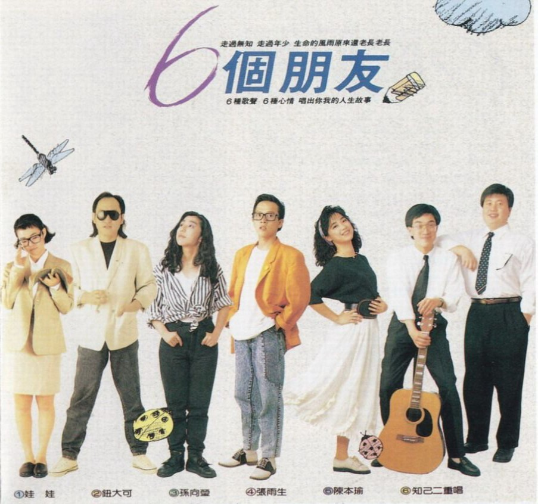
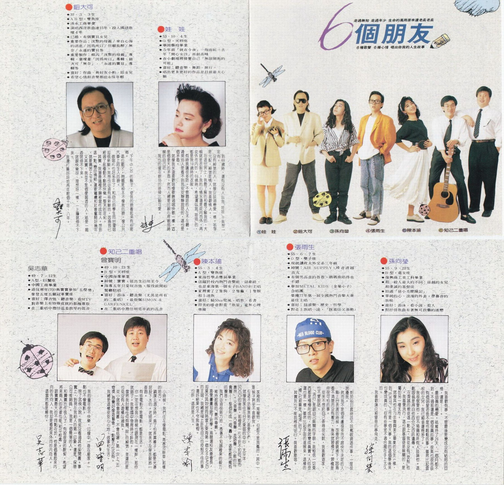
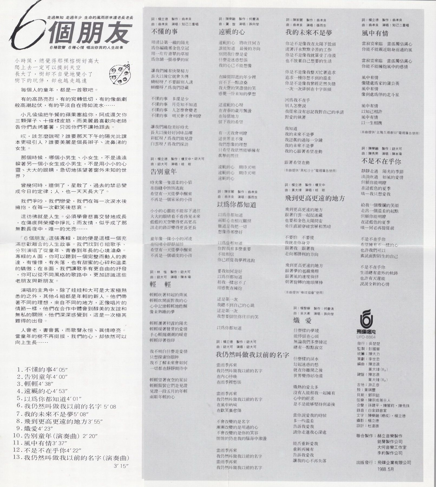
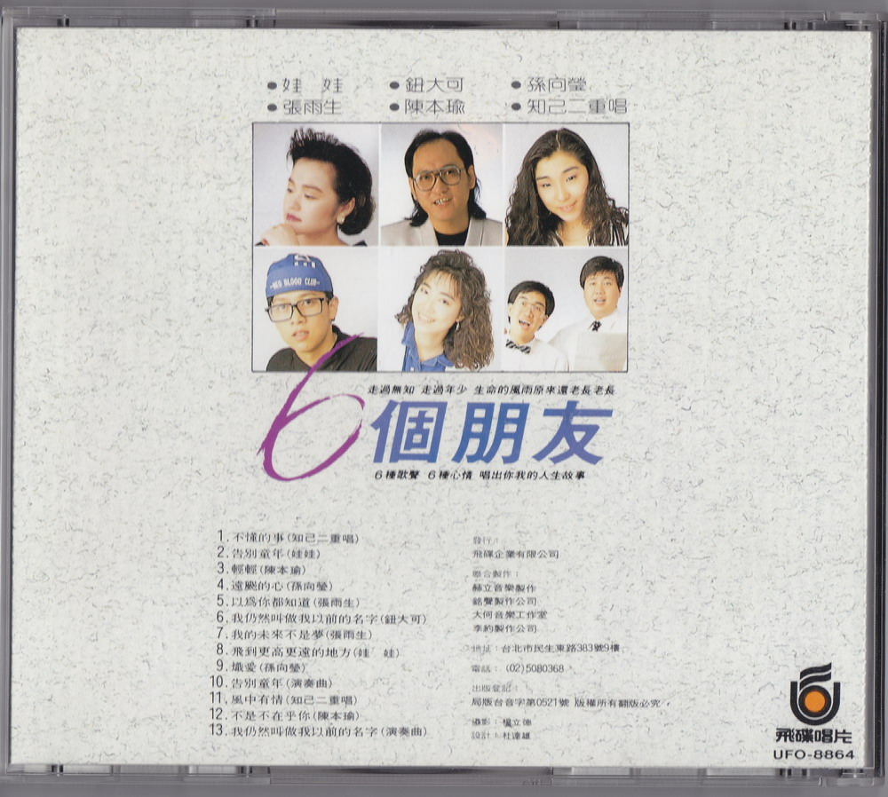

# 6 個朋友

# 文案

走過無知 走過年少 生命的風雨原來還老長老長  
6 種歌聲 6 種心情 唱出你我的人生故事

小時候，總覺得那棵榕樹好高大  
爬上去一定可以摸到天空  
長大了，樹卻不自覺地變小了  
樹下的玩伴，卻也越走越遠

每個人的童年，都是一首歌吧。

有的高昂亮烈，有的宛轉低切，有的像戲劇般高潮起伏，有的平淡自在得如流水……

小凡偷偷把午餐的蘋果塞給你，阿成還欠你三顆彈子、十條橡皮筋，而美麗最喜歡向老師告你們去烤番薯，只因你們不讓她跟去。

哎，該怎麼說呢？誰要那天下午的陽光比課本更吸引人？誰要美麗是個長辮子、流鼻涕的女生。

那個時侯，哪個小男生、小女生，不是遠遠躲著另一個小女生或小男生，不是用小小的心靈、大大的眼睛，急切地張望著窗外未知的世界。

曾幾何時，牆倒了，星散了，過去的禁忌變成今日的定律；人，也一天天長大了。

我們爭吵，我們戀愛，我們在每一次淚水後擁抱，在每一次歡笑後悲哀。

這彷彿就是人生。必須學會悲喜交替地成長，在傷痕與榮耀中掙扎；而友情，似乎成了那無數長夜中，唯一的光亮……

「6 個朋友」這張專輯，說的便是這樣一個充滿悲歡離合的人生故事。我們找到 6 組歌手，分別演唱了從童年、青春到年長的心境滄桑。專輯的 A 面，你可以聽到一個完整而動人的表達，有憧憬，有失落，也有甜蜜的心碎和溫柔的驕傲；在 B 面，我們讓歌手有更自由的抒發，你可以從不同風格的歌路中，更加認識這些老朋友與新朋友。

演唱的主角中，除了娃娃和大可是大家極熟悉的之外，其他 4 組都是年輕的新人。他們帶著不同的理想，來自不同的地方，正像唱片的情節一樣，他們在合作中體會到醇美的友誼和無私的關照，他們深深感覺到，這是一次極其難得的出發。

人會老，書會舊，但歌聲永恆、真情嘹亮。當童年的樹不再挺拔，我們的心，卻依然可以向上生長……

# 歌手介紹

## 鈕大可

-   37、3、3 生
-   AB 型·雙魚座
-   淡水工商畢業
-   演唱西洋歌曲達 15 年，投入國語歌壇 4 年
-   已婚，有個寶貝女兒
-   重要作品：沉默的母親 / 來自心海的消息 / 因爲所以 / 但願長醉 / 無奈 / 永遠的寶貝等
-   重要製作：蘇芮「沉默的母親」專輯、葉璦菱「因爲所以」專輯、鈕大可「無奈」、「永遠的寶貝」專輯等
-   喜好：作曲、與好友小酌、陪女兒
-   希望心情和音樂都能永保年輕

下午 5:30 的鬍子，使我的臉看起來有些疲倦。  
這也罷了。問題是根本不像我的臉，像公共汽車上陌生人的臉。  
做唱片也好多年了，和自己的學生同台灌唱卻很新鮮。我想也必須有些新鮮的，因爲我已經過了那種動不動就快樂一整天的年紀。  
其實，我潛意識裡不願被當做成年人。想到這一點「戀母情結」還要繼續和社會奮鬥好幾年，就要痛苦上半天。  
又其實，我並不是個愛喝酒的人。衹是一喝酒就停不下來。  
就跟快樂呀、理想呀一樣，一上癮就停不下來。  
我還打算好好地再年輕個十年、八年。

## 娃娃

-   53、10、4 生
-   O 型·天秤座
-   華岡藝校畢業
-   5 年前「就在今夜」一炮而紅，去年「開心女孩」再創高峯
-   在小劇場裡發覺自己「無限開拓的可能」
-   喜好：聽音樂、舞蹈、旅行
-   唱出更多更好的作品是目前最大心願

到 69 歲時，還有沒有人叫我「娃娃」？我想一定有。  
沒有綽號的人，就像沒談過戀愛一樣。名字是元配，綽號是情人。我喜歡情人。  
在這個世界上，我最了解的和最了解我的，大概就是衣服了。我的心情永遠是從內而外，再從外而內的。69 歲時，希望還叫我「娃娃」的，都是我 19 歲時的衣服。  
有時我講很多話，不管聽話的人在不在聽。通常別人是看不到我安安靜靜說話的，這也是個矛盾。  
就像我永遠喜歡唱慢歌勝過唱快歌一樣，這是個更大的矛盾。然而人總是比較心疼軟弱時候的自己吧。  
我也的確在軟弱的時候比較可愛。

## 知己二重唱

### 吳志華

-   49、7、12 生
-   A 型·巨蟹座
-   中國工商畢業
-   退伍那年（73）與寶寶參加「五燈獎」榮獲五度五關冠軍寶座
-   喜好：彈吉他、聽音樂、看 MTV，對音樂上有特殊成就的都極尊重
-   在二重唱中擔任溫柔敦厚的低音

我的童年很不快樂，印象中一直在搬家。一點也不像電影。
除了武俠小說，我從沒看過其他的閒書。事實上，到現在我給人的第一印象，還是「保險公司推銷員」。我是一個簡單的人。
和寶寶合作很久了，有股很深的默契，希望將來兩人的老婆也能「和平相處」。
跟寶寶最大的不同點在於，他是個看起來內向的外向人，我卻是看起來外向的內向人。
這當然都是緣分。

### 曾寶明

-   49、10、23 生
-   B 型·天秤座
-   中國海專畢業
-   綽號：寶寶，從出生沿用至今
-   海專五年只愛玩吉他，服役前開始餐廳駐唱
-   喜好：游泳、聽音樂（尤其是所有的二重唱），最敬佩 SIMON & GARFUNKEL
-   在二重唱中擔任明亮直率的高音

小時候，我們住在像電影「青青河畔草」那樣的地方。  
翹課去游泳時，爲了怕弄溼褲子，都是光著屁股下水的。老師來了，就來不及穿衣服地一直跑。  
有些電影不是電影，都是生活。  
你一定在想我小時候也跟現在一樣胖，那你就錯了。我是國中發育時才胖的。  
當然我討厭任何有關「胖」的綽號，幸運的是也從沒有人這樣叫過我。  
從小就很會背書，不會怯場。第一次上「五燈獎」感覺好像遊藝會，一點壓力也沒有。  
我總是這樣安安心心地，做事和生活。

## 陳本瑜

-   55、3、4 生
-   A 型·雙魚座
-   東海哲學系應屆畢業
-   活躍於校內熱門音樂社、話劇社，也是東海第一個女子 BAND 的主唱
-   家裡養了 2 隻狗、2 隻龜，1 隻猴和 1 池魚
-   喜好：騎 50cc 兜風、唱歌、看書
-   甜美的嗓音對於「歌星」毫無心理準備

家裡有一堆寵物，但都不是我養的。其中一隻猴子甚至不喜歡我。  
但這不妨礙我努力喜愛它們。  
就像我家住在台北東區的中心，太平洋 SOGO 的後面，那裡是一片不折不扣的「都市叢林」。火車聲、汽車聲、走路聲、小販的叫賣聲……整個形成一個「轟」字，這是都市獨有的聲音。  
我們必須很努力地，憑著不知哪裡來的毅力，維持起碼的「叢林尊嚴」。  
喜愛畫畫卻念起了哲學，爲競選校友會會長，卻莫名其妙地同時當上東海第一個女子 BAND 的主唱，我總是碰上許多自己也控制不住的事。還好結果也不令我後悔。  
也許，這就是人生。

## 張雨生

-   55、6、7 生
-   O 型·雙子座
-   現就讀政大外交系三年級
-   綽號：AIR SUPPLY，嗓音清越高亢
-   有個男高音的爸爸，媽媽歌唱得也不錯
-   參加 METAL KIDS（金屬小子）合唱團  
    榮獲 77 年第一屆全國熱門音樂大賽最佳主唱
-   喜好：搖滾樂、歷史、哲學
-   對走上唱歌一途，「既羞怯又激動」

對於拍封套時該不該戴眼鏡這件事，一度很困擾我。  
然而我不是個考慮很多而不趕快下決定的人。  
剛上台表演的時候，故意把眼鏡摘下，因爲看不清楚而沒有壓力，後來就習慣了。習慣是件很可怕的事。  
從來不想把自己弄得很尖銳，我喜歡道家，也不愛說話。  
「流行」是跟自己無關的字眼。我相信一切東西都是慢慢形成的，然後就變成真實。人的命運也是一樣，雖然比起宇宙的進展來，這樣的「慢」已經算是「超速」的了。  
其實我也不能說得很明白。我喜歡歌唱。

## 孫向瑩

-   55、9、22 生
-   B 型·處女座
-   復興商工美工科畢業
-   與一般人最大的不同：孫越的女兒和虔誠的基督徒
-   拍過「孫小毛歷險記」
-   單純的心、爛漫的外表，帶鼻音的歌喉
-   喜好：游泳、看小說、看人
-   對抒情歌曲有著無可救藥的迷戀

我喜歡有夢，不管最後是變成沒有結局的回憶，還是……。  
最認真的戀愛，衹維持了 26 天，一個月都不到。不過那還是一個很真的夢，很美也很悲哀。  
有個明星老爸不是件輕鬆的事，雖然比起雷根的女兒，我已經幸運得多了。  
我很敬愛他，但不預備和所有人談論他。這點固執是得自他百分之百的遺傳。  
在虔誠的教徒這一點上，我從沒有「受制」他人。我喜愛流行，這也跟基督徒是無關的，是屬於另一種天性。  
就像其他在 73 年復興美工畢業的女生一樣，到「巴而可」工作是一個大夢，我的這個夢後來也變成真的，但有些夢是不適合握在手上太久的。  
我喜歡讓已經窒息的夢飛走。

# 以爲你都知道

作詞：陳家麗  
作曲：翁孝良  
製作：翁孝良  
演唱：張雨生

以爲你都知道  
兩顆心在相互關照  
難道是我  
把一切想象得那麼好

以爲你都知道  
你對我有多麼重要  
不能相信  
你已經從我夢裡逃跑

要我如何是好  
以爲你都知道  
和我一樣忘不了  
用感覺在擁抱

這是第一次  
我聽不到自己的心跳  
這是第一次  
我想要留住你往日的笑

以爲你都知道

# 我的未來不是夢

作詞：陳家麗  
作曲：翁孝良  
製作：翁孝良  
演唱：張雨生

你是不是像我在太陽下低頭  
流著汗水默默辛苦地工作  
你是不是像我就算受了冷落  
也不放棄自己想要的生活

你是不是像我整天忙著追求  
追求一種你想不到的溫柔  
你是不是像我曾經茫然失措  
一次一次徘徊在十字街頭

因爲我不在乎  
別人怎麼說  
我從來沒有忘記我對自己的承諾
對愛的執著

我知道  
我的未來不是夢  
我認真地過每一分鐘  
我的未來不是夢  
我的心跟著希望在動

跟著希望在動

（本曲提供“黑松沙士”電視廣告使用）

# 製作團隊

|   負責   |                         人員 / 工作室                          |
| :------: | :------------------------------------------------------------: |
|   發行   |                             吳楚楚                             |
|   監製   |                             彭國華                             |
|   統籌   |                             陳大力                             |
|   策劃   |                             李世忠                             |
|   編曲   |                   陳志遠 黃大煒（$B_2$）                    |
|   鍵盤   |                   陳志遠 黃大煒（$B_2$）                    |
|   吉他   |                             游正彥                             |
|    鼓    |                             黃瑞豐                             |
|   貝斯   |                             郭宗韶                             |
|   絃樂   |                         陳宗成等 8 人                          |
|   合聲   |                     孫建平，陳麗莉，陳秀珠                     |
|   錄音   |                           白金錄音室                           |
|   文字   |                     陳樂融（總成），楊立德                     |
|   攝影   |                             楊立德                             |
|   設計   |                             杜達雄                             |
| 聯合制作 | 赫立音樂製作 銘聲製作公司 大何音樂工作室 李約製作公司 |
| 出版發行 |                 飛碟企業有限公司 1988.5 月                  |

# 專輯照片

整理：健健，Finn & Rain

當前頁面缺陷：

1. 發行時間無法精確到日
