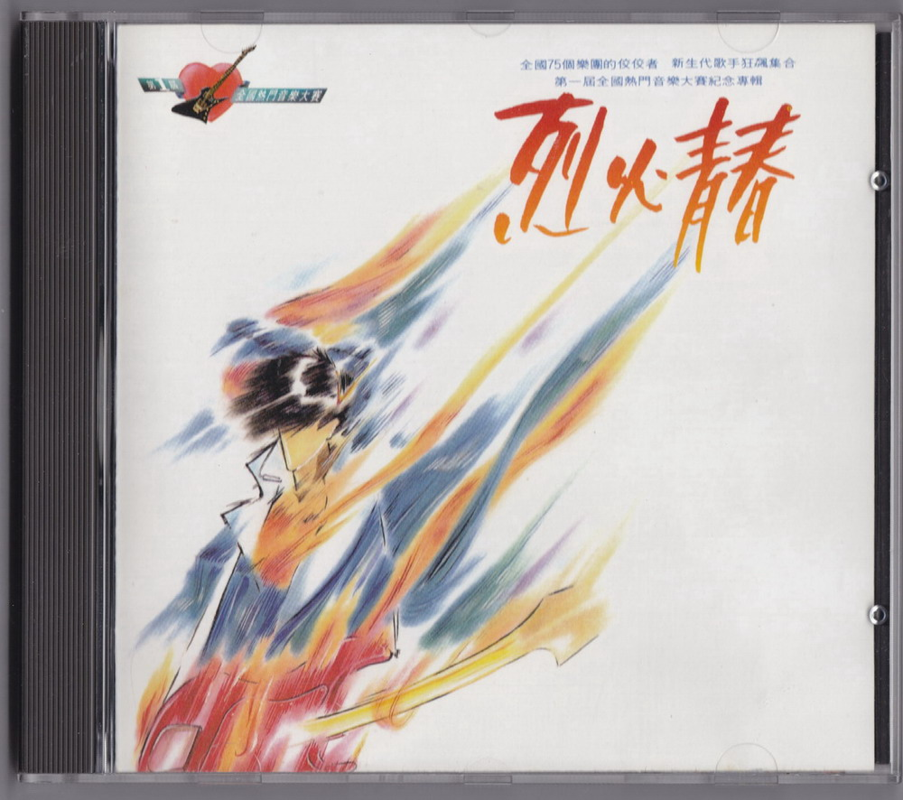
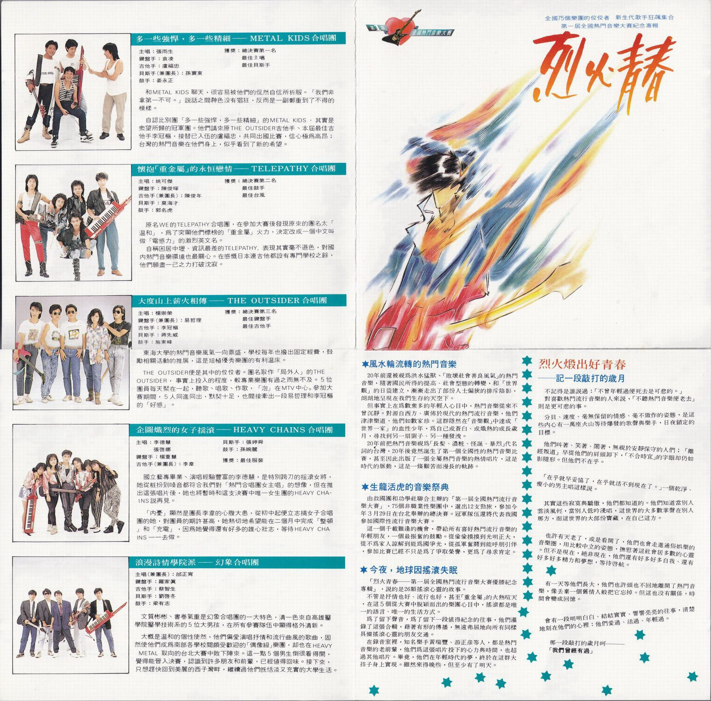
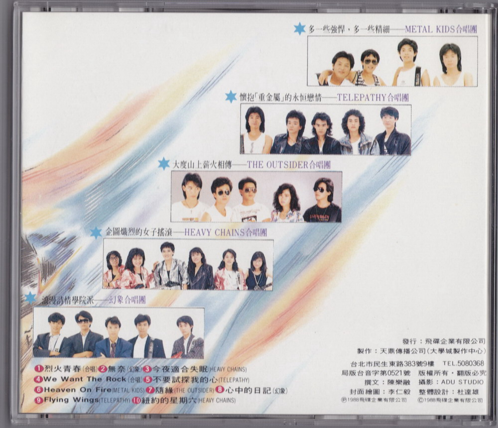

# 烈火青春

# 樂隊介紹

## 多一些強悍，多一些精細 —— METAL KIDS 合唱團

主唱：張雨生  
鍵盤手：袁凌  
吉他手：盧福忠  
貝斯手（兼團長）孫寰東  
鼓手：姜永正

獲獎：

-   總決賽第一名
-   最佳主唱
-   最佳貝斯手

和 METAL KIDS 聊天，很容易被他們的侃然自信所折服。「我們非拿第一不可。」說話之間神色沒有猖狂，反而是一副鄭重到了不得的模樣。

自認比別團「多一些強悍，多一些精細」的 METAL KIDS，其實是衆望所歸的冠軍團。他們請來原 THE OUTSIDER 吉他手、本屆最佳吉他手李冠樞，接替已入伍的盧福忠，共同出國比賽，信心極爲高昂；臺灣的熱門音樂在他們身上，似乎看到了新的希望。

## 懷抱「重金屬」的永恆戀情——TELEPATHY 合唱團

主唱：姚可傑  
鍵盤手：陳俊暉  
吉他手（兼團長）：陳俊年  
貝斯手：莫海才  
鼓手：郭名虎

獲獎：

-   總決賽第二名
-   最佳鼓手
-   最佳颱風

原名 WE 的 TELEPATHY 合唱團，在參加大賽後發現原來的團名太「溫和」，爲了突顯他們標榜的「重金金」火力，決定改成一箇中文叫做「電感力」的激烈英文名。

自稱困居中壢、資訊最差的 TELEPATHY，表現其實毫不遜色，對國內熱門音樂環境也最關心。在感慨日本連吉他都設有事門學校之餘，他們願盡一己之力打破沉寂。

## 大度山上薪火相傅——THE OUTSIDER 合唱團

主唱：楊崇榮  
鍵盤手（兼團長）：易哲理  
吉他手：李冠樞  
貝斯手：蔣先威  
鼓手：施東峯

獲獎：

-   總決賽第三名
-   最佳鍵盤手
-   最佳吉他手

東海大學的熱門音樂風氣一向鼎盛，學校每年也撥出固定經費，鼓勵相關活動的推展，這是培植優秀樂團的有利溫牀。

THE OUTSIDER 便是其中的佼佼者。名取作「局外人」的 THE OUTSIDER，事實上投入的程度，較專業樂團有過之而無不及。5 位團員每天聚在一起，聽歌、唱歌、作歌，「泡」在 MTV 中心。參加大賽期間，5 人同進同出，默契十足，也間接牽出一段易哲理和李冠樞的「好感」。

## 企圖熾烈的女子搖滾——HEAVY CHAINS 合唱團

主唱：李德慧、張啓娜  
鍵盤手：楊重慧  
吉他手（兼團長）：李韋  
貝斯手：張婷舜  
鼓手：孫婉麗

獲獎：最佳服裝

國立藝專畢業、演唱經驗豐富的李德慧，是特別跨刀的搖滾女將，她從裝扮到嗓音都符合我們對「熱門合唱團女主唱」的想像，但在推出這張唱片後，她也將暫時和這支決賽中唯一女生團的 HEAVY CHAINS 說再見。

「內憂」，顯然是團長李韋的心腹大患，從初中起便立志搞女子合唱團的她，對團員的期許甚高，她熱切地希望能在二個月中完成「整頓」和「充電」，因爲她覺得還有好多的雄心壯志，等待 HEAVY CHAINS 一一去做。

## 浪漫詩情學院派——幻象合唱團

主唱（兼團長）：邰正宵  
鍵盤手：羅家真  
吉他手：蔡智生  
貝斯手：劉啓冬  
鼓手：梁有志

文質彬彬、書卷氣重是幻象合唱團的一大特色，清一色來自高雄醫學院醫學技術系的 5 位大男孩，在所有參賽隊伍中顯得格外清新。

大概是溫和的個性使然，他們偏愛演唱抒情和流行曲風的歌曲，固然使他們成爲南部各學校間頗受歡迎的「偶像級」樂團，卻也在 HEAVY METAL 取向的臺北大賽中敗下陣來。這一點 5 個男生倒很看得開，覺得能晉入決賽，認識到許多朋友和前輩，已值得回味。接下來，只想趕快回到美麗的西子灣畔，繼續過他們既恬淡又充實的大學生活。

# 烈火煅出好青春——記一段敲打的歲月

## 風水輪流轉的熱門音樂

20 年前還被視爲洪水猛獸、「敗壞社會善良風氣」的熱門音樂，隨着國民所得的提高、社會型態的轉變，和「世界觀」的日益建立，漸漸走出了部份人士偏狹的排斥陰影朗朗地呈現在我們生存的天空下。

但事實上在爲數衆多的年輕人心目中，熱門音樂從來不曾沉靜。對源自西方、廣佈於現代的熱門流行音樂，他們津津樂道、他們如數家珍。這羣隱然在「音樂觀」中達成「世界一家」的血性少年，爲自己或蒼白、或熾熱的成長歲月，尋找到另一扇窗子、另一種發泄。

20 年前把熱門音樂視爲「長髮、濃粧、怪誕、暴烈」代名詞的臺灣，20 年後竟然誕生了第一個全國性的熱門音樂比賽，甚至因此出版了一張全屬熱門音樂的熱情唱片，這是時代的脈動，這是一條艱苦而漫長的軌跡。

## 生龍活虎的音樂祭典

由救國團和功學社聯合主辦的「第一屆全國熱門流行音樂大賽」，75 個非職業性樂團中，選出 12 支勁旅，參加今年 3 月 29 日在臺北舉辦的總決賽。冠軍隊伍還將代表我國參加國際性流行音樂大賽。
這一個千載難逢的機會，帶給所有喜好熱門流行音樂的年輕朋友，一個最振奮的鼓勵。從偷偷摸摸到光明正大，從不爲家人諒解到能爲國爭光，從孤軍奮關到能呼朋引伴參加比賽已經不只是爲了爭取榮譽，更爲了尋求肯定。

## 今夜，地球因搖滾失眠

「烈火青春——第一屆全國熱門流行音樂大賽優勝紀念專輯」，說的是 26 顆搖滾心靈的故事。

不管是抒情也好、流行也好，甚至「重金屬」的火熱喧天，在這 5 個從大賽中脫穎而出的樂團心目中，搖滾都是唯一的語言、唯一的生活方式。

爲了留下聲音，爲了留下一段值得紀念的往事，他們灌錄了這張合輯，藉着有形的傳播，無遠弗屆地向所有同樣具備搖滾心靈的朋友交通。

在錄音室裏，知名樂手黃瑞豐、遊正彥等人，都是熱門音樂的老前輩，他們爲這張唱片投下的心力與時間，也超過其他唱片。畢竟，他們在年輕時代的夢，終於在這羣大孩子身上實現。雖然來得晚些，但至少有了明天。

不記得是誰說過：「不曾年輕過便死去是可悲的。」

對喜歡熱門流行音樂的人來說，「不聽熱門音樂便老去」則是更可悲的事。

分貝、速度、毫無保留的情感、毫不做作的姿態，是這些內心有一萬座火山等待爆發的歌聲與樂手，日夜鎖定的目標。

他們叫着、笑着、鬧着，無視於安靜保守的人們；「離經叛道」早從他們的肩頭卸下，「不合時宜」的字眼卻仍如影隨形。但他們不在乎。

「在乎就早妥協了，在乎就活不到現在了。」一個乾淨、瘦小的男主唱這樣說。

其實這些寂寞與驕傲，他們都知道的。他們知道當別人雲淡風輕，當別人低吟淺唱，這世界的大多數掌聲在別人那方，而這世界的大部份寶藏，在自己這方。

也許有天老了，或是看開了，他們也會走進通俗娛樂的音樂圈，用比較中立的姿態，撫慰着這社會居多數的心靈。但不是現在，絕非現在，他們還有好多好多自我、還有好多好多精力和夢想，等待啓航。

有一天等他們長大，他們也許頭也不回地離開了熱門音樂，像丟棄一箇舊情人般把它忘掉。但這也沒有關係，時間會變成回憶。

會有一段明明白白、結結實實、響響亮亮的往事，清楚地刻在他們的心裏：他們愛過、活過、年輕過。

那一段敲打的歲月呵——「我們會經有過」

# 烈火青春

作詞：陳樂融  
作曲：陳志遠  
編曲：陳志遠

沸騰的夜在跳動  
跟着搖滾的節奏  
敲打的歲月在你和我  
嘹亮的歌聲在風中

用感覺擦亮你我期待的臉龐  
用心靈溫暖黑夜孤獨的淚光  
讓青春烈火燃燒永恆  
讓生命閃電劃過天邊  
用所有熱情換回時間  
讓年輕的夢沒有終點

這一刻我將遠走  
愛是我唯一所有  
外面的世界如此遼闊  
年輕的我不再回頭

用感覺擦亮你我期待的臉龐  
用心靈溫暖黑夜孤獨的淚光  
讓青春烈火燃燒永恆  
讓生命閃電劃過天邊  
向浩瀚星空許下諾言  
讓年輕的心永不改變

# Heaven On Fire

作詞：孫寰東  
作曲：孫寰東

Walking on lonely streets in a darkened night  
Midnight sun rolling down my eye  
Living in a forest of fallen dreams  
And life's a big hand strangling me till I die  
But your giving hand rising up to my heart  
So keep the fire burning my love

> 在這漆黑的夜晚我走在寂寞的街道上  
> 午夜的陽光直射我的眼睛  
> 活在淒涼墮落的夢魘裏  
> 生活如一隻巨手扼住我直到我死去  
> 但這時你向我的心靈伸出援助之手  
> 讓火焰燃燒我的愛永不停息

Feeling your heat burning  
Makes my body temperature rise  
Heaven on fire shining like an angle flying  
Heaven burning my love  
Never gonna have you leave me  
Heaven on fire burning love

> 我感到你的內心在燃燒  
> 使我的身體熱血沸騰  
> 火焰如天使般閃耀着我們的天堂  
> 在天堂我的愛熾熱燃燒  
> 永遠不會讓你離開我  
> 燃燒愛的天堂

Sharing pretty nights. Hold me till I die  
Falling in love is so sweet  
Oh~ Flying like the dust  
What kind of fool am I. Burning love

> 共度這美妙之夜，抱着我直到我死去  
> 墜入愛河是如此的甜蜜  
> 哦~ 像飛揚的塵埃  
> 我是如熾熱般燃燒愛情的傻瓜

# 製作團隊

|         負責         |         人員 / 工作室          |
| :------------------: | :----------------------------: |
|         發行         |             吳楚楚             |
|         監製         |             彭國華             |
|         統籌         |             陳大力             |
|         策劃         |         陳光陸、鄧廷琤         |
|         製作         | 天鼎傳播公司（大學城製作中心） |
|        製作人        |             馬兆駿             |
|       助理製作       |         呂曉楝、塗佩岑         |
|      編曲/鍵盤       |             陳志遠             |
|         吉他         |             遊正彥             |
|        打擊樂        |             黃瑞豐             |
|         貝斯         |             郭宗韶             |
|         和音         |           林美滿 等            |
|         混音         |             陳建平             |
|        錄音室        |           雅弦錄音室           |
|       文案總監       |             陳樂融             |
|       封面繪圖       |             李仁毅             |
|         攝影         |           ADU STUDIO           |
|         設計         |             杜達雄             |
| MTV 導演（烈火青春） |              未知              |

飛碟唱片 UFO-8870 局版臺音字第 0521 號  
Ⓟ&Ⓒ 飛碟企業有限公司

# 掃描照片

參考：

-   [烈火青春，第一屆全國熱門音樂大賽紀念專輯 - TOMCHANG.CN](https://www.tomchang.cn/music/collection/21.html)

整理：健健

當前頁面缺陷：

-   缺少專輯掃描照片
-   發行時間無法精確到日
