# 天天想你

# 文案

我認識你 不假修飾的真誠  
我認識你 帶著夢想的眼神  
我認識你 毫不保留的歌聲  
我認識你 你是張雨生！

張雨生，這個出身澎湖眷村、12 歲開始接觸西洋歌曲，歌聲裡有自足的單純與喜悅的一個大男孩，從 '88 年暑假起風靡了台灣。

他唱「我的未來不是夢」，讓所有人陡然相信：自己可以飛得更高、做得更好；他唱「以爲你都知道」，證明只要有真情，小小年紀一樣懂得愛情的美好；甚至他參與合唱的「烈火青春」，都明白告訴人們：年輕不一定代表叛逆，搖滾一樣很熱情！

大家喜歡張雨生，不只是因爲他像我們鄰家謙虛上進的小兄弟，更因爲他自己相信、也讓我們相信了：「真實地愛、自然地活」，是可以做到的人生信仰。

張雨生的歌唱之路才剛開始，張雨生的人生故事還很長，他還有好多的心願要去實現，還有好多的困難要去擔當，他不會每件事都幸運得不假思索，但是他知道自己征途的盡頭，會有光亮。

讓我們祝福他，像祝福自己心中的一抹陽光。

# 獨白

兩年前，從小與我最親的妹妹，在梨山附近的山澗不幸溺斃，那一年她才 15 歲。

雖然從頭到尾，我沒有掉一滴眼淚，但這個傷口一直在我心中。

她是那麼可愛，那麼懂事，而且歌聲又那麼好。老天真不公平，妹妹她一直比我更愛唱歌，唱得比我更好。

這件事對我的打擊太大，在此之前，我從來不曾公開演唱過。是她去世後，我報名了「木船」民歌比賽，開始加入熱門合唱團，一場又一場地唱下來。

像是揹負了什麼使命，心裡不斷有個聲音催著我|「喜歡，就趕快去做！」不要等到一切都太遲。

今天我站在台上，受到許許多多的歡迎，除了高興，更多的是感激，感激上天讓我唱出了自己，也唱出每一個人永遠渴望的純真與勇氣。

這是我的第一張專輯，我把他獻給所有喜歡音樂，喜歡生命的朋友。

謝謝你，老妹。謝謝你們，爸媽。謝謝你，我的朋友！

張雨生  
77.10.22

# 跟著我

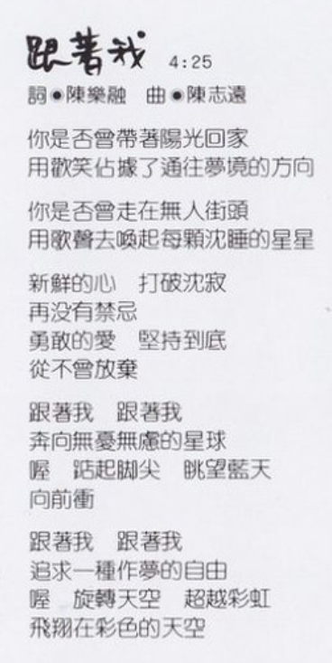

時長：4:25  
作詞：陳樂融  
作曲：陳志遠

你是否曾帶著陽光回家  
用歡笑佔據了通往夢境的方向

你是否曾走在無人街頭  
用歌聲去喚起每顆沉睡的星星

新鮮的心 打破沉寂  
再沒有禁忌  
勇敢的愛 堅持到底  
從不曾放棄

跟著我 跟著我  
奔向無憂無慮的星球  
喔 踮起腳尖 眺望藍天  
向前衝

跟著我 跟著我  
追求一種做夢的自由  
喔 旋轉天空 超越彩虹  
飛翔在彩色的天空

# 天天想你

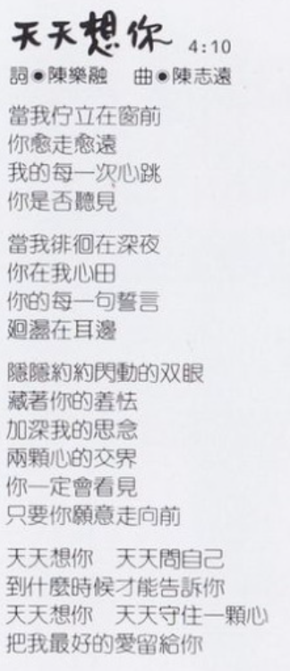

時長：4:10  
作詞：陳樂融  
作曲：陳志遠

當我佇立在窗前  
你愈走愈遠  
我的每一次心跳  
你是否聽見

當我徘徊在深夜  
你在我心田  
你的每一句誓言  
迴盪在耳邊

隱隱約約閃動的雙眼  
藏著你的羞怯  
加深我的思念  
兩顆心的交界  
你一定會看見  
只要你願意走向前

天天想你 天天問自己  
到什麼時候才能告訴你  
天天想你 天天守住一顆心  
把我最好的愛留給你

# 永遠都像才認識

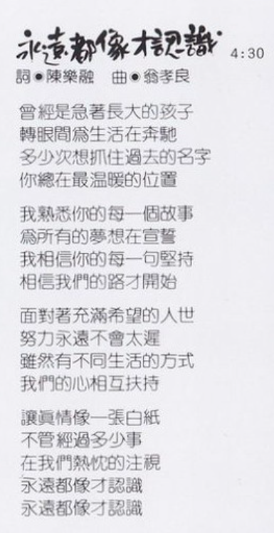

時長：4:30  
作詞：陳樂融  
作曲：翁孝良

曾經是急著長大的孩子  
轉眼間爲生活在奔馳  
多少次想抓住過去的名字  
你總在最溫暖的位置

我熟悉你的每一個故事  
爲所有的夢想在宣誓  
我相信你的每一句堅持  
相信我們的路才開始

面對著充滿希望的人世  
努力永遠不會太遲  
雖然有不同生活的方式  
我們的心相互扶持

讓真情像一張白紙  
不管經過多少事  
在我們熱忱的注視  
永遠都像才認識  
永遠都像才認識

# 我的陽光我的風

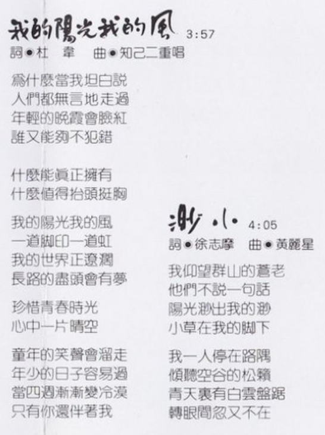

時長：3:57  
作詞：杜韋  
作曲：知己二重唱

爲什麼當我坦白說  
人們都無言地走過  
年輕的晚霞會臉紅  
誰又能夠不犯錯

什麼能真正擁有  
什麼值得擡頭挺胸

我的陽光我的風  
一道腳印一道虹  
我的世界正遼闊  
長路的盡頭會有夢

珍惜青春時光  
心中一片晴空

童年的笑聲會溜走  
年少的日子容易過  
當四周漸漸變冷漠  
只有你還伴著我

# 渺小

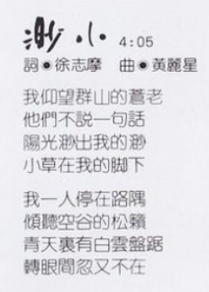

時長：4:05  
作詞：徐志摩  
作曲：黃麗星

我仰望群山的蒼老  
他們不說一句話  
陽光渺出我的渺  
小草在我的腳下

我一人停在路隅  
傾聽空谷的松籟  
青天裡有白雲盤踞  
轉眼間忽又不在

# 和天一樣高

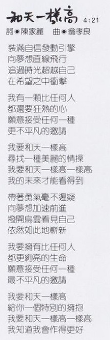

時長：4:21  
作詞：陳家麗  
作曲：翁孝良

裝滿自信發動引擎  
向夢想直線飛行  
追過時光超越自己  
在希望之中衝擊

我有一顆比任何人  
都還要狂熱的心  
願意接受任何一種  
最不平凡的邀請

我要和天一樣高  
尋找一種美麗的情操  
我要和天一樣高一樣高  
我的未來才能看得到

帶著勇氣毫不遲疑  
向夢想加速前進  
撥開烏雲看見自己  
竟[^1]然如此地嶄新

我要擁有比任何人  
都更絢亮的生命  
願意接受任何一種  
最不平凡的邀請

我要和天一樣高  
給你一個特別的擁抱  
我要和天一樣高一樣高  
我知道我會作得更好

# 告訴我親愛的

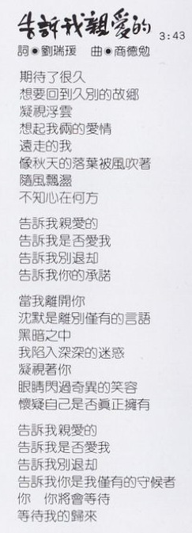

時長：3:43  
作詞：劉瑞瑗  
作曲：商德勉

期待了很久  
想要回到久別的故鄉  
凝視浮雲  
想起我倆的愛情  
遠走的我  
像秋天的落葉被風吹著  
隨風飄蕩  
不知心在何方

告訴我親愛的  
告訴我是否愛我  
告訴我別退卻  
告訴我你的承諾

當我離開你  
沉默是離別僅有的言語  
黑暗之中  
我陷入深深的迷惑  
凝視著你  
眼睛閃過奇異的笑容  
懷疑自己是否真正擁有  
告訴我親愛的  
告訴我是否愛我  
告訴我別退卻  
告訴我你是我僅有的守候者  
你 你將會等待  
等待我的歸來

# 沒有不可能的事

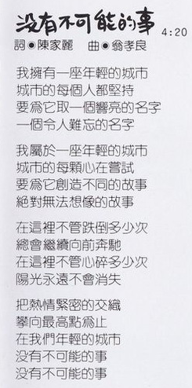

時長：4:20  
作詞：陳家麗  
作曲：翁孝良

我擁有一座年輕的城市  
城市的每個人都堅持  
要爲它取一個響亮的名字  
一個令人難忘的名字

我屬於一座年輕的城市  
城市的每顆心在嘗試  
要爲它創造不同的故事  
絕對無法想象的故事

在這裡不管跌倒多少次  
總會繼續向前奔馳  
在這裡不管心碎多少次  
陽光永遠不會消失

把熱情緊密的交織  
攀向最高點爲止  
在我們年輕的城市  
沒有不可能的事  
沒有不可能的事

# 不是因爲寂寞

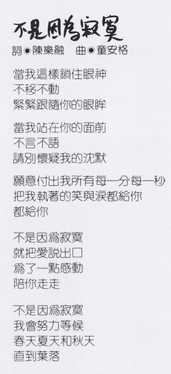

時長：4:55  
作詞：陳樂融  
作曲：童安格

當我這樣鎖住眼神  
不移不動  
緊緊跟隨你的眼眸

當我站在你的面前  
不言不語  
請別懷疑我的沉默

願意付出我所有每一分每一秒  
把我執著的笑與淚都給你  
都給你

不是因爲寂寞  
就把愛說出口  
爲了一點感動  
陪你走走

不是因爲寂寞  
我會努力等候  
春天夏天和秋天  
直到葉落

# 就算爲你，也是爲我

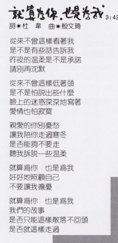

時長：3:42  
作詞：杜韋  
作曲：殷文琦

從來不曾這樣看著我  
是不是有些話告訴我  
昨夜的溫柔是不是承諾  
請別再沉默

從來不曾這樣低著頭  
是不是怕說出些什麼  
臉上的迷惑深深地寫著  
愛情也怕寂寞

親愛的你別憂愁  
讓我陪你走過寒冬  
是否能夠不要走  
聽我訴說一些溫柔

就算爲你 也是爲我  
好好地照顧自己  
不要讓我擔憂

就算爲你 也是爲我  
我們的故事  
是否只能這樣散落不回頭  
是否就這樣走過

# 製作團隊

|   負責    |       人員/資訊        |
| :-------: | :--------------------: |
|   發行    |         吳楚楚         |
|   監製    |         彭國華         |
|   統籌    |         陳大力         |
|   策劃    |         李世忠         |
|   製作    |         翁孝良         |
| 編曲/鍵盤 |         陳志遠         |
|    鼓     |         黃瑞豐         |
|   貝斯    |         郭宗韶         |
|   吉他    |     遊正彥、李庭匡     |
|   和音    | 孫建平、陳麗莉、陳秀珠 |
|   錄音    |   成功錄音室 林明陽    |
| 文案總監  |         陳樂融         |
|   化妝    |         戰霈綺         |
|   攝影    |       ADU STUDIO       |
|   設計    |         杜逹雄         |

飛碟企業股份有限公司  
1988 年 11 月出版發行  
Ⓟ1988 飛碟企業有限公司  
Ⓒ1988 飛碟企業有限公司

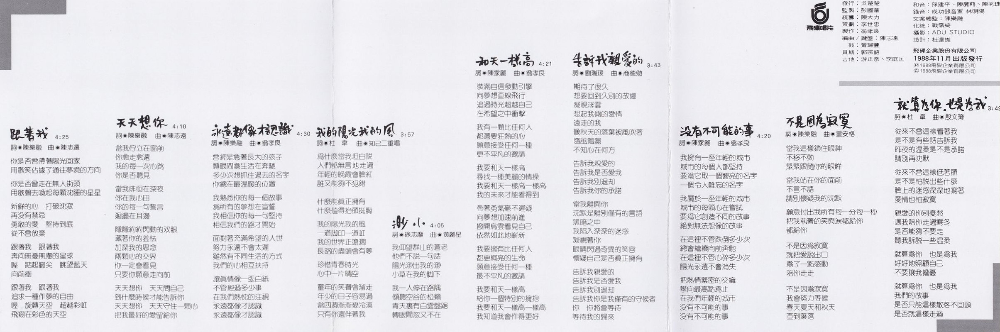

# 參考

相關鏈接：

-   [張雨生 \- 經典雋永「天天想你」](https://www.facebook.com/share/p/ZThWZgKe88hw9A3U/)
-   [天天想你\-專輯\-張雨生網站 \- TOMCHANG\.CN](https://www.tomchang.cn/music/album/10.html)

當前頁面缺陷：

-   獨白需要更清晰的照片
-   發行時間沒有精確到日

整理：郈斐，健健

[^1]: 雖然寫著「依」，唱的是「竟」
