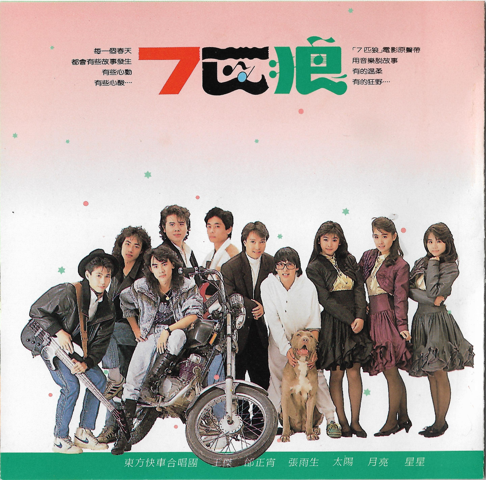

# 7 匹狼 電影原聲帶

# 封面文案

每一個春天  
都會有些故事發生  
有些心動  
有些心酸……

「7 匹狼」電影原聲帶  
用音樂說故事  
有的溫柔  
有的狂野……

# 內頁文案

在不久不久以前  
在很遠很遠的地方  
一個不知名的國度裡  
有一群狼

他們外表冷漠、內心火熱  
喜歡群居、視朋友爲唯一  
用生命相知相惜

當夜風來臨的時候  
他們引吭高歌  
當獵物出現時  
他們一齊在原野奔馳、捕獲  
當危險逼近時  
他們用全部的熱血奮力相搏

他們曾經有過眼淚和風雨的澆灌  
他們也曾有過美夢和理想的遮蔽

他們是「七匹狼」和他們驚天動地的人生故事

他紅得很快  
但是總讓你覺得  
「紅人」，不該是這個樣子  
這就是他紅的原因  
「我喜歡我所喜歡的。」  
他就是這樣

他的暱稱叫「小寶」（現實生活裡的）  
他的綽號叫「小胖」（電影裡唯一的動物主角）  
他和它和腳踏車，是一家人  
他對它和對其他人一樣，相信：  
「有時候，付出等於獲得。」  
這似乎證明：所有善解人意的男孩  
最後都會是主角的

張雨生的受歡迎，連他自己也常常大喫一驚。明明是極普通的一句問答，或是不經意流露的小動作，都能令歌迷會心微笑或是激動不已。  
這位像極鄰家小弟，來自澎湖眷村的大男孩，以一曲「我的未來不是夢」風靡大街小巷，歌曲成了人們朗朗上口的標語，張雨生，這個仍在政大外交系就讀的學生歌手，也跟著一夜成名了。  
去年 11 月推出的第一張個人專輯「天天想你」，雷霆萬鈞般突破 7 白金（35 萬張）紀錄，讓張雨生賺足了雪費和樂器錢，在今年 7 月入伍前，他還將出版一張告別學生時代的代表作。收錄在「七匹狼」專輯中的歌曲，將是張雨生上半年僅有的新歌。

# 永遠不回頭

UFO-8988-01

作詞：陳樂融  
作曲：陳志遠  
編曲：陳志遠  
演唱：全體歌手[^1]  
MV 導演：朱延平

## 歌詞

在天色破曉之前  
我想要爬上山巔 仰望星辰  
向時間祈求永遠

當月光送走今夜  
我想要躍入海面 找尋起點  
看誓言可會改變

年輕的淚水不會白流  
痛苦和驕傲 這一生都要擁有  
年輕的心靈還會顫抖  
再大的風雨 我和你也要向前衝

永遠不回頭 不管天有多高  
憂傷和寂寞 感動和快樂  
都在我心中

永遠不回頭 不管路有多長  
黑暗試探我 烈火燃燒我  
都要去接受 永遠不回頭

# 如果你冷

UFO-8988-02

作詞：楊立德  
作曲：鈕大可  
編曲：陳志遠  
演唱：張雨生

## 歌詞

如果你冷 我將你擁入懷中  
如果你恨 我替你擦去淚痕  
如果你愛我 我要向全世界廣播  
如果你離開我 我會默默地承受

我的愛爲你開啓  
像白色的閃電劃破天際  
我的愛爲你奔馳  
像紅色的血液充滿身體

我只是要你知道一件事  
就是我愛你  
就是我愛你 愛你

# 我喜歡瘋狂

UFO-8988-06

作詞：楊立德  
作曲：小蟲  
編曲：陳志遠  
演唱：張雨生  
MV 導演：張榮貴

## 歌詞

找一個沒有人知道的方向  
找個沒有人能打擾的地方  
找個理由對著自己說話  
找個空房讓我大聲地唱

哈……… 我喜歡  
自由自在就像來到天堂

哈……… 我喜歡  
一顆會跳舞的心臟

哈……… 我喜歡  
讓我可以多得一點點成就感

哦！我喜歡瘋狂  
被大雨淋得全身打顫  
哦！我喜歡瘋狂  
因爲雨天之後還是會有陽光  
哦！我喜歡瘋狂  
找一個夜晚不睡也不想  
哦！我喜歡瘋狂  
因爲夢醒之後  
它還是會有夜晚

# 看見

UFO-8988-08

作詞：陳樂融  
作曲：翁孝良  
編曲：陳志遠  
演唱：張雨生

得恩堂“看的喜悅”廣告曲

## 歌詞

很小的時候  
我就看見自己的笑靨  
和這個不太明瞭的人間

長大了以後  
我想看見自己的未來  
和心靈能夠到達的邊界

年老的時候  
我願看見自己的行囊  
滿滿裝載著我的一生

用我的眼 用我的心  
好好去看這世界  
用我的眼 用我的心  
好好去愛這世界

# 製作團隊

飛碟唱片
UFO-8988

|   負責    |                人員                 |
| :-------: | :---------------------------------: |
|   發行    |               吳楚楚                |
|   監製    |               彭國華                |
|   統籌    |               陳大力                |
|   製作    |          陳秀男 翁孝良           |
| 編曲/鍵盤 |       陳志遠 屠穎 (11)[^2]       |
|   吉他    | 遊正彥，李庭匡 (1)[^3]，劉哲雄 (11) |
|   貝斯    |               郭宗韶                |
|    鼓     |               黃瑞豐                |
|   合音    |       孫建平，陳麗莉，陳秀珠        |
|  錄音室   |      白金錄音室 成功錄音室       |
|   混音    |       葉垂青，陳秀男，翁孝良        |
|   髮型    |       Julie 髮型工作室，喜悅        |
|   化妝    |            戰霈綺，大裘             |
|   攝影    |               楊立德                |
| 文案總監  |               陳樂融                |
|   設計    |               杜達雄                |
|   感謝    |     卡爾男仕禮服，喜悅髮型美容      |

飛碟企業有限公司  
1989 年 3 月出版發行  
Ⓟ1989 飛碟企業有限公司  
Ⓒ1989 飛碟企業有限公司

整理：向晚，Finn & Rain  
校對：向晚

當前頁面缺陷：

1. 發行時間無法精確到日

# 參考

相關鏈接

-   [想念雨生 - tomchang.cn](https://www.tomchang.cn/music/collection/22.html)

[^1]: 全體歌手：王傑、邰正宵、張雨生、星星·月亮·太陽、東方快車合唱團
[^2]: 本專輯第 11 首曲目爲東方快車合唱團演唱的《宇宙征服者》
[^3]: 本專輯第 1 首曲目爲全體歌手演唱的《永遠不回頭》
