# 想念我

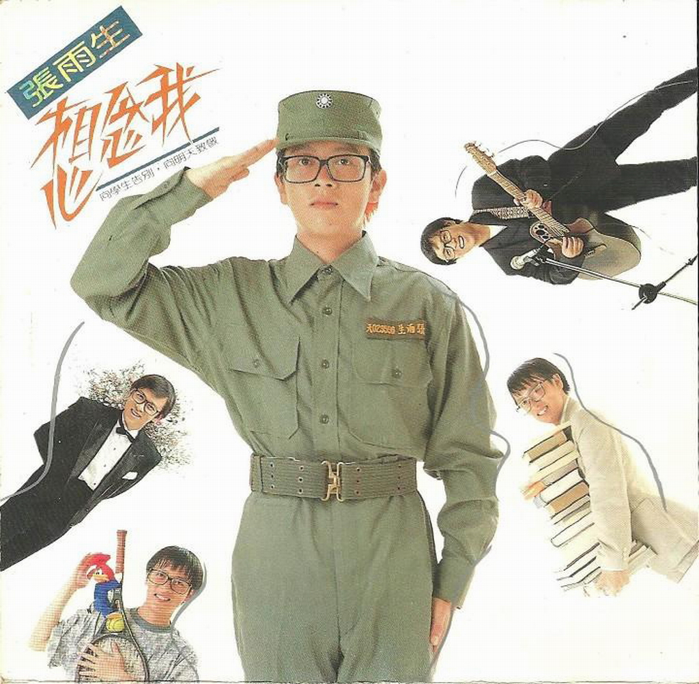

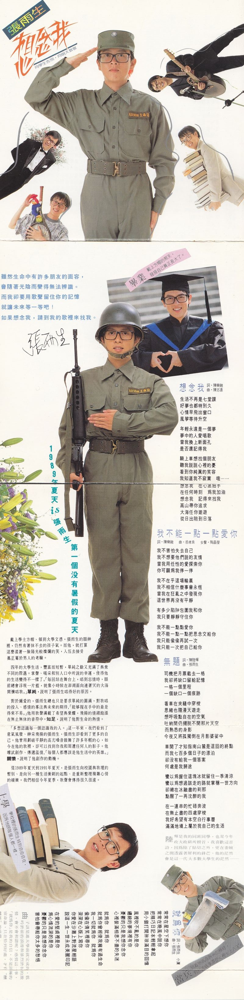

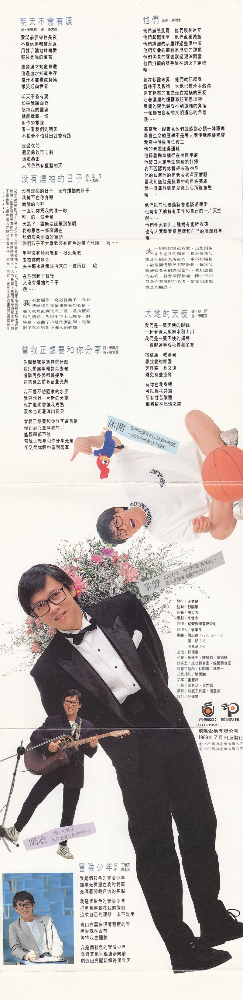

# 唱片詳情

**1989 年夏天 is 張雨生第一個沒有暑假的夏天**  
戴上學士方帽，領到大學文憑，張雨生的眼神裏，仍然有著抹不去的孩子氣。而他，就打算這麼漾著一臉陽光般燦爛的笑，入伍去接受真正屬於男人的考驗。

四年的大學生活，豐富而短暫，單純之餘又充滿了與衆不同的際遇。掌聲、喝彩和別人口中所說的幸運，使得他的生活變得不一樣了。“每回站在舞臺上，唱到忘情時，眼前總會浮現一片藍，就像小時候在澎湖面向連著天的大海開懷唱歌。”單純，說明了張雨生唱得好的原因。

對於鍾愛的，張雨生總也只是要求單純的圓滿，對歌唱的投入、感情的專注與未來的期待，“能夠握在手中的最是得來不易。”他用歌聲滿載了希望與榮耀，飛揚的情緒飽漲在無止無休的音符中。知足，說明了他對生命的熱情。

“多想認識每一個認識我的人。”這一年來，我們看到了意氣風發、神采飛揚的張雨生，張雨生卻看到了更多的自己。他曾用劃破平靜的高亢嗓音鼓舞了許多年輕的心，如今在他的歌裏，卻可以找到你我和周遭任何人的影子。他嘗試創作、傳遞溫情，“每個人都應該是他生活中的英雄。”關懷，說明了他創作的動機。

從 1989 年夏天到 1991 年夏天，是張雨生向校園與歌壇的暫別、是向另一種生活衝刺的起點、是重新整理複雜心情的緩衝。我們相信今年夏季，歌聲會傳得很久很遠。

**上學**  
學校裏的張雨生特別自由自在，  
因爲他跟每個人都一樣。

**畢業**  
戴上方帽的那天，  
發現自己真正長大了。

**當兵**  
別看他高高興興的模樣，  
對於這碼事還是心裏七上八下。

**休閒**  
別問他還有多少玩耍的時間，  
一天 24 小時都快不夠用。

**掌聲**  
站在臺上，他才知道「張雨生」，  
原來是個滿受歡迎的傢伙。

**唱歌**
一個人的時候，  
他只唱自己最想唱的。

# 專輯文案

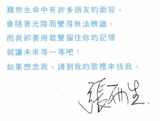
雖然生命中有許多朋友的面容，  
會隨著光陰而變得無法辨識。  
而我卻要用歌聲留住你的記憶，  
就讓未來等一等吧！  
如果想念我，請到我的歌裏來找我。

張雨生

# 想念我

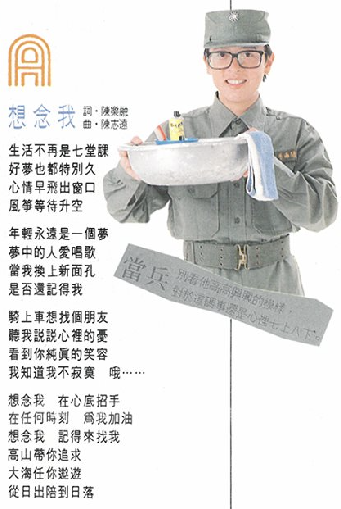
詞：陳樂融  
曲：陳志遠

## 歌詞

生活不再是七堂課  
好夢也都特別久  
心情早飛出窗口  
風箏等待升空

年輕永遠是一個夢  
夢中的人愛唱歌  
當我換上新面孔  
是否還記得我

騎上車想找個朋友  
聽我說說心裏的憂  
看到你純真的笑容  
我知道我不寂寞 哦......

想念我 在心底招手  
在任何時刻 爲我加油  
想念我 記得來找我  
高山帶你追求  
大海任你遨遊  
從日出陪到日落

# 我不能一點一點愛你

詞：陳樂融  
曲：翁孝良  
女聲：陶晶瑩

## 歌詞

我不害怕失去自己  
我不想要他們說的友情  
當我用任性的愛探索你  
你可願爲我停一停

我不在乎這場輸贏  
我不相信什麼事會永恆  
當我在狂亂之中發現你  
這世界再沒有平靜

有多少陷阱包圍我和你  
我只要靜靜守住你  
我不能一點一點愛你  
我不能一點一點把思念交給你  
我只能偷偷再試一次  
我只能一次把自己給你

# 無題

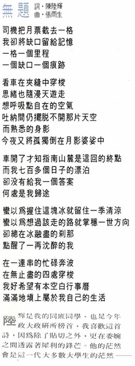

詞：陳陸輝  
曲：張雨生

## 導引

陸輝是我的同班同學，也是今年政大政研所榜首，我喜歡這首詩，因爲除了貼切之外，更在委婉之間透露著犀利的鋒芒。他的茫然會是這一代大多數大學生的茫然——

## 歌詞

司機把月票截去一格  
我卻將缺口留給記憶  
一格一個里程  
一個缺口一個痕跡

看車在夾縫中穿梭  
思緒也隨漫天遊走  
想呼吸點自在的空氣  
吐納間仍擺脫不開那片天空  
而熟悉的身影  
今夜又將孤獨倒在月影婆娑中

車開了才知指南山麓是這回的終點  
而我七百多個日子的漂泊  
卻沒有給我一個答案  
何處是我歸途

蠻以爲握住這塊冰就留住一季清涼  
蠻以爲想過該走的路就掌穩一世方向  
卻總在冰融盡的剎那  
點醒了一再沉醉的我

在一連串的忙碌奔波  
在無止盡的四處穿梭  
我好希望有本空白行事曆  
滿滿地填上屬於我自己的生活

# 就爲你

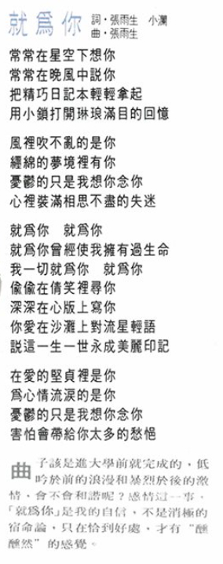  
詞：張雨生 小瀾（邱連枝）  
曲：張雨生

## 導引

曲子該是進大學前就完成的，低吟於前的浪漫和暴烈於後的激情，會不會和諧呢？感情這一事，「就爲你」是我的自信，不是消極的宿命論，只在恰到好處，纔有“醺醺然”的感覺。

## 歌詞

常常在星空下想你  
常常在晚風中說你  
把精巧日記本輕輕拿起  
用小鎖打開琳琅滿目的回憶

風裏吹不亂的是你  
纏綿的夢境裏有你  
憂鬱的只是我想你念你  
心裏裝滿相思不盡的失迷

就爲你 就爲你  
就爲你曾經使我擁有過生命  
我一切就爲你 就爲你  
偷偷在倩笑裏尋你  
深深在心版上寫你  
你愛在沙灘上對流星輕語  
說這一生一世永成美麗印記

在愛的堅貞裏是你  
爲心情流淚的是你  
憂鬱的只是我想你念你  
害怕會帶給你太多的愁悒

# 明天不會有淚

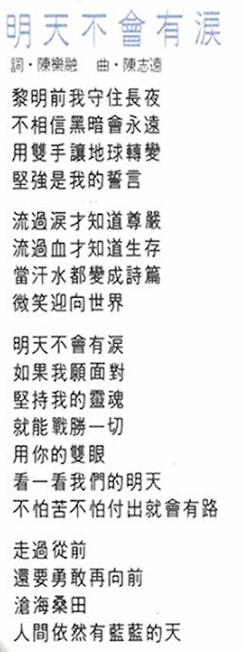  
詞：陳樂融  
曲：陳志遠

## 歌詞

黎明前我守住長夜  
不相信黑暗會永遠  
用雙手讓地球轉變  
堅強是我的誓言

流過淚才知道尊嚴  
流過血才知道生存  
當汗水都變成詩篇  
微笑迎向世界

明天不會有淚  
如果我願面對  
堅持我的靈魂  
就能戰勝一切  
用你的雙眼  
看一看我們的明天  
不怕苦不怕付出就會有路

走過從前  
還要勇敢再向前  
滄海桑田  
人間依然有藍藍的天

# 沒有煙抽的日子

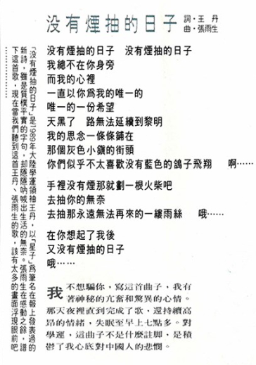  
詞：王丹  
曲：張雨生

## 導引

我不想騙你，寫這首曲子，我有著神祕的亢奮和驚異的心情。那天夜裏直到完成了歌，還持續高昂的情緒，失眠至早上七點多。對學運，這曲子不是什麼註腳，是積鬱了我心底對中國人的悲憫。

（「沒有煙抽的日子」是 1989 年大陸學運領袖王丹，以「星子」爲筆名在報上發表過的新詩，雖是質樸平實的字句，卻隱隱吶喊出生活的無奈。張雨生在感動之餘，譜下這首歌，現在當我們聽到這首王丹、張雨生的歌，該有太多的畫面浮現眼前吧......）

## 歌詞

沒有煙抽的日子 沒有煙抽的日子  
我總不在你身旁  
而我的心裏  
一直以你爲我的唯一的  
唯一的一份希望  
天黑了 路無法延續到黎明  
我的思念一條條鋪在  
那個灰色小鎮的街頭  
你們似乎不太喜歡沒有藍色的鴿子飛翔 啊……

手裏沒有煙那就劃一根火柴吧  
去抽你的無奈  
去抽那永遠無法再來的一縷雨絲 哦……

在你想起了我後  
又沒有煙抽的日子  
哦……

# 當我正想要和你分享

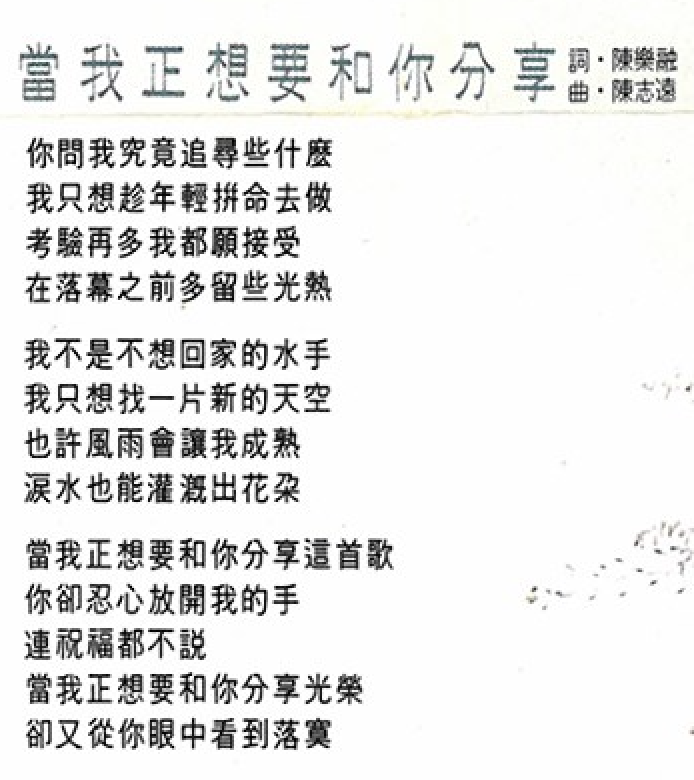

詞：陳樂融  
曲：陳志遠

## 歌詞

你問我究竟追尋些什麼  
我只想趁年輕拼命去做  
考驗再多我都願接受  
在落幕之前多留些光熱

我不是不想回家的水手  
我只想找一片新的天空  
也許風雨會讓我成熟  
淚水也能灌溉出花朵

當我正想要和你分享這首歌  
你卻忍心放開我的手  
連祝福都不說  
當我正想要和你分享光榮  
卻又從你眼中看到落寞

# 他們

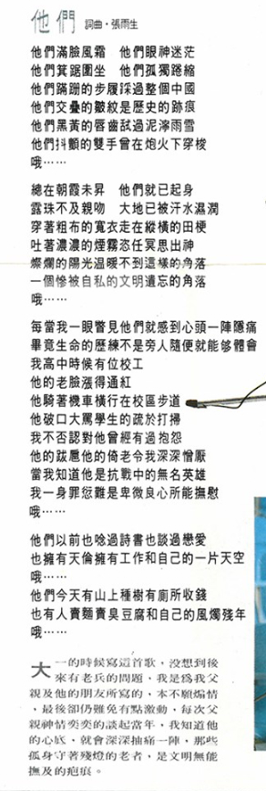

詞曲：張雨生

## 導引

大一的時候寫這首歌，沒想到後來有老兵的問題，我是爲我父親及他的朋友所寫的，本不願煽情，最後卻仍難免有點激動，每次父親神情奕奕的談起當年，我知道他的心底，就會深深抽痛一陣，那些孤身守著殘燈的老者，是文明無能撫及的疤痕。

## 歌詞

他們滿臉風霜 他們眼神迷茫  
他們箕踞圍坐 他們孤獨蜷縮  
他們蹣跚的步履踩過整個中國  
他們交疊的皺紋是歷史的跡痕  
他們黑黃的脣齒舐過泥濘雨雪  
他們抖顫的雙手曾在炮火下穿梭  
哦……

總在朝霞未升 他們就已起身  
露珠不及親吻 大地已被汗水溼潤  
穿著粗布的寬衣走在縱橫的田梗  
吐著濃濃的煙霧恣任冥思出神  
燦爛的陽光溫暖不到這樣的角落  
一個慘被自私的文明遺忘的角落  
哦……

每當我一眼瞥見他們就感到心頭一陣隱痛  
畢竟生命的歷練不是旁人隨便就能夠體會  
我高中時候有位校工  
他的老臉漲得通紅  
他騎著機車橫行在校區步道  
他破口大罵學生的疏於打掃  
我不否認對他曾經有過抱怨  
他的跋扈他的倚老令我深深憎厭  
當我知道他是抗戰中的無名英雄  
我一身罪愆難是卑微良心所能撫慰  
哦……

他們以前也念過詩書也談過戀愛  
也擁有天倫擁有工作和自己的一片天空  
哦……  
他們今天有山上種樹有廁所收錢  
也有人賣面賣臭豆腐和自己的風燭殘年  
哦……

# 大地的天使

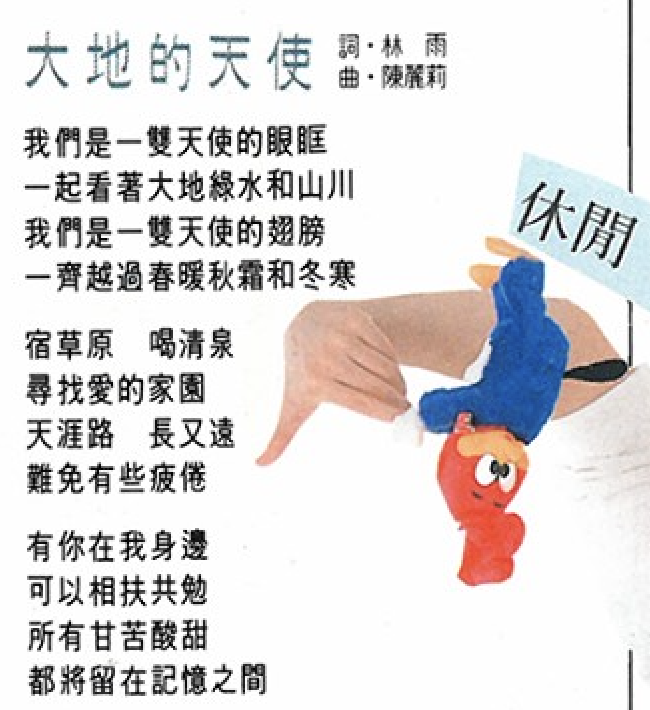

詞：林雨  
曲：陳麗莉

# 歌詞

我們是一雙天使的眼眶  
一起看著大地綠水和山川  
我們是一雙天使的翅膀  
一齊越過春暖秋霜和冬寒

宿草原 喝清泉  
尋找愛的家園  
天涯路 長又遠  
難免有些疲倦

有你在我身邊  
可以相扶共勉  
所有甘苦酸甜  
都將留在記憶之間

# 冒險少年

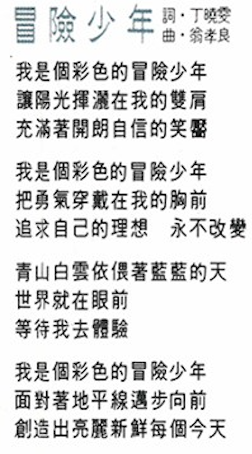

詞：丁曉雯  
曲：翁孝良

# 歌詞

我是個彩色的冒險少年  
讓陽光揮灑在我的雙肩  
充滿著開朗自信的笑靨

我是個彩色的冒險少年  
把勇氣穿戴在我的胸前  
追求自己的理想 永不改變

青山白雲依偎著藍藍的天  
世界就在眼前  
等待我去體驗

我是個彩色的冒險少年  
面對著地平線邁步向前  
創造出亮麗新鮮 每個今天

# 負責團隊

|      負責      |                         人員 / 工作室                         |
| :------------: | :-----------------------------------------------------------: |
|      發行      |                            吳楚楚                             |
|      監製      |                            彭國華                             |
|      統籌      |                            陳大力                             |
|      策劃      |                            李世忠                             |
|      製作      |                       銘聲製作有限公司                        |
|     製作人     |                            翁孝良                             |
|      編曲      | 陳志遠（1、2、5、6、7、10） 屠穎（3、8） 涂惠源（4、9） |
|      吉他      |                            蘇德華                             |
|      和聲      |                    孫建平、陳麗莉、陳秀珠                     |
|     錄音室     |                    成功錄音室、銘聲錄音室                     |
|   錄音工程師   |                        林明陽、馮志平                         |
|    文案總監    |                            陳樂融                             |
|      文案      |                            謝慧鈴                             |
|      化妝      |                        裘素芝、吳翔凱                         |
|      攝影      |                      祥威工作室 - 潘重威                      |
|      設計      |                            杜達雄                             |
| 音樂錄影帶導演 |          想念我（朱延平）、沒有煙抽的日子（張榮貴）           |

飛碟唱片 銘聲製作  
UFO - 8999  
飛碟企業有限公司  
1989 年 7 月 22 日出版發行  
Ⓟ1992 飛碟企業股份有限公司  
Ⓒ1992 飛碟企業股份有限公司

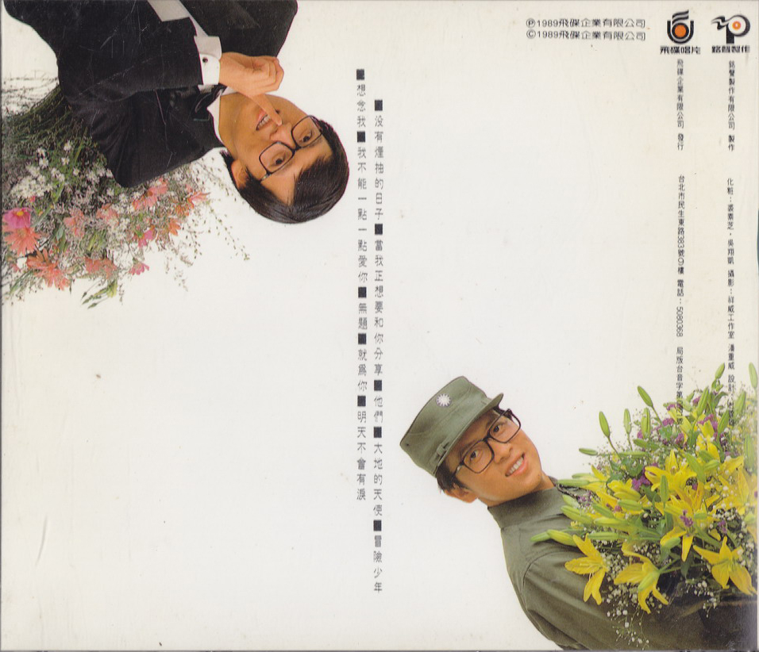

# 參考

相關鏈接：

-   [想念雨生「想念我」 - 男神卡卡的卡帶人生@facebook.com](https://www.facebook.com/livingtapes/posts/pfbid0kvDCafRvK9Jcje3wAsbpaGXJjRUnH7k9FUfuyZuBbS5mi2DabbJydwZMPrNRZqQvl)
-   [想念我 \- 維基百科，自由的百科全書](https://zh.wikipedia.org/wiki/%E6%83%B3%E5%BF%B5%E6%88%91)

當前頁面缺陷：

1. 維基百科和 tomchang.cn 關於專輯的發行時間衝突，目前以維基百科爲準

整理：cora，健健
