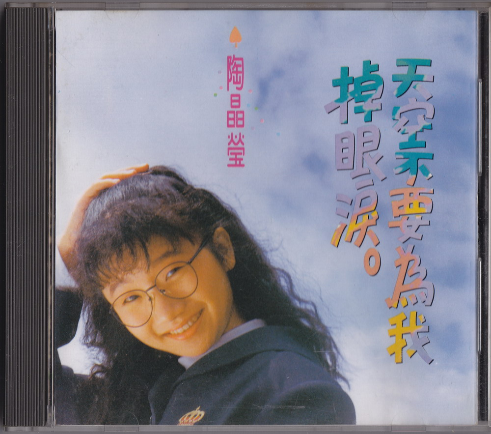
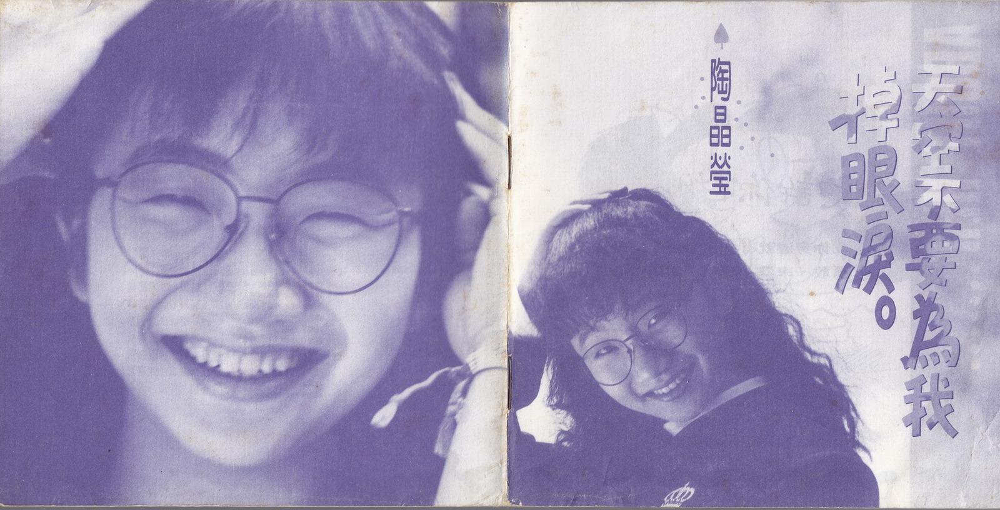
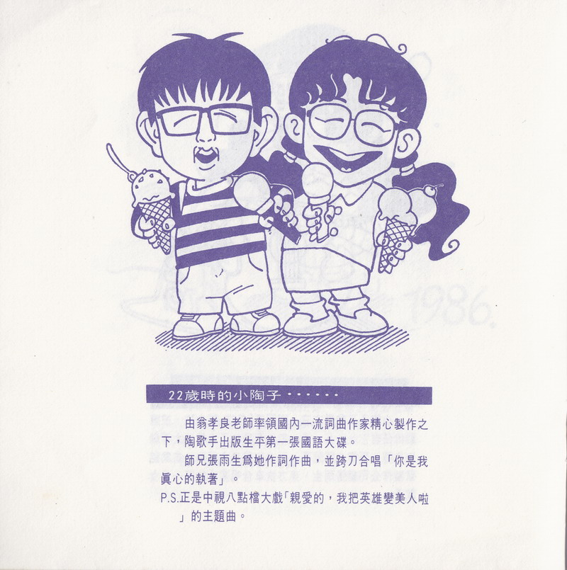
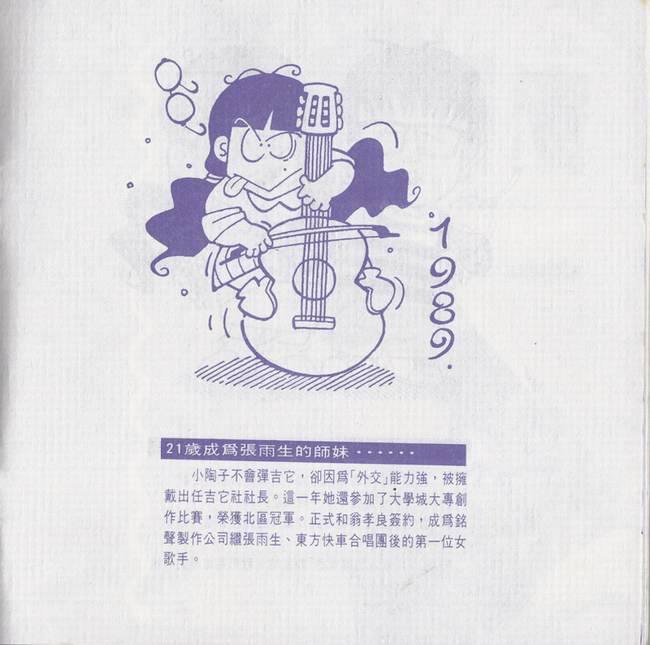
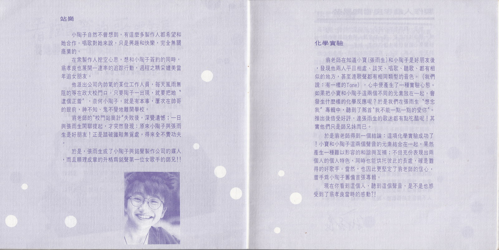
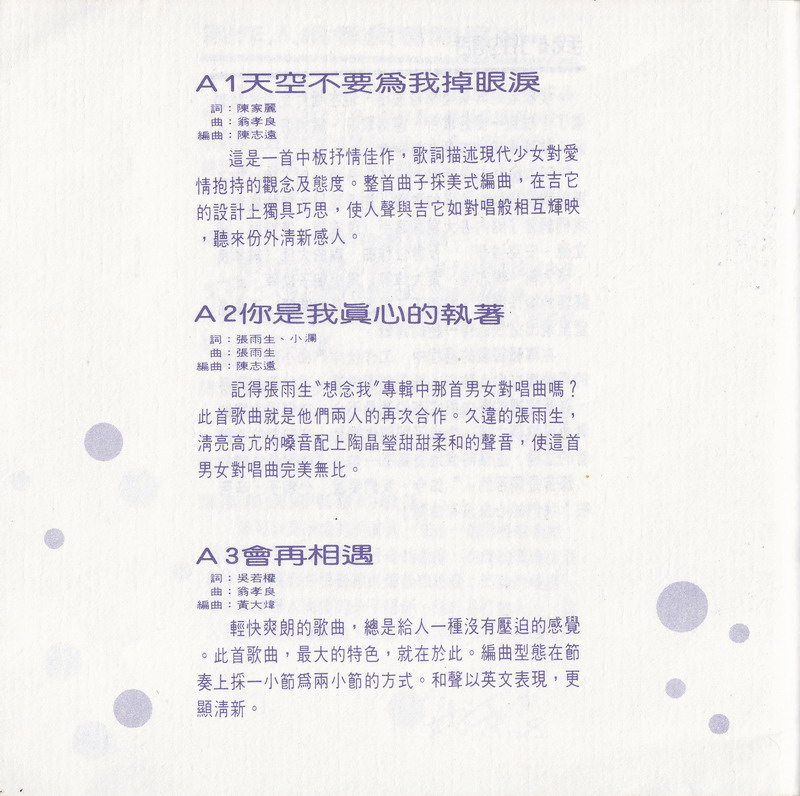
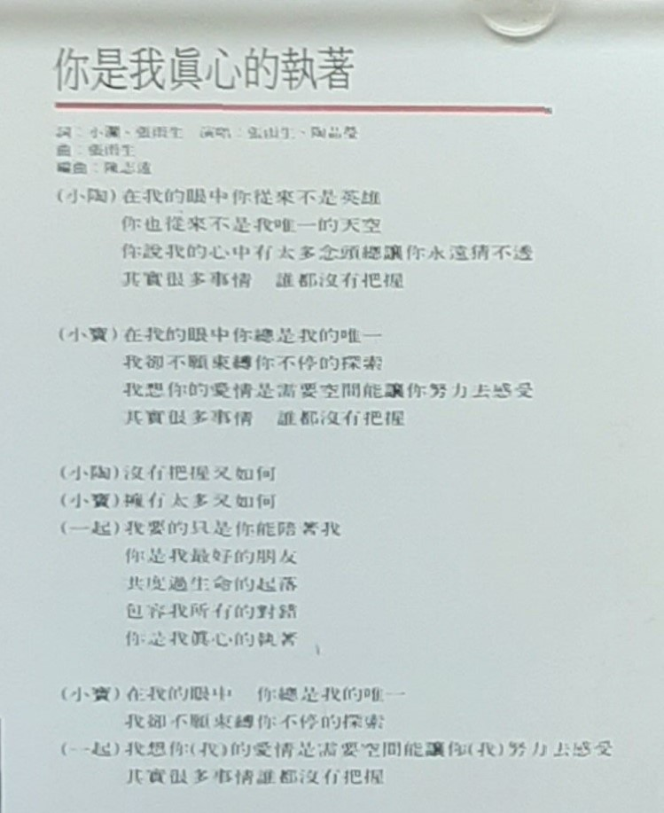
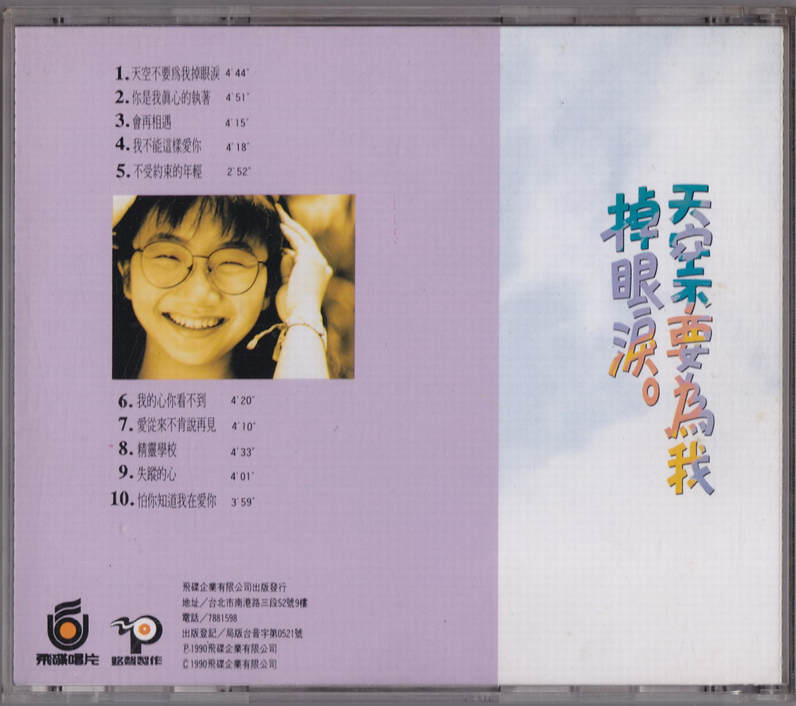

# 天空不要爲我掉眼淚

# 文案

**22 歲時的小陶子 · · · · · ·**  
由翁孝良老師率領國內一流詞曲作家精心製作之下，陶歌手出版生平第一張國語大碟。  
師兄張雨生爲她作詞作曲，並跨刀合唱「你是我真心的執著」。  
P.S.正是中視八點檔大戲「親愛的，我把英雄變美人啦」的主題曲。

**21 歲成爲張雨生的師妹 · · · · · ·**  
小陶子不會彈吉它，卻因爲「外交」能力強，被擁戴出任吉它社社長。這一年她還參加了大學城大專創作比賽，榮獲北區冠軍。正式和翁孝良策約，成爲銘聲製作公司繼張雨生、東方快車合唱圍後的第一位女歌手。

**站崗**  
小陶子自然不會想到，有這麼多製作人都希望和她合作。唱歌對她來說，只是興趣和快樂，完全無關商業的。  
在衆製作人挖空心思，想和小陶子簽約的同時，翁孝良也展開一連串的追蹤行動，過程之精采媲美當年追女朋友。  
他派出公司內帥氣的某位工作人員，每天風雨無阻的等在政大校門口。只要陶子一出現，就要把她“逮個正著”，奈何小陶子，就是有本事，屢次在帥哥的眼前，神不知、鬼不覺地離開學校。  
翁老師的“校門站崗計”失敗後，深覺遺憾；一日與張雨生間聊提起，才突然發現：原來小陶子輿張雨生是好朋友！正是踏破鐵鞋無覓處，得來全不費功夫。  
於是，張雨生成了小陶子與銘聲製作公司的媒人，而且順理成章的升格爲銘聲第一位女歌手的師兄！

**化學實驗**  
翁老師在知道小寶(張雨生)和小陶子是好朋友後，發現他兩人平日相處、談笑、唱歌、聽歌、都有相似的地方，甚至連歌聲都有相同類型的音色。(我們說：有一樣的 Tone)，心中便產生了一種實驗心態。 如果把小寶和小陶子這兩個不同的元素放在一起，會發生什麼樣的化學反應呢？於是我們在張雨生“想念我”專輯中，聽到了那首“我不能一點一點愛你”。 推出後倍受好評，連張雨生的歌迷都有點吃醋呢！其實他們只是師兄妹而已。  
於是翁老師得到一個結論：這項化學實驗成功了！小寶和小陶子這兩個聲音的元素結合在一起，果然產生一種難以形容的和諧與互補；不但充份表現出兩個人的個人特色，同時也能烘托彼此的長處，確是難得的好歌手。當然，也因此更堅定了翁老師的信心，著手爲小陶子籌備首張專輯。
現在你看到這個人，聽到這個聲音，是不是也感受到了翁孝良當時的感動？！

# 你是我真心的執著

作詞：張雨生、小瀾（邱連枝）  
作曲：張雨生  
編曲：陳志遠

## 導引

記得張雨生”想念我”專輯中那首男女對唱曲嗎？此首歌曲就是他們兩人的再次合作。久違的張雨生，清亮高亢的嗓音配上陶晶瑩甜甜柔和的聲音，使這首男女對唱曲完美無比。

## 歌詞

在我的眼中你從來不是英雄  
你也從來不是我唯一的天空  
你說我的心中有太多念頭總讓你永遠猜不透  
其實很多事情 誰都沒有把握

在我的眼中你總是我的唯一  
我卻不願束縛你不停的探索  
我想你的愛情是需要空間能讓你努力去感受  
其實很多事情 誰都沒有把握

沒有把握又如何  
擁有太多又如何  
我要的只是你能陪著我  
你是我最好的朋友  
共渡過生命的起落  
包容我所有的對錯  
你是我真心的執著

在我的眼中 你總是我的唯一  
我卻不願束縛你不停的探索  
我想你（我）的愛情是需要空間能讓你（我）努力去感受  
其實很多事情誰都沒有把握

# 製作團隊

|    負責    |      人員 / 工作室       |
| :--------: | :----------------------: |
|    發行    |          吳楚楚          |
|    監製    |          彭國華          |
|    統籌    |          陳大力          |
|    策劃    |          李世忠          |
|  製作策劃  |     銘聲製作有限公司     |
|   製作人   |          翁孝良          |
|  助理製作  |          吳志華          |
|  吉他演奏  |          蘇德華          |
|    和聲    |  吳志華、陳麗莉、黃麗星  |
|    錄音    | 銘聲錄音室 、成功錄音室  |
| 錄音工程師 |          馮志平          |
|  混音合成  |  馮志平、翁孝良、吳志華  |
|    攝影    |          楊立德          |
|    化妝    |           Anny           |
|    發行    |           高明           |
|    漫畫    |          王言中          |
|  平面設計  | AD 李明道、DESIGN 汪筱平 |
|  專案執行  |     飛碟國內事業一部     |

飛碟企業有限公司出版發行  
地址/台北市南港路三段 52 號 9 樓  
電話/7881598  
出版登記/局版台音字第 0521 號  
Ⓟ1990 飛碟企業有限公司  
Ⓒ1990 飛碟企業有限公司

# 掃描圖片

整理：cora
