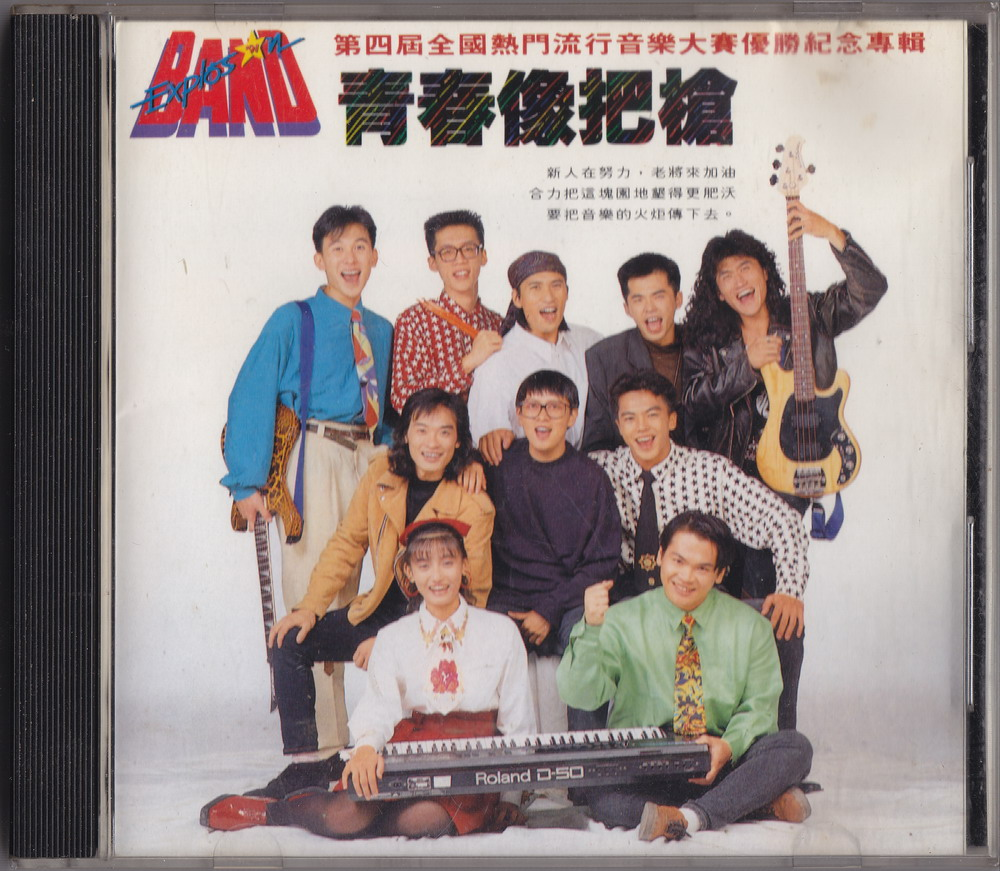
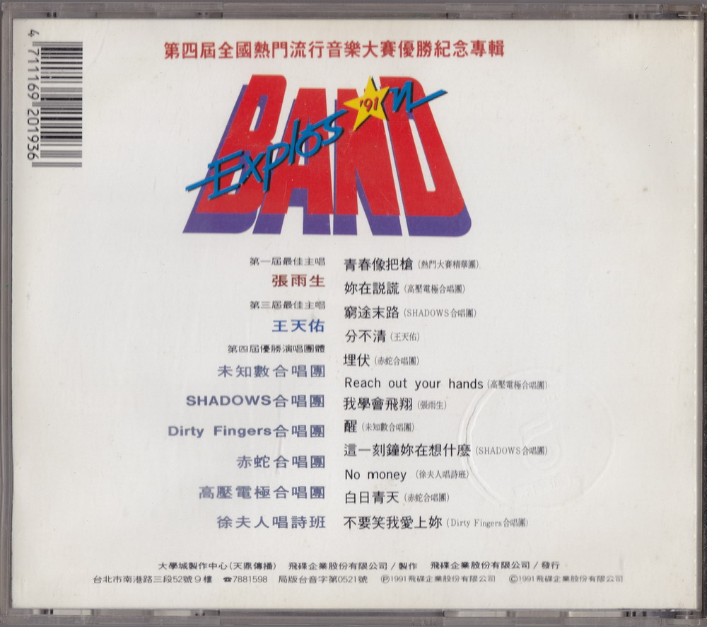
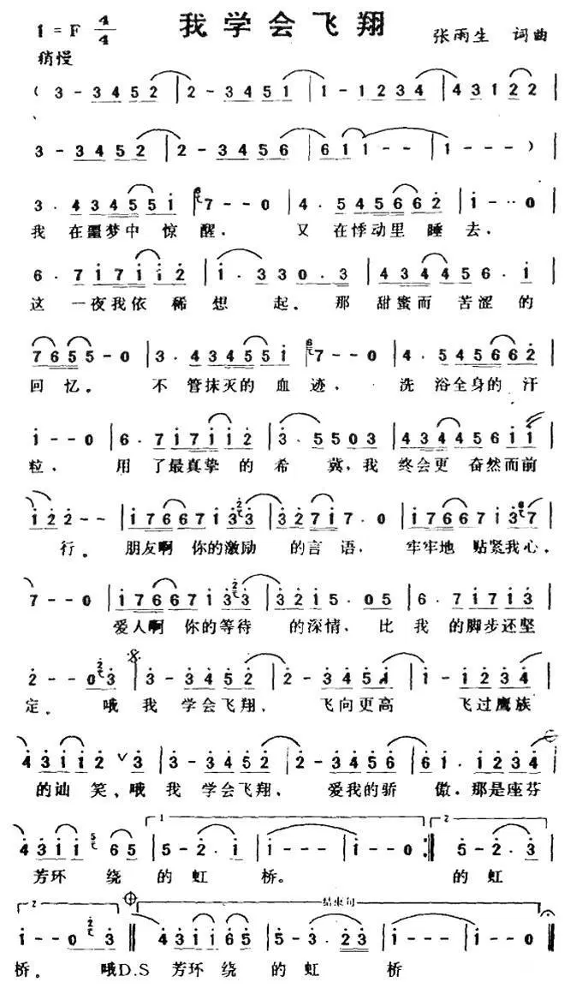

# 青春像把槍

# 文案

青春像把槍，第四屆全國流行音樂大賽優勝紀念專輯

轉眼，全國熱門流行音樂大賽已經第四屆了。回想當時，我們還引用合辦單位之一救國團李鍾桂主任的話：「喜愛音樂的孩子不會變壞」，來祛除社會大衆中部分疑慮不屑的眼光，然而至今，我們早已能讓歌手和聽衆，都挺直腰桿地站在陽光下。張雨生、邰正宵、姚可傑、王天佑…乃至國內女子搖滾樂團前軀「鐵之女」的前身，都出自這個園地。他們幸運地隨著時代人心的驛動，而以另一種風貌贏得多數人的肯定，進而從校園躍身歌壇，甚至成爲努力的詞曲創作者或幕後工作者，讓少年時期的摯愛，能演變爲一生的挑戰，全國熱門流行音樂大賽，應該功不容沒。

而現在，經歷了「烈火青春」、「美夢成真」「吶喊天空」三張專輯多樣的嘗試，熱門大賽的歌手，找到了新的一種表達熱情的方式。不但如前例從數支優勝隊伍中，萃取了八位演唱及演奏的代表組成精華團，第一屆最佳主唱張雨生和第三屆最佳主唱王天佑，也重披戰袍，帶著他們的新作與「小老弟們」一較高下。這種師兄弟同臺競技的氣氛，和熱門大賽一貫標榜的生猛有勁的精神相映照，戲味，就更濃了。
其實較勁也好，傳承也好，打氣也好，這樣的安排設想都奠立在音樂上，一次揚名立萬不夠，再接再勵、貫徹始終才厲害。張雨生、王天佑不過是想給學弟妹們一點鼓勵、一點示範，當然，也給自己無限壓力。

從現在起，我們每個人的眼睛，都要牢牢盯緊臺上的每一個身影。前人看著後人，後人看著前人，觀衆看著歌手，歌手催促著知音。大學城和飛碟唱片，每年都以最開放的心，給國內的新人、新團和新的音樂在這片園地上大聲說、大聲唱，因爲我們衷心希望大家可以一齊說，一齊唱，讓我們共同構成熱門音樂與年輕生命間，一個善的循環。

# 分不清

作詞：張雨生  
作曲：張雨生  
編曲：張雨生  
演唱：王天佑

## 歌詞

無緣無故想起你 和敗壞的心情  
輸贏的念頭盤旋著 揉酸我眼睛  
莫非我也不能自己 不能摒息  
當記憶還有些 小碎片要整理

無嗔無喜想起你 和掉淚的情緒  
並沒有空間來安放 失落的感情  
只是我又不能自己 不能摒息  
當歡呼聲過去 那熟悉的聲音

分不清 我一直緊緊距離這樣近 卻抓不住你  
分不清 時間把生活棱角都磨平 我們一無轉機  
分不清 我一直緊緊距離這樣近 卻抓不住你  
分不清 惡醉在人羣喧鬧的中間 我卻格外清醒  
想起你

# 我學會飛翔

作詞：張雨生  
作曲：陳志遠  
演唱：張雨生

## 歌詞

我在噩夢裏驚醒  
又在悸動裏睡去  
這一夜我依稀想起  
那甜美而苦澀的回憶

不曾磨滅的血跡  
洗浴全身的汗粒  
用了最真摯的希冀  
我終會更奮然而前行

朋友啊 你的激勵的言語 牢牢地貼近我心  
愛人啊 你的等待的深情 比我的腳步還堅定

哦 我學會飛翔 飛向最高 飛過鷹族的訕笑  
哦 我學會去愛 愛我的驕傲 那是座芬芳環繞的虹橋

# 這一刻鐘妳在想什麼

作詞：張雨生  
作曲：張雨生  
演唱：Shadows 合唱團

### 歌詞

這一刻鐘妳在想什麼 我愛的容顏往哪邊斜  
那些我熟稔的小動作 那雙我心醉的草莓眼

夜風吹亂桌上書頁 這陣清涼實在費解  
臨風遙想溫存情話 相思深處誰怕肉麻

這一刻鐘妳在想什麼 尋夢之前聽我唱首歌  
這一刻鐘我在想什麼 喜悅與寧謐澆灑心胸

# 製作團隊

|     負責     |                    人員/團隊                     |
| :----------: | :----------------------------------------------: |
|     發行     |                      吳楚楚                      |
|     監製     |                      彭國華                      |
|     統籌     |                      陳大力                      |
|    總策劃    |                      陳光陸                      |
|     製作     | 大學城製作中心（天鼎傅播）、飛碟企業股份有限公司 |
|    製作人    |                      吳大衛                      |
|     吉他     |                      江建民                      |
|     和聲     |          孫建平、陳麗莉、馬國萍、羅添洲          |
|    錄音室    |                    加合錄音室                    |
|    錄音師    |                  何慶堂、王家棟                  |
|     混音     |                  王家棟、吳大衛                  |
|   項目策劃   |                      李世忠                      |
|     文案     |                  陳樂融、雷建中                  |
|     化妝     |                  林葉亭、陳玫如                  |
|     髮型     |                     華隆髮型                     |
|     攝影     |                      潘重威                      |
|   平面設計   |                Album Design Unit                 |
|      AD      |                      杜達雄                      |
|     設計     |                      王鶴治                      |
|   MTV 導演   |               朱延平（我學會飛翔）               |
|   專案執行   |                 飛碟國內事業一部                 |
| 活動主辦單位 |         中國青年救國團、功學社、中國時報         |

飛碟唱片 UFO-91193  
Ⓟ&Ⓒ 飛碟企業股份有限公司  
1991 年 10 月出版發行

# 專輯掃描

# 簡譜

# 參考

-   [張雨生『這一刻鐘你在想什麼』demo 高清音質版\_嗶哩嗶哩\_bilibili](https://www.bilibili.com/video/BV1aU4y117U4/)
-   [張雨生《分不清》Demo\_嗶哩嗶哩\_bilibili](https://www.bilibili.com/video/BV1as411N7Nm/)

整理：洋昆，健健

當前頁面缺陷：

1. 發行時間沒有精確到日
2. 缺少專輯掃描圖片
