# 張雨生創作專輯（帶我去月球）[^1]

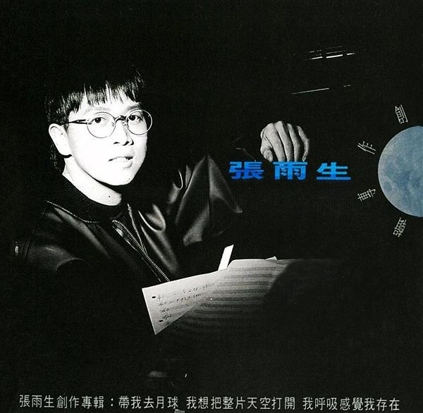

# 張雨生創作專輯·製作概念·企劃情報

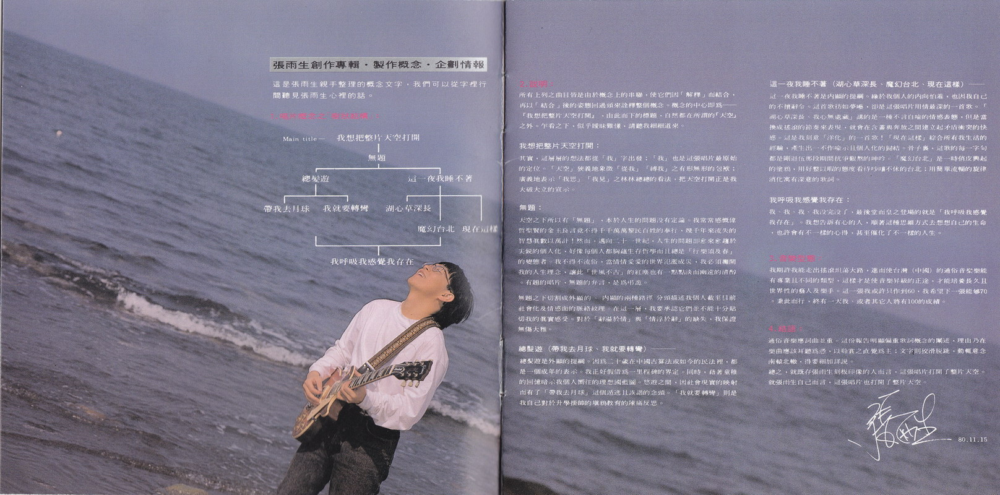

## 唱片概念之「樹狀結構」

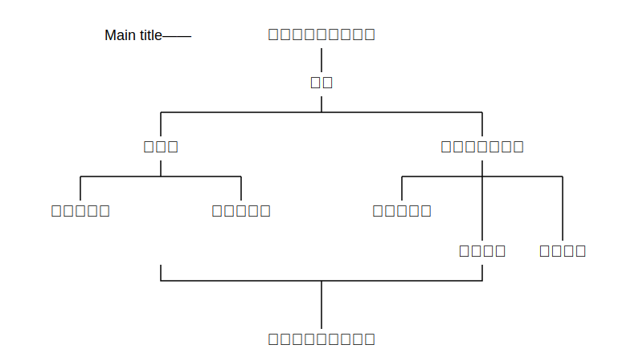

## 說明

所有上列之曲目皆是由於概念上的串聯，使它們因「解釋」而結合，再以「結合」後的姿態回過頭來詮釋整個概念。概念的中心即爲——『我想把整片天空打開』，由此而下的標題，自然都在所謂的『天空』之外。乍看之下，似乎暖味難懂，請聽我細細道來。

**我想把整片天空打開：**  
其實，這層層的想法都是從「我」字出發：「我」也是這張唱片最原始的定位。「天空」狹義地象徵「從我」「縛我」之有形無形的包袱；廣義地表示「我思」「我見」之林林總總的看法，把天空打開正是我大破大立的宣示。

**無題：**  
天空之下所以有「無題」，本於人生的問題沒有定論。我常常感慨偉哲聖賢的金玉良言竟不得千千萬萬黎民百姓的奉行，幾千年來流失的智慧真數以萬計！然而，邁向二十一世紀，人生的問題卻愈來愈趨於尖銳的個人化，好像每人都胸蘊生存哲學而且總是「行樂須及春」的變態者。我不得不流俗，當情情愛愛的世界氾濫成災，我必須攤開我的人生理念，讓此「世風不古」的紅塵也有一點點淡而幽遠的清醇。有題的唱片，無題的弁言，是爲弔詭。  
無題之下切割成外顯的、內顯的兩種路徑，分類描述我個人截至目前社會化及情感面的脈絡紋理。在這一層，我要承認它們並不能十分貼切我的真實感受。對於「辭溢於情」與「情浮於辭」的缺失，我保證無傷大雅。

**總髮遊（帶我去月球、我就要轉彎）————**  
總髮遊是外顯提綱。因爲二十歲在中國古算法或如今的民法裏，都是一個成年的表示。我正好假借爲一里程碑的界定。同時，藉着童稚的回憶暗示我個人嚮往的理想國藍圖。悠遊之間，因社會現實的映射而有了「帶我去月球」這個遁逃且詼諧的念頭。「我就要轉彎」則是我自己對於升學掛帥的填鴉教育的陳痛反思。

**這一夜我睡不着（湖心草深長、魔幻臺北、現在這樣）————**  
這一夜我睡不着是內顯的提綱。緣於我個人的內向怕羞。也因我自己的不擅辭令。這首歌彷如夢囈，卻是這張唱片用情最深的一首歌。「湖心草深長，我心無處藏」講的是一種不言自喻的情感表態，但是當換成搖滾的節奏來表現，就會在含蓄與奔放之間建立起矛盾衝突的快感。這是我刻意「洋化」的一首歌！「現在這樣」綜合所有我生活的經驗，產生出一不作喻示且個人化的歸結。骨子裏，這歌的每一字句都是剛退伍那段期間抗爭艱熬的呻吟。「魔幻臺北」是一時俏皮興起的塗鴉，用好整以暇的態度看待吵嚷不休的臺北；用簡單流暢的旋律消化寓有深意的歌詞。

**我呼吸我感覺我存在：**  
我、我、我、我沒完沒了，最後堂而皇之登場的就是「我呼吸我感覺我存在」。我想告訴有心的人，順着這種思維方式去想想自己的生命，也許會有不一樣的心得，甚至催化了不一樣的人生。

## 音樂型態

我期許我能走出搖滾坦蕩大路，進而使臺灣（中國）的通俗音樂[^2]能有專業且不同的類型，這樣纔是使音樂升級的正途，才能培養長久且世界性的藝人及樂手。這一張我或許只作到 60。我希望下一張能夠 70。秉此而行，終有一天我、或者其它人將有 100 的成績。

## 結語

通俗音樂應詞曲並重。這份報告明顯偏重歌詞概念的闡述，理由乃在樂曲應該耳聽爲憑，以聆賞之直覺爲主；文字則狡猾脫跳，動輒意念南轅北轍，得要細加詳說。  
總之，就既存張雨生刻板印像的人而言，這張唱片打開了整片天空。就張雨生自己而言，這張唱片也打開了整片天空。  
張雨生 80.11.15

# 文案

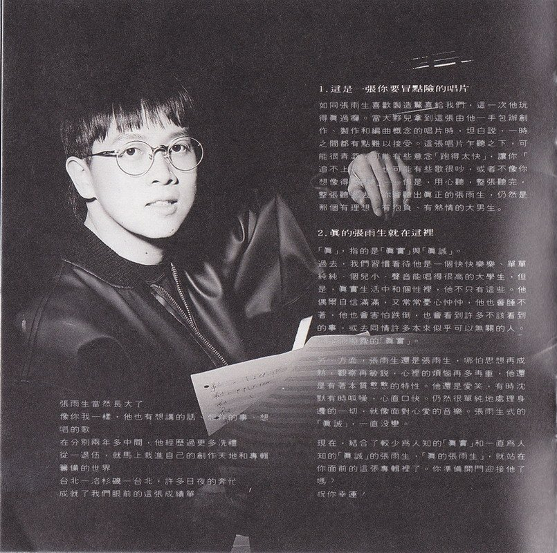  
張雨生當然長大了  
像你我一樣，他也有想講的話、想做的事、想唱的歌  
在分別兩年多中間，他經歷過更多洗禮  
從一退伍，就馬上栽進自己的創作天地和專輯籌備的世界  
臺北——洛杉磯——臺北，許多日夜的奔忙成就了我們眼前的這張成績單——

## 1. 這是一張你要冒點險的唱片

如同張雨生喜歡製造驚喜給我們，這一次他玩得真過癮。當大夥兒拿到這張由他一手包辦創作、製作和編曲概念的唱片時，坦白說，一時之間都有點難以接受。這張唱片乍聽之下，可能很青澀，可能有些意念『跑得太快』，讓你『追不上去』 ；也可能有些歌很吵，或者不像你想象得『好聽』—— 但是，用心聽，整張聽完，整張聽進去，你會聽出真正的張雨生，仍然是那個有理想、有抱負、有熱情的大男生。

## 2. 真的張雨生就在這裏

『真』，指的是『真實』和『真誠』。  
過去，我們習慣看待他是一個快快樂樂、單單純純、個兒小、聲音能唱得很高的大學生，但是，真實生活中和個性裏，他不只有這些。他偶而自信滿滿，又常常憂心忡忡，他也會睡不着，他也會害怕跌倒，也會看到許多不該看到的事，或去同情許多本來似乎可以無關的人。這是他顯露的『真實』。  
另一方面，張雨生還是張雨生，哪怕思想再成熟，觀察再敏銳，心裏的煩惱再多再重，他還是有着本質憨憨的特性。他還是愛笑，有時沉默有時呱噪，心直口快。仍然很單純地處理身邊的一切，就像面對心愛的音樂。張雨生式的『真誠』，一直沒變。  
現在，結合了較少爲人知的『真實』和一直爲人知的『真誠』的張雨生，『真的張雨生』，就站在你面前的這張專輯裏了。你準備開門迎接他了嗎？  
祝你幸運！

---

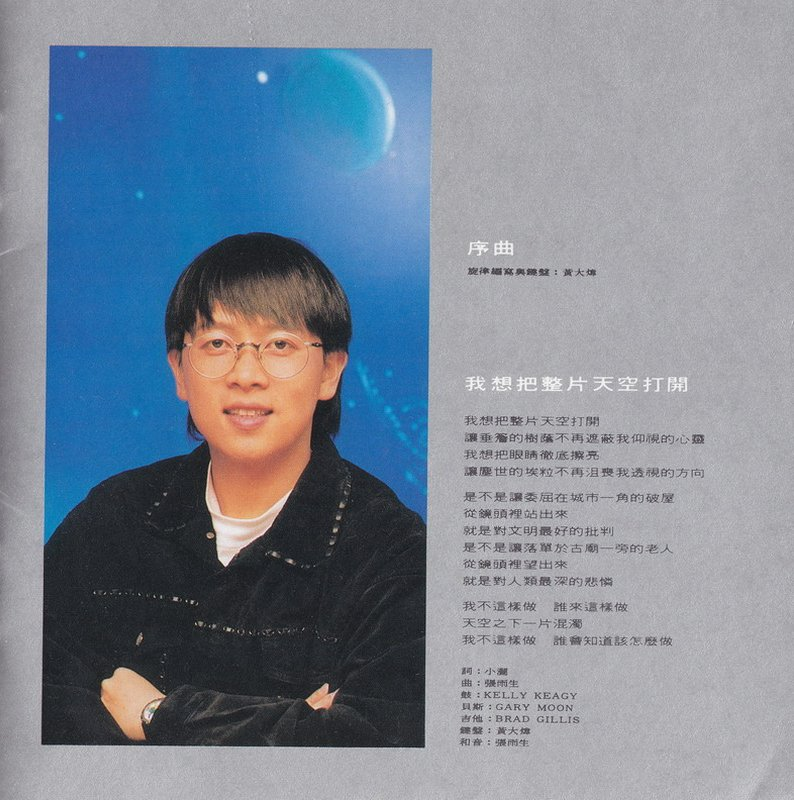

# 序曲

|      負責      |  人員  |
| :------------: | :----: |
| 旋律編寫與鍵盤 | 黃大煒 |

# 我想把整片天空打開

## 歌詞

我想把整片天空打開  
讓垂檐的樹蔭不再遮蔽我仰視的心靈  
我想把眼睛徹底擦亮  
讓塵世的埃粒不再沮喪我透視的方向

是不是讓委屈在城市一角的破屋  
從鏡頭裏站出來  
就是對文明最好的批判  
是不是讓落單于古廟一旁的老人  
從鏡頭裏望出來  
就是對人類最深的悲憐

我不這樣做 誰來這樣做  
天空之下一片混濁  
我不這樣做 誰會知道該怎麼做

| 負責  |      人員      |
| :---: | :------------: |
|  詞   | 小瀾（邱連枝） |
|  曲   |     張雨生     |
|  鼓   |  KELLY KEAGY   |
| 貝斯  |   GARY MOON    |
| 吉他  |  BRAD GILLIS   |
| 鍵盤  |     黃大煒     |
| 和音  |     張雨生     |

# 無題

## 導引

我不是喜歡無題，我只想表示我個人對答案的不置可否。生命的意義不是問與答，而是對於所有追尋的期待。  
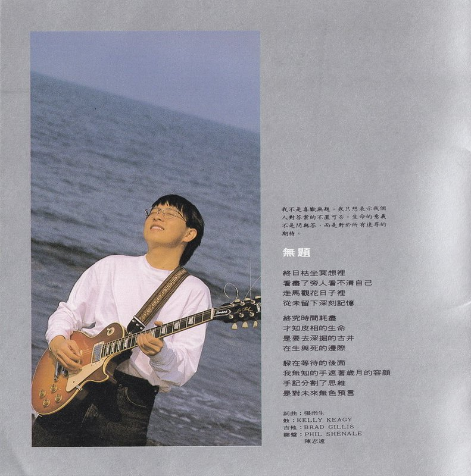

## 歌詞

終日枯坐冥想裏  
看盡了旁人看不清自己  
走馬觀花日子裏  
從未留下深刻記憶

終究時間耗盡  
才知皮相的生命  
是要去深掘的古井  
在生與死的邊際

躲在等待的後面  
我無知的手遮著歲月的容顏  
手記分割了思維  
是對未來無色預言

| 負責  |          人員          |
| :---: | :--------------------: |
| 詞曲  |         張雨生         |
|  鼓   |      KELLY KEAGY       |
| 吉他  |      BRAD GILLIS       |
| 鍵盤  | PHIL SHENALE 陳志遠 |

# 帶我去月球

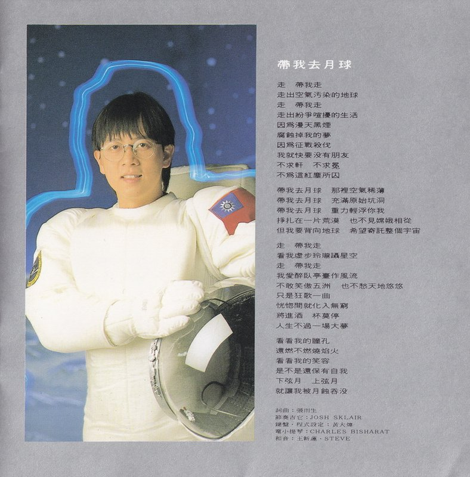

## 歌詞

走 帶我走  
走出空氣污染的地球  
走 帶我走  
走出紛爭喧擾的生活  
因爲漫天黑煙  
腐蝕掉我的夢  
因爲征戰殺伐  
我就快要沒有朋友  
不求軒 不求冕  
不爲這紅塵所囚

帶我去月球 那裏空氣稀薄  
帶我去月球 充滿原始坑洞  
帶我去月球 重力輕浮你我  
掙扎在一片荒漠 也不見嫦娥相從  
但我要背向地球 希望寄託整個宇宙

走 帶我走  
看我虛步玲瓏躡星空  
走 帶我走  
我愛醉臥亭臺作風流  
不敢笑傲五洲 也不愁天地悠悠  
只是狂歌一曲  
恍惚間就化入無窮  
將進酒 杯莫停  
人生不過一場大夢

看看我的瞳孔  
還燃不燃燒焰火  
看看我的笑容  
是不是還保有自我  
下弦月 上弦月  
就讓我被月蝕吞沒

|     負責      |       人員       |
| :-----------: | :--------------: |
|     詞曲      |      張雨生      |
|   演奏吉它    |   JOSH SKLAIR    |
| 鍵盤·程式設定 |      黃大煒      |
|   電小提琴    | CHARLES BISHARAT |
|     和音      |   王新蓮.STEVE   |

# 這一夜我睡不着

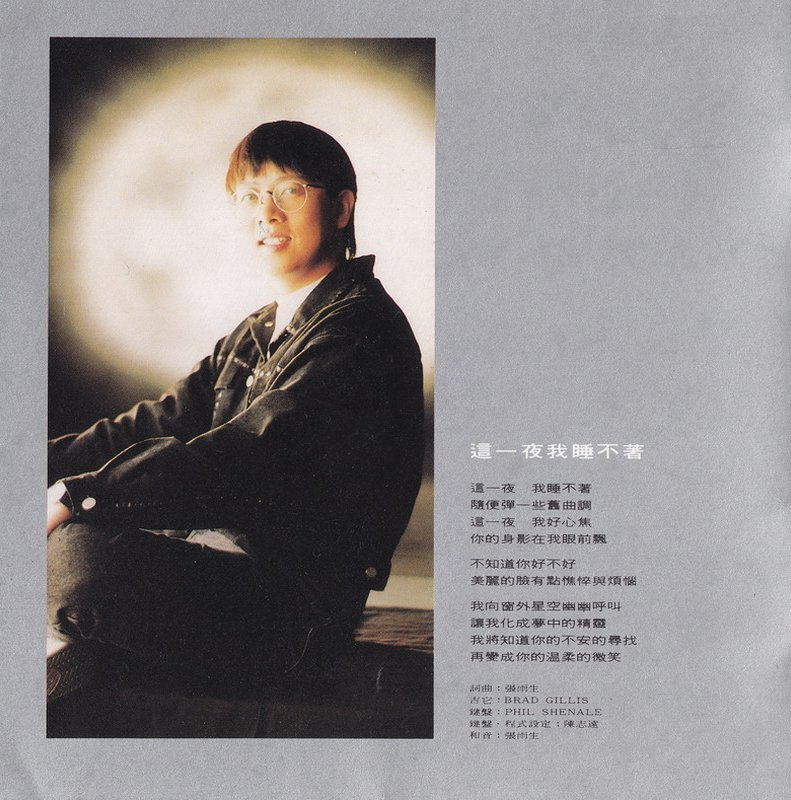

## 歌詞

這一夜 我睡不着  
隨便彈一些舊曲調  
這一夜 我好心焦  
你的身影在我眼前飄

不知道你好不好  
美麗的臉有點憔悴與煩惱

我向窗外星空幽幽呼叫  
讓我化成夢中的精靈  
我將知道你的不安的尋找  
再變成你的溫柔的微笑

|     負責      |     人員     |
| :-----------: | :----------: |
|     詞曲      |    張雨生    |
|     吉他      | BRAD GILLIS  |
|     鍵盤      | PHIL SHENALE |
| 鍵盤·程式設定 |    陳志遠    |
|     和音      |    張雨生    |

# 我就要轉彎

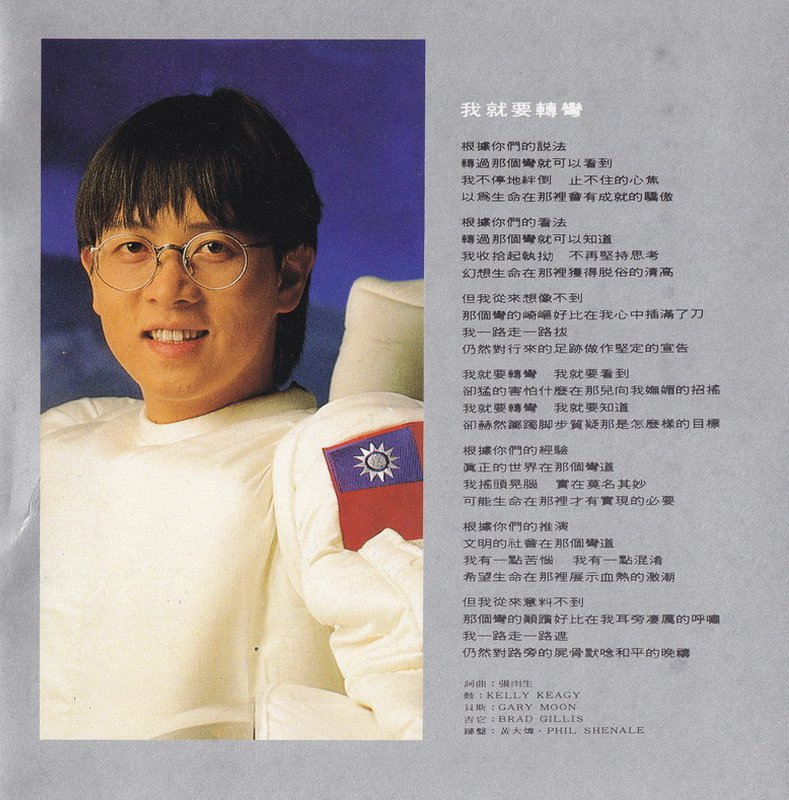

## 歌詞

根據你們的說法  
轉過那個彎就可以看到  
我不停地絆倒 止不住的心焦  
以爲生命在那裏會有成就的驕傲

根據你們的看法  
轉過那個彎就可以知道  
我收拾起執拗 不再堅持思考  
幻想生命在那裏獲得脫俗的清高

但我從來想象不到  
那個彎的崎嶇好比在我心中插滿了刀  
我一路走一路拔  
仍然對行來的足跡做作堅定的宣告

我就要轉彎 我就要看到  
卻猛的[^3]害怕什麼在那兒向我嫵媚的招搖  
我就要轉彎 我就要知道  
卻赫然躑躅腳步質疑那是怎麼樣的目標

根據你們的經驗  
真正的世界在那個彎道  
我搖頭晃腦 實在莫名其妙  
可能生命在那裏纔有實現的必要

根據你們的推演  
文明的社會在那個彎道  
我有一點苦惱 我有一點混淆  
希望生命在那裏展示血熱的激潮

但我從來意料不到  
那個彎的顛躓好比在我耳旁淒厲的呼嘯  
我一路走一路遮  
仍然對路旁的屍骨默唸和平的晚禱

| 負責  |         人員         |
| :---: | :------------------: |
| 詞曲  |        張雨生        |
|  鼓   |     KELLY KEAGY      |
| 貝斯  |      GARY MOON       |
| 吉它  |     BRAD GILLIS      |
| 鍵盤  | 黃大煒・PHIL SHENALE |

# 總髮遊

## 導引

『總髮』語出陶詩。謂「結髮也。少年總聚其發於頂結束之。」借來比擬今日的少年雖有點不符實際，但我的年少也曾爲了『落髮』而有過一番心靈交戰！  
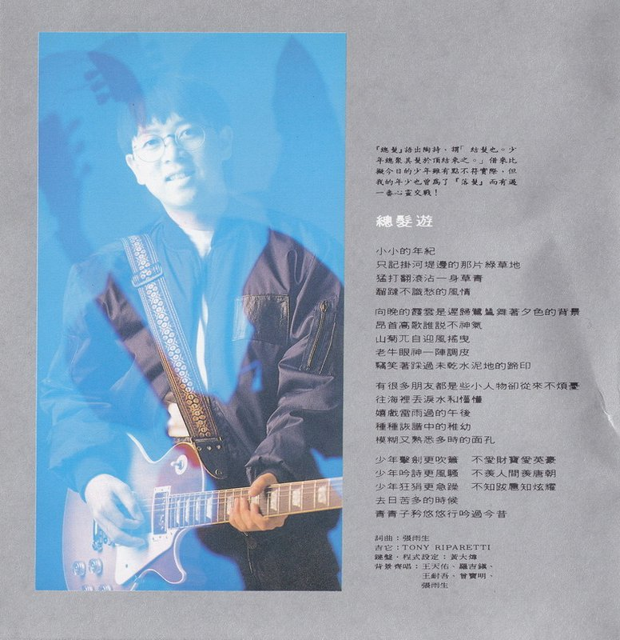

## 歌詞

小小的年紀  
只記掛河堤邊的那片綠草地  
猛打翻滾沾一身草青  
蹓躂不識愁的風情

向晚的霞雲是遲歸鷺鷥舞着夕色的背景  
昂首高歌誰說不神氣  
山菊兀自迎風搖曳  
老牛眼神一陣調皮  
竊笑着踩過未乾水泥地的蹄印

有很多朋友都是些小人物卻從來不煩憂  
往海里丟淚水和懵懂  
嬉戲雷雨過的午後  
種種詼諧中的稚幼  
模糊又熟悉多時的面孔

少年擊劍更吹簫 不愛財寶愛英豪  
少年吟詩更風騷 不羨人間羨唐朝  
少年狂狷更急躁 不知跋扈知炫耀  
去日苦多的時候  
青青子衿悠悠行吟過今昔

|     負責      |                      人員                      |
| :-----------: | :--------------------------------------------: |
|     詞曲      |                     張雨生                     |
|     吉它      |                 TONY RIPARETTI                 |
| 鍵盤·程式設定 |                     黃大煒                     |
|   背景齊唱    | 王天佑、羅吉鎮、 王耐吾、曾寶明、 張雨生 |

# 湖心草深長

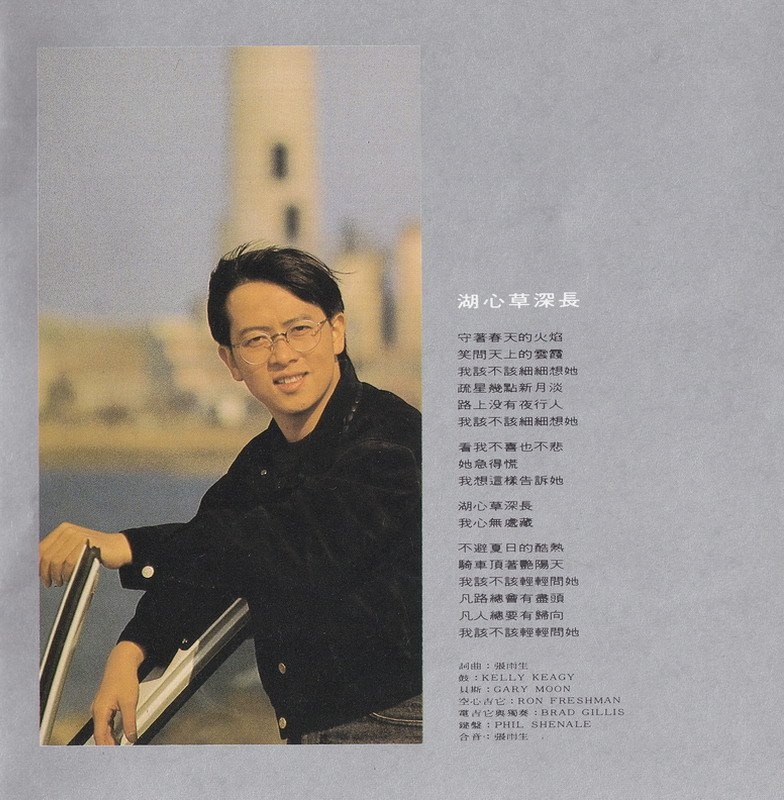

## 歌詞

守着春天的火焰  
笑問天上的雲霞  
我該不該細細想她  
疏星幾點新月淡  
路上沒有夜行人  
我該不該細細想她

看我不喜也不悲  
她急得慌  
我想這樣告訴她

湖心草深長  
我心無處藏  
不避夏日的酷熱  
騎車頂着豔陽天  
我該不該輕輕問她  
凡路總會有盡頭  
凡人總要有歸向  
我該不該輕輕問她

|     負責     |     人員     |
| :----------: | :----------: |
|     詞曲     |    張雨生    |
|      鼓      | KELLY KEAGY  |
|     貝斯     |  GARY MOON   |
|   空心吉它   | RON FRESHMAN |
| 電吉他與獨奏 | BRAD GILLIS  |
|     鍵盤     | PHIL SHENALE |
|     合音     |    張雨生    |

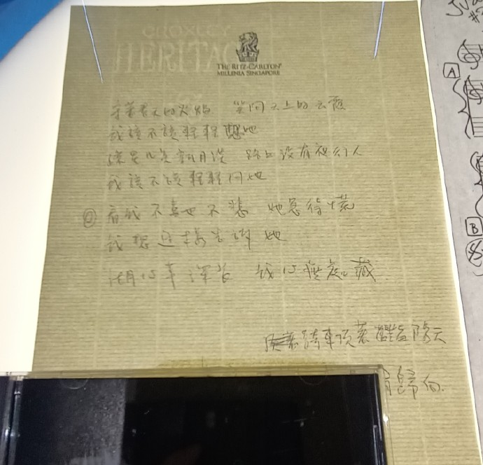

# 魔幻臺北

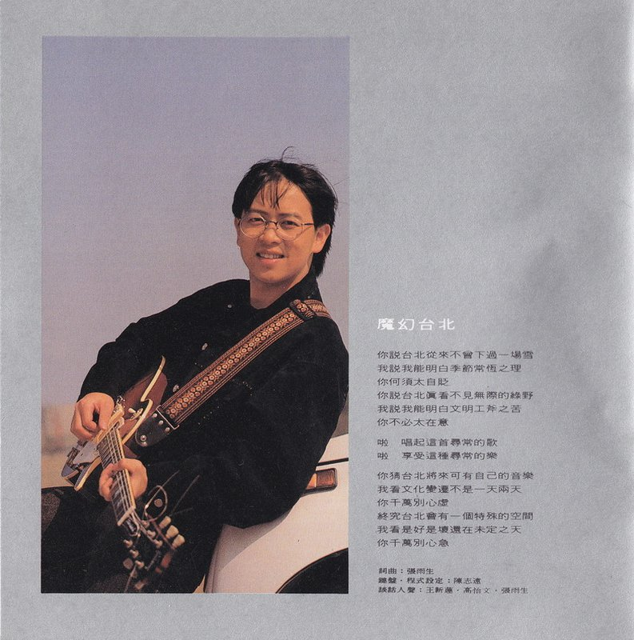

## 歌詞

你說臺北從來不曾下過一場雪  
我說我能明白季節常恆之理  
你何須太自貶  
你說臺北真看不見無際的綠野  
我說我能明白文明工斧之苦  
你不必太在意

啦 唱起這首尋常的歌  
啦 享受這種尋常的樂

你猜臺北將來可有自己的音樂  
我看文化變遷不是一天兩天  
你千萬別心虛  
終究臺北會有一個特殊的空間  
我看是好是壞還在未定之天  
你千萬別心急

|     負責      |          人員          |
| :-----------: | :--------------------: |
|     詞曲      |         張雨生         |
| 鍵盤·程式設定 |         陳志遠         |
|   談話人聲    | 王新蓮・高怡文・張雨生 |

# 現在這樣

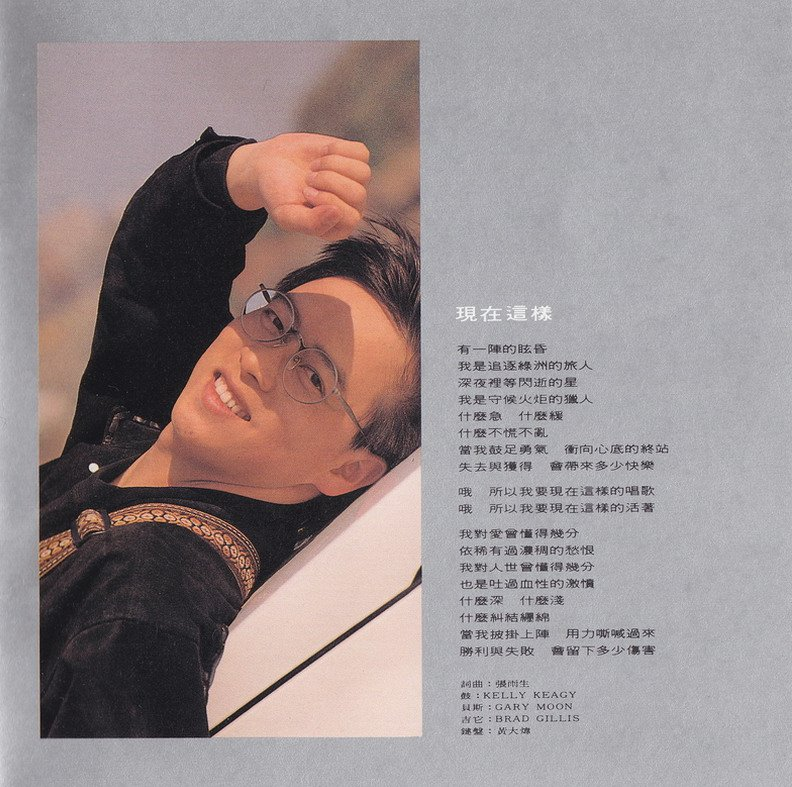

## 歌詞

有一陣的眩昏  
我是追逐綠洲的旅人  
深夜裏等閃逝的星  
我是守候火炬的獵人  
什麼急 什麼緩  
什麼不慌不亂  
當我鼓足勇氣 衝向心底的終站  
失去與獲得 會帶來多少快樂

哦 所以我要現在這樣的唱歌  
哦 所以我要現在這樣的活着

我對愛曾懂得幾分  
依稀有過濃稠的愁恨  
我對人世曾懂得幾分  
也是吐過血性的激憤  
什麼深 什麼淺  
什麼糾結纏綿  
當我披掛上陣 用力嘶喊過來  
勝利與失敗 會留下多少傷害

| 負責  |    人員     |
| :---: | :---------: |
| 詞曲  |   張雨生    |
|  鼓   | KELLY KEAGY |
| 貝斯  |  GARY MOON  |
| 吉它  | BRAD GILLIS |
| 鍵盤  |   黃大煒    |

# 我呼吸我感覺我存在

## 導引

這歌傳達一種迴歸原始的想法，只用吉它和人聲作不復雜的表演。業餘演出儘管生澀，卻因此詮得相當稱職。  
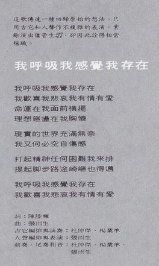

## 歌詞

我呼吸我感覺我存在  
我歡喜我悲哀我有情有愛  
命運在我面前橫擺  
理想回蕩在我胸懷

現實的世界充滿無奈  
我又何必空自傷感

打起精神任何困難我來排  
提起腳步路途崎嶇也得邁

我呼吸我感覺我存在  
我歡喜我悲哀我有情有愛

|      負責      |            人員            |
| :------------: | :------------------------: |
|       詞       |           陳陸輝           |
|       曲       |           張雨生           |
| 吉它編排與演奏 |       杜仲傑・楊業承       |
| 人聲編排與表演 |           張雨生           |
| 前奏、尾奏和音 | 杜仲傑、楊業承、 張雨生 |

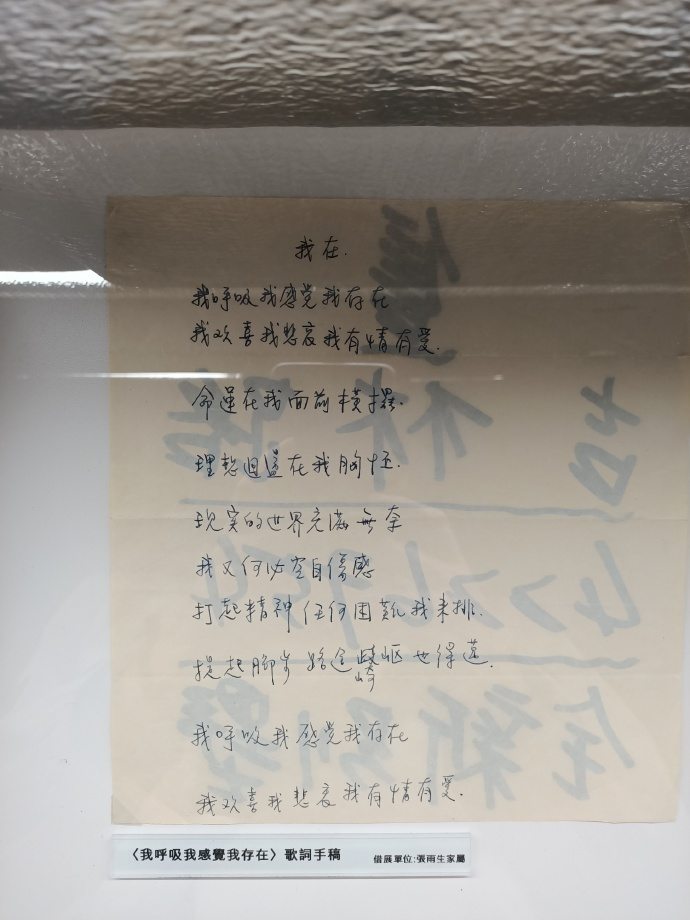  
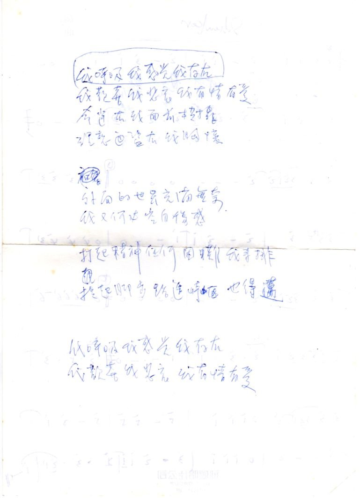  
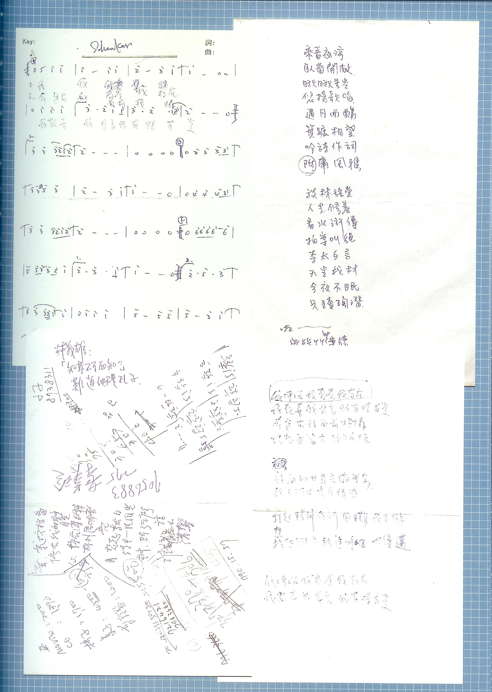

# 我想把整片天空打開

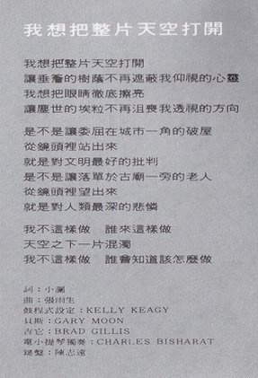

## 歌詞

我想把整片天空打開  
讓垂檐的樹蔭不再遮蔽我仰視的心靈  
我想把眼睛徹底擦亮  
讓塵世的埃粒不再沮喪我透視的方向

是不是讓委屈在城市一角的破屋  
從鏡頭裏站出來  
就是對文明最好的批判  
是不是讓落單于古廟一旁的老人  
從鏡頭裏望出來  
就是對人類最深的悲憐

我不這樣做 誰來這樣做  
天空之下一片混濁  
我不這樣做 誰會知道該怎麼做

|     負責     |                  |
| :----------: | :--------------: |
|      詞      |  小瀾（邱連枝）  |
|      曲      |      張雨生      |
|  鼓程式設定  |   KELLY KEAGY    |
|     貝斯     |    GARY MOON     |
|     吉它     |   BRAD GILLIS    |
| 電小提琴獨奏 | CHARLES BISHARAT |
|     鍵盤     |      陳志遠      |

# 致謝

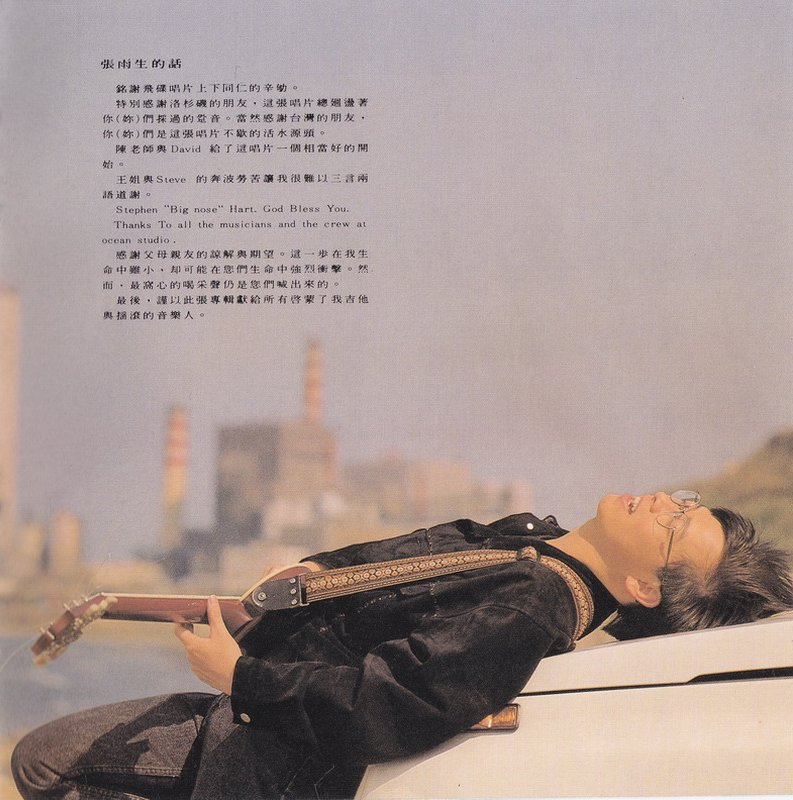
**張雨生的話**  
衷心感謝唱片上下同仁的辛劬。  
特別感謝洛杉磯的朋友，這張唱片總廻蕩著你（妳）們踩[^4]過的跫音。當然感謝臺灣的朋友，你（妳）們是這張唱片不歇的活水源頭。  
陳老師與 David 給了這唱片一個相當好的開始。  
王姐與 Steve 的奔波勞苦讓我很難以三言兩語道謝。  
Stephen "Big nose" Hart. God Bless You.  
Thanks To all the musicians and the crew at ocean studio.  
感謝父母親友的諒解與期望。這一步在我生命中雖小，卻可能在您們生命中強烈衝擊。然而，最窩心的喝采聲仍是您們喊出來的。  
最後，謹以此張專輯獻給所有啓蒙了我吉他與搖滾的音樂人。

# 製作團隊

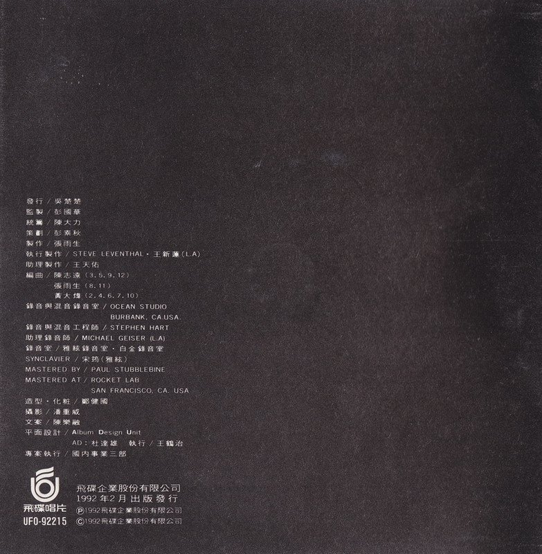

|       負責       |                                     人員/資訊                                      |
| :--------------: | :--------------------------------------------------------------------------------: |
|       發行       |                                       吳楚楚                                       |
|       監製       |                                       彭國華                                       |
|       統籌       |                                       陳大力                                       |
|       策劃       |                                       彭素秋                                       |
|       製作       |                                       張雨生                                       |
|     執行製作     |                           STEVE LEVENTHAL・王新蓮 (L. A)                           |
|     助理製作     |                                       王天佑                                       |
|       編曲       |        陳志遠（3・5・9・12） 張雨生（8・11） 黃大煒（2・4・6・7・10）        |
| 錄音與混音錄音室 |                          OCEAN STUDIO BURBANK. CA.USA                           |
| 錄音與混音工程師 |                                    STEPHEN HART                                    |
|    助理錄音師    |                               MICHAEL GEISER (L. A)                                |
|      錄音室      |                               雅弦錄音室・白金錄音室                               |
|    SYNCLAVIER    |                                    宋筠（雅弦）                                    |
|   MASTERED BY    |                                  PAUL STUBBLEBINE                                  |
|   MASTERED AT    |                        ROCKET LAB SAN FRANCISCO. CA .USA                        |
|    造型・化妝    |                                       鄭健國                                       |
|       攝影       |                                       潘重威                                       |
|       文案       |                                       陳樂融                                       |
|     平面設計     |                  Album Design Unit AD：杜達雄 執行：王鶴治                   |
|     專案執行     |                                    國內事業三部                                    |
|  音樂錄影帶導演  | 帶我去月球（彭文淳） 我想把整片天空打開（彭文淳） 我呼吸我感覺我存在（未知） |

飛碟唱片  
UFO-92215  
飛碟企業股份有限公司  
1992 年 2 月 24 日出版發行  
Ⓟ1992 飛碟企業股份有限公司  
Ⓒ1992 飛碟企業股份有限公司

# 張雨生特展的照片

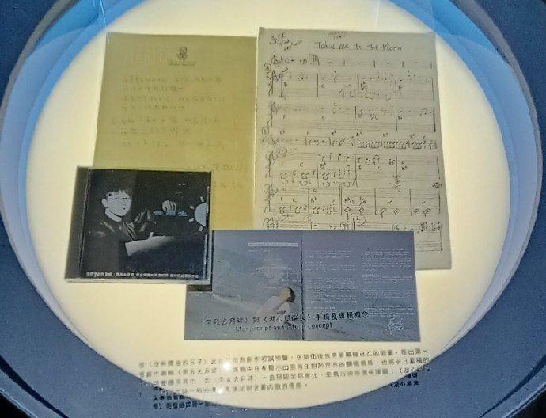

# 參考

相關鏈接

- [張雨生創作專輯 - 專輯 - 張雨生網站 - https://www.tomchang.cn/](https://www.tomchang.cn/music/album/12.html)
- [【圖片】1992 創作專輯【張雨生吧】\_百度貼吧 - https://tieba.baidu.com/](https://tieba.baidu.com/p/2084189468#!/l/p1)
- [張雨生手稿 - tieba.baidu.com](https://tieba.baidu.com/p/2084189476#!/l/p1)
- [想你到月球 張雨生特展 08 - 蓁芯 0607@weibo.com​](https://weibo.com/2567125954/MmMWq3p44)
- [帶我去月球 - https://supersky0.tripod.com/](https://supersky0.tripod.com/a-3.htm)

整理：露水、郈斐  
校對：郈斐

[^1]: 也有大量資料將此專輯的名稱記爲「帶我去月球」。
[^2]: 文案爲「通俗音樂樂」，應是誤植。
[^3]: 簡體專輯作「猛然」，應該是打錯了。
[^4]: 文案爲「採過的跫音」，應是錯字。
