# 大海

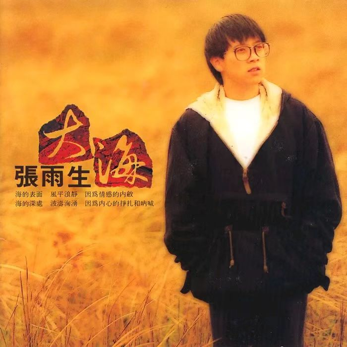

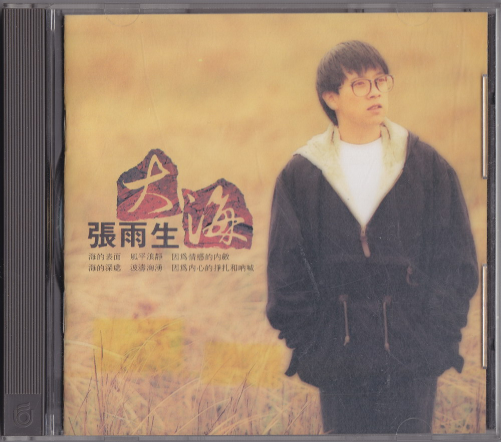

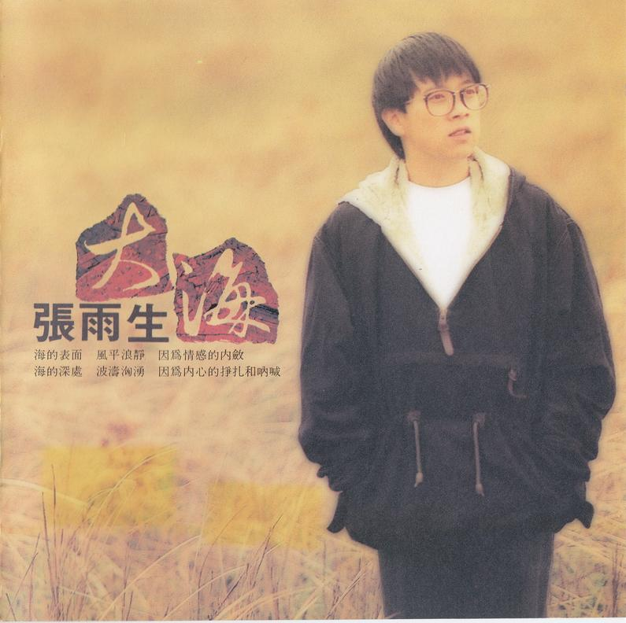

# 文案

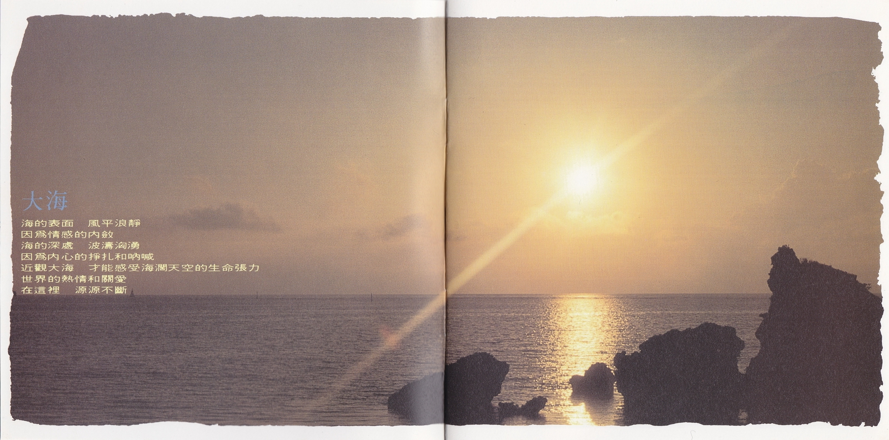

**大海**  
海的表面 風平浪靜  
因爲情感的內斂  
海的深處 波濤洶湧  
因爲內心的掙扎和吶喊  
近觀大海 才能感受海濶天空的生命張力  
世界的熱情和關愛  
在這裡 源源不斷

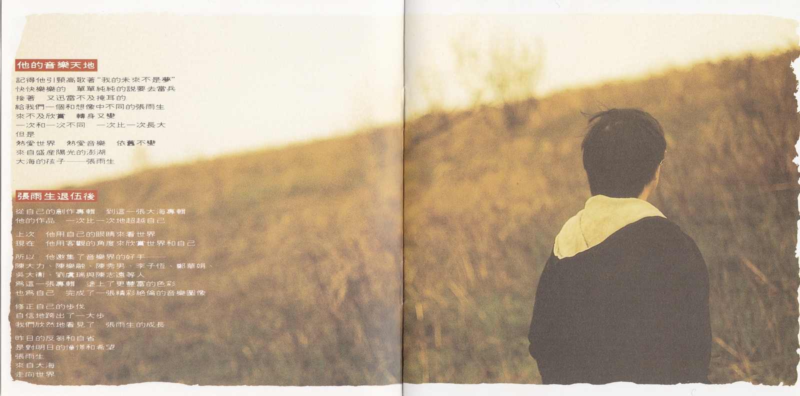

**他的音樂天地**  
記得他引頸高歌著“我的未來不是夢”  
快快樂樂的 單單純純的說要去當兵  
接著 又迅雷不及掩耳的  
給我們一個和想像中不同的張雨生  
來不及欣賞 轉身又變  
一次和一次不同 一次比一次長大  
但是  
熱愛世界 熱愛音樂 依舊不變  
來自盛產陽光的澎湖  
大海的孩子——張雨生

**張雨生退伍後**  
從自己的創作專輯 到這一張大海專輯  
他的作品 一次比一次地超越自己

上次 他用自己的眼睛來看世界  
現在 他用客觀的角度來欣賞世界和自己

所以 他邀集了音樂界的好手——  
陳大力、陳樂融、陳秀男、李子恆、鄭華娟、  
吳大衛、劉虞瑞與陳志遠等人  
爲這一張專輯 塗上了更豐富的色彩  
也爲自己 完成了一張精彩絕倫的音樂圖像

修正自己的步伐  
自信地跨出了一大步  
我們欣然地看見了 張雨生的成長

昨日的反芻和自省  
是對明日的憧憬和希望  
張雨生  
來自大海  
走向世界

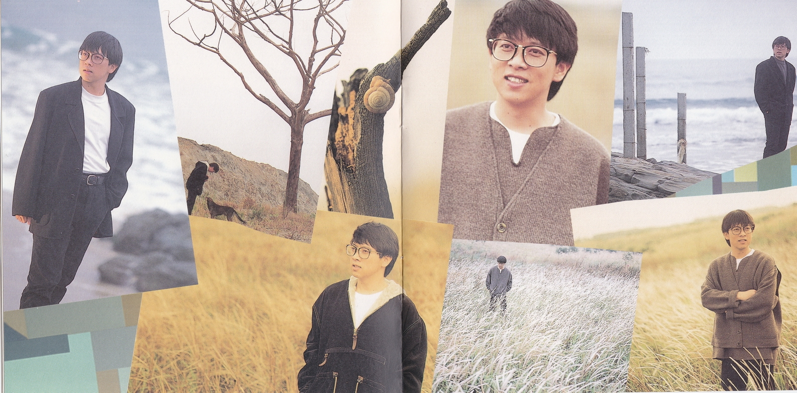
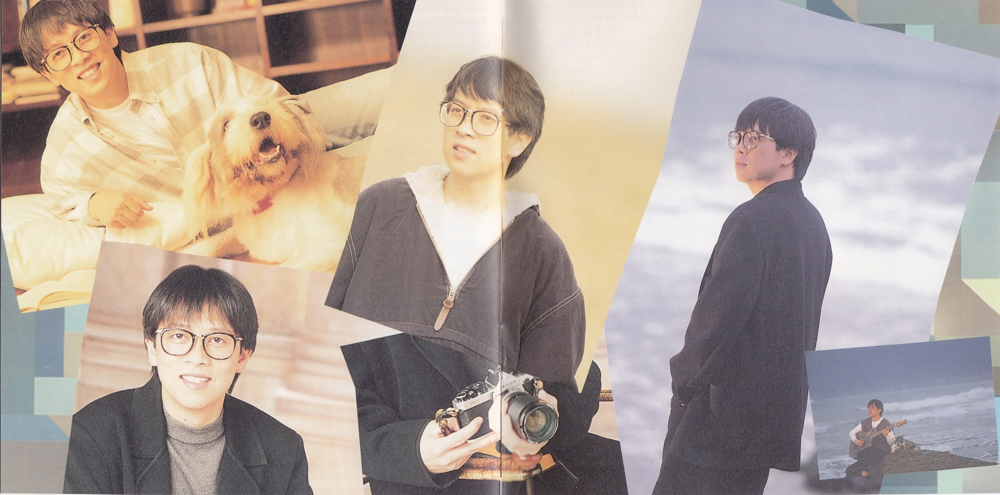

# 我是一棵秋天的樹

UFO-92265-01

作詞：許常德  
作曲：陳志遠  
編曲：陳志遠  
吉他：江建民  
錄音：劉明德 (UFO)，王廣武 (白金)  
混音：王廣武，林一平，張雨生  
混音錄音室：白金  
MV 導演：張榮貴  
MV 出演：潘蓉

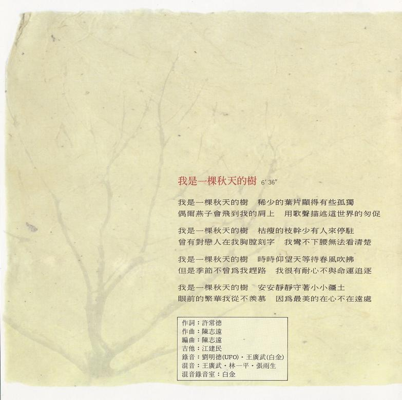

## 歌詞

我是一棵秋天的樹 稀少的葉片顯得有些孤獨    
偶爾燕子會飛到我的肩上 用歌聲描述這世界的匆促

我是一棵秋天的樹 枯瘦的枝幹少有人來停駐  
曾有對戀人在我胸膛刻字   我彎不下腰無法看清楚

我是一棵秋天的樹 時時仰望天等待春風吹拂  
但是季節不曾爲我趕路 我很有耐心不與命運追逐

我是一棵秋天的樹 安安靜靜守著小小疆土  
眼前的繁華我從不羨慕 因爲最美的在心不在遠處

# I DON'T WANNA SAY GOODBYE

UFO-92265-02

作詞：陳樂融  
作曲：陳志遠  
編曲：陳志遠  
吉他：江建民  
合聲：陳麗莉，黃秀偵，陳秀珠  
錄音：王廣武 (白金)  
混音：王廣武，林一平，張雨生  
混音錄音室：白金  
MV 導演：未知[^1]

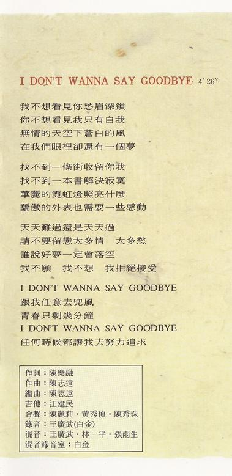

## 歌詞

我不想看見你愁眉深鎖  
你不想看見我只有自我  
無情的天空下蒼白的風  
在我們眼裡卻還有一個夢

找不到一條街收留你我  
找不到一本書解決寂寞  
華麗的霓虹燈照亮什麼  
驕傲的外表也需要一些感動

天天難過還是天天過  
請不要留戀太多情 太多愁  
誰說好夢一定會落空  
我不願 我不想 我拒絕接受

I DON'T WANNA SAY GOODBYE  
跟我任意去兜風  
青春只剩幾分鐘  
I DON'T WANNA SAY GOODBYE  
任何時候都讓我去努力追求

# 多夢的歲月

UFO-92265-03

作詞：李子恆  
作曲：吳大衛  
編曲：涂惠源  
吉他：倪方來  
合聲：楊新玲，李鼎慧，蕭玉玲，林一平，劉明德，張雨生  
錄音：ERIC (麗風)，王俊傑，王偉明 (白金)  
混音：王偉明，林一平  
混音錄音室：白金

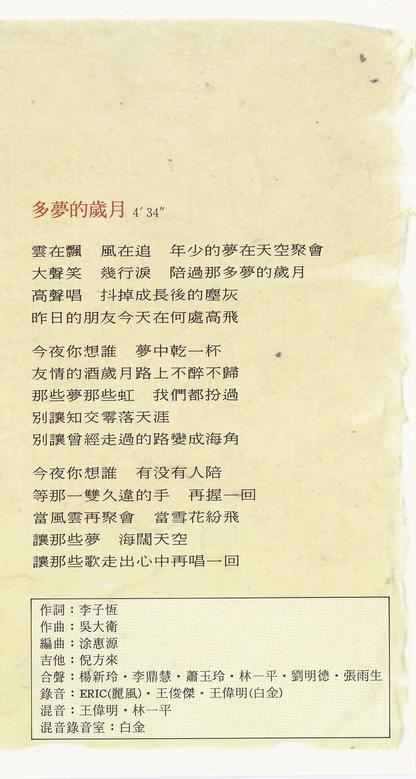

## 歌詞

雲在飄 風在追 年少的夢在天空聚會  
大聲笑 幾行淚 陪過那多夢的歲月  
高聲唱 抖掉成長後的塵灰  
昨日的朋友今天在何處高飛

今夜你想誰 夢中乾一杯  
友情的酒歲月路上不醉不歸  
那些夢 那些虹 我們都扮過  
別讓知交零落天涯  
別讓曾經走過的路變成海角

今夜你想誰 有沒有人陪  
等那一雙久違的手 再握一回  
當風雲再聚會 當雪花紛飛  
讓那些夢 海闊天空  
讓那些歌 走出心中再唱一回

# 愛上你的一切

UFO-92265-04

作詞：陳樂融  
作曲：林一平  
編曲：屠穎  
吉他：倪方來  
合聲：孫建平，陳秀珠，孫安林  
錄音：王俊傑 (白金)  
混音：王偉明，林一平  
混音錄音室：白金

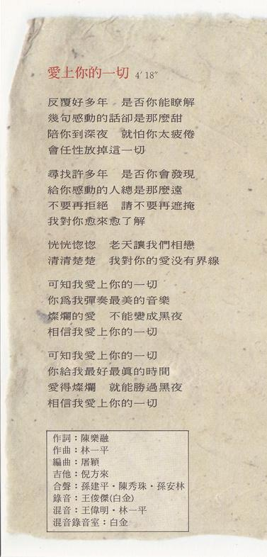

## 歌詞

反覆好多年 是否你能瞭解  
幾句感動的話卻是那麼甜  
陪你到深夜 就怕你太疲倦  
會任性放掉這一切

尋找許多年 是否你會發現  
給你感動的人總是那麼遠  
不要再拒絕 請不要再遮掩  
我對你愈來愈瞭解

恍恍惚惚 老天讓我們相戀  
清清楚楚 我對你的愛沒有界線

可知我愛上你的一切  
你爲我彈奏最美的音樂  
燦爛的愛 不能變成黑夜  
相信我愛上你的一切

可知我愛上你的一切  
你給我最好最真的時間  
愛得燦爛 就能勝過黑夜  
相信我愛上你的一切

# 掙扎

UFO-92265-05

作詞：陳樂融  
作曲：陳志遠  
編曲：陳志遠  
吉他：江建民  
合聲：張雨生  
錄音：王廣武 (白金)  
混音：王廣武，林一平  
混音錄音室：白金

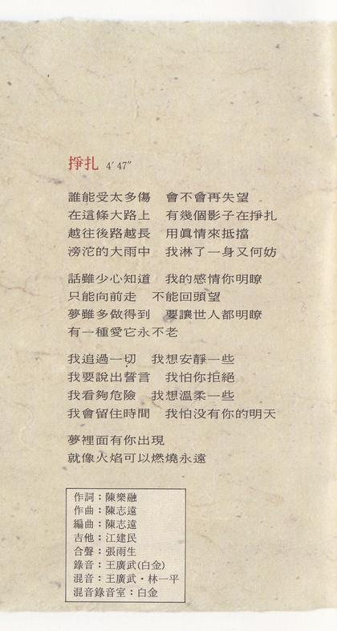

## 歌詞

誰能受太多傷 會不會再失望  
在這條大路上 有幾個影子在掙扎  
越往後路越長 用真情來抵擋  
滂沱的大雨中 我淋了一身又何妨

話雖少心知道 我的感情你明瞭  
只能向前走 不能回頭望  
夢雖多做得到 要讓世人都明瞭  
有一種愛它永不老

我追過一切 我想安靜一些  
我要說出誓言 我怕你拒絕  
我看夠危險 我想溫柔一些  
我會留住時間 我怕沒有你的明天  
夢裡面有你出現  
就像火焰可以燃燒永遠

# 大海

UFO-92265-06

作詞：陳大力  
作曲：陳大力，陳秀男  
製作：陳大力，陳秀男  
編曲：RICKY HO  
鋼琴，鍵盤：RICKY HO  
貝斯：EDDIE MARZUKI  
電吉他：JONATHAN KOH  
錄音：台北 張永夫 (白金)，新加坡 MO LEE (STUDIO C)，EUNICE YOUNG  
MV 導演：楊布新

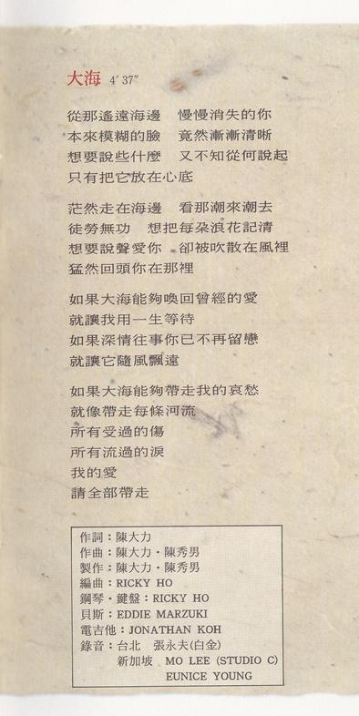

## 歌詞

從那遙遠海邊 慢慢消失的你  
本來模糊的臉 竟然漸漸清晰  
想要說些什麼 又不知從何說起  
只有把它放在心底

茫然走在海邊 看那潮來潮去  
徒勞無功 想把每朵浪花記清  
想要說聲愛你 卻被吹散在風裡  
猛然回頭你在那裡

如果大海能夠喚回曾經的愛  
就讓我用一生等待  
如果深情往事你已不再留戀  
就讓它隨風飄遠

如果大海能夠帶走我的哀愁  
就像帶走每條河流  
所有受過的傷  
所有流過的淚  
我的愛  
請全部帶走

# 寧可讓我苦

UFO-92265-07

作詞：張雨生  
作曲：張雨生  
編曲：孫崇偉  
吉他：倪方來  
合聲：王天佑 林一平 劉明德 張雨生  
錄音：ERIC 王家棟 (麗風)  
混音：王家棟  
混音錄音室：麗風

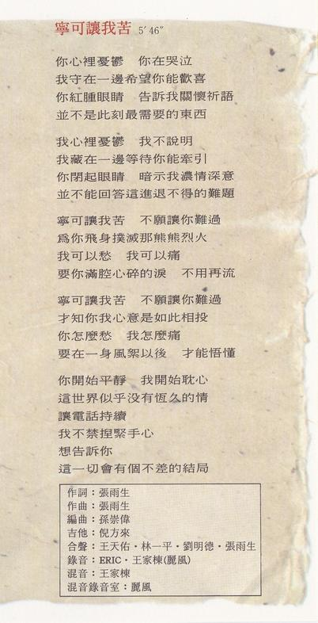

## 歌詞

你心裡憂鬱 你在哭泣  
我守在一邊希望你能歡喜  
你紅腫眼睛 告訴我關懷祈語  
並不是此刻最需要的東西

我心裡憂鬱 我不說明  
我藏在一邊等待你能牽引  
你閉起眼睛 暗示我濃情深意  
並不能回答這進退不得的難題

寧可讓我苦 不願讓你難過  
爲你飛身撲滅那熊熊烈火  
我可以愁 我可以痛  
要你滿腔心碎的淚 不用再流

寧可讓我苦 不願讓你難過  
才知你我心意是如此相投  
你怎麼愁 我怎麼痛  
要在一身風絮以後 才能悟懂

你開始平靜 我開始耽心  
這世界似乎沒有恆久的情  
讓電話持續  
我不禁捏緊手心  
想告訴你  
這一切會有個不差的結局

# 不管不管

UFO-92265-08

作詞：鄭華娟  
作曲：鄭華娟  
編曲：李正帆  
吉他：江建民  
合聲：張雨生  
錄音：ERIC (麗風)，王廣武 (達采)  
混音：王廣武，林一平，張雨生  
混音錄音室：達采

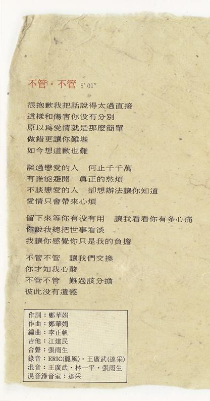

## 歌詞

很抱歉我把話說得太過直接  
這樣和傷害你沒有分別  
原以爲愛情就是那麼簡單  
做錯更讓你難堪  
如今想道歉也難

談過戀愛的人 何止千千萬  
有誰能避開 真正的愁煩  
不談戀愛的人 卻想辦法讓你知道  
愛情只會帶來心煩

留下來等你有沒有用 讓我看看你有多心痛  
你說我總把世事看淡  
我讓你感覺你只是我的負擔

不管不管 讓我們交換  
你才知我心酸  
不管不管 難過該分擔  
彼此沒有遺憾

# 把世界分一半給你

UFO-92265-09

作詞：劉虞瑞  
作曲：吳大衛  
編曲：屠穎  
吉他：倪方來  
合聲：孫建平，陳秀珠，孫安林  
錄音：王偉明 (白金)  
混音：王偉明，林一平  
混音錄音室：白金

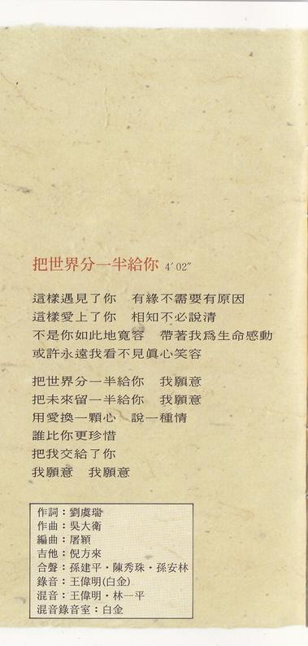

## 歌詞

這樣遇見了你 有緣不需要有原因  
這樣愛上了你 相知不必說清  
不是你如此地寬容 帶著我爲生命感動  
或許永遠我看不見真心笑容

把世界分一半給你 我願意  
把未來留一半給你 我願意  
用愛換一顆心 說一種情  
誰比你更珍惜  
把我交給了你  
我願意 我願意

# 心底的中國

UFO-92265-10

作詞：張雨生  
作曲：張雨生  
編曲：陳志遠  
吉他：江建民  
合聲：王天佑，林一平，劉明德，江天賦，張雨生  
錄音：王家棟，ERIC (麗風)  
混音：王廣武，林一平，張雨生  
混音錄音室：白金

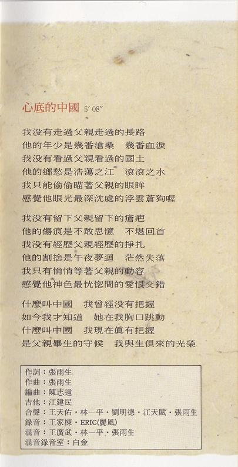

## 歌詞

我沒有走過父親走過的長路  
他的年少是幾番滄桑 幾番血淚  
我沒有看過父親看過的國土  
他的鄉愁是浩蕩之江 滾滾之水  
我只能偷偷瞄著父親的眼眸  
感覺他眼光最深沉處的浮雲蒼狗喔

我沒有留下父親留下的瘡疤  
他的傷痕是不敢思憶 不堪回首  
我沒有經歷父親經歷的掙扎  
他的割捨是午夜夢迴 茫然失落  
我只有悄悄等著父親的動容  
感覺他神色最恍惚間的愛恨交錯

什麼叫中國 我曾經沒有把握  
如今我才知道 她在我胸口跳動  
什麼叫中國 我現在真有把握  
是父親畢生的守候 我與生俱來的光榮

# 製作團隊

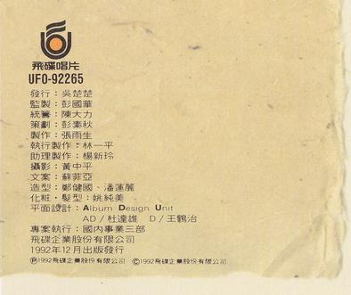

|    負責    |       人員        |
| :--------: | :---------------: |
|    發行    |      吳楚楚       |
|    監製    |      彭國華       |
|    統籌    |      陳大力       |
|    策劃    |      彭素秋       |
|    製作    |      張雨生       |
|  執行製作  |      林一平       |
|  助理製作  |      楊新玲       |
|    攝影    |      黃中平       |
|    文案    |      蘇菲亞       |
|    造型    |  鄭健國，潘蓮麗   |
| 化粧，髮型 |      姚純美       |
|  平面設計  | Album Design Unit |
|     AD     |      杜達雄       |
|     D      |      王鶴治       |
|  專案執行  |   國內事業三部    |

飛碟企業股份有限公司  
1992 年 12 月出版發行  
Ⓟ1992 飛碟企業股份有限公司  
Ⓒ1992 飛碟企業股份有限公司

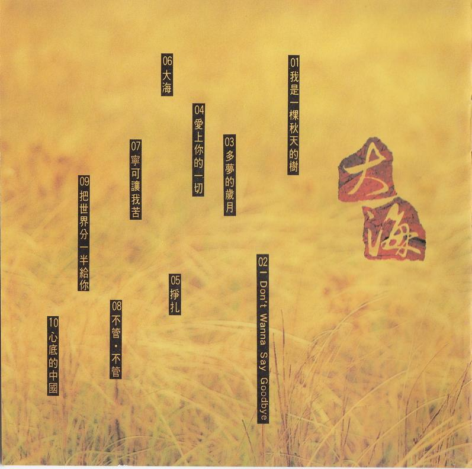

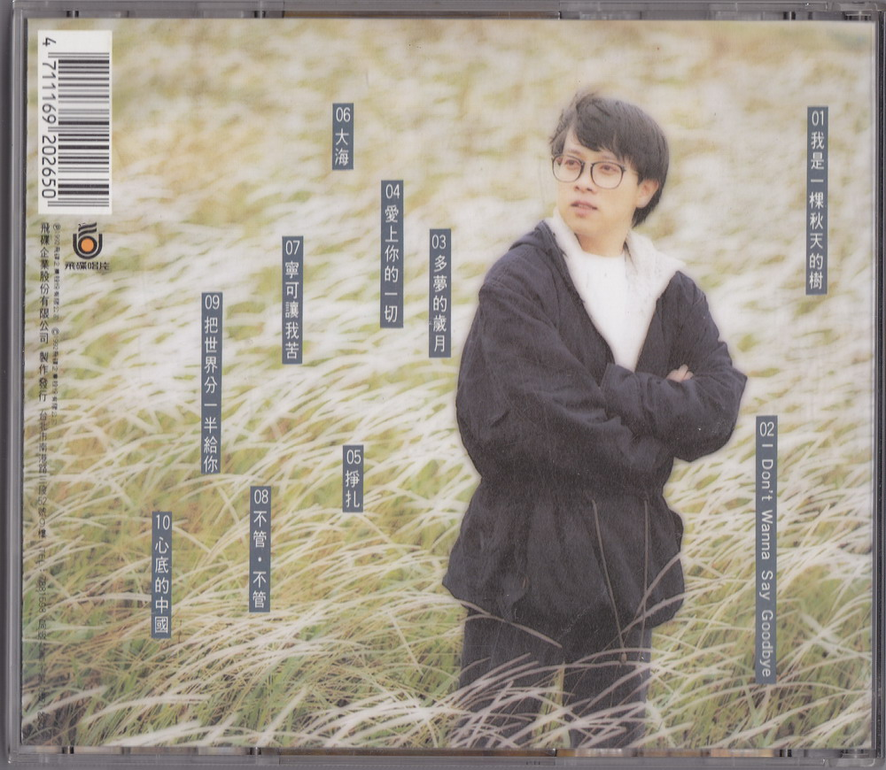

整理：郈斐，向晚  
校對：郈斐

[^1]: 網上能找到 MV，但不知道導演是誰
