# 一天到晚游泳的魚
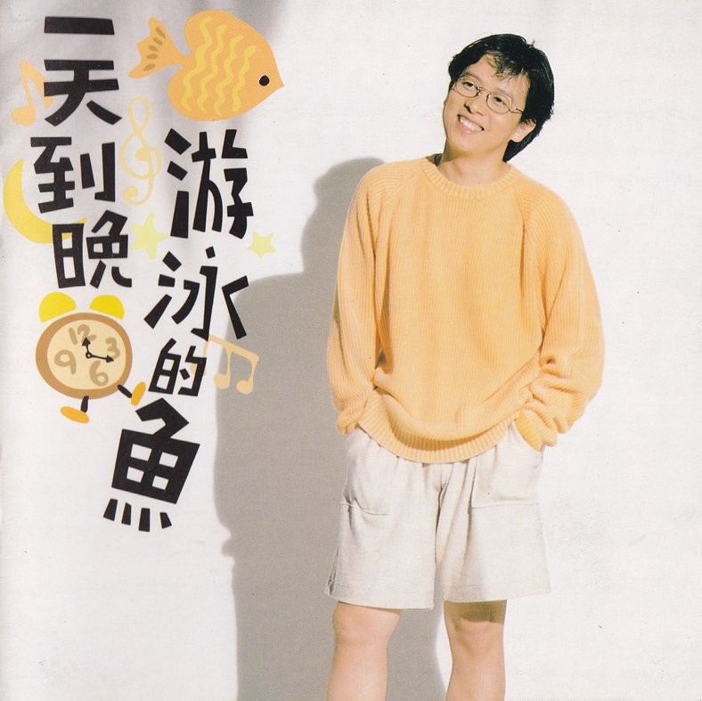

## 文案
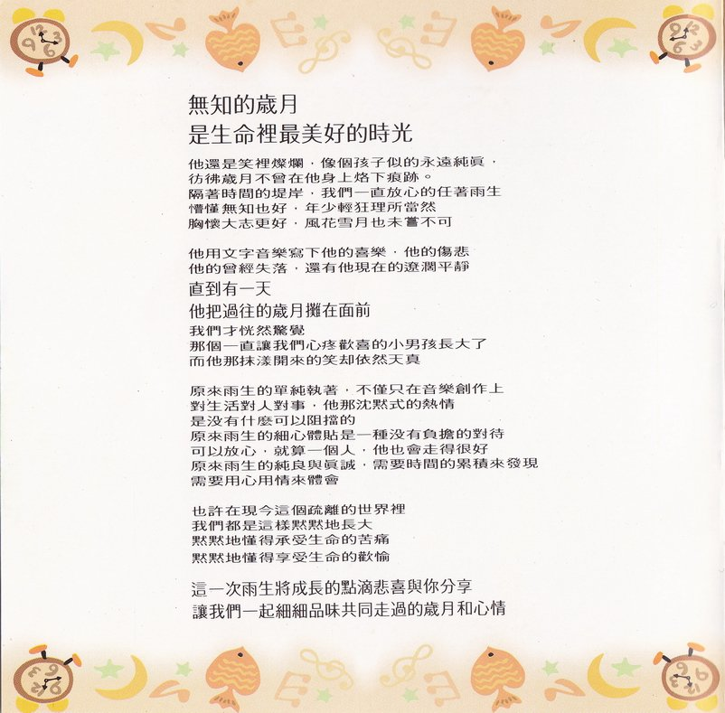

**無知的歲月**  
**是生命裏最美好的時光**

他還是笑容燦爛，像個孩子似的永遠純真，  
彷佛歲月不曾在他身上烙下痕跡。  
隔著時間的堤岸，我們一直放心的任著雨生  
懵懂無知也好，年少輕狂理所當然  
胸懷大志更好，風花雪月也未嘗不可

他用文字音樂寫下他的喜樂，他的傷悲  
他的曾經失落，還有他現在的遼闊平靜  
**直到有一天**  
**他把過往的歲月攤在面前**  
我們才恍然驚覺  
那個一直讓我們心疼歡喜的小男孩長大了  
而他那抹漾開來的笑卻依然天真

原來雨生的單純執著，不僅只在音樂創作上  
對生活對人對事，他那沉默式的熱情  
是沒有什麼可以阻擋的  
原來雨生的細心體貼是一種沒有負擔的對待  
可以放心，就算一個人，他也會走得很好  
原來雨生的純良與真誠，需要時間的累積來發現  
需要用心用情來體會

也許在現今這個疏離的世界裏  
我們都是這樣默默地長大  
默默地懂得承受生命的苦痛  
默默地懂得享受生命的歡愉  

**這一次雨生將成長的點滴悲喜與你分享**  
**讓我們一起細細品味共同走過的歲月和心情**

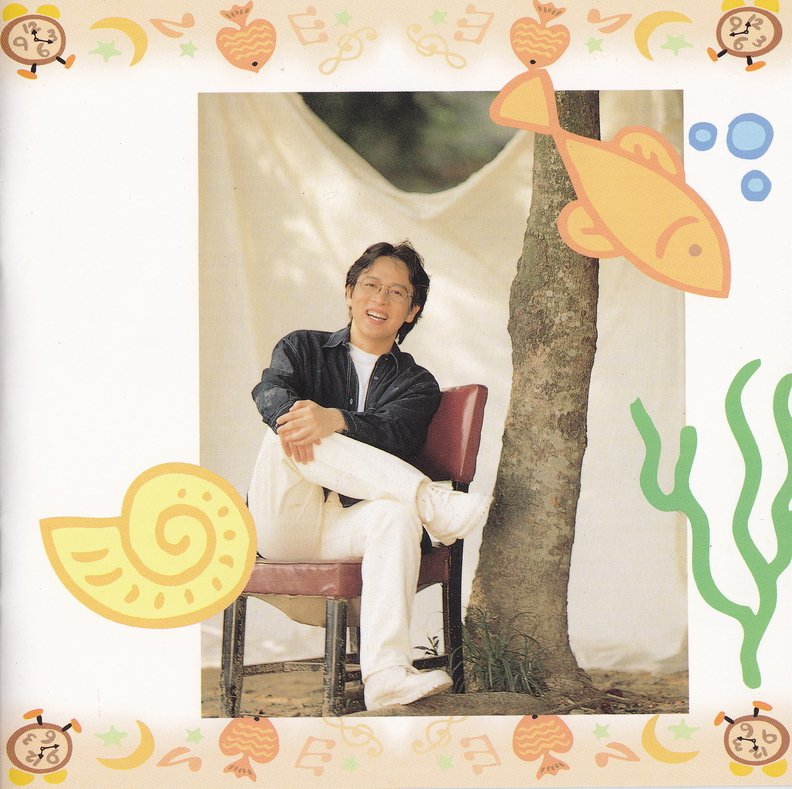

## 青澀的記憶
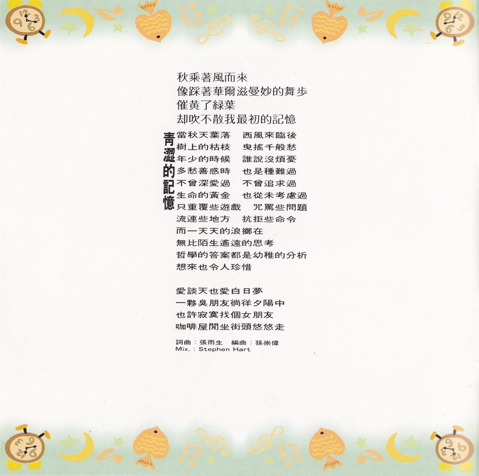

### 文案
秋乘著風而來  
像踩著華爾茲曼妙的舞步  
催黃了綠葉  
卻吹不散我最初的記憶

### 歌詞
當秋天葉落 西風來臨後  
樹上的枯枝 曳搖千般愁  
年少的時候 誰說沒煩憂  
多愁善感時 也是種難過  
不曾深愛過 不曾追求過  
生命的黃金 也從未考慮過  
只重複些遊戲 咒罵些問題  
流連些地方 抗拒些命令  
而一天天的浪擲在  
無比陌生遙遠的思考  
哲學的答案都是幼稚的分析  
想來也令人珍惜

愛談天也愛白日夢  
一夥臭朋友徜徉夕陽中  
也許寂寞找個女朋友  
咖啡屋閒坐 街頭悠悠走

| 負責  |     人員     |
| :---: | :----------: |
| 詞曲  |    張雨生    |
| 編曲  |    孫崇偉    |
|  Mix  | Stephen Hart |

## 是否真的愛我
### 歌詞
是否真的愛我  
別對我沉默  
這月色美麗的夜晚  
你在想什麼
是否真的愛我  
別對我冷漠  
你心裏有什麼樣的話  
儘管對我說
還記得曾經編織的夢想  
也許你早遺忘  
絢爛的愛情在多年以後  
也許漸漸變得平淡
你可知不是我不瞭解愛情  
微妙難捉摸  
不是我不懷疑弦外的愛情會迷惑  
總是那肩並肩走過的歲月  
刻劃在心頭  
切切的叮嚀著我  
與你長相廝守

|   負責   |  人員  |
| :------: | :----: |
|   詞曲   | 熊天益 |
|   編曲   | 陳志遠 |
|  Guitar  | 江建民 |
| B. Vocal | 張雨生 |
|   Mix    | Mr. K  |

## 海的呼喚

（純音樂）

## 一天到晚游泳的魚
### 歌詞
情願困在你懷中 困在你溫柔  
不想一個人寂寞 無邊漂泊  
就像魚兒水裏遊 你的心河流向我  
不眠不休的追求

一天到晚游泳的魚啊 魚不停遊  
一天到晚想你的人啊 愛不停休  
從來不想回頭 不問天長地久  
因爲我的愛覆水難收

多少喜樂在心中 慢慢遊  
多少憂愁不肯走 流向心頭  
就像魚兒水裏遊 永遠不會問結果  
他們知道愛情沒盡頭

一天到晚游泳的魚啊 魚不停遊  
一天到晚想你的人啊 愛不停休  
滄海多麼遼闊 再也不能回首  
只要你心裏永遠留我

合音：  
魚兒魚兒魚兒水中游  
遊啊遊啊遊 啊游到樂悠悠  
魚兒魚兒魚兒慢慢遊  
寶哥：滄海樂悠悠 從不覺不自由  
魚兒魚兒魚兒水中游  
寶哥：你看那滄海多麼遼闊 再也不能回首  
魚兒魚兒魚兒慢慢遊  
寶哥：情海不由我 追求沒有盡頭  
魚兒魚兒魚兒水中游  
寶哥：不問天長地久 從來不想回頭  
魚兒魚兒魚兒慢慢遊

|  負責   |                       人員                       |
| :-----: | :----------------------------------------------: |
|   詞    |                      許常德                      |
|   曲    |                      陳復明                      |
|  編曲   |                      陳志遠                      |
| B.Vocal | 馬玉芬・林美滿・林美瑛・鄭知明 陳復明・張雨生 |
|   Mix   |                      Mr. K                       |

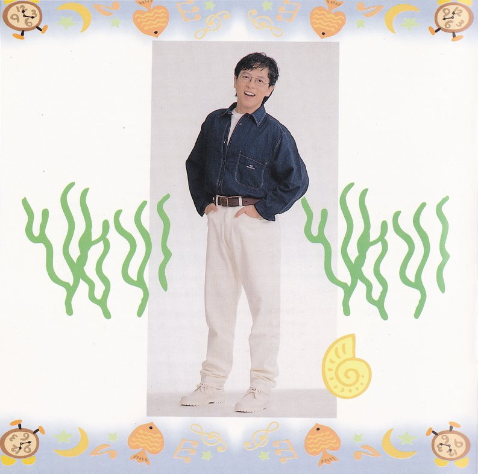

## 冰點

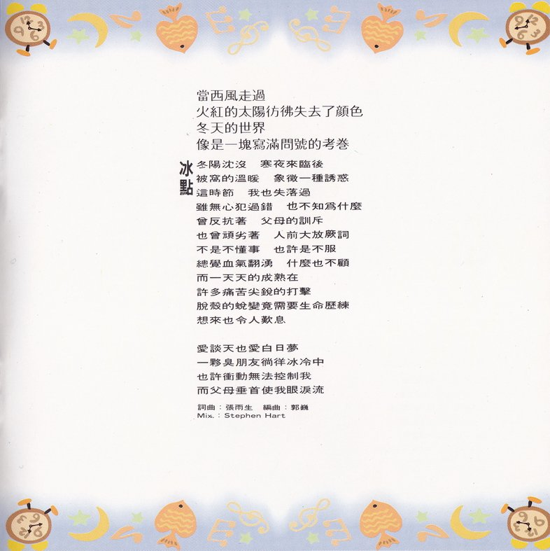

### 文案
當西風走過  
火紅的太陽彷彿失去了顏色  
冬天的世界  
像是一塊寫滿問號的考卷

### 歌詞
冬陽沉沒 寒夜來臨後  
被窩的溫暖 象徵一種誘惑  
這時節 我也失落過  
雖無心犯過錯 也不知爲什麼  
曾反抗著 父母的訓斥  
也曾頑劣著 人前大放厥詞  
不是不懂事 也許是不服  
總覺血氣翻湧 什麼也不顧  
而一天天的成熟在  
許多痛苦尖銳的打擊  
脫殼的蛻變竟需要生命歷練  
想來也令人嘆息

愛談天也愛白日夢  
一夥臭朋友徜徉冰冷中  
也許衝動無法控制我  
而父母垂首使我眼淚流

| 負責  |     人員     |
| :---: | :----------: |
| 詞曲  |    張雨生    |
| 編曲  |     郭巍     |
|  Mix  | Stephen Hart |

## 妹妹晚安
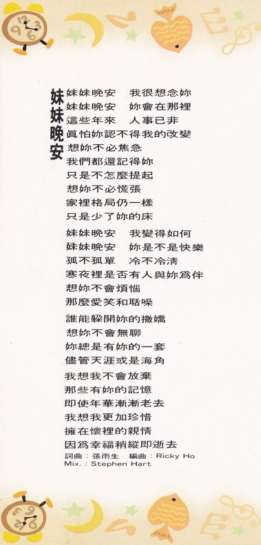

### 歌詞
妹妹晚安 我很想念妳  
妹妹晚安 妳會在那裏  
這些年來 人事已非  
真怕妳認不得我的改變  
想妳不必焦急  
我們都還記得妳  
只是不怎麼提起  
想妳不必慌張  
家裏格局仍一樣  
只是少了妳的牀

妹妹晚安 我變得如何  
妹妹晚安 妳是不是快樂  
孤不孤單 冷不冷清  
寒夜裏是否有人與妳爲伴  
想妳不會煩惱  
那麼愛笑和聒噪

誰能躲開妳的撒嬌  
想妳不會無聊  
妳總是有妳的一套  
儘管天涯或是海角

我想我不會放棄  
那些有妳的記憶  
即使年華漸漸老去  
我想我更加珍惜  
擁在懷裏的親情  
因爲幸福稍縱即逝去

| 負責  |     人員     |
| :---: | :----------: |
| 詞曲  |    張雨生    |
| 編曲  |     Ricky Ho     |
|  Mix  | Stephen Hart |

## 祈求
### 歌詞
給我愛 換走無奈  
給我苦 讓我記得溫暖  
眼眸中 彷佛有陽光  
要照亮 最後一扇窗

給我淚 洗去悲哀  
給我路 讓我走出未來  
謊言中 我依然守候  
不相信 世界沒有夢

給我最燦爛的春天  
給我最狂熱的夏天  
身處人海中  只有你我  
懂得天地間一片真

給我最纏綿的秋天  
給我最豐收的冬天  
時間帶不走你我的夢  
我不想平凡過一生

|  負責  |    人員    |
| :----: | :--------: |
|   詞   |   陳樂融   |
|   曲   |   吳大衛   |
|  編曲  | Blinda Foo |
| Guitar |   江建民   |
|  Mix   |   陳冠宇   |

## 三月的天真
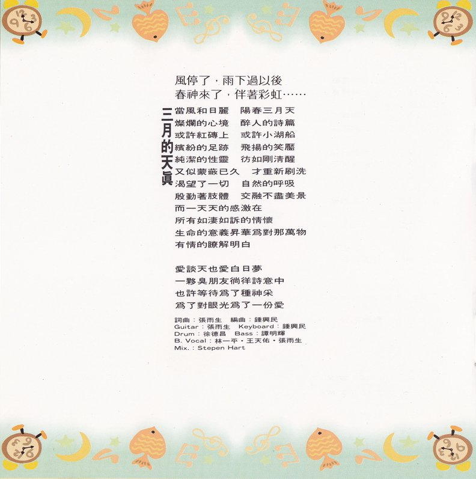

### 文案
風停了，雨下過以後  
春神來了，伴著彩虹……

### 歌詞
當風和日麗 陽春三月天  
燦爛的心境 醉人的詩篇  
或許紅磚上 或許小湖沿  
繽紛的足跡 飛揚的笑靨  
純潔的性靈 彷如剛清醒  
又似矇蔽已久 才重新刷洗  
渴望了一切 自然的呼吸  
殷勤著肢體 交融不盡美景  
而一天天的感激在  
所有如泣如訴的情懷  
生命的意義昇華爲對那萬物  
有情的瞭解明白

愛談天也愛白日夢  
一夥臭朋友徜徉詩意中  
也許等待爲了種神采  
爲了對眼光爲了一份愛

|   負責   |          人員          |
| :------: | :--------------------: |
|   詞曲   |         張雨生         |
|   編曲   |         鍾興民         |
|  Guitar  |         張雨生         |
| Keyboard |         鍾興民         |
|   Drum   |         徐德昌         |
|   Bass   |         譚明輝         |
| B.Vocal  | 林一平・王天佑・張雨生 |
|   Mix    |      Stephen Hart      |

## 一人一個夢
### 歌詞
調一杯酒 調成櫻花紅  
顏色淡的看不出用情多濃  
你永遠不懂  
夢如果不成夢 翻來覆去的長夜裏  
思念會刺的人心坎很痛

愛一個人 等他幾分鐘  
看他眼神和語氣有何不同  
慢慢就會懂  
情如果放太重 就像心握在他手中  
愛與不愛都是那樣的被動

難道不懂

給一人一個夢 夢都不會相同  
當感覺開始無法相容  
爲何還要堅持感情 有始有終

給愛一個屏風 心靈隔成雙重  
讓自己可以監視自己  
當愛來時 寧願孤獨 不爲所動

一人一個夢  
一人一個夢

|    負責     |      人員      |
| :---------: | :------------: |
|     詞      |     林秋離     |
|     曲      |     熊美玲     |
|    編曲     |     陳志遠     |
|   Guitar    |     江建民     |
| Percussions |     劉效松     |
|   B.Vocal   | 馬玉芬・黃麗星 |
|     Mix     |     Mr. K      |

## 一步一徘徊
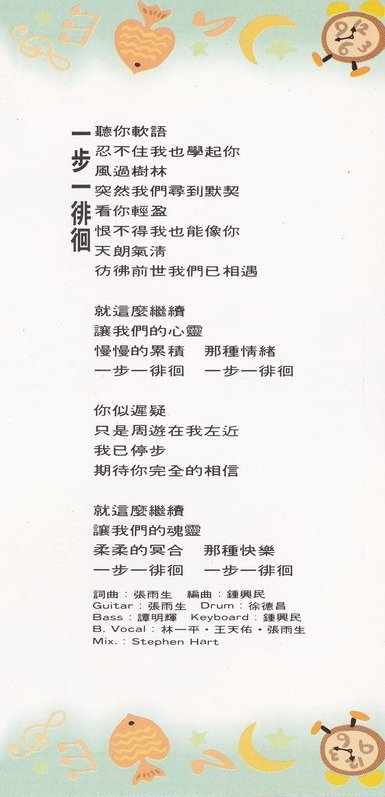

### 歌詞
聽你軟語  
忍不住我也學起你  
風過樹林  
突然我們尋到默契  
看你輕盈  
恨不得我也能像你  
天朗氣清  
彷佛前世我們已相遇

就這麼繼續  
讓我們的心靈  
慢慢的累積 那種情緒  
一步一徘徊 一步一徘徊

你似遲疑  
只是周遊在我左近  
我已停步  
期待你完全的相信

就這麼繼續  
讓我們的魂靈  
柔柔的冥合 那種快樂  
一步一徘徊 一步一徘徊

|   負責   |          人員          |
| :------: | :--------------------: |
|   詞曲   |         張雨生         |
|   編曲   |         鍾興民         |
|  Guitar  |         張雨生         |
|   Drum   |         徐德昌         |
|   Bass   |         譚明輝         |
| Keyboard |         鍾興民         |
| B.Vocal  | 林一平・王天佑・張雨生 |
|   Mix    |      Stephen Hart      |

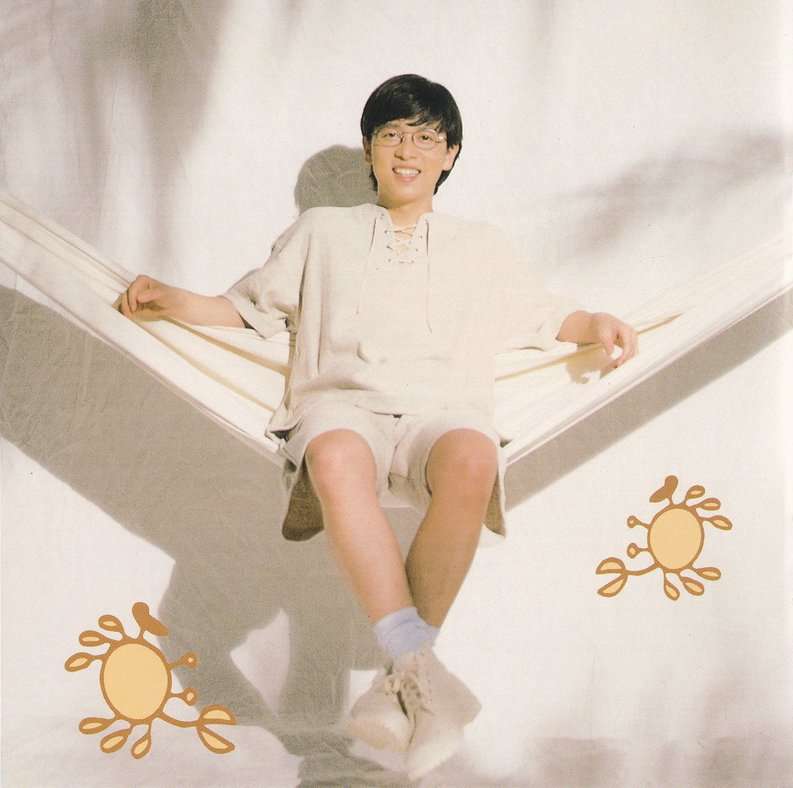

## 仲夏夜之夢
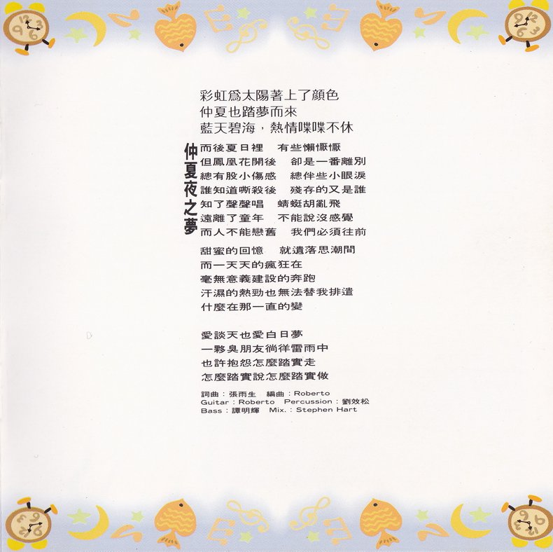

### 文案
彩虹爲太陽著上了顏色  
仲夏也踏夢而來  
藍天碧海，熱情喋喋不休

### 歌詞
而後夏日裏 有些懶懨懨  
但鳳凰花開後 卻是一番離別  
總有股小傷感 總伴些小眼淚  
誰知道嘶殺後 殘存的又是誰  
知了聲聲唱 蜻蜓胡亂飛  
遠離了童年 不能說沒感覺  
而人不能戀舊 我們必須往前

甜蜜的回憶 就遺落思潮間  
而一天天的瘋狂在  
毫無意義建設的奔跑  
汗溼的熱勁也無法替我排遣  
什麼在那一直的變

愛談天也愛白日夢  
一夥臭朋友徜徉雷雨中  
也許抱怨怎麼踏實走  
怎麼踏實說怎麼踏實做

|    負責    |     人員     |
| :--------: | :----------: |
|    詞曲    |    張雨生    |
|    編曲    |   Roberto    |
|   Guitar   |   Roberto    |
| Percussion |    劉效松    |
|    Bass    |    譚明輝    |
|    Mix     | Stephen Hart |

## 勿忘我
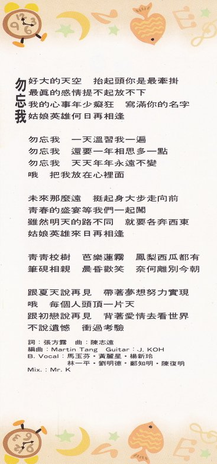
### 歌詞
好大的天空 抬起頭你是最牽掛  
最真的感情提不起放不下  
我的心事年少癡狂 寫滿你的名字  
姑娘英雄何日再相逢

勿忘我 一天溫習我一遍  
勿忘我 還要一年相思多一點  
勿忘我 天天年年永遠不變  
哦 把我放在心裏面

未來那麼遠 挺起身大步走向前  
青春的盛宴等我們一起闖  
雖然明天的路不同 就要各奔西東  
姑娘英雄來日再相逢

青青校樹 芭樂蓮霧 鳳梨西瓜都有  
筆硯相親 晨昏歡笑 奈何離別今朝

跟夏天說再見 帶著夢想努力實現  
哦 每個人頭頂一片天  
跟初戀說再見 背著愛情去看世界  
不說遺憾 衝過考驗

|  負責   |                           人員                           |
| :-----: | :------------------------------------------------------: |
|   詞    |                          張方露                          |
|   曲    |                          陳志遠                          |
|  編曲   |                       Martin Tang                        |
| Guitar  |                          J. KOH                          |
| B.Vocal | 馬玉芬・黃麗星・楊新玲 林一平・劉明德・鄭知明・陳復明 |
|   Mix   |                          Mr. K                           |

## 靜夜星空
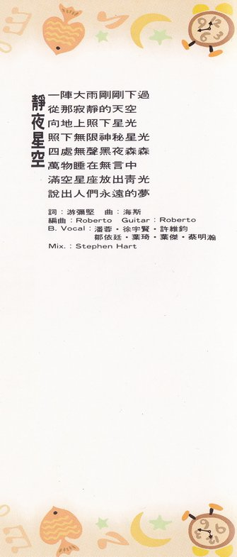

### 歌詞
一陣大雨剛剛下過  
從那寂靜的天空  
向地上照下星光  
照下無限神祕星光  
四處無聲黑夜森森  
萬物睡在無言中  
滿空星座放出青光  
說出人們永遠的夢

|  負責   |                        人員                        |
| :-----: | :------------------------------------------------: |
|   詞    |                       遊彌堅                       |
|   曲    |                        海斯                        |
|  編曲   |                      Roberto                       |
| Guitar  |                      Roberto                       |
| B.Vocal | 潘蓉・徐宇賢・許維鈞 鄒依廷・葉琦・葉傑・蔡明瀚 |
|   Mix   |                    Stephen Hart                    |

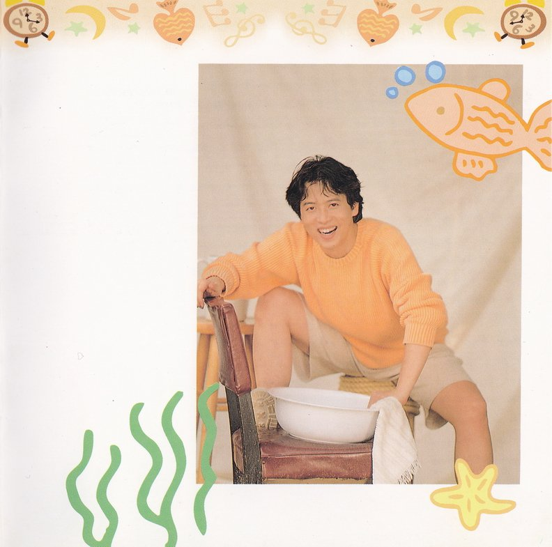

## 無知的歲月
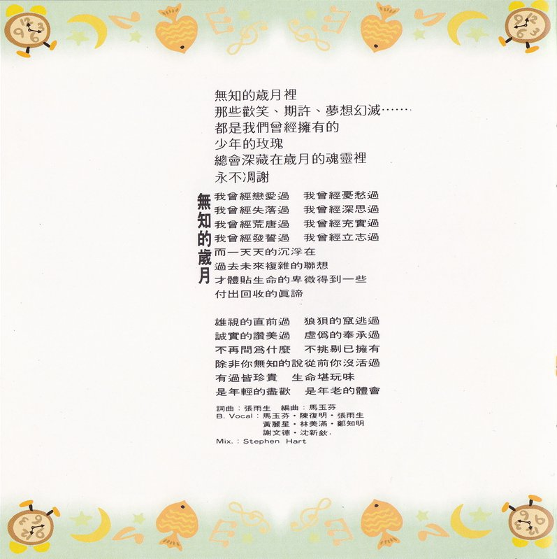

### 文案
無知的歲月裏  
那些歡笑、期許、夢想幻滅……  
都是我們曾經擁有的  
少年的玫瑰  
總會深藏在歲月的魂靈裏  
永不凋謝

### 歌詞
我曾經戀愛過 我曾經憂愁過  
我曾經失落過 我曾經深思過  
我曾經荒唐過 我曾經充實過  
我曾經發誓過 我曾經立志過  
而一天天的沉浮在  
過去未來複雜的聯想  
才體貼生命的卑微得到一些  
付出回收的真諦

雄視的直前過 狼狽的竄逃過  
誠實的讚美過 虛僞的奉承過  
不再問爲什麼 不挑剔已擁有  
除非你無知的說從前你沒活過  
有過皆珍貴 生命堪玩味  
是年輕的盡歡 是年老的體會

|  負責   |                                人員                                |
| :-----: | :----------------------------------------------------------------: |
|  詞曲   |                               張雨生                               |
|  編曲   |                               馬玉芬                               |
| B.Vocal | 馬玉芬・陳復明・張雨生 黃麗星・林美滿・鄭知明 謝文德・沈新欽 |
|   Mix   |                            Stephen Hart                            |

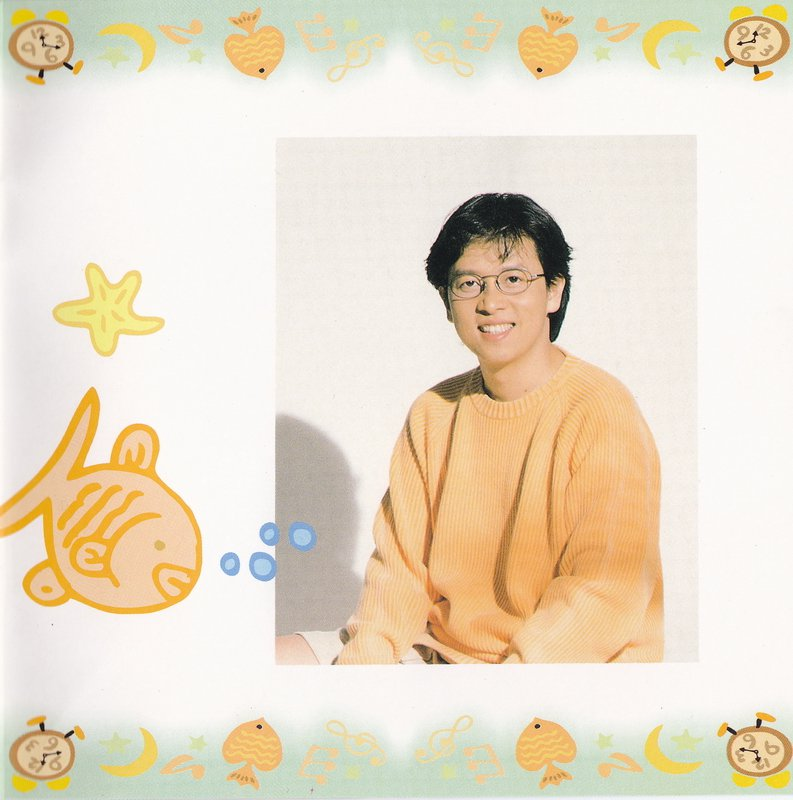

# 製作團隊
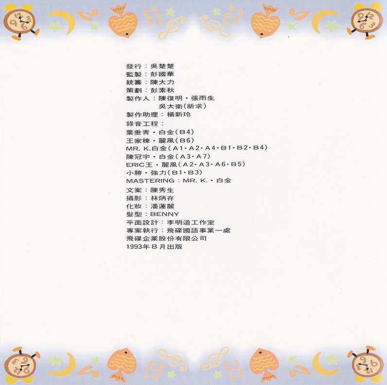

|      負責      |                                                                                 人員                                                                                 |
| :------------: | :------------------------------------------------------------------------------------------------------------------------------------------------------------------: |
|      發行      |                                                                                吳楚楚                                                                                |
|      監製      |                                                                                彭國華                                                                                |
|      統籌      |                                                                                陳大力                                                                                |
|      策劃      |                                                                                彭素秋                                                                                |
|     製作人     |                                                                   陳復明・張雨生 吳大衛（祈求）                                                                   |
|    製作助理    |                                                                                楊新玲                                                                                |
|    錄音工程    | 葉垂青・白金（B4） 王家棟・麗風（B6） MR.K.白金（A1・A2・A4・B1・B2・B4） 陳冠宇・白金（A3・A7） ERIC 王・麗風（A2・A3・A6・B5） 小勝・強力（B1・B3） |
|   MASTERING    |                                                                              MR.K・白金                                                                              |
|      文案      |                                                                                陳秀生                                                                                |
|      攝影      |                                                                                林炳存                                                                                |
|      化妝      |                                                                                潘蓮麗                                                                                |
|      髮型      |                                                                                BENNY                                                                                 |
| 音樂錄影帶導演 |                                              一天到晚游泳的魚（張榮貴） 一人一個夢（未知） 是否真的愛我（賴偉康）                                              |
|    平面設計    |                                                                             李明道工作室                                                                             |
|    專案執行    |                                                                           飛碟國語事業一處                                                                           |
|    出版發行    |                                                                         飛碟企業股份有限公司                                                                         |
|    出版日期    |                                                                          1993 年 8 月 24 日                                                                          |

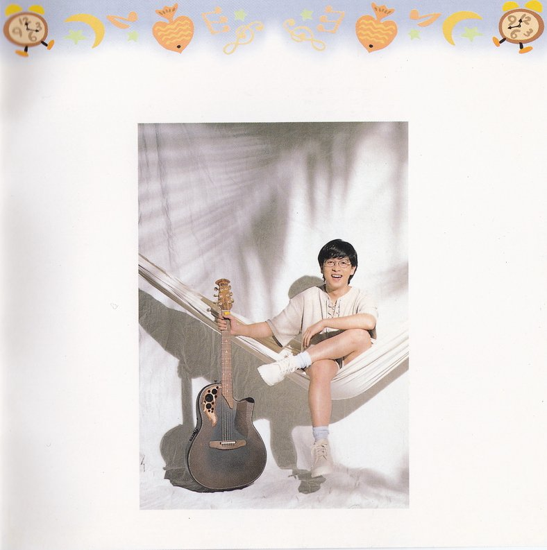

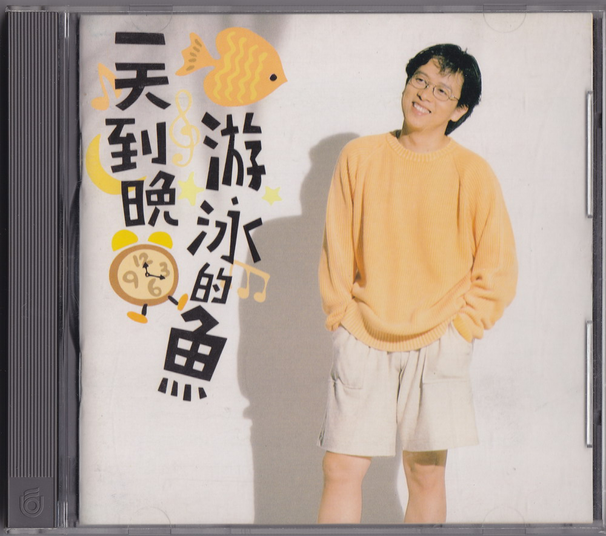
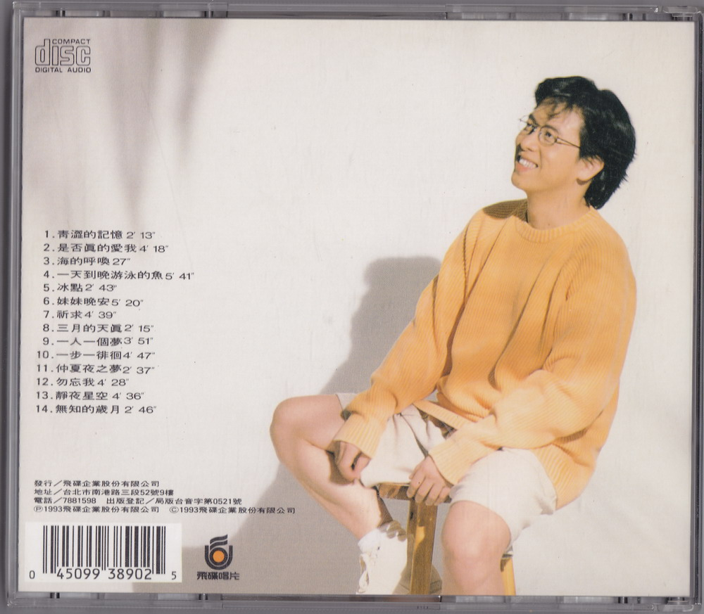

|   項目   |           內容            |
| :------: | :-----------------------: |
|   發行   |   飛碟企業股份有限公司    |
|   地址   |  臺北市南港路三段 52 號 9 樓  |
|   電話   |          7881598          |
| 出版登記 |    局版臺音字第 0521 號     |

ⓟ1993 飛碟企業股份有限公司  
ⓒ1993 飛碟企業股份有限公司

### 參考
-   [一天到晚游泳的魚圖冊 - tieba.com](https://tieba.baidu.com/p/2084189463#!/l/p1)
-   [張雨生音樂作品合輯 - cangkus.com](https://www.cangkus.com/music/21672.html)
-   [一天到晚游泳的魚 - tomchang.cn](https://www.tomchang.cn/music/album/14.html)
-   [一天到晚游泳的魚 - yu-sheng.org](https://web.archive.org/web/20120824043855/http://www.yu-sheng.org/Music/album.php?action=sa&id=5)
  
整理：Finn & Rain、露水  
校對：露水、向晚