# 卡拉 OK·台北·我[^1]

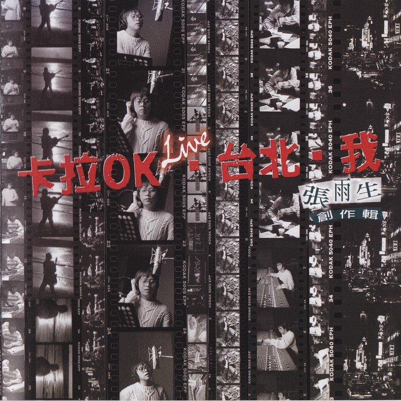

# 文案

我開始想做這張唱片的時候，野心並不大。在國外行之有年的錄音架構下，來比較本專輯的“劃時代意義”是極爲可笑的，所以我只是用再平常不過的心情，籌備一張不太電子的唱片而已，前人典範多有，何必大驚小怪！可是偏偏越走、越覺得壓力無處不在；越陷進去、越發現其深奧實在令人乍舌；越接近完成、越感受到一股非與衆不同不可的迷思！一些同業認爲在商業機制下，我有夠膽大妄爲，製作助理一再提醒我費用超支的情況，公司內部屢屢投來的迷惘但同情的目光，爲宣傳的切入點傷透腦筋…，然而，狀況與變數終會過去，唯有作品會留下來，那些用心、那些靈光閃動瞬間的驚喜會不斷帶給後繼的人希望！

LIVE！卡拉 OK · 台北 C · 我

專輯名稱怪得很！我聽了男女幼老各種反應，最喜歡錄音師反對的理由 ─ 太像散文的名字？！分成三段，是大有道理的（本段應公司要求而寫）。就一體成形的概念而言，這些歌曲都是生活的抽樣，真實的或感覺到的，經驗的或夢想能的，獨特的或不停重複的，有一點兒想像大導演羅勃 · 阿特曼在 Short Cuts（真不好意思）中展現的那樣。不在乎你認不認同、喜不喜歡每一首歌，只希望你在一個多小時內，有因爲什麼而想了一想！不然，你還可以玩玩文字拼湊遊戲，比方說，卡拉 OK 台北了我——這有點像中南部學子的心聲；我把卡拉 OK 台北了——這一句話就比較黑了；我保證台北卡拉 OK——這像執政黨的口吻；台北要卡拉 OK 看我——這就很在野的…，你瞧，慧心一來，巧妙千萬無窮，好玩透了！

在音樂言音樂，專輯的進行與完成之間，這三個名稱正好代表三個不可分割的階段，也隱現音樂的本質。

LIVE！卡拉 OK 是音樂的初始：我們知道每一張專輯都會有一位叫做製作人的角色，去掉那些浮誇不實的形容詞以後，製作人就會現形成爲一個標準的卡拉 OK 製造者，專門負責把卡拉 OK 的帶子做好，然後交給歌手唱。在本專輯中，我簡化了很多較專業較理論的部份，選擇真人來演奏該屬於真人的樂器，所以再加上 LIVE 的字眼，以示童叟無欺。

台北 c 是音樂從無到有、變魔術的所在：台北依然是流行音樂自產自銷的大宗，依然是音樂流行的指標都市，也是唱 KTV 老是排不到隊的繁華地方。在本專輯中，我與樂手於八十三年四月六日進駐台北南港飛碟唱片公司 C 棟倉庫開始編練，在光輝的五四那天開錄於台北長春路白金錄音室，真比白先勇筆下的台北人更台北。（當然，我們不希望只賣台北啦！）

我 音樂的畫龍點睛：卡拉 ok 沒有人唱，它就永遠是卡拉 ok，有人唱了，就可能成爲白金或黃金歌曲，但也是有成爲夜市歌后的可能，所以歌手賦予音樂生命，音樂回饋歌手以質感並大量財富名聲。在本專輯中，我試著用不同種類且落差極大的音樂型態，要求歌者稱職而趨於完美的演出。硬式搖滾、節奏藍調、流行抒情的分寸拿捏，民搖風、輕爵士、帶古典的深淺火侯，讓歌者接受大衆嚴格的評分。

剛剛對製作人的描述忘了最重要的一項，那就是，當遊戲進行到這裡，他必須對所有參與的人說——Game Set！

# 我是多麼想

數來寶特別指導：丁仲  
數來寶間怪打擊樂器：張雨生  
BASIC RHYTHM & BIG SOLO E.GT.：倪方來  
INTRO E.GT. SOLO：江建民  
INTRO E.GT. SOLO RECORDED BY 陳冠宇  
CHORUS ARRANGED BY 馬毓芬  
CHORUS GROUP：馬毓芬、黃麗星

讓我握住你瘦骨嶙峋的小手  
讓我捧起你茫然無神的面孔  
讓我聆聽你心田深處的噩夢  
重覆怎樣的折磨  
驚怕怎樣的傷痛  
讓我擁抱你弱不禁風的皮囊  
讓我拭乾你淚珠滂沱的臉龐  
讓我告訴你雲朗天青的地方  
白米綠蔬多肥壯  
花飛蝶舞多徜徉

我是多麼想說  
我甘心在這裡停留  
我是多麼想做  
我情願在這裡守候  
（你燦爛的笑容）

讓我承擔你虛脫鬆垮的肩膀  
讓我扶持你驀然回首的希望  
讓我唱出你純潔赤子的善良  
天真無邪的倜儻  
自由自在的歡暢  
讓我安慰你何去何從的心慌  
讓我指引你觸手可及的天堂  
讓我打開來沉沉重重的陰霾  
撒下金黃色的愛  
溫暖你我的胸懷

接近我 靠緊我  
你會發現我胸口  
同你一樣跳動 同你一樣顫抖  
相信我 聽我說  
你會看見我雙手  
也有成長的脈絡 也有跌仆的創痛

竹板一打 劈哩啪  
來把我們的社會想一想  
公益觀念剛剛才發了芽  
孰輕孰重誰緩誰急費思量  
別學兔爺兒打滾兒沾了一身臭泥巴  
別看兔爺兒吃飯兒七葷八素鬧胃腸  
要嘛規規矩矩真心真意愛心來出發  
管它有錢出錢有力出力來皆菩薩

# 動物的悲歌

SPECIAL REPORTER：陶晶瑩  
RHYTHM GT.& JAZZY SOLO：倪方來  
BRASS ARRANGED BY Koji Sakurai  
TRUMPET & TROMBONE：Lito  
ALTO SAX. & FLUTE：Met  
TENOR & SOPRANO SAX：張家銘  
CHORUS ARRANGED BY 馬毓芬  
CHORUS GROUP：馬毓芬、黃麗星、林一平、王天佑

小黑與小花孿生於晨光下  
也是母親心裡呵藏已久的願望  
他們生來便強壯  
他們歌聲正清亮  
形影不離天不怕地不怕  
小黑與小花嬉遊於碧山下  
追著落日餘霞浮雲微風和星光  
他們開懷而歡笑  
他們並沒有看到  
地平線上聳起鋼鐵爪牙

這個家園充滿芬芳的青草  
春風吹過響起感激的歌謠

而如今 天不是他們的 地不是他們的  
他們還擁有什麼  
山不是他們的 花草不是他們的  
生命之泉行將乾涸  
如今天不是他們的 地不是他們的  
他們還擁有什麼  
樓宇不是他們的 道路不是他們的  
只剩這首動物的悲歌

快樂的日子卻並沒有很長  
萬丈高樓大廈遮住金黃的陽光  
他們才兩個月大  
他們依然在玩耍  
直到那天他們找不到媽媽  
小黑與小花流浪在工地旁  
聽著人來人往熙熙嚷嚷的喧譁  
他們飢渴又疲乏  
他們落拓而骯髒  
形影不離還抱一絲希望

陶晶瑩：  
各位觀衆這裡是瑩生電台，記者爲您做世紀末文明霸客篇特別報道  
叢林冒險家小花將要挑戰台灣人類北二高…進行…這個禽獸街大考驗…小花英雄…  
現在我們透過鏡頭可以看到，轉眼間小花已經跳過分隔島，大發裕隆喜美福特一輛輛的，小花穿梭而不已，啊終點就在眼前  
哎呀小花跌倒了，怎麼又來一輛車，又翻車又彈跳，沒有躲開，來了一輛最貴的賓士三百！！！（撞車聲）

小黑站在小花冰冷的身體旁  
試著哄他叫他舔他咬他推弄他  
北二高的馬路上  
車行狂亂而爭吵  
瞬間淹沒小黑悲戚的呼嚎

# 靈光

古典樂段出處：  
第一左邊的 Guitar —— Inventionen（Bach）  
第二中間的合唱與絃樂 —— Symphony No.9（Beethoven）  
第二右邊的鋼琴 —— MUSETTE（Bach）  
第四段中間的合唱 —— Ha - le - lu - jah（Handel）  
第五段左邊的絃樂 —— The Four Seasons（Vivaldi）  
GRAND PIANO：Ricky Ho  
E.GT. & ACOUSTIC GT.：江建民

我珍藏的記憶 隨風輕撫心靈  
我鍾愛的旋律 隨意朗朗行吟  
那面泛酡紅的人啊  
總是讓我情不自禁  
我收覽的美景 閉眼栩栩清晰  
我蜷曲的身軀 任暖陽烘曬暈暈  
那朱脣白齒的人啊  
總是叫我情不自禁

霎時靈光撥弄我心絃  
甘美思緒如水瀉  
羅網交織出優美側面  
擷取這大塊的瞬間

但是窮盡我所擁有 極盡我所能夠  
我也沒有把握  
（去）速寫此生在此時此刻的感動  
速寫此刻給此心此身的溫柔  
速寫此人對此情此景的傾心

如絲如縷的情愛  
被精確的 Quaintize[^2]  
至情至性的神采  
也被 Digital 取代  
那回眸一笑的人啊  
依然使我情不自禁

# 永公街的街長

口白：文英  
E.GT. & ACOUSTIC GT. (BASIC ARP.)：江建民  
TENOR SAX. SOLO：張家銘  
ENDING FEMALE SOLO：馬毓芬  
CHORUS GROUP：王天佑、劉明德、林一平  
月琴：巫興昌

我來唸歌 請您仔細聽  
那個永公街上 說有一個奇怪的人  
他每天行來行去 面黑黑又打赤腳  
不過他都行去滿滿的垃圾筒  
找垃圾桶裡面 別人拋棄的東西

他只在附近遊蕩  
全村的人都知道他  
我喜歡這樣稱呼他  
說他是永公街的街長

他不癡 也不是傻瓜  
他不狂 也不常說話  
他的世界裡用著吊詭文法  
他是永公街的街長

不可以世俗斗量的情感  
不可以世俗斗量的牽絆

永公街的街長  
他是文明社會的罪與罰  
永公街的街長  
像只漂鳥因固執的追尋而跌下  
永公街的街長  
他在櫻花繽紛裡玩耍  
永公街的街長  
像只漂鳥因逆風迷失了方向

# 子夜紓懷

前奏音樂取自 Rachmaninoff 的 Vocalise  
GRAND PIANO：Ricky Ho

好一陣山風  
好一輪秋月  
好一個夢般子夜  
細忖我們的是非

好遠的市囂  
好近的天籟  
好一程寄旅人生  
邂逅我們的情懷

曾經一場夢 虛無縹緲中  
混沌間浮動  
一路行來像在森林裏遊走  
野火般婆娑 天空般寬容  
恰似波浪擺盪 聚合又散落  
創造而烏有  
經不起的是什麼？  
渴念著什麼？  
只是虛構一夜的傷痛

狂熱的自由  
冰冷的靜默  
在這個絕美夜色  
崩潰成我的脆弱

# 兄弟呀

INTRO ACOUSTIC GT. & E.GT. BIG SOLO：杜仲傑

當你這樣看著我  
當我這樣面對你  
我們靠得這樣的近  
彼此之間沒有言語  
你輾轉說一些事情  
我抑制我的訝異  
以爲臉上沒有衝突的情緒  
卻讓肢體僵硬滑稽

多年若即又若離  
盤根錯結在一起

兄弟呀  
我有多麼的愛你  
雖然蹉跎至今不敢表明  
兄弟呀  
我有多麼關心你  
雖然聚少離多難以親近  
兄弟啊  
我有多麼的愛你  
只是藏在心裏看在眼裡  
兄弟呀  
我有多麼在乎你  
因爲失去要比擁有容易

我們背對背前行  
朝著路的兩端走去  
漫漫人生裡悠揚的歌曲  
伴著歲月走過年輕

年長以後談笑起  
那少不更事的意氣

# 這一年這一夜

GRAND PIANO: Ricky Ho  
CHORUS：馬麗華、林咪咪、李鼎慧、王天佑、劉明德、林一平  
FEMALE "WU" ARRANGED BY 楊新玲  
E.GT. & ACOUSTIC GT.：江建民

太陽燒紅了海洋  
海洋包容了太陽  
向晚天空缺了一角  
月亮探頭撒張網  
眼觀鼻觀心口上  
你那羞澀不能忘  
我的手臂不勝扭曲靠上你的肩膀

山頂一片白茫茫  
風起滾層層浪花  
向晚天空明暗更替  
霞彩忙著點新妝  
眼望雲望西天涯  
你那出神不能忘  
我的情緒傻傻隨你飛進美麗烏托邦

這一年 這一夜  
回憶溫暖我疲憊  
小黃燈書桌前  
細數有心人情淚  
看似清 實迷離  
情路又玄又是漩  
爲你 我更舉杯  
好景當前莫留連

獵戶星在前方亮  
雙熊盤踞北極光  
春分時候無際穹蒼  
銀河舞會星宿忙  
眼遊神遊老與莊  
你那無語不能忘  
我的胸口鼓鼓吹脹歡樂幸福的遐想

# 我的心在發燙

KARAOKE & ENDING IMPROVISED VOCAL：陶晶瑩  
E.GT：李庭匡  
CHORUS ARRANGED BY 馬毓芬  
CHORUS GROUP：馬毓芬、黃麗星、謝文德、劉文毅（FAT BASS）  
吆喝：Killer

累不累 倦不倦  
讓我來爲你 挑動心弦  
愛與恨 癡與嗔  
你不用再區分 也不必再等

要可樂 或咖啡  
讓我來陪你 漫談一夜（唱卡拉 OK）  
真似假 假似真  
你何苦要追問 你不需求證

天天想 天天都一樣  
我用熱情懷抱希望  
愛得慌 我無處可藏  
你想一想 要怎樣 才能夠  
摸索出適切的表達

我的心在發燙  
（想要陪你一起唱）

# 後知後覺

BRASS ARRANGED BY Koji Sakurai  
TRUMPET & TROMBONE：Lito  
TENOR & SOPRANO SAX.：張家銘  
CHORUS ARRANGED BY 馬毓芬  
CHORUS GROUP：馬毓芬、黃麗星、謝文德、劉文毅

你披星戴月  
你不辭冰雪  
你穿過山野  
來到我的心田

你像遠在天邊  
又似近在眼前  
直到充臆心間  
我才後知後覺

你給我安慰  
我不致頹廢  
你寬容慈悲  
我能振翅高飛  
你卻功成身退  
我不及言謝  
你不告而別  
我才後知後覺

# 蝴蝶結

燙金的滾邊 墨綠的絨面  
對稱的折線 貼緊中間的圓  
擱置在角邊 不怎麼顯眼  
卻讓我驚豔 氣質的特別

看了一眼又看了一眼  
總是不能忘記那一種感覺  
轉過一圈再轉過一圈  
終於還是回到玻璃櫥窗前

電話的那邊 啜泣與哽咽  
情感在翻飛 逃不脫傷悲  
握在手裡面 話已到嘴邊  
靜默又吞滅 最後一絲機會

想把手上這個蝴蝶結  
親自送到你的面前  
別在秀髮間  
然而現在這個蝴蝶結  
卻靜靜躺在心靈的深淵  
再也不會  
別在你鵝黃衣領邊

燙金的滾邊 墨綠的絨面  
旋轉在高點 格外的悽美  
對稱的折線 貼緊中間的圓  
急遽的下跌 來不及反悔

# 跟得上我吧

INTRO ACOUSTIC GT. AND CHORDS ARRANGEMENT 杜仲傑

你何不問我  
你何不問我  
就問我這些日子來是否心依舊  
（就問我這些日子來是否仍作夢）

你常常看我  
你常常聽我  
我大半的時間裡都存在你左右  
（我大半的生命裡都投向你眼眸）

你跟得上我吧  
你學得還好吧  
眼看他無中生有 卻越來越茁壯  
你跟得上我吧  
你還習慣我吧  
多少紅塵情愫 卻越來越荒涼

# 我期待

GRAND PIANO:Ricky Ho (INTRO NOT INCLUDING)

我期待 有一天我會回來  
回到我最初的愛  
回到童真的神采

我期待 有一天我會明白  
明白人世的至愛  
明白原始的情懷

我情願 分合的無奈  
能換來 春夜的天籟  
我情願 現在與未來  
能充滿 秋涼的爽快

Say Goodbye  
Say Goodbye  
前前後後 迂迂迴迴地試探  
Say Goodbye  
Say Goodbye  
昂首闊步 不留一絲遺憾

# 再見 蘭花草！

SOLO VIOLIN：賴佳奇  
E.GT SOLO (LEFT) & ENDING WAH - WAH GT.：江建民  
E.GT SOLO (RIGHT) & CLEAN RHYTHM GT.：李庭匡  
齊唱：馬麗華、林咪咪、李鼎慧、王天佑、劉明德、林一平  
齊唱分部：楊新玲

誰從山中來 帶著蘭花草  
也曾勤灌溉 長得一園好  
雖然經過許多年  
其人其事漸湮滅  
我就是不能忘掉那盆蘭花草

我往山中行 尋找蘭花草  
梵音在弦外 醉翁意韻妙  
茶花櫻花滿山開  
杜鵑木棉沿街栽  
誰記得曾經有那一盆蘭花草

給我一把吉它我來唱  
給我一枝鉛筆讓我來畫  
給我一對翅膀我來飛  
給我一個空間讓我轉圈  
直到那一天我愛上他  
直到那一天我眼淚滑下  
你只要給我五分鐘  
我給你完全不同的感受

# 致謝

本專輯在四個颱風肆虐之下，仍然“如期”完工，不能不感謝以下諸人：

Lulu 與錄音師不眠不休的配合，Koji，豆子與同學無怨無悔的付出，  
潘先生與其助理往返白金的辛勞，小狗完美的吠叫，丁叔的相助，文英阿姨的令人動容…

特別感謝彭國華先生，因爲他給了我完整的授權，  
特別感謝彭素秋（小彭）“小姐”，在最後關頭又讓我得到所有的支援，  
謝謝影響本專輯的中外前輩團體，  
謝謝 K 嫂，我們佔用小 K 太久了，  
謝謝白金錄音室及所有白金工作人員，No more overnight！？  
謝謝！謝謝大家！

張雨生 83[^3].8.20.

# 專輯照片

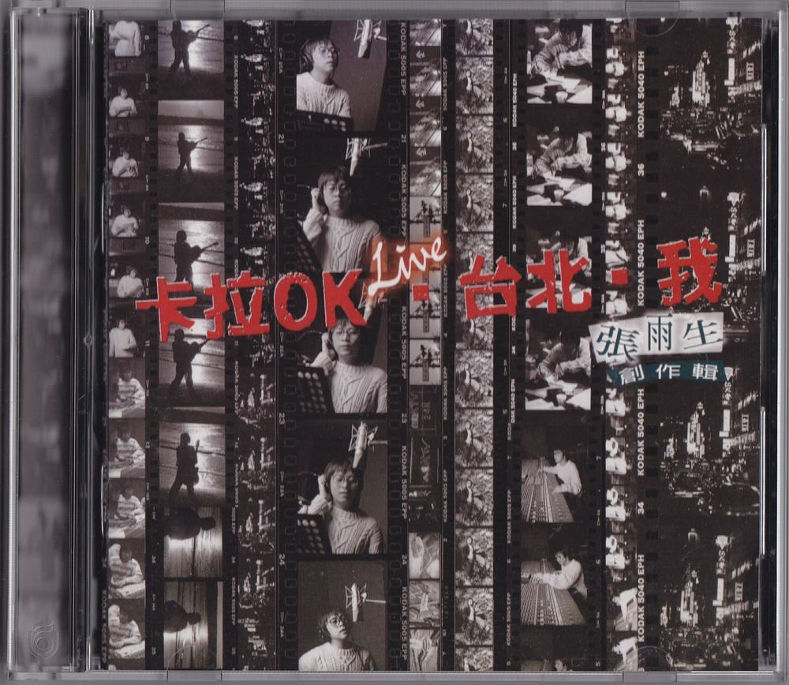

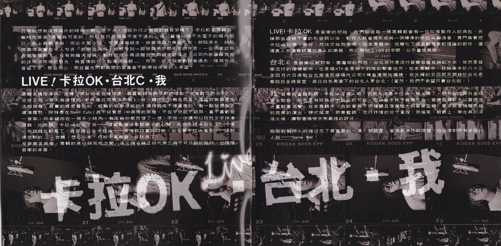

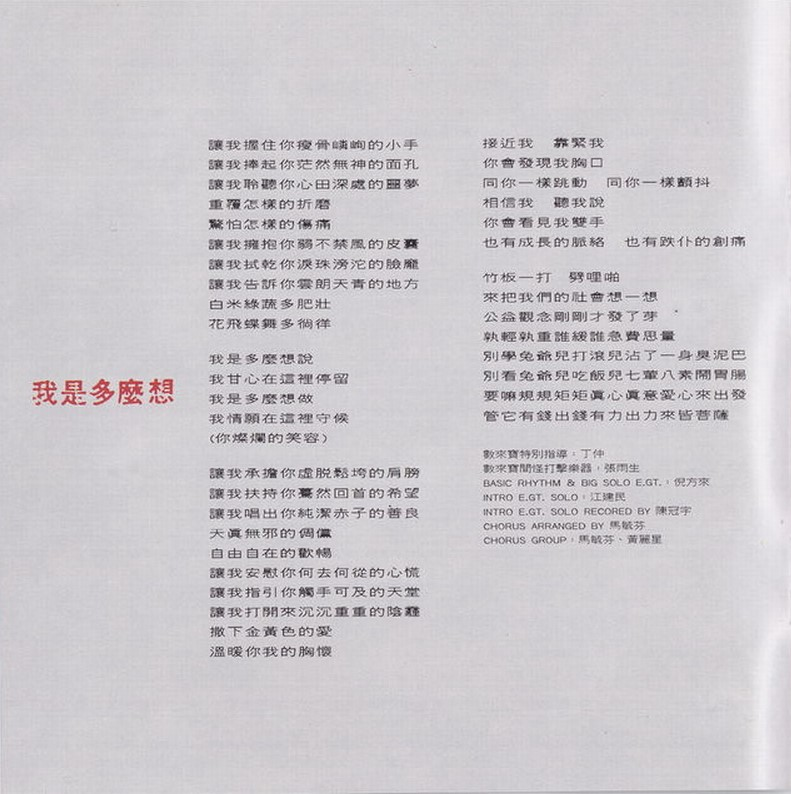

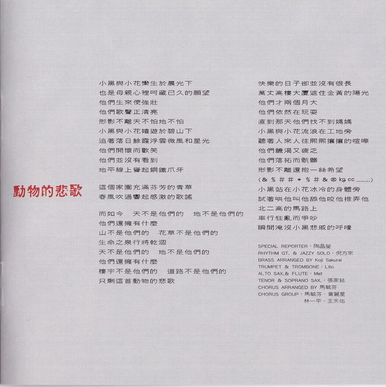

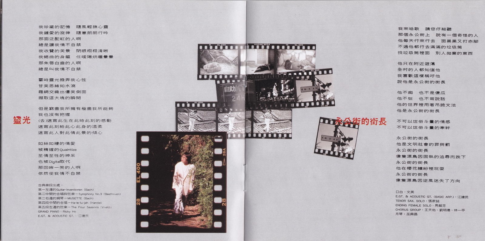

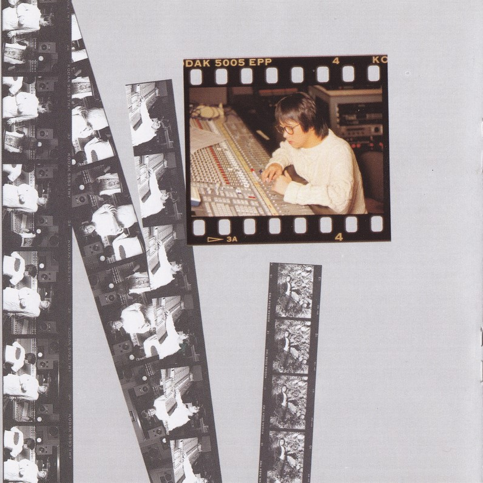

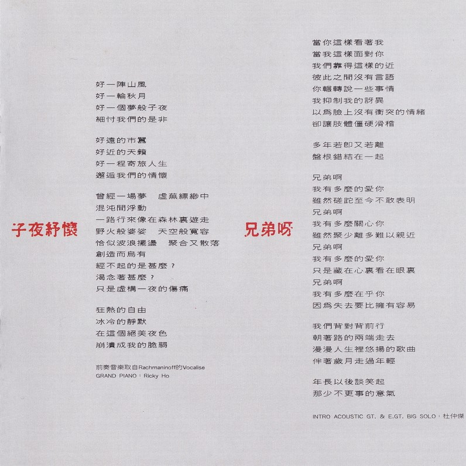

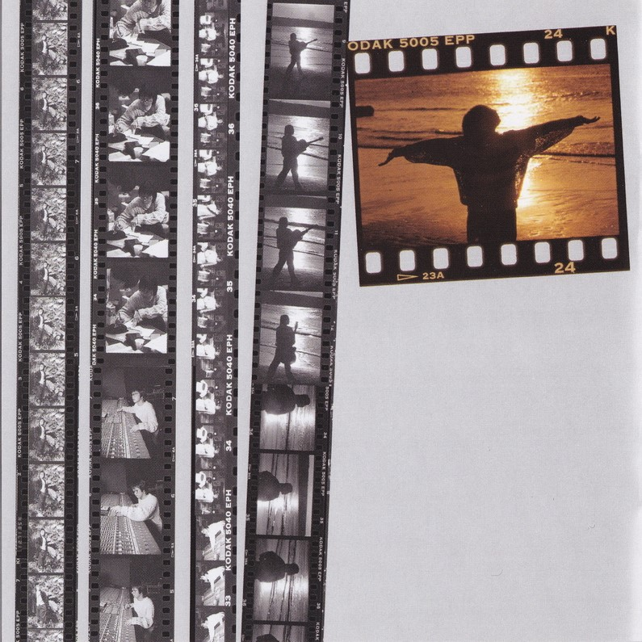

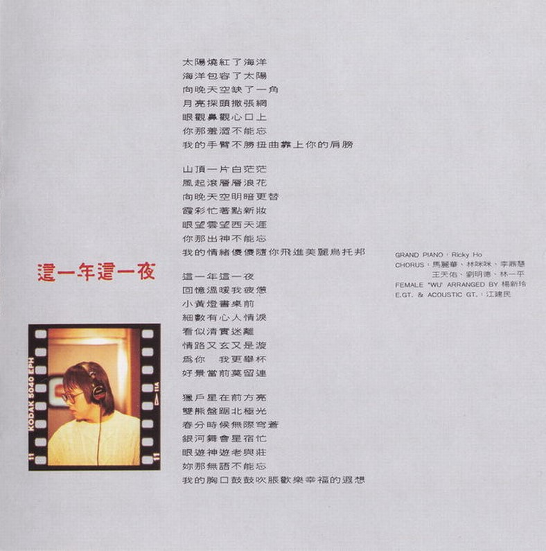

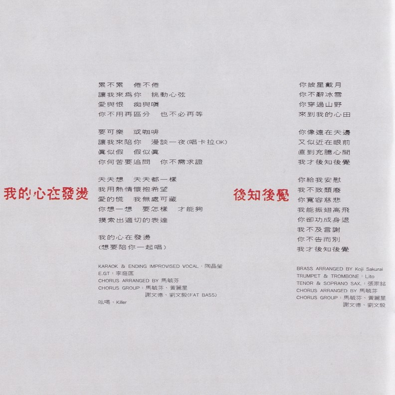

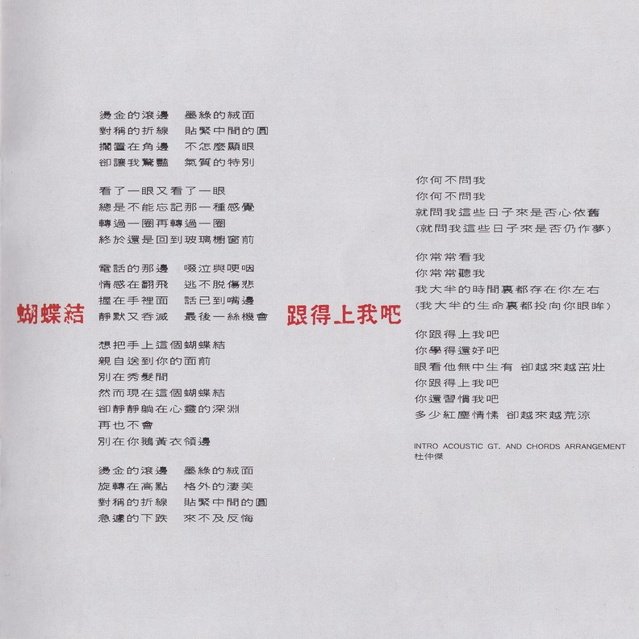

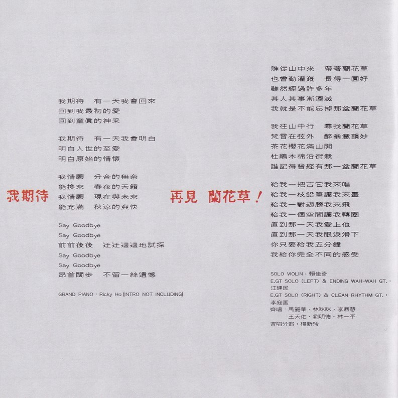

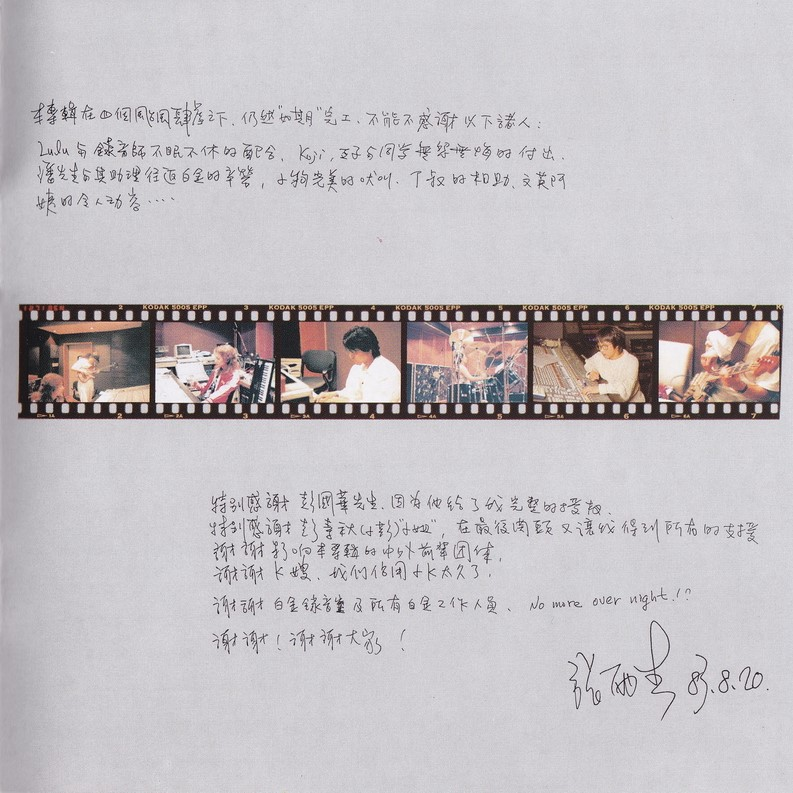

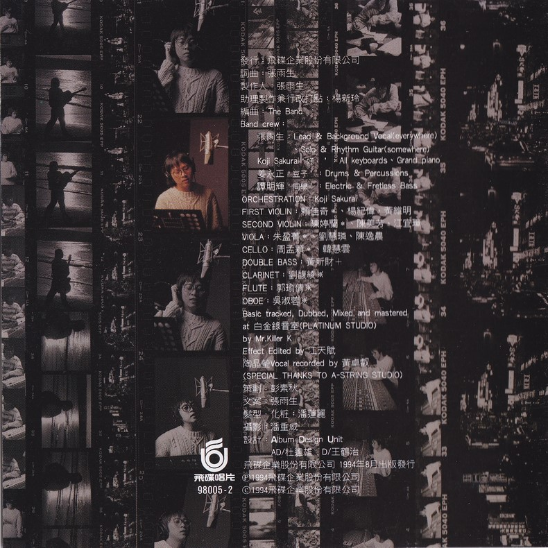

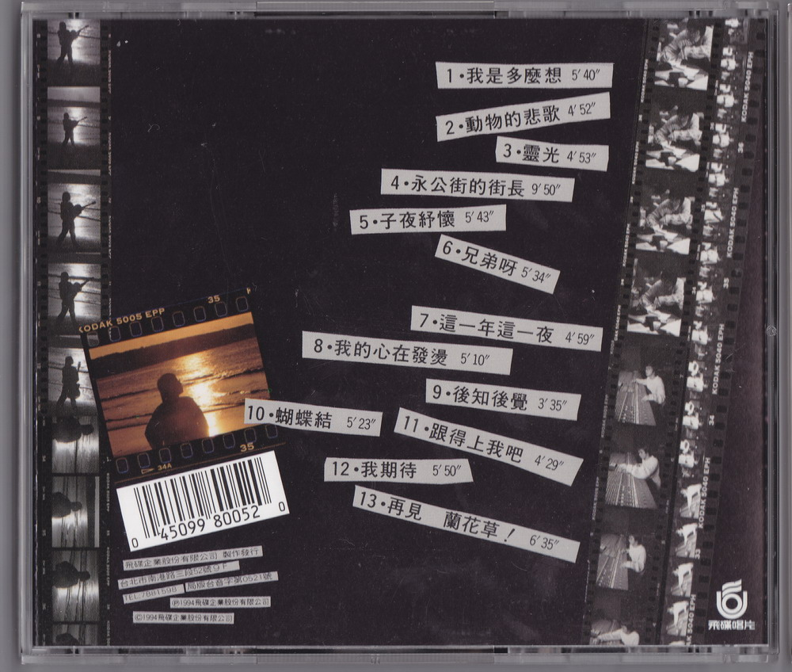

# 製作團隊

|        負責        |     人員 / 團隊      |
| :----------------: | :------------------: |
|        發行        | 飛碟企業股份有限公司 |
|        詞曲        |        張雨生        |
|       製作人       |        張雨生        |
| 助理製作兼行政打點 |        楊新玲        |
|        編曲        |       The Band       |

Band crew:

|        人員         |                                 負責                                 |
| :-----------------: | :------------------------------------------------------------------: |
|       張雨生        | Lead & Background Vocal(everywhere)、Solo & Rhythm Guitar(somewhere) |
| Koji Sakurai ‘好！’ |                      All keyboards、Grand piano                      |
|    姜永正 ‘豆子’    |                         Drums & Percussions                          |
|    譚明輝 ‘同學’    |                       Electric & Fretless Bass                       |

|     樂器      |             人員             |
| :-----------: | :--------------------------: |
| ORCHESTRATION |         Koji Sakurai         |
| FIRST VIOLIN  | 賴佳奇\*[^4]、楊紀偉、黃維明 |
| SECOND VIOLIN |   陳婷蘭\*、陳美芳、江宜璋   |
|     VIOLA     |   朱盈菁\*、劉慧璘、陳逸農   |
|     CELLO     |       周孟穎\*、韓慧雲       |
|  DOUBLE BASS  |            黃新財            |
|   CLARINET    |           劉馥綾\*           |
|     FLUTE     |           郭瑜倩\*           |
|     OBOE      |           吳淑蓉\*           |

Basic tracked, Dubbed, Mixed and mastered  
at 白金錄音室（PLATINUM STUDIO）  
by Mr.Killer K  
Effect Edited by 江天賦  
陶晶瑩 Vocal recorded by 黃卓叡  
（SPECIAL THANKS TO A-STRING STUDIO）

|   負責    |                    人員                    |
| :-------: | :----------------------------------------: |
|   策劃    |                   彭素秋                   |
|   文案    |                   張雨生                   |
| 髮型·化妝 |                   潘蓮麗                   |
|   攝影    |                   潘重威                   |
|   設計    | Album Design Unit AD/杜達雄 D/王鶴治 |

飛碟企業股份有限公司 1994 年 8 月出版發行  
Ⓟ1994 飛碟企業股份有限公司  
Ⓒ1994 飛碟企業股份有限公司

# 相關鏈接

-   [《動物的悲歌》陶晶瑩部分歌詞 - music.163.com](https://music.163.com/#/song?id=187861)
-   [卡拉 Ok▪ 台北 ▪ 我\-專輯\-張雨生網站 \- TOMCHANG\.CN](https://www.tomchang.cn/music/album/320.html)

整理：郈斐、健健  
校對：健健

[^1]: 各音樂平台也稱此專輯爲「卡拉 OK.台北.我」，本資料按照專輯封面命名。
[^2]: 應該是「Quantize」，專輯裡可能打錯字了
[^3]: 民國 83 年，公元 1994 年。
[^4]: 加 \* 的爲客串演出的樂手
