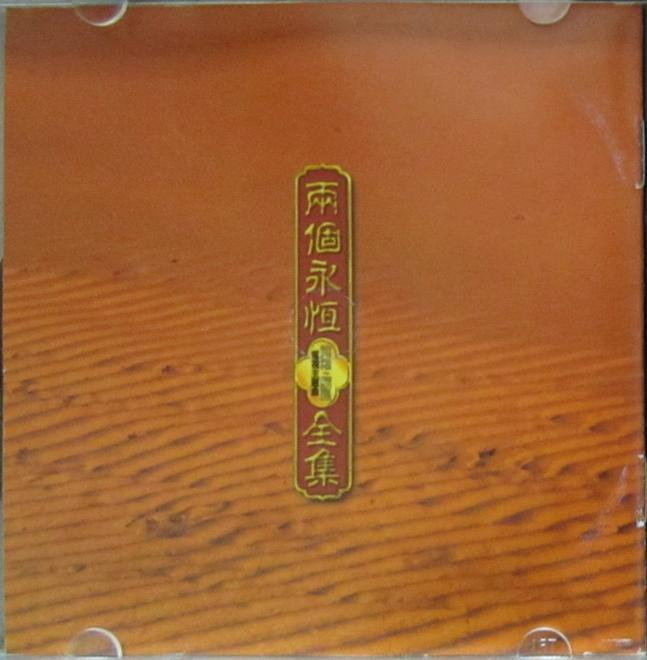
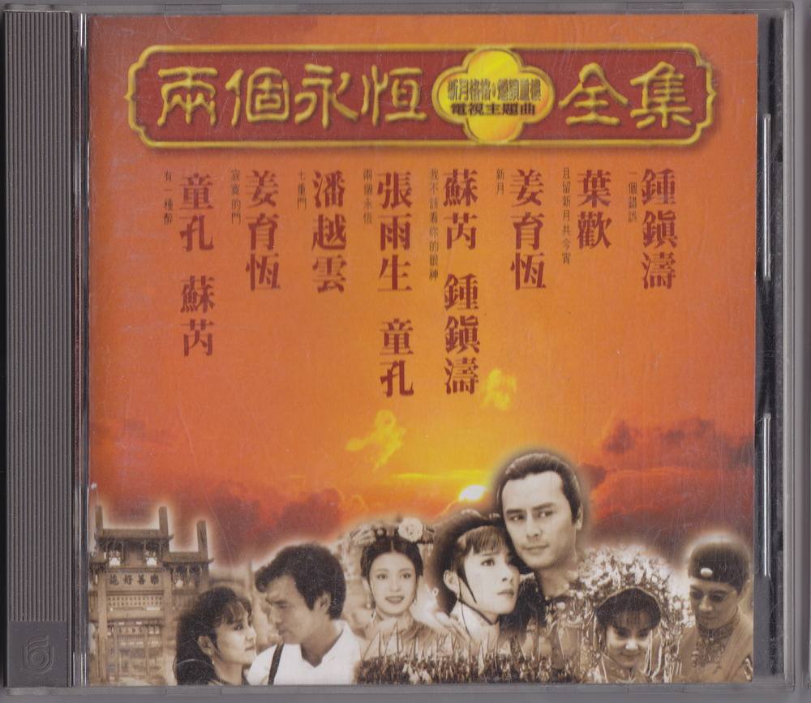
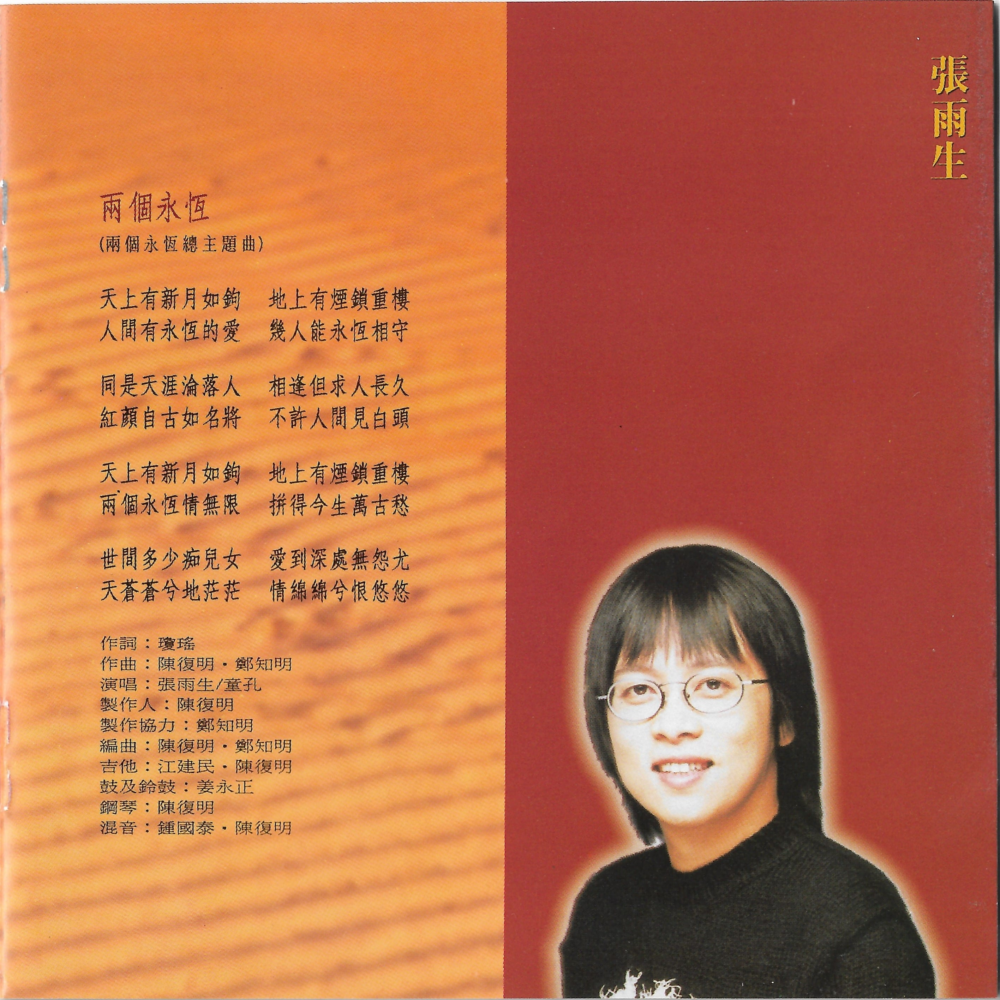
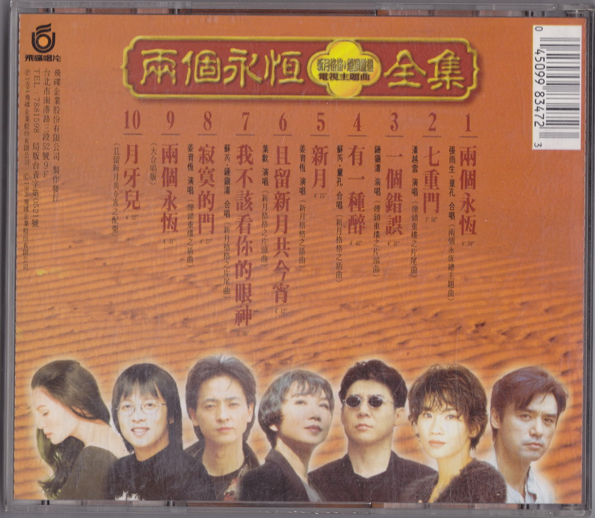

# 兩個永恆電視主題曲全集

# 兩個永恆

天上有新月如鉤 地上有煙鎖重樓  
人間有永恆的愛 幾人能永恆相守

同是天涯淪落人 相逢但求人長久  
紅顏自古如名將 不許人間見白頭

天上有新月如鉤 地上有煙鎖重樓  
兩個永恆情無限 拼得今生萬古愁

世間多少痴兒女 愛到深處無怨尤  
天蒼蒼兮地茫茫 情綿綿兮恨悠悠

作詞：瓊瑤  
作曲：陳復明、鄭知明  
演唱：張雨生、童孔  
製作人：陳復明  
製作協力：鄭知明  
編曲：陳復明、鄭知明  
吉他：江建民、陳復明  
鼓及鈴鼓：姜永正  
鋼琴：陳復明  
混音：鍾國泰、陳復明

# 專輯照片

