# 還是朋友

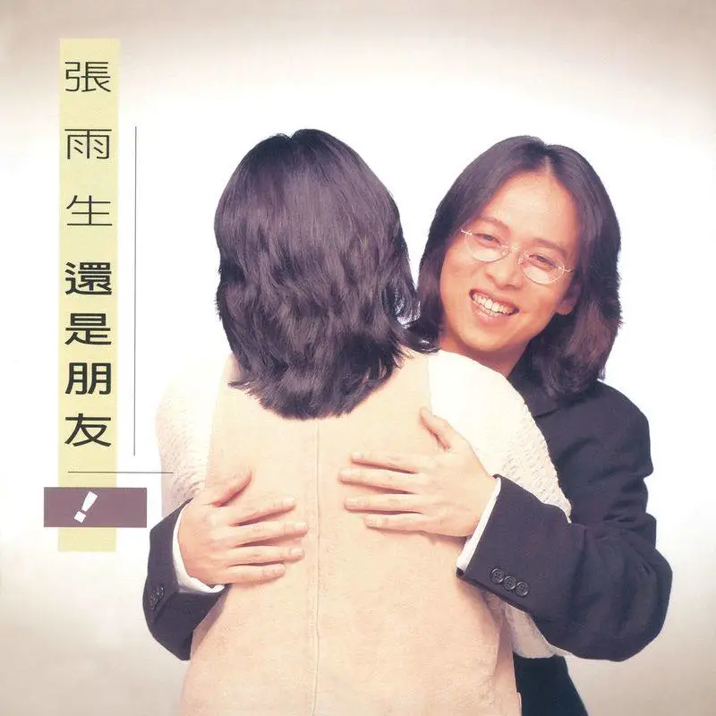

# 文案

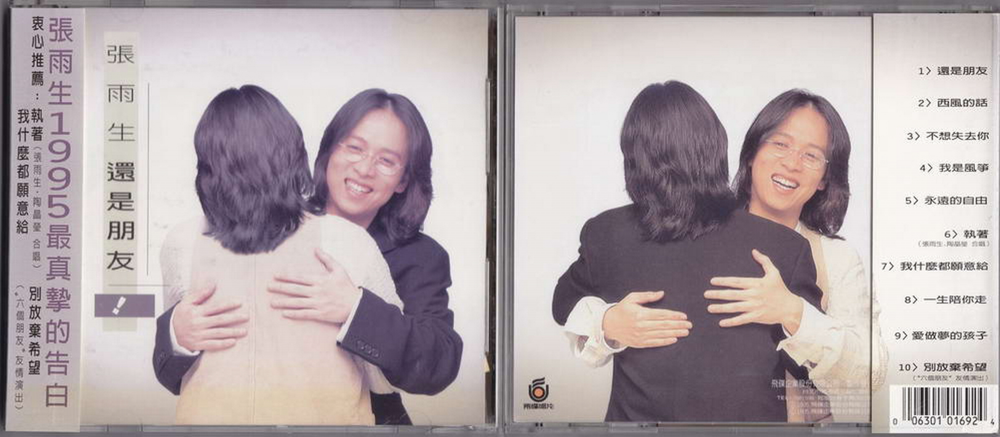

**張雨生 1995 最真摯的告白**

**衷心推薦：**

- **執著**（張雨生，陶晶瑩 合唱）
- **別放棄希望**（“六個朋友”友情演出）
- **我什麼都願意給**

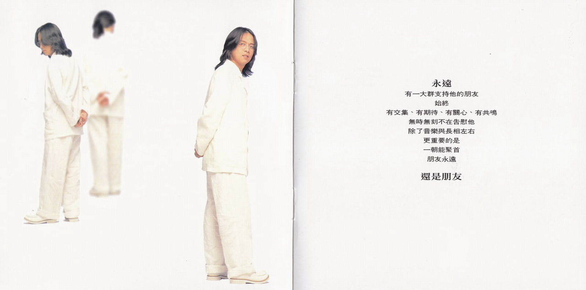
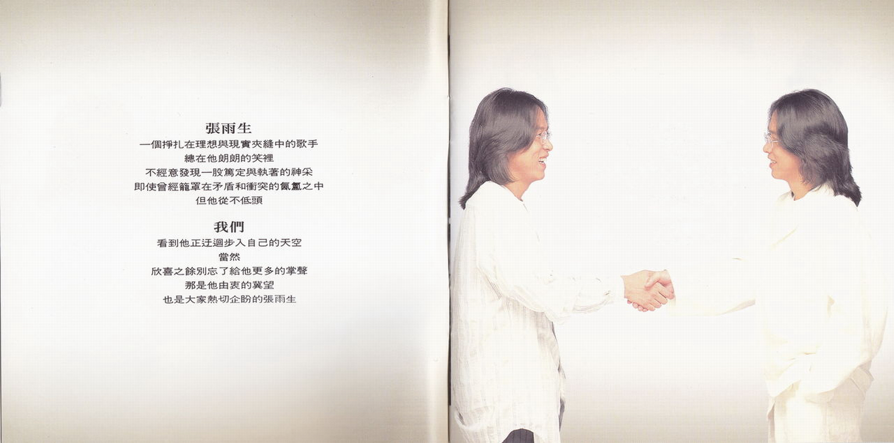

**永遠**  
有一大羣支持他的朋友  
始終  
有交集、有期待、有關心、有共鳴  
無時無刻不在告慰他  
除了音樂與長相左右  
更重要的是  
一朝能聚首  
朋友永遠  
**還是朋友**

**張雨生**  
一個掙扎在理想與現實夾縫中的歌手  
總在他朗朗的笑裏  
不經意發現一股篤定與執著的神采  
即使曾經籠罩在矛盾和衝突的氤氳之中  
但他從不低頭

**我們**  
看到他正迂迴步入自己的天空  
當然  
欣喜之餘別忘了給他更多的掌聲  
那是他由衷的冀望  
也是大家熱切企盼的張雨生

# 還是朋友

0630-10169-2-01

作詞：吳大衛  
作曲：吳大衛  
編曲：涂惠源，徐德昌  
MV 導演：陳怡君

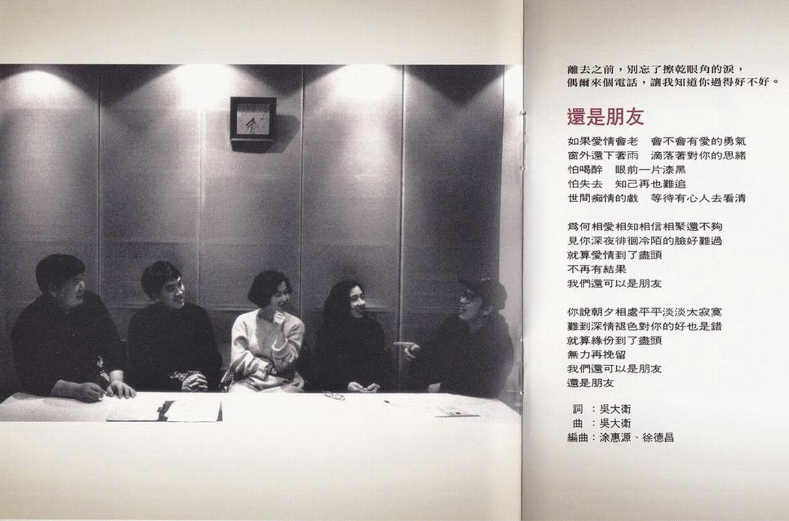

## 導引

離去之前，別忘了擦乾眼角的淚，  
偶爾來個電話，讓我知道你過得好不好。

## 歌詞

如果愛情會老 會不會有愛的勇氣  
窗外還下著雨 滴落著對你的思緒  
怕喝醉 眼前一片漆黑  
怕失去 知己再也難追  
世間癡情的戲 等待有心人去看清

爲何相愛相知相信相聚還不夠  
見你深夜徘徊冷陌的臉好難過  
就算愛情到了盡頭 不再有結果  
我們還可以是朋友

你說朝夕相處平平淡淡太寂寞  
難道深情褪色對你的好也是錯  
就算緣份到了盡頭 無力再挽留  
我們還可以是朋友 還是朋友

# 西風的話

0630-10169-2-02

作詞：許常德  
作曲：楊新玲  
編曲：王繼康

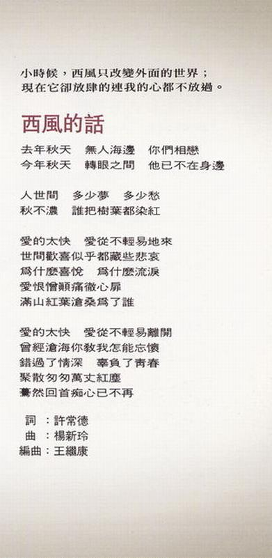

## 導引

小時候，西風只改變外面的世界；  
現在它卻放肆的連我的心都不放過。

## 歌詞

去年秋天 無人海邊 你們相戀  
今年秋天 轉眼之間 他已不在身邊

人世間 多少夢 多少愁  
秋不濃 誰把樹葉都染紅

愛的太快 愛從不輕易地來  
世間歡喜似乎都藏些悲哀  
爲什麼喜悅 爲什麼流淚  
愛恨憎顛痛徹心扉  
滿山紅葉滄桑爲了誰

愛的太快 愛從不輕易離開  
曾經滄海你教我怎能忘懷  
錯過了情深 辜負了青春  
聚散匆匆萬丈紅塵  
驀然回首癡心已不再

# 不想失去你

0630-10169-2-03

作詞：張雨生  
作曲：張雨生  
編曲：王繼康

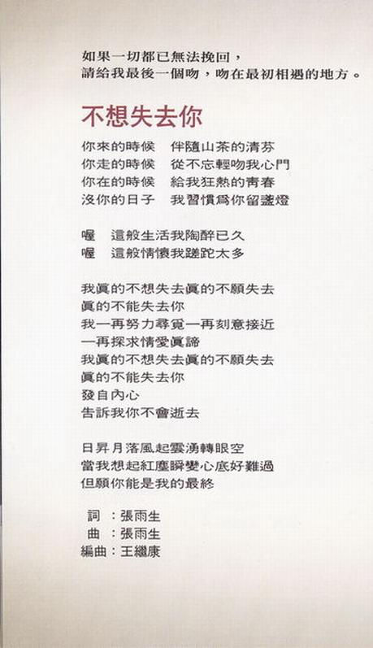

## 導引

如果一切都已無法挽回，  
請給我最後一個吻，吻在最初相遇的地方。

## 歌詞

你來的時候 伴隨山茶的清芬  
你走的時候 從不忘輕吻我心門  
你在的時候 給我狂熱的青春  
沒你的日子 我習慣爲你留盞燈

喔 這般生活我陶醉已久  
喔 這般情懷我蹉跎太多

我真的不想失去 真的不願失去  
真的不能失去你  
我一再努力尋覓 一再刻意接近  
一再探求情愛真諦  
我真的不想失去 真的不願失去  
真的不能失去你  
發自內心 告訴我你不會逝去

日升月落風起雲湧轉眼空  
當我想起紅塵瞬變心底好難過  
但願你能是我的最終

# 我是風箏

0630-10169-2-04

作詞：鄭智化  
作曲：鄭智化  
編曲：王繼康

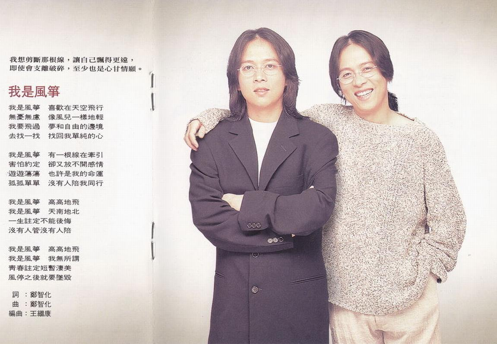

## 導引

我想剪斷那根線，讓自己飄得更遠，  
即時會支離破碎，至少也是心甘情願。

## 歌詞

我是風箏 喜歡在天空飛行  
無憂無慮 像風兒一樣地輕  
我要飛過 夢和自由的邊境  
去找一找 找回我單純的心

我是風箏 有一根線在牽引  
害怕約定 卻又放不開感情  
遊遊蕩蕩 也許是我的命運  
孤孤單單 沒有人陪我同行

我是風箏 高高地飛  
我是風箏 天南地北  
一生註定不能後悔  
沒有人管沒有人陪

我是風箏 高高地飛  
我是風箏 我無所謂  
青春註定短暫悽美  
風停之後就要墜毀

# 永遠的自由

0630-10169-2-05

作詞：李子恆  
作曲：吳大衛  
編曲：王繼康

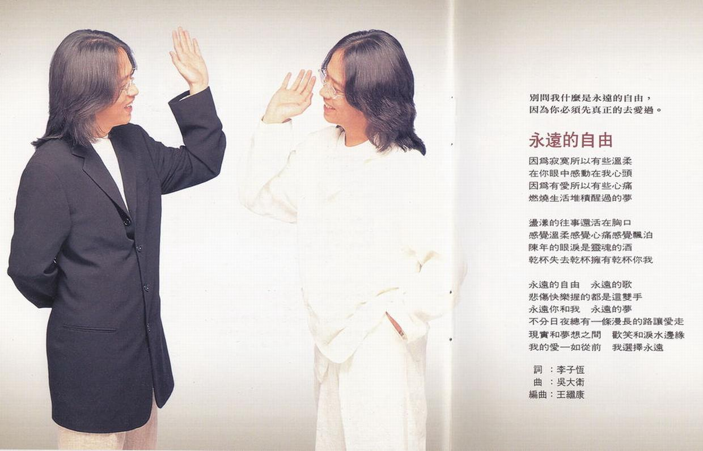

## 導引

別問我什麼是永遠的自由，  
因爲你必須先真正的去愛過。

## 歌詞

因爲寂寞所以有些溫柔  
在你眼中感動在我心頭  
因爲有愛所以有些心痛  
燃燒生活堆積醒過的夢

盪漾的往事還活在胸口  
感覺溫柔感覺心痛感覺飄泊  
陳年的眼淚是靈魂的酒  
乾杯失去幹杯擁有乾杯你我

永遠的自由 永遠的歌  
悲傷快樂握的都是這雙手  
永遠你和我 永遠的夢  
不分日夜總有一條漫長的路讓愛走  
現實和夢想之間 歡笑和淚水邊緣  
我的愛一如從前 我選擇永遠

# 執著（張雨生，陶晶瑩 合唱）

0630-10169-2-06

作詞：陳樂融  
作曲：吳大衛  
編曲：王繼康  
MV 導演：張榮貴

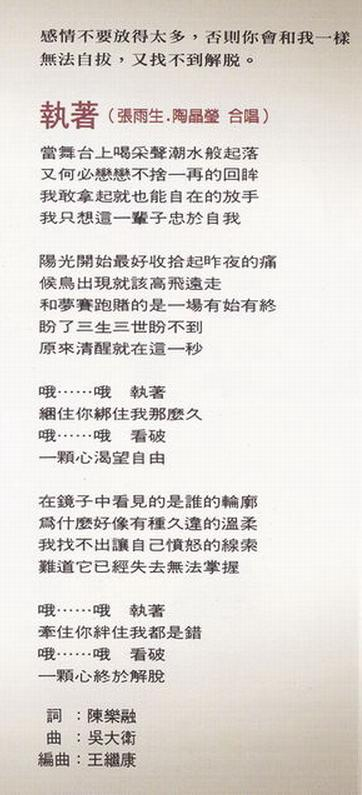

## 導引

感情不要放得太多，否則你會和我一樣  
無法自拔，又找不到解脫。

## 歌詞

當舞臺上喝采聲潮水般起落  
又何必戀戀不捨一再的回眸  
我敢拿起就也能自在的放手  
我只想這一輩子忠於自我

陽光開始最好收拾起昨夜的痛  
候鳥出現就該高飛遠走  
和夢賽跑賭的是一場有始有終  
盼了三生三世盼不到  
原來清醒就在這一秒

哦……哦 執著  
捆住你綁住我那麼久  
哦……哦 看破  
一顆心渴望自由

在鏡子中看見的是誰的輪廓  
爲什麼好像有種久違的溫柔  
我找不出讓自己憤怒的線索  
難道它已經失去無法掌握

哦……哦 執著  
牽住你絆住我都是錯  
哦……哦 看破  
一顆心終於解脫

# 我什麼都願意給

0630-10169-2-07

作詞：陳家麗  
作曲：黃怡  
編曲：王繼康

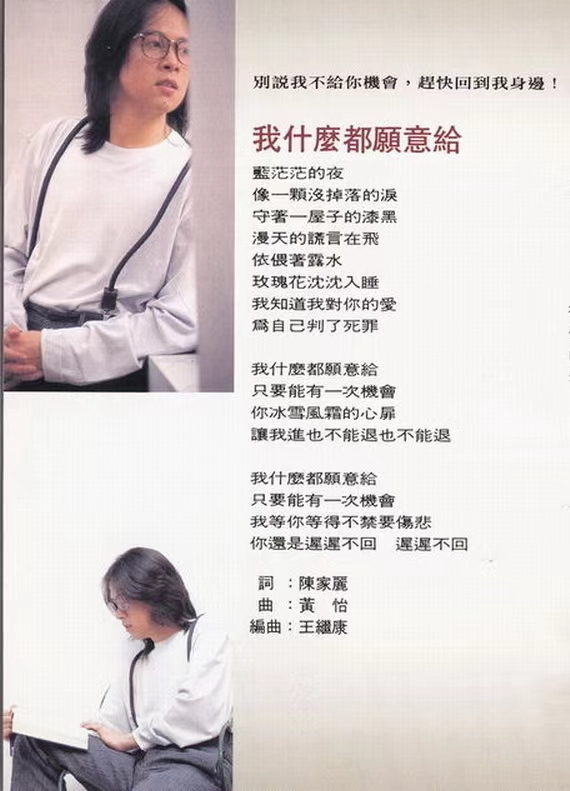

## 導引

別說我不給你機會，趕快回到我身邊！

## 歌詞

藍茫茫的夜 像一顆沒掉落的淚  
守著一屋子的漆黑 漫天的謊言在飛  
依偎著露水 玫瑰花沉沉入睡  
我知道我對你的愛 爲自己判了死罪

我什麼都願意給 只要能有一次機會  
你冰雪風霜的心扉  
讓我進也不能退也不能退

我什麼都願意給 只要能有一次機會  
我等你等得不禁要傷悲  
你還是遲遲不回 遲遲不回

# 一生陪你走

0630-10169-2-08

作詞：星期三  
作曲：錢幽蘭  
編曲：王繼康

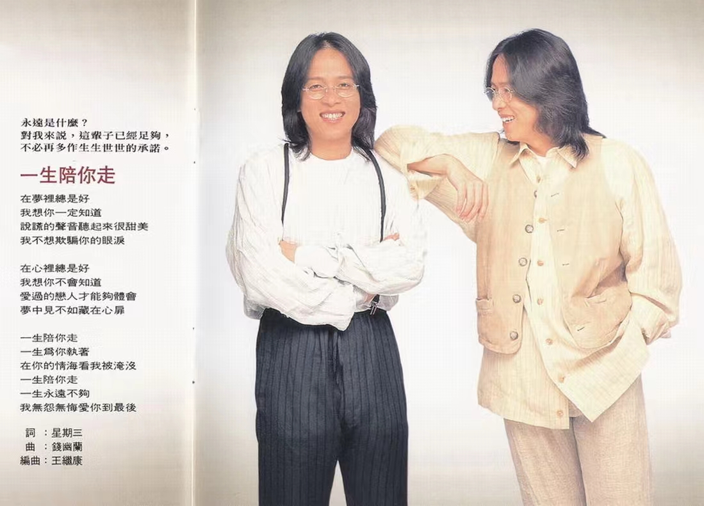

## 導引

永遠是什麼？  
對我來說，這輩子已經足夠，  
不必再多作生生世世的承諾。

## 歌詞

在夢裏總是好 我想你一定知道  
說謊的聲音聽起來很甜美  
我不想欺騙你的眼淚

在心裏總是好 我想你不會知道  
愛過的戀人才能夠體會  
夢中見不如藏在心扉

一生陪你走 一生爲你執著  
在你的情海看我被淹沒  
一生陪你走 一生永遠不夠  
我無怨無悔愛你到最後

# 愛做夢的孩子

0630-10169-2-09

作詞：鄭淑妃  
作曲：羅吉鎮  
編曲：王繼康

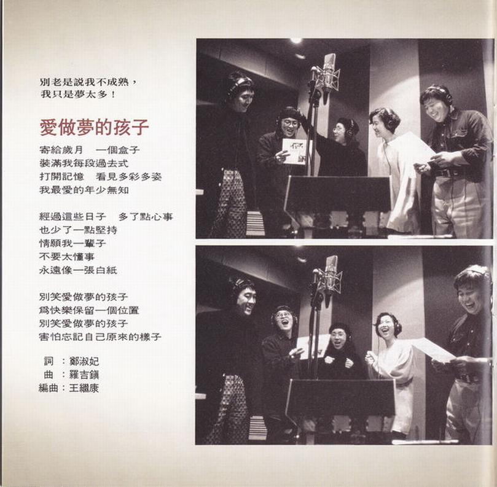

## 導引

別老是說我不成熟，  
我只是夢太多！

## 歌詞

寄給歲月 一個盒子  
裝滿我每一段[^1] 過去式  
打開記憶 看見多彩多姿  
我最愛的年少無知

經過這些日子 多了點心事  
也多[^2]了一點堅持  
情願我一輩子 不要太懂事  
永遠像一張白紙

別笑愛做夢的孩子  
爲快樂保留一個位置  
別笑愛做夢的孩子  
害怕忘記自己原來的樣子

經過這些日子 多了點心事  
也少了一點堅持  
情願我一輩子 不要太懂事  
永遠像一張白紙

# 別放棄希望（“六個朋友”[^3]友情演出）

0630-10169-2-10

作詞：張雨生  
作曲：楊新玲  
編曲：王繼康

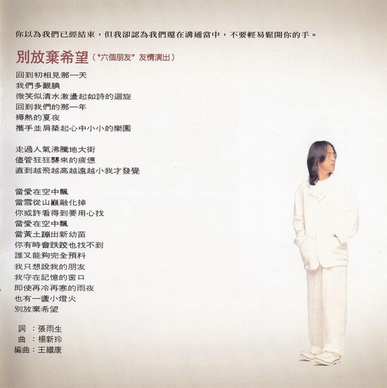

## 導引

你以爲我們已經結束，但我卻認爲我們還在溝通當中，不要輕易鬆開你的手。

## 歌詞

回到初相見那一天 我們多靦腆  
微笑似清水激盪起如詩的迴旋  
回到我們的那一年 褥熱的夏夜  
攜手並肩築起心中小小的樂園  
走過人氣沸騰的[^4]大街  
儘管狂狂襲來的疲憊  
直到越飛越高越遠越小我才發覺

當愛在空中飄 當雪從山巔融化掉  
你或許看得到要用心找  
當愛在空中飄 當黃土蹦出新幼苗  
你有時會跌跤也找不到  
誰又能夠完全預料

我只想說我的朋友 我守在記憶的窗口  
即使再冷再寒的雨夜 也有一盞小燈火  
別放棄希望

# 製作團隊

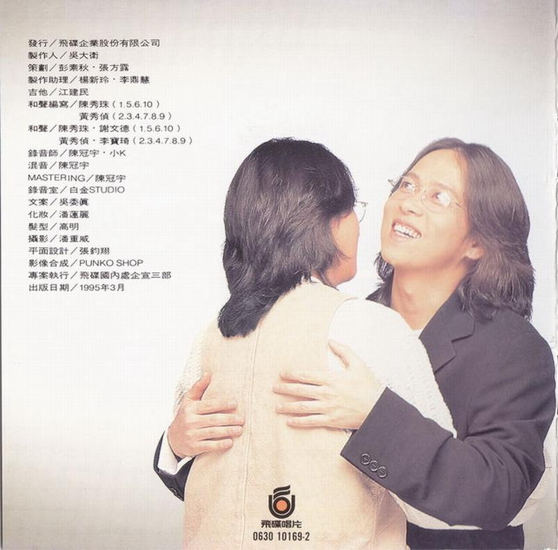

|   負責    |                          人員/資訊                          |
| :-------: | :---------------------------------------------------------: |
|   發行    |                    飛碟企業股份有限公司                     |
|  製作人   |                           吳大衛                            |
|   策劃    |                       彭素秋・張方露                        |
| 製作助理  |                       楊新玲・李鼎慧                        |
|   吉他    |                           江建民                            |
| 和聲編寫  |         陳秀珠（1.5.6.10） 黃秀偵（2.3.4.7.8.9）         |
|   和聲    | 陳秀珠・謝文德（1.5.6.10） 黃秀偵・李寶琦（2.3.4.7.8.9） |
|  錄音師   |                        陳冠宇・小 K                         |
|   混音    |                           陳冠宇                            |
| MASTERING |                           陳冠宇                            |
|  錄音室   |                         白金 STUDIO                         |
|   文案    |                           吳委真                            |
|   化妝    |                           潘蓮麗                            |
|   髮型    |                            高明                             |
|   攝影    |                           潘重威                            |
| 平面設計  |                           張鈞翔                            |
| 影像合成  |                         PUNKO SHOP                          |
| 專案執行  |                     飛碟國內處企宣三部                      |
| 出版日期  |                        1995 年 3 月                         |

飛碟唱片  
0630 10169-2

整理：向晚  
校對：露水

[^1]: 歌詞本顯示“每段”
[^2]: 歌詞本顯示“少”，雨生第一段唱的是“多”
[^3]: 六個朋友：一起到飛碟唱片的另外 6 位新人，分別是：娃娃，紐大可，孫向瑩，陳本瑜，知己二重唱（曾寶明，吳志華），曾於 1988 年 5 月共同出過一張專輯《6 個朋友》
[^4]: 歌詞本顯示“地”
