# 白色才情

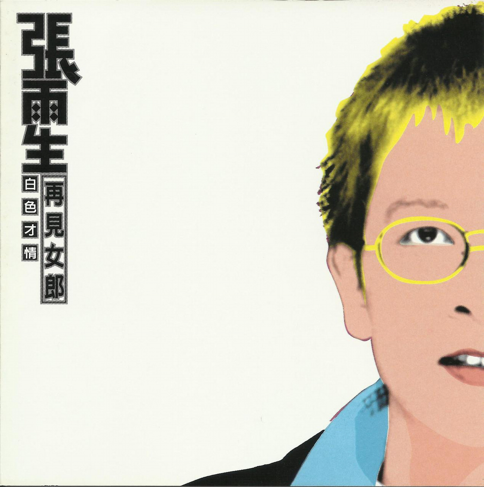

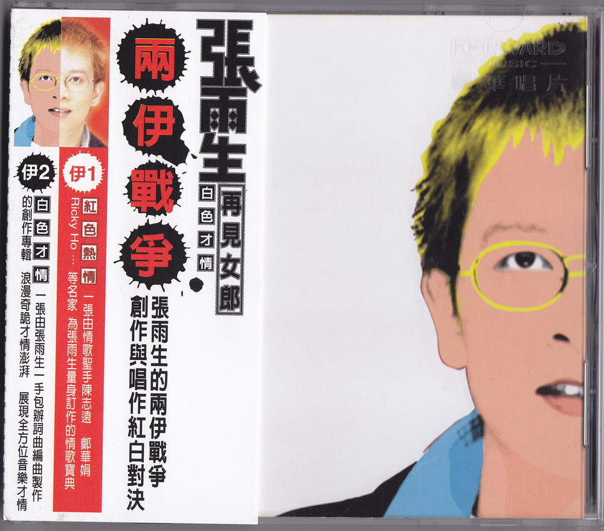

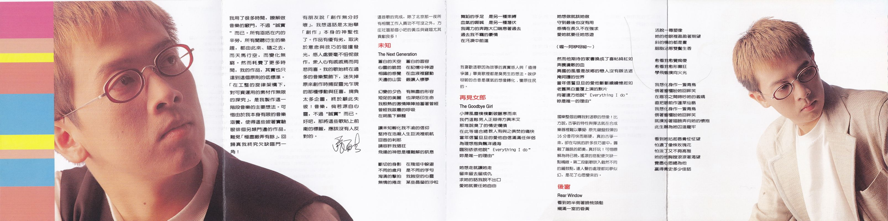

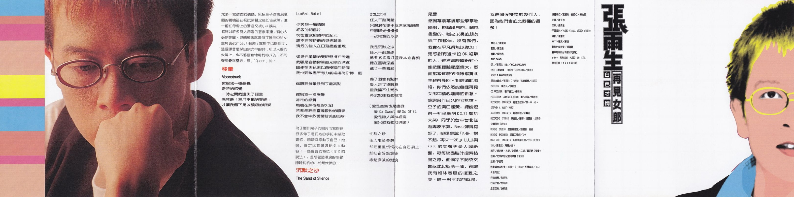

# 文案

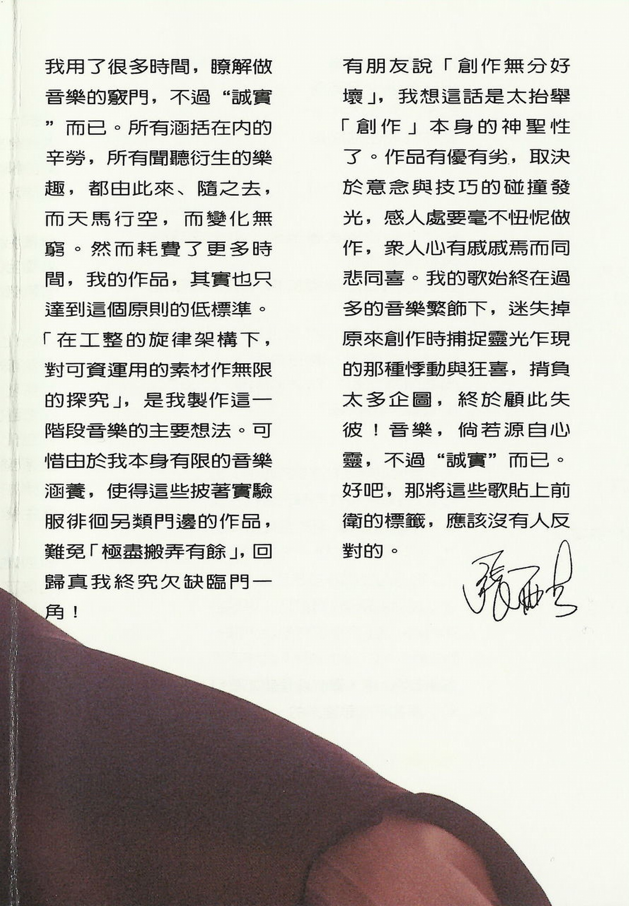

我用了很多時間，瞭解做音樂的竅門，不過“誠實”而已。所有涵括在內的辛勞，所有聞聽衍生的樂趣都由此來、隨之去，而天馬行空，而變化無窮。然而耗費了更多時間，我的作品，其實也只達到這個原則的低標準。「在工整的旋律架構下，對可資運用的素材作無限的探究」，是我製作這一階段音樂的主要想法。可惜由於我本身有限的音樂涵養，使得這些披著實驗服徘徊另類門邊的作品，難免「極盡搬弄有餘」，回歸真我終究欠缺臨門一角！

有朋友說「創作無分好壞」，我想這話是太抬舉「創作」本身的神聖性了。作品有優有劣，取決於意念與技巧的碰撞發光，感人處要毫不忸怩做作，衆人心有戚戚焉而同悲同喜。我的歌始終在過多的音樂繁飾下，迷失掉原來創作時捕捉靈光乍現的那種悸動與狂喜，揹負太多企圖，終於顧此失彼！音樂，倘若源自心靈，不過"誠實"而已。好吧，那將這些歌貼上前衛的標籤，應該沒有人反對的。

張雨生

# 未知 (The Next Generation)

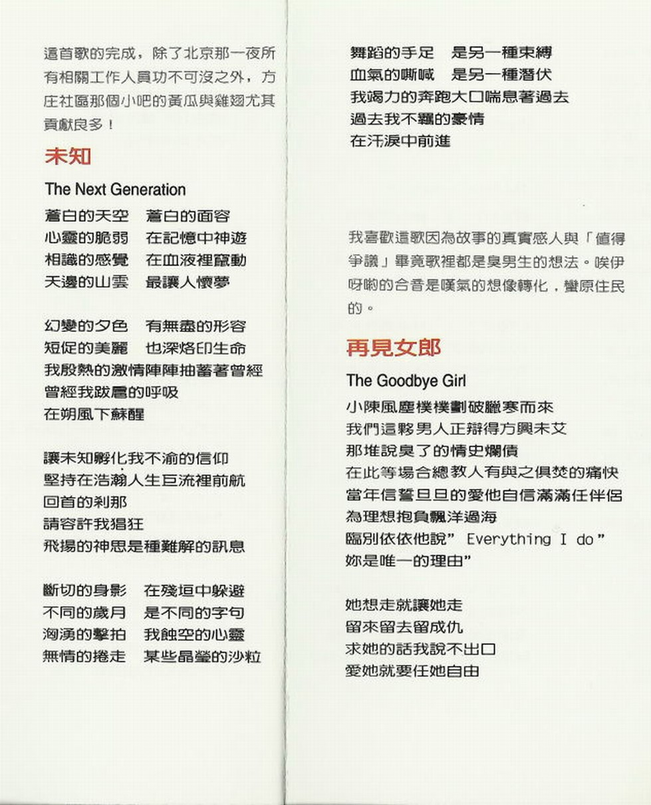

## 導引

這首歌的完成，除了北京那一夜所有相關工作人員功不可沒之外，方莊社區那個小吧的黃瓜與雞翅尤其貢獻良多！

## 歌詞

蒼白的天空 蒼白的面容  
心靈的脆弱 在記憶中神遊  
相識的感覺 在血液裏竄動  
天邊的山雲 最讓人懷夢

幻變的夕色 有無盡的形容  
短促的美麗 也深烙印生命  
我殷熱的激情陣陣抽蓄著曾經  
曾經我跋扈的呼吸  
在朔風下甦醒

讓未知孵化我不渝的信仰  
堅持在浩瀚人生巨流裏前航  
回首的剎那  
請容許我猖狂  
飛揚的神思 是種難解的訊息

斷切的身影 在殘垣中躲避  
不同的歲月 是不同的字句  
洶湧的擊拍 我蝕空的心靈  
無情的捲走 某些晶瑩的沙粒

舞蹈的手足 是另一種束縛  
血氣的嘶喊 是另一種潛伏  
我竭力的奔跑大口喘息著過去  
過去我不羈的豪情  
在汗淚中前進

# 再見女郎 (The Goodbye Girl)

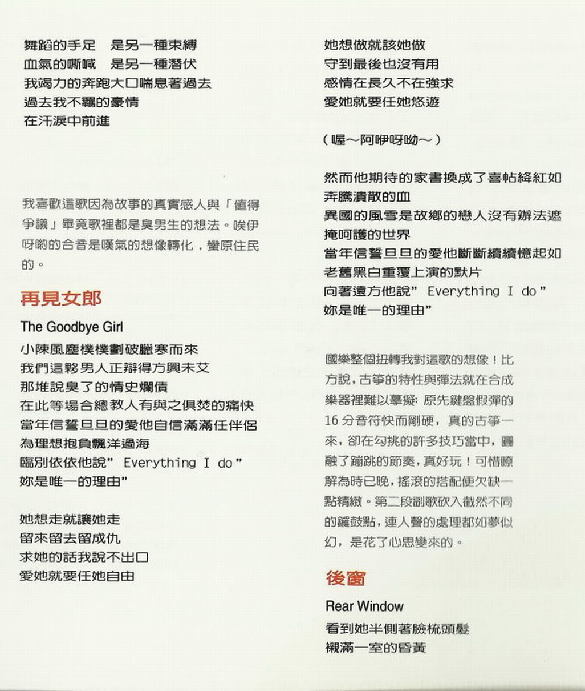

## 導引

我喜歡這歌因爲故事的真實感人與「值得爭議」畢竟歌裏都是臭男生的想法。唉伊呀呦的合音是嘆氣的想像轉化，蠻原住民的。

## 歌詞

小陳風塵僕僕劃破臘寒而來  
我們這夥男人正辯得方興未艾  
那堆說臭了的情史爛債  
在此等場合 總教人有與之俱焚的痛快  
當年信誓旦旦的愛他自信滿滿任伴侶  
爲理想抱負飄洋過海  
臨別依依他說“Everything I do”  
妳是唯一的理由”

她想走就讓她走  
留來留去留成仇  
求她的話我說不出口  
愛她就要任她自由

她想做就該她做  
守到最後也沒有用  
感情在長久不在強求  
愛她就要任她悠遊

（喔～阿咿呀呦～）

然而他期待的家書換成了喜帖絳紅如  
奔騰潰散的血  
異國的風雪是故鄉的戀人沒有辦法遮  
掩呵護的世界  
當年信誓旦旦的愛他斷斷續續憶起如  
老舊黑白重複上演的默片  
向著遠方他說“Everything I do”  
妳是唯一的理由”

# 後窗 (Rear Window)

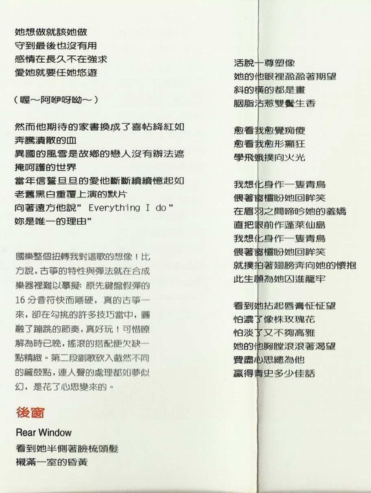

## 導引

國樂整個扭轉我對這歌的想像！比方說，古箏的特性與彈法就在合成樂器裏難以摹擬；原先鍵盤假彈的 16 分音符快而剛硬，真的古箏一來，卻在勾挑的許多技巧當中，圓融了蹦跳的節奏，真好玩！可惜瞭解爲時已晚，搖滾的搭配便欠缺一點精緻。第二段副歌砍入截然不同的鑼鼓點，連人聲的處理都如夢似幻，是花了心思變來的。

## 歌詞

看到她半側著臉梳頭髮  
襯滿一室的昏黃  
活脫一尊塑像  
她的他眼裏盈盈著期望  
斜的橫的都是畫  
胭脂沾惹雙鬢生香

愈看我愈覺癡傻  
愈看我愈形癲狂  
學飛蛾撲向火光

我想化身作一隻青鳥  
偎著窗欞盼她回眸笑  
在眉羽之間啼吟她的羞嬌  
直把眼前作蓬萊仙島  
我想化身作一隻青鳥  
偎著窗欞盼她回眸笑  
就撲抽著翅膀奔向她的懷抱  
此生願爲她囚進籠牢

看到她拈起脣膏怔怔望  
怕濃了像株玫瑰花  
怕淡了又不夠高雅  
她的他胸膛滾滾著渴望  
費盡心思總爲他  
贏得青史多少佳話

# 發暈 (Moonstruck)

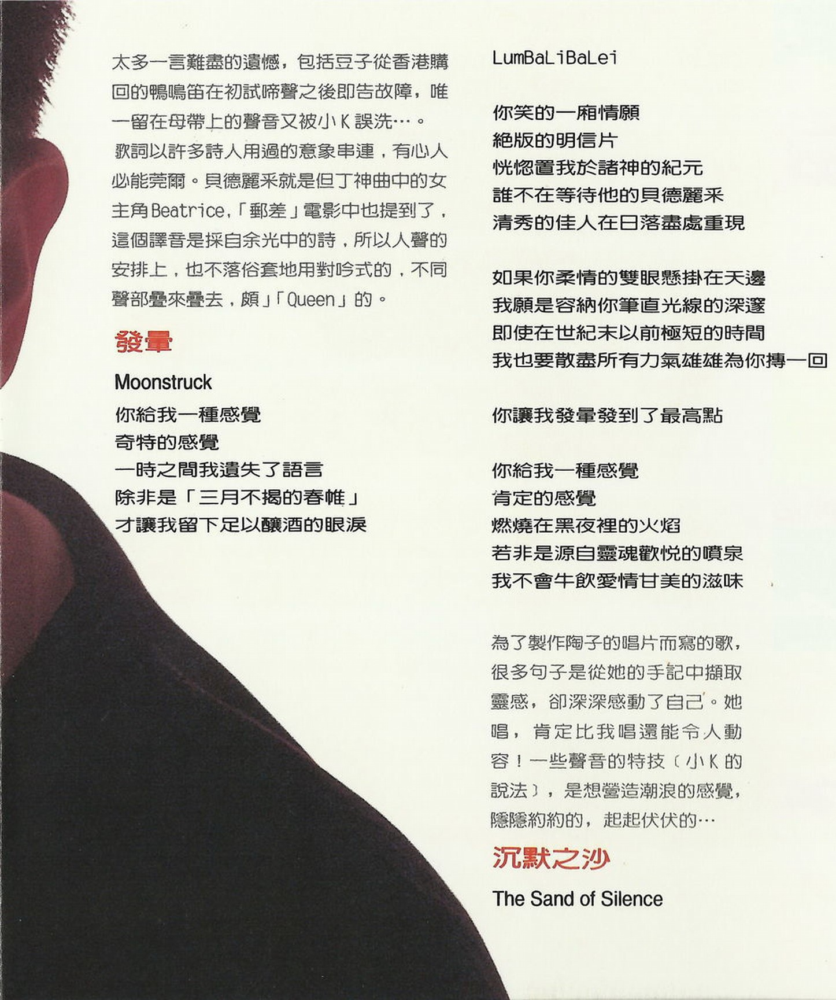

## 導引

太多一言難盡的遺憾，包括豆子從香港購回的鴨鳴笛在初試啼聲之後即告故障，唯一留在母帶上的聲音又被小 K 誤洗…。  
歌詞以許多詩人用過的意象串連，有心人必能莞爾。貝德麗採就是但丁神曲中的女主角 Beatrice，「郵差」電影中也提到了，這個譯音是採自余光中的詩，所以人聲的安排上，也不落俗套地用對吟式的，不同聲部疊來疊去，頗「Queen」的[^1]。

## 歌詞

你給我一種感覺  
奇特的感覺  
一時之間我遺失了語言  
除非是「三月不揭的春帷」[^2]  
才讓我留下足以釀酒的眼淚

LumBaLiBaLei

你笑的一廂情願  
絕版的明信片  
恍惚置我於諸神的紀元  
誰不在等待他的貝德麗採  
清秀的佳人在日落盡處重現

如果你柔情的雙眼懸掛在天邊  
我願是容納你筆直光線的深邃  
即使在世紀末以前極短的時間  
我也要散盡所有力氣雄雄爲你搏一回

你讓我發暈發到了最高點

你給我一種感覺  
肯定的感覺  
燃燒在黑夜裏的火焰  
若非是源自靈魂歡悅的噴泉  
我不會牛飲愛情甘美的滋味

# 沉默之沙 (The Sand Of Silence)

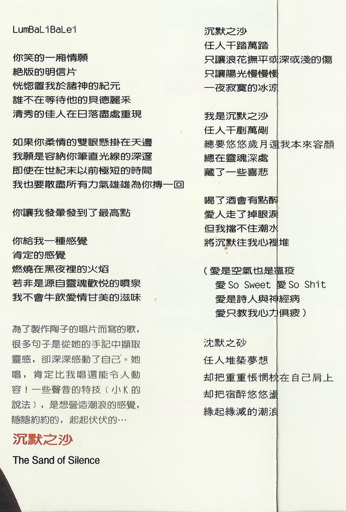

## 導引

爲了製作陶子的唱片而寫的歌，很多句子是從她的手記中擷取靈感，卻深深感動了自己。她唱，肯定比我唱還能令人動容！一些聲音的特技（小 K 的說法），是想營造潮浪的感覺，隱隱約約的，起起伏伏的…

## 歌詞

沉默之沙  
任人千踏萬踏  
只讓浪花撫平或深或淺的傷  
只讓陽光慢慢慢  
一夜寂寞的冰涼

我是沉默之沙  
任人千鏟萬剮  
總要悠悠歲月還我本來容顏  
總在靈魂深處  
藏了一些喜悲

喝了酒會有點醉  
愛人走了掉眼淚  
但我擋不住潮水  
將沉默往我心裏堆

（愛是空氣也是瘟疫  
愛 So Sweet 愛 So Shit  
愛是詩人與神經病  
愛只教我心力俱疲）

沉默之砂  
任人堆築夢想  
卻把重重悵惘枕在自己肩上  
卻把宿醉悠悠盪  
緣起緣滅的潮浪

# 致謝

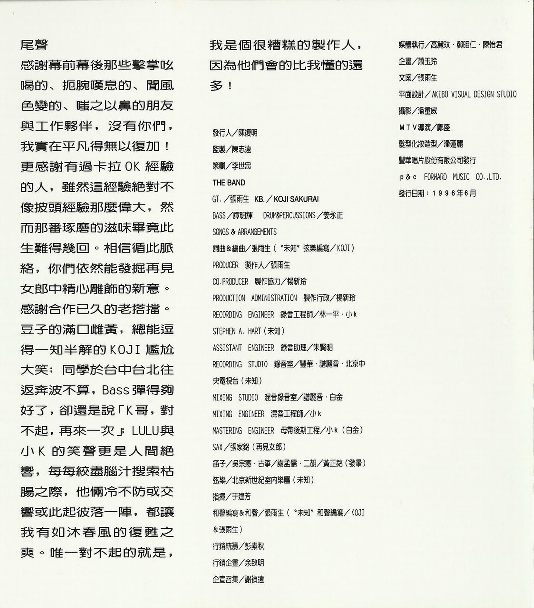

尾聲

感謝幕前幕後那些擊掌吆喝的、扼腕嘆息的、聞風色變的、嗤之以鼻的朋友與工作夥伴，沒有你們，我實在平凡得無以復加！更感謝有過卡拉 OK 經驗的人，雖然這經驗絕對不像披頭經驗那麼偉大，然而那番琢磨的滋味畢竟此生難得幾回。相信循此脈絡，你們依然能發掘再見女郎中精心雕飾的新意。  
感謝合作已久的老搭檔。豆子的滿口雌黃，總能逗得一知半解的 KOJI 尷尬大笑；同學於臺中臺北往返奔波不算，Bass 彈得夠好了，卻還是說「K 哥，對不起，再來一次」；LULU 與小 K 的笑聲更是人間絕響，每每絞盡腦汁搜索枯腸之際，他倆冷不防或交響或此起彼落一陣，都讓我有如沐春風的復甦之爽。唯一對不起的就是，我是個很糟糕的製作人，因爲他們會的比我懂的還多！

# 製作團隊

|  負責  |  人員  |
| :----: | :----: |
| 發行人 | 陳復明 |
|  監製  | 陳志遠 |
|  策劃  | 李世忠 |

THE BAND

|       負責       |     人員     |
| :--------------: | :----------: |
|       GT.        |    張雨生    |
|       KB.        | KOJI SAKURAI |
|       BASS       |    譚明輝    |
| DRUM&PERCUSSIONS |    姜永正    |

SONS&ARRANGEMENTS

|                負責                |                  人員                  |
| :--------------------------------: | :------------------------------------: |
|             詞曲&編曲              |                 張雨生                 |
|           “未知”絃樂編寫           |                  KOJI                  |
|          PRODUCER 製作人           |                 張雨生                 |
|        CO.PRODUCER 製作協力        |                 楊新玲                 |
| PRODUCTION ADMINISTRATION 製作行政 |                 楊新玲                 |
|   RECORDING ENGINEER 錄音工程師    | 林一平 · 小 K · STEPHEN A. HART (未知) |
|    ASSISTANT ENGINEER 錄音助理     |                 朱賢明                 |
|      RECORDING STUDIO 錄音室       | 豐華 · 譜麗音 · 北京中央電視臺（未知） |
|      MIXING STUDIO 混音錄音室      |              譜麗音· 白金              |
|     MIXING ENGINEER 混音工程師     |                  小 K                  |
|  MASTERING ENGINEER 母帶後期工程   |              小 K（白金）              |
|                SAX                 |           張家銘（再見女郎）           |
|                笛子                |                 吳宗憲                 |
|                古箏                |                 謝孟儒                 |
|                二胡                |             黃正銘（發暈）             |
|                絃樂                |       北京新世紀室內樂團（未知）       |
|                指揮                |                 於建芳                 |
|           和聲編寫&和聲            |                 張雨生                 |
|           “未知”和聲編寫           |              KOJI&張雨生               |
|              營銷統籌              |                 彭素秋                 |
|              營銷企畫              |                 餘致明                 |
|              企宣召集              |                 謝禎遠                 |
|              媒體執行              |        高麗玟 · 鄭昭仁 · 陳怡君        |
|                企畫                |                 蕭玉玲                 |
|                文案                |                 張雨生                 |
|              平面設計              |       AKIBO VISUAL DESIGN STUDIO       |
|                攝影                |                 潘重威                 |
|              MTV 導演              |            鄺盛（再見女郎）            |
|            髮型化妝造型            |                 潘蓮麗                 |

豐華唱片股份有限公司發行  
P&C FORWARD MUSIC CO.LTD.

發行日期：1996 年 6 月

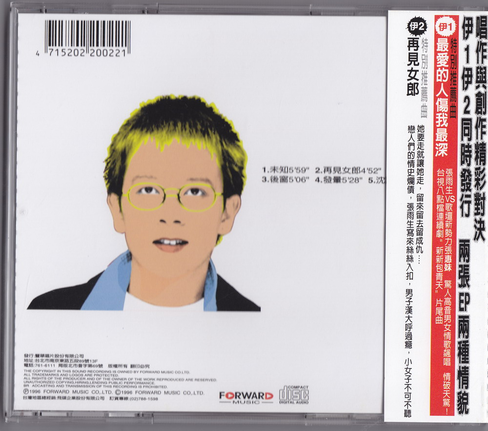

[^1]: 原作“頗」「Queen」”，多打了一個引號。
[^2]: 出自鄭愁予的《錯誤》。
