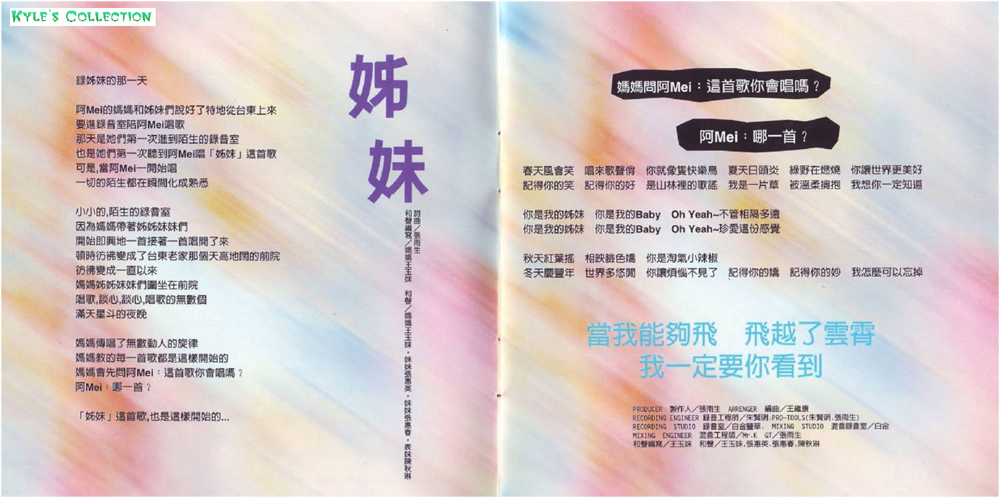
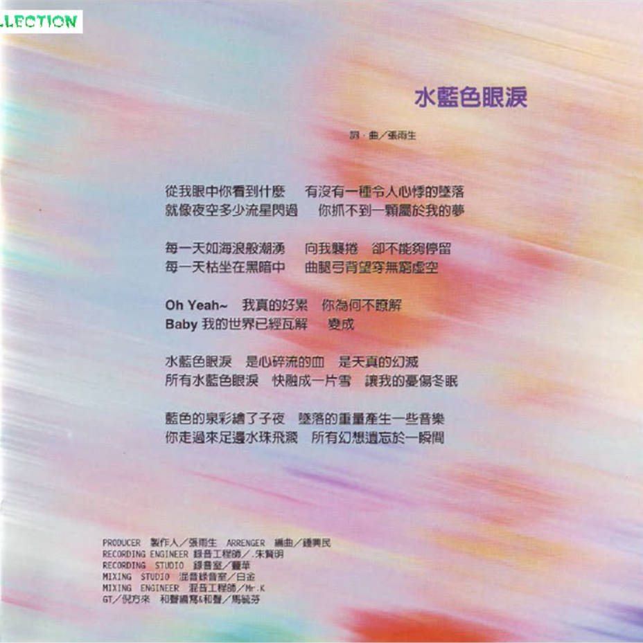

# 姊妹

# 姊妹

詞曲：張雨生  
和聲編寫：媽媽王玉妹  
和聲：媽媽王玉妹，妹妹張惠英，妹妹張惠春，表妹陳秋琳

## 導引

錄姊妹的那一天

阿 Mei 的媽媽和姊妹們說好了特地從台東上來  
要進錄音室陪阿 Mei 唱歌  
那天是她們第一次進到陌生的錄音室  
也是她們第一次聽到阿 Mei 唱「姊妹」這首歌  
可是，當阿 Mei 一開始唱  
一切的陌生都在瞬間化成熟悉

小小的，陌生的錄音室  
因爲媽媽帶著姊姊妹妹們  
開始即興地一首接著一首唱開了來  
頓時彷彿變成了台東老家那個天高地闊的前院  
彷彿變成一直以來  
媽媽姊姊妹妹們圍坐在前院  
唱歌，談心，談心，唱歌的無數個  
滿天星斗的夜晚

媽媽傳唱了無數動人的旋律  
媽媽教的每一首歌都是這樣開始的  
媽媽會先問阿 Mei：這首歌你會唱嗎？  
阿 Mei：哪一首？

「姊妹」這首歌，也是這樣開始的

## 歌詞

春天風會笑 唱來歌聲俏 你就像只快樂鳥 夏天日頭炎 綠野在燃燒 你讓世界更美好  
記得你的笑 記得你的好 是山林裡的歌謠 我是一片草 被溫柔擁抱 我想你一定知道

你是我的姐妹 你是我的 Baby Oh Yeah ～ 不管相隔多遠  
你是我的姐妹 你是我的 Baby Oh Yeah ～ 珍愛這份感覺

秋天紅葉搖 相映臉色嬌 你是淘氣小辣椒  
冬天慶豐年 世界多悠閒 你讓煩惱不見了 記得你的嬌 記得你的妙 我怎麼可以忘掉

當我能夠飛 飛越了雲霄 我一定要你看到

## 製作團隊

|             負責              |           人員 / 工作室            |
| :---------------------------: | :--------------------------------: |
|        PRODUCER 製作人        |               張雨生               |
|         ARRANGER 編曲         |               王繼康               |
| RECORDING ENGINEER 錄音工程師 | 朱賢明.PRO-TOOLS（朱賢明，張雨生） |
|    RECORDING STUDIO 錄音室    |              白金豐華              |
|   MIXING STUDIO 混音錄音室    |                白金                |
|  MIXING ENGINEER 混音工程師   |                Mr.K                |
|              GT               |               張雨生               |
|           和聲編寫            |               王玉妹               |
|             和聲              |   王玉妹，張惠英，張惠春，陳秋琳   |

# 水藍色眼淚

詞曲：張雨生

從我眼中你看到什麼 有沒有一種令人心悸的墜落  
就像夜空多少流星閃過 你抓不到一顆屬於我的夢

每一天如海浪般潮湧 向我襲捲 卻不能夠停留  
每一天枯坐在黑暗中 曲腿弓背望穿無窮虛空

Oh Yeah~ 我真的好累 你爲何不瞭解  
Baby 我的世界已經瓦解 變成

水藍色眼淚 是心碎流的血 是天真的幻滅  
所有水藍色眼淚 融成一片雪 讓我的憂傷冬眠

藍色的泉彩繪了子夜 墜落的重量產生一些音樂  
你走過來足邊水珠飛濺 所有幻想遺忘於一瞬間

|             負責              | 人員/工作室 |
| :---------------------------: | :---------: |
|             詞曲              |   張雨生    |
|        PRODUCER 製作人        |   張雨生    |
|         ARRANGER 編曲         |   鍾興民    |
| RECORDING ENGINEER 錄音工程師 |   朱賢明    |
|    RECORDING STUDIO 錄音室    |    豐華     |
|   MIXING STUDIO 混音錄音室    |    白金     |
|  MIXING ENGINEER 混音工程師   |    Mr.K     |
|              GT               |   倪方來    |
|         和聲編寫&和聲         |   馬毓芬    |

頁面缺陷：

-   需要更清晰的封面
