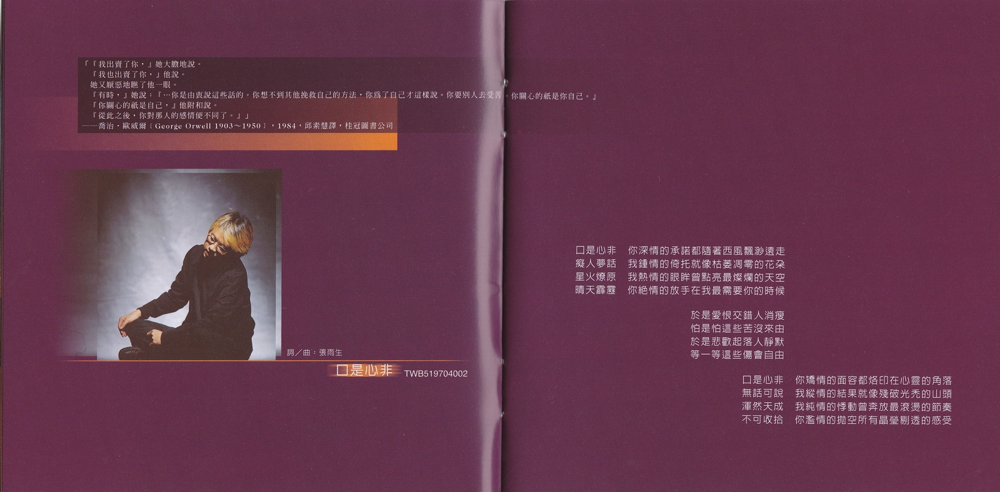
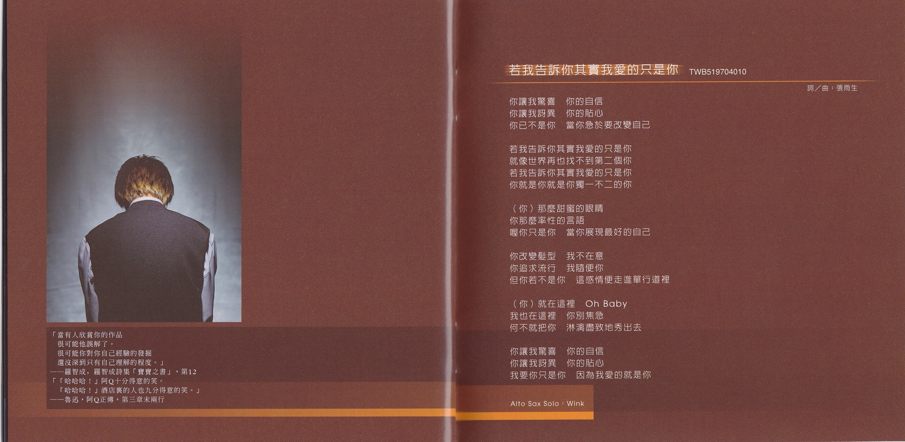
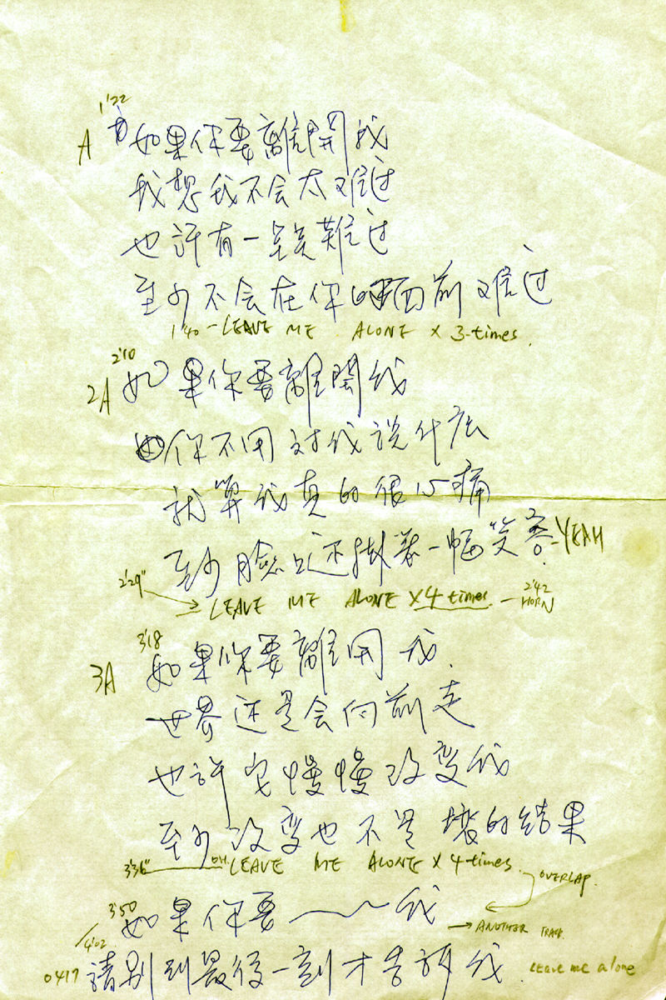
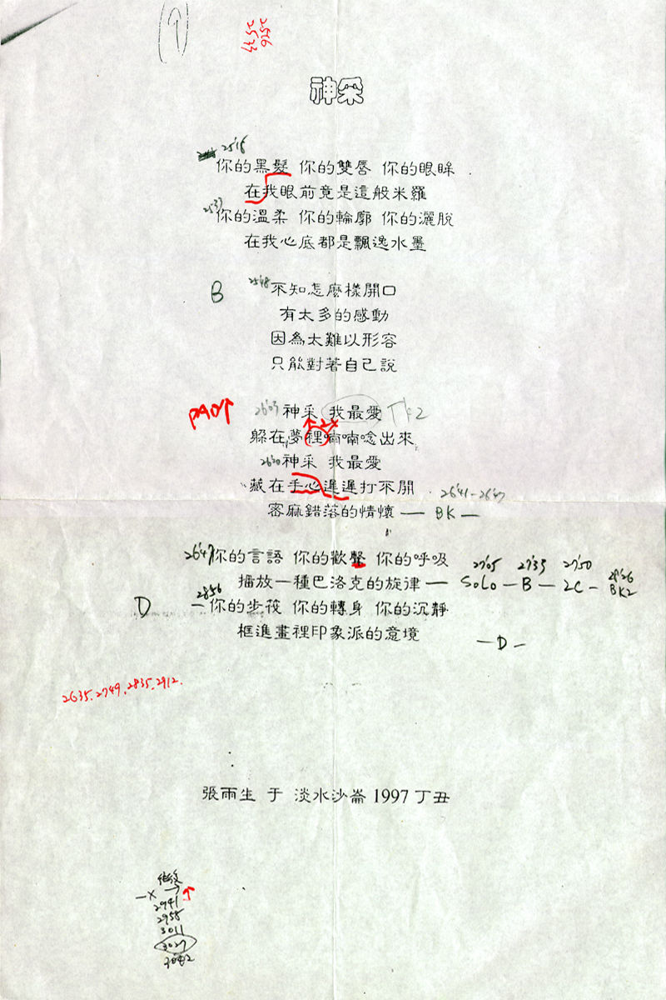

# 口是心非

# 文案

這兩年，我都在淡水。朋友告訴我很多好玩的、好吃的、好看的、有趣的地方，有些我去過，有些沒有；大半時間，我執意守在面海的一方小天地裡，與這裡的朝暉夕暈一同呼吸。常常，藍得發亮的天空一早讓我來不及揉開睡眼惺鬆，驚喜不已的一躍而起！一放眼望盡海天之際，層層白雲作弄千奇百怪的造型，清風徐來，更伴著一片綠茸茸的草浪夾帶四溢的原野純香，那一刻，真教人不爽快大喝一聲不行！但是，也有冬夜遠從地球另一端來緊緊貼在窗外猙獰咆哮的狂風，「使天地戰慄如同發了瘧疾」[^1]，那一刻，不著魔似的隨之亂舞一陣亦不得也！於是我下放所有情感的起落，又謳歌所有愛戀的絕美。屬於荒謬的罪愆，任由子夜銀白如洗的月色潔淨；屬於神祕的口訣，便在夕陽金芒散盡的瞬間領略；屬於糾纏不清的、似懂非懂、欲語還休的、交叉質詢、欲辯忘言的、泛激情的、泛道德的種種，就丟給天龍八部裡的無名老僧吧。

關於音樂，陳復明老師說：「這一次，聽得出來每一個人都進步了。」我想這是很中肯的評斷。我與這幾個樂手合作了許多片子，把玩過數十首不同曲式的歌曲，這一次，我覺得大家的質感確實很統一。偉大的大提琴家卡薩爾斯（Pablo Casals）曾說：「世人說我拉琴像小鳥唱歌一樣輕鬆，他們才不知道想讓這隻小鳥唱得好要花多少的工夫在其中！」我們花的工夫當然沒他多，但是我相信至少聽起來像只鳥在唱歌。這幾個月算是我踏進這個圈子以來，最忙碌的一段時間。果陀的音樂劇，我的唱片，其他人的唱片，相互混亂，相互影響。從邊「綠酒開芳顏」邊工作中，我體會到很多事情，也見識了自己先天上的諸般頑劣，而不努力者恆被淘汰的鐵則，更是血淋淋被不斷辯證著。嚴格來說，「超越」，是我這次做唱片時最先考慮的事情。其次，是「誠實」。至於那些主不主流、另不另類、新不新潮、前不前衛的問題，我不需要也不想要僭越地代媒體界定。聽聽約翰·藍農（John Lennon）的憤憤不平，「這整個音樂商業真是恐怖至極，完全是他媽的屈辱生涯！一個人必須徹底地羞辱自己，才能達到『披頭四』過去的地位，而那正是我所深惡痛絕的…」或許，對於聆聽者，我只想證明我完成了我的專輯。不管飛龍在天或是龍歸大海，我盡過全力。雖然這些一年多來，小兒小女式的生命雜記，泰半浮之於多愁善感的詞彙表皮，所謂「內行人看門道，外行人看熱鬧」，大可各取所需。哥德藉浮士德的口說「靈界並不關閉：只是你的感覺閉塞，你的心死滅！」，打開塵封你們赤子之心的瓶蓋吧，讓沉淪的世紀末「叭的放出光芒」！

最後，以洪醒夫在小說「散戲」裡秀潔的話，與天下有心人共勉，「不管有沒有觀衆，戲都應該好好演！」

「戲，就這樣散了」…

張雨生 1997 月全蝕後一日

在黃昏融化了世界的色彩以前，如果你要離開我，玫瑰的名字，隨——你！  
愛情的圖案或是口是心非的神采？  
若我告訴你我愛的只是你，  
CAPPUCCINO 般的河…

# 如果你要離開我

TWB519704001

作詞：張雨生  
作曲：張雨生

## 導引

如果太陽此刻熄滅光茫，地球上的人要八分鐘後才會知道…  
「Beatrice: 『I am gone, though I am here: there is no love in you: nay, I pray you, let me go.』」—— William Shakespeare, Much Ado About Nothing, ACT  
「泉涸，魚相與處於陸，相呴以溼，相濡以沫，不如相忘於江湖。」—— 莊子，大宗師

## 歌詞

如果你要離開我  
我想我不會太難過  
也許有一點點難過  
至少不會在你的面前難過  
Leave me alone

如果你要離開我  
你不用對我說什麼  
就算我真的很心痛  
至少臉上還掛著一幅笑容  
Leave me alone

如果你要離開我  
世界還是會向前走  
也許它慢慢改變我  
至少改變也不是壞的結果  
Leave me alone

如果你要離開我  
如果你要離開我  
如果你要離開  
請別到最後一刻才告訴我  
Leave me alone

# 口是心非

TWB519704002

作詞：張雨生  
作曲：張雨生

## 導引

「『我出賣了你，』她大膽地說。  
『我也出賣了你，』他說。  
她又厭惡地瞧了他一眼。  
『有時，』她說：『…你是由衷說這些話的。你想不到其他挽救自己的方法，你爲了自己才這樣說。你要別人去受苦，你關心的只是你自己。』  
『你關心的只是自己，』他附和說。  
『從此之後，你對那人的感情便不同了。』」  
—— 喬治 · 奧威爾（George Orwell 1903 ~ 1950），1984，邱素慧譯，桂冠圖書公司

## 歌詞

口是心非 你深情的承諾都隨著西風飄渺遠走  
癡人夢話 我鍾情的倚托就像枯萎凋零的花朵  
星火燎原 我熱情的眼眸曾點亮最燦爛的天空  
晴天霹靂 你絕情的放手在我最需要你的時候

於是愛恨交錯人消瘦  
怕是怕這些苦沒來由  
於是悲歡起落人靜默  
等一等這些傷會自由

口是心非 你矯情的面容都烙印在心靈的角落  
無話可說 我縱情的結果就像殘破光禿的山頭  
渾然天成 我純情的悸動曾奔放最滾燙的節奏  
不可收拾 你濫情的拋空所有晶瑩剔透的感受

# Cappuccino

TWB519704003

作詞：張雨生  
作曲：張雨生

## 歌詞

白淨的紙 畫上一個桶子 黑筆圈滿許多心事  
親筆寫上 完成它的日子 順便藏起紛亂情思

時間過得快 愛得太奇怪 回憶頻頻追撞懸浮的未來  
有歡聚有分開有甜蜜有無奈 直到我們一再目送彼此消失於人海之外

你讓我想起那杯 Cappuccino 咖啡 我想我的愚昧都被你容在桶內  
就像散開均勻香味濃郁的肉桂 我想我的眼淚已被你統統看見

白淨的紙 讓我若有所思 若有所失 若有所癡

# 玫瑰的名字

TWB519704004

作詞：張雨生  
作曲：張雨生

## 導引

「啊啊！這一種譬喻，值得什麼？…因爲說得出譬喻得出的悲懷，還不是世上最傷心的事情呀…」[^2]  
—— 郁達夫，郁達夫散文集，頁 59，陽明書局  
「Now I know that good is cause of love and that which is good is defined by knowledge... Now I know, as the doctor says, that love can harm the lover when it is excessive. 」  
—— Umberto Eco, The Name Of The Rose, translated from Italian by William Weaver

## 歌詞

玫瑰多情也多刺 竟與妳似曾相識  
有多少次我嘗試寫首詩  
留下妳那婀娜多姿的樣子  
有時候嬌橫傷人 有時候嬌柔依人  
我只能用最奢侈的玻璃  
爲妳築起不懼風雨的天地

只要能夠陪著妳我都願意  
我就是妳忠實的園丁  
只要能夠想著妳我就歡喜  
即使妳寧可自由自在呼吸那一窗星星

名字背過又忘記 符號充滿了神祕  
原在夢裡忽而又中世紀  
我像聖堂下爲妳禁慾的僧侶

# 河

TWB519704005

作詞：張雨生  
作曲：張雨生  
尾奏左邊吉他狂野即興 / 電鑽特技 Ending session guitar solo on Left side / E.screw driver：黃中嶽

## 導引

「…豹子撲攏去，摸到媚金的額，摸到臉，摸到口：口鼻只剩了微熱…臨死的媚金聽到這話，知道豹子遲來的理由是爲了羊，並不是故意失約了，對於自己在失望中把刀陷進胸膛裡的事是覺得做錯了…豹子是把自己的胸也袒出來了，他去拔刀。陷進去很深的刀是用了很大的力才拔出的。刀一拔出血就湧出來了，豹子全身浴著血。豹子把全是血的刀子扎進自己的胸脯，媚金還能見到就含笑死了…」  
——沈從文，「媚金，豹子，與那羊」，沈從文小說選 Ι，洪範書店

## 歌詞

當你平躺下來 我便成了河  
迴繞你的頸間 在你脣邊乾涸  
竊想你的眼神 我戀戀不捨  
聚爲一泓泉水 深邃清澈

當愛燎原成災 你徐徐側身  
堆積肥沃河床 我是朝聖的人  
我是客途的雁 卻一往情深  
從此無意追逐 新綠的春

任我流吧 層層冰川  
億年換幾吋 我也寧願這麼盼  
等到昏黃 等到癡傻  
等著公主吻青蛙

魔咒緩緩退盡 你笑的厲害  
天曾缺掉的角 無非此等神采  
我將殘翼放下 從河中走來  
你正頷首告知 這裡有愛

# 愛情…

TWB519704006

作曲：張雨生

# …的圖案

TWB519704011

作詞：張雨生  
作曲：張雨生  
Harp Solo 豎琴：解瑄

## 導引

「紀德：『關於床我將對你說什麼呢？』[^3]  
洛夫：『我們躺如雨後的田畝』[^4]  
林燿德：『我們共同躺成半球型的雪』[^5]  
楊喚：『哎，我再也不能入睡，我再也不能入睡。』[^6]  
馮承植：『在一間生疏的房裡，他白晝時是什麼模樣，我們都無從認識，…』[^7]」——詩的對話[^8]  
「但如果你在懼怯中只想尋求愛的平安和愛的愉悅，  
那麼不如遮掩著你的裸體，離開愛的打穀場，進入那無季節的世界，在那兒你將歡笑，但非全心的笑，你將哭泣，卻非盡情的哭。…  
除了成全它自己，愛沒有別的慾望。」  
—— 卡里 · 紀伯倫 (Kahlil Gibran 1883 ~ 1931) ，先知 (The Prophet)，王季慶譯，純文學

## 歌詞

請你給我一個吻吧 我便不會再懼怕  
我將貼身藏起酥麻 拋開所有的牽掛

請你給我一個擁抱 我便情願被燃燒  
我將祕密進行浮雕 歧視所有的依靠

最美麗的季節裡我們初相遇  
就在至高的峯頂我們風化了愛情

請你給我一個眼神 我最癡想的天真  
轉開我發熱的身體 足足地球的半徑

請你給我一個呼喚 我最寵幸的柔軟  
遮蔽我前方的視野 可是愛情的圖案？

請你給我一滴淚水 附著魔咒的甘泉  
當我不慎任她下墜 赤道也疊起了雪

請你給我一種蹙眉 偷火的人也後悔  
要從絢爛走回平凡 才見到愛情的圖案

# 隨你

TWB519704007

作詞：張雨生  
作曲：張雨生  
和聲模擬機 Vocoder：Koji

## 導引

「從民子到雪子對於他的愛的閃電，劃過佐山的心裡。」  
—— 川端康成（1899 ～ 1972），母親初戀的人，伊豆的舞娘 —— 川端康成十五篇短篇精選集，黃玉燕譯  
「"But man is not made for defeat," he said. "A man can be destroyed but not defeated."…  
"Don't think, old man," he said aloud. "Sail on this course and take it when it comes."」  
—— The Old Man and the Sea, Ernest Hemingway, 敦煌書局

## 歌詞

我常常覺得對你充滿了綺想  
這是不是個好現象  
我常常逆向思考對你的需要  
答案仍然是個問號  
當我見到你卻把一切都拋掉不再自尋煩惱  
只想讓每一分一秒都很美妙

於是我每一個動作都是配合你  
我的心隨你牽引隨你歡喜而歡喜  
隨你愛隨你恨隨你一意孤行我都願意  
於是你每一個動作都被我臨摹  
我的夢隨你擁有隨你哀愁而哀愁  
隨你癡隨你怨隨你漫天遨遊我不退縮

我已經到了老大不小的年齡  
這事實一定要認清  
我已經條條列舉衝動的下場  
結果也夠讓我驚嚇  
當我見到你卻把一切都拋掉不再自尋煩惱  
只想讓每一分一秒都很美妙

# 神采

TWB519704008

作詞：張雨生  
作曲：張雨生  
點石成金的 Magic Bell：豆子，Mr.Killer，Koji  
三人合作的手風琴獨奏：Koji，黃國豐，張雨生

## 導引

「更漫長的永晝來臨以前  
讓我 趁著這些微的極光  
看清妳被雪地曬紅的臉」  
—— 林燿德，南極記，銀碗盛雪，洪範書店

## 歌詞

你的黑髮 你的雙脣 你的眼眸  
在我眼前竟是這般米羅  
你的溫柔 你的輪廓 你的灑脫  
在我心底都是飄逸水墨

不知怎麼樣開口 有太多的感動  
因爲太難以形容 只能對著自己說

神采 我最愛  
躲在夢裡喃喃念出來  
神采 我最愛  
藏在手心遲遲打不開  
密麻錯落的情懷

你的言語 你的歡聲 你的呼吸  
播放一種巴洛克的旋律

你的步伐 你的轉身 你的沉靜  
框進畫裡印象派的意境

# 在黃昏融化了世界的色彩以前

TWB519704009

作詞：張雨生  
作曲：張雨生  
禮成：譚明輝  
Wedding Party：張雨生，Koji，姜永正，譚明輝，黃國豐，張惠春，陳秋琳，張淑婷  
反拍“嘿”：張雨生，Koji，黃國豐

## 導引

Note..朋友們頻頻列隊結婚，我也被紅色喜帖炸得不亦樂乎。  
這當然無關乎流行，只是到了年紀。  
從純吃喝鬧酒的賓客，一路做遍招待、司機、甚至伴郎（搞過烏龍、也鬧了笑話），體恤他們在這樣一種透過古老風俗迷信串接的典禮儀式當中，即心力交瘁，又要笑臉迎人的苦處。  
不過，那些笑意畢竟發自肺腑，誠如他們所言，結合是兩個人的事、結婚卻是兩家子人的事。祝福他們！

## 歌詞

在黃昏融化了世界的色彩以前  
我們的情緒達到至美的極限  
當月光歌頌著絕倫的天上詩篇  
我們的歡樂湧現節慶的境界

所以你說你情願放棄自己的那一片天  
所以你說你情願走向生命的另一回圈

相思會醉 愛戀能癡  
無可比擬的激情幾回  
一對指戒 一諾百年  
一座從此 恬適的伊甸園？

在星辰造型出神聖的幾何以前  
我們的心跳衝破古老的高原

當黎明破曉之姿粉刷彤霞一片  
我們的視野才拓展到地平線

所以你說你情願揮別憧憬的愛情唯美  
所以你說你情願迎接繁複的柴米油鹽

# 若我告訴你其實我愛的只是你

TWB519704010

作詞：張雨生  
作曲：張雨生  
Alto Sax Solo：Wink

## 導引

「當有人欣賞你的作品  
很可能他誤解了。  
很可能你對你自己經驗的發掘  
還沒深到只有自己理解的程度。」  
—— 羅智成，羅智成詩集「寶寶之書，第 12

「『哈哈哈！』阿 Q 十分得意的笑。  
『哈哈哈！』酒店裡的人也九分得意的笑。」  
—— 魯迅，阿 Q 正傳，第三章末兩行

## 歌詞

你讓我驚喜 你的自信  
你讓我訝異 你的貼心  
你已不是你 當你急於要改變自己

若我告訴你其實我愛的只是你  
就像世界再也找不到第二個你  
若我告訴你其實我愛的只是你  
你就是你就是你獨一不二的你

（你）那麼甜蜜的眼睛  
你那麼率性的言語  
喔你只是你 當你展現最好的自己

你改變髮型 我不在意  
你追求流行 我隨便你  
但你若不是你 這感情便走進單行道里

（你）就在這裡 Oh Baby  
我也在這裡 你別焦急  
何不就把你 淋漓盡致地秀出去

你讓我驚喜 你的自信  
你讓我訝異 你的貼心  
我要你只是你 因爲我愛的就是你

# 製作團隊

|  負責  |  人員  |
| :----: | :----: |
| 發行人 | 陳復明 |
|  監製  | 陳志遠 |
|  策劃  | 李世忠 |

| 負責                                                                |      人員      |
| ------------------------------------------------------------------- | :------------: |
| 製作統籌                                                            |     彭素秋     |
| A&R                                                                 |     鄔裕康     |
| 所有詞曲/製作（All songs composed & produced by）                   |     張雨生     |
| 所有編曲（All music arranged by）                                   |  Koji Sakurai  |
| 錄音/混音/數位剪輯（All songs recorded. mixed & digital edited by） |   Mr.Killer    |
| 執行製作                                                            |     黃國豐     |
| MASTER ENGINEER                                                     |     王俊傑     |
| MASTERING ENGINEER ASSISTANT                                        | 蔣自強，賴瑞鴻 |

## 演出

|     人員     |                                               樂器                                               |
| :----------: | :----------------------------------------------------------------------------------------------: |
|    張雨生    |                          人聲編排 / 表演（All Vocals），吉他（Guitars）                          |
| Koji Sakurai | 程式設定（Midi Programming），鍵盤樂器（All Keyboards），口琴（Harmonica），手風琴 （Accordion） |
|    姜永正    |                             鼓（All Drums），打擊樂器（Percussion）                              |
|    譚明輝    |                                 貝斯（Bass），鈴鼓（Tambourine）                                 |

**Guest Players**

|  人員  |                樂器                 |
| :----: | :---------------------------------: |
|  解瑄  |            豎琴（Harp）             |
| 黃中嶽 |    吉他即興（Guitar Improvised）    |
|  Wink  | 薩克斯風即興（Alto Sax Improvised） |

String Sessions（“玫”“河”“愛”“隨”）

|  樂器   |          人員          |
| :-----: | :--------------------: |
| Violins | 賴佳奇，陳婷蘭，詹青青 |
| Cellos  |     周孟穎，馬靜儀     |

Brass Sessions（“如”“在”）

|        樂器        |   人員    |
| :----------------: | :-------: |
| Trumpet & Trombone |   Lito    |
|     Saxophone      | Francisco |

Brass Sessions （“若”）

|   樂器    |  人員  |
| :-------: | :----: |
| Alto Sax  | 蕭東山 |
| Tenor Sax | 林成昌 |
|  Trumpet  |  Lito  |
| Trombone  |  John  |

## 音頻製作

|             負責              | 人員 / 工作室                                                              |
| :---------------------------: | -------------------------------------------------------------------------- |
| Basic Rhythm Tracking Studios | 譜麗音錄音室（“如”“口”“C”“玫”“河”“隨”“在”） 白金錄音室（“愛”“神”“若”） |
|        Dubbing Studios        | 白金錄音室，豐華錄音室                                                     |
| Additional Tracking Engineers | 張瑞麟(白金)，朱賢明（豐華），陳伯豪（白金）                               |
|        Mixing Studios         | 白金錄音室 P3，P8（“C”“神”“河”）                                           |

## 宣傳

|      負責      |              人員              |
| :------------: | :----------------------------: |
|    行銷統籌    |             彭素秋             |
|    企宣召集    |             謝天齊             |
|      企劃      |         蕭玉玲，胡秋月         |
|    媒體執行    | 高一秀，陳怡君，宋幸娟，謝佩儒 |
|    媒體文宣    |             吳秀雲             |
|      攝影      |             潘仲威             |
|      造型      |             SHERRY             |
|      化妝      |             潘慈麗             |
| 音樂錄影帶導演 |       林錦和（口是心非）       |
|    封面繪圖    |           PAOLO RUI            |
|    平面設計    |   土木一工房 杜達雄、王鶴治    |

發行：豐華唱片股份有限公司 發行日期：1997 年 10 月

# 致謝

感謝  
豐華唱片的鼎力相助，陳老師、小彭、鄔師兄、新玲等人辛苦的挑歌；國豐的任勞任怨及一手絕妙的烹飪調酒功夫；  
絃樂班的久別重逢、解瑄的絕美姿態、中嶽的放浪形骸、管樂班的契合於無形、文麗的幫忙、阿琴的苦茶以及白金錄音室這一陣子幾乎朝夕相處的員工助理們。

特別感謝  
小 K，我知道，這回一定又有很多「時也！命也！」的遺憾，但是，距離我們企望的國際水準應該越來越近了。  
Koji, You are the wonderful music genius and great partner. It's a pleasure to work with you.Thanks to your kind family (Tomoko & Iruma).  
豆子，真不敢相信我們已合作超過十年！聽你恣意黑白講、看你快意喝酒都是很爽的，祝你與豆嫂好夢快圓！  
同學，我們是相見恨晚，幸好大器晚成。這張堪稱你的代表作，尤其是「嗚～嗚～」的部份，當然不會是最後一張。還有，我不會忘記那些笑話的。  
Bell，即使妳對某些歌依然存有偏見，但妳必須承認，我做的很用心！

獻給三一[^9]

# 彩蛋

## 《神采》開頭說了什麼？

Q2:《神采》的前奏好象有人在講話，講的好象是閩南語，我聽起來怎麼像在罵粗話的感覺~~不 過我想雨生這樣的乖小孩應該是不會這樣做的吧?真相是什麼樣的呢?  
A2: 那是鼓手豆子講的，用閩南話說 :"這樣子而已喔 ??不行 !!"表示他很厲害的意思 !!

## 《若我告訴你其實我愛的只是你》開頭右聲道有人講了一句話，是什麼?

是小喇叭手（管樂）嫌合成器 Pad 太乾擾拍子，然後說：It’s easier no pad[^10]

## 《神采》的三人手風琴“獨奏”是怎麼回事？

TO：蟲兒飛  
Q：口是心非裡提到的“三人合作的手風琴”是什麼意思？  
A：因爲 KOJI 不是金門王，KOJI 不會一邊鼓動風箱一邊彈鍵盤，所以他把手風琴平放，執行製作黃國豐雙手捧著手風琴，雨生負責拉風箱，KOJI 負責鍵盤……如此景象應該拍照存底，可惜可惜！！[^11]

# 專輯掃描

# 手稿

# 參考

相關鏈接

-   [張雨生手稿 - tieba.baidu.com](https://tieba.baidu.com/p/2084189476#!/l/p1)
-   [《口是心非》照片 - tieba.baidu.com](https://tieba.baidu.com/p/775929583)
-   [發行日期 - forward-music.blog](https://forward-music.blog/%e5%bc%b5%e9%9b%a8%e7%94%9f_%e5%8f%a3%e6%98%af%e5%bf%83%e9%9d%9e/)
-   [想你到月球 張雨生特展 08 - 蓁芯 0607@weibo.com​](https://weibo.com/2567125954/MmMWq3p44)

整理：郈斐，健健  
校對：郈斐

[^1]: 紀弦 (1913 ~ 2013)，[狼之獨步](https://dict.baidu.com/shici/detail?pid=76e0719089956bca0a3ef540c948dddd)
[^2]: 出自《還鄉記》第六節
[^3]: 安德烈 · 紀德 (André Paul Guillaume Gide 1869 ~ 1951)，地糧，盛澄華譯，上海譯文出版社
[^4]: 洛夫 (1928 ~ 2018)，去夏的汗，因爲風的緣故，江蘇鳳凰文藝出版社
[^5]: 林燿德 (1962 ~ 1996)，上邪注，銀碗盛雪，洪範書店
[^6]: 楊喚 (1930 ~ 1954)，雨
[^7]: 馮承植 (1905 ~ 1993)，我們有時度過一個親密的夜
[^8]: 這裡使用的是的[集句](https://www.ptt.cc/man/poem/D6E7/D6A/D93/M.1287776694.A.0DA.html)的手法
[^9]: [「三一」](https://www.douban.com/group/topic/84236049/)是雨生寵物狗的名字
[^10]: [《若我告訴你其實我愛的只是你》開頭有人講了一句話，是什麼？](https://www.douban.com/group/topic/305705207)
[^11]: [Koji 親自披露『三人合作的手風琴獨奏』之謎！](https://www.ptt.cc/bbs/Metal_kids/M.1155919412.A.B2F.html)
