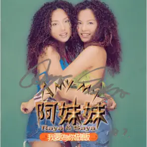
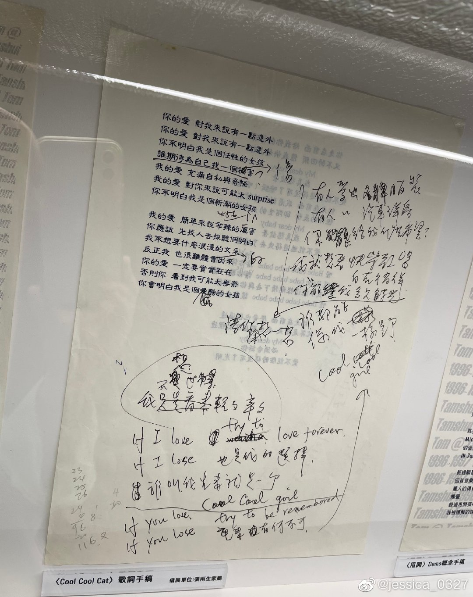

# 我要爲你做飯

# BABE 讓我告訴你

你走在前面 給我你的背影  
又不時回頭 催我快趕上你  
My dear baby 我真想放棄  
愛不能追趕得沒有了喘息

你走在前面 我看到你的背影  
但你的表情 卻陌生得太神祕  
My dear baby 我真想放棄  
愛不能逃避得失去了聯繫

Oh baby baby baby baby baby 停一停  
Oh baby baby baby baby baby 聽一聽  
我不能這樣繼續下去與你的距離  
Oh baby baby baby baby 讓我告訴你

你走在前面 聲音也很遙遠  
就算是晴天 我也躲在陰影裏邊  
My dear baby 必須告訴你  
愛不能灰暗得沒有了光明

# COOL COOL CAT

你的愛 對我來說有一點意外  
你的愛 對我來說有一點意外  
你不明白 我是個任性的女孩  
誰期待 爲自己找一個傷害

我的愛 充滿自私與奇怪  
我的愛 對你來說可能太 surprise  
你不明白 我是個新潮的女孩

我的愛 簡單來說辛辣的厲害  
你應該 先找人去探聽個明白  
我不想要 什麼浪漫的文采  
反正我 也很難體會的出來

你的愛 一定要實實在在  
否則你 看到我可能太無奈  
你會明白 我是個酷酷的女孩

有人愛出名牌服裝  
有人愛出汽車洋房  
你能給我什麼希望  
我就想要快樂歌唱  
我只想要自在徜徉  
你能愛我多久時光  
請你來想一想

If I love try to love forever  
If I lose 也是我的選擇  
誰叫我生來就是一個 cool cool cat

If I love try to be remembered  
If I lose 重來有何不可  
誰都能像我一樣是個 cool cool cat

# 哎唷！沒什麼

你又怎麼啦 爲什麼還不想回家  
我的心情有一點複雜  
我只是想要找個人說說話  
今晚我就來陪你吧

都是我的他 教我心底亂如麻  
難道他又欺負你了嗎  
不知道還該不該繼續愛他  
別讓自己變成可憐的傻瓜

你還想忍耐他多久 我不知道  
倒不如一次解決個乾淨利落  
你有把握 跟着我說  
哎唷沒什麼 哎唷放輕鬆  
男人這麼多 辣妹何必回頭  
哎唷沒什麼 哎唷放輕鬆  
朋友這麼多 沒有了愛情你還有個我

你又怎麼啦 讓自己哭成這模樣  
他爲什麼躲我的電話  
我開始懷疑我比你還要傻 就別支支吾吾快點招了吧  
原來我的他 也不是什麼樣好卡  
他們總是順手摘野花  
不知道 還該不該繼續讓他  
讓他最後一腳把你踢開嗎

不需要讓自己煩惱 我也知道  
倒不如一次解決個乾淨利落  
你學我 跟着我說 大聲地說  
哎唷沒什麼 哎唷放輕鬆  
男人這麼多 辣妹何必回頭  
哎唷沒什麼 哎唷放輕鬆  
朋友這麼多 沒有了愛情你還有個我

# 參考

相關鏈接：

-   [想你到月球 張雨生特展 10 - 蓁芯 0607@weibo.com​](https://weibo.com/2567125954/MmMXSgknO)

當前頁面缺失：

-   發行時間
-   專輯封面
-   詞曲作者信息
