# 口是心非（拋物線版）

# 致豐華唱片企宣同事的信

彭先生、陳老師、小彭、李桑以及親愛的企宣兄弟姐妹們：

先祝各位 新年快樂！也願豐華唱片能在諸位齊心協力的帶領下，「氣衝斗牛之墟」，「豐」收之歌、耀眼若日月光「華」！

是的，張雨生的作品又來了。  
忘記過去，放眼將來，是現實商場成功的鐵則。我們必須忘記過去成王敗寇蓋棺論定的結果，才能以全新的姿態放眼無限成王敗寇可能的將來。所以，這一次我得準備，與其說很成熟，不如說很充分；與其說很囉嗦，不如說很誠懇；與其說很花俏，不如說很講究；與其說很濫情，不如說很感性。  
這一次我準備的很充分：十二首歌，十二段導引文字，加上前言後記林林總總五千多字，並一幅拋物線圖，手筆之大，流行歌壇罕見。  
這一次我準備的很誠懇：我把所有文字的出處詳加註明，對我自己、也對瀏覽的人負所有文責，擔當之大，流行歌壇罕見。  
這一次我準備的很講究：我幾乎透過所有的文字形態展現文字，韻文、散文、雜記、小說、寓言神話、語錄體、對話體等等，用功之深，流行歌壇罕見。  
這一次我準備的很感性：我像攤開手掌，暴露我的感情紋線，放棄所有奇字怪句，舒詞緩語直指心性，淬鍊之精，突破我自己有史以來的格局，亦流行歌壇難得一見。

我們都知道，情歌並不難寫，難在激情的稍縱即逝，真正的歡愉總是乍現的靈光，一旦冷眼旁觀，便失去了感人的興味。我想，我討厭不痛不癢、卻又苦得稀里嘩啦的那種情歌，尤其被女歌者詮釋出來，讓我想起了西蒙波娃的話，「在性方面，女人活在男人粗糙的世界之中，爲了補償自己，她們會特別愛好『精美的東西』…」。

好吧！一切皇天在上，諸位自有公論，廢話就此打住。

如果這些未能盡符諸位心中期許，請大剌剌將冷水潑回，我必悉心受教。我與諸位合作也將近十年，窮盡感激的言語，也數不盡我心中如絲如縷的謝意呀！

張小寶雨生

丁丑年 1997 於淡水沙崙 悠然娛海小樓

# 我會瘋狂

## 導引

「凌晨 4:50，早覺者與邊緣人有了不經意的交會。同樣惺忪的睡眼，生命的活力卻此消彼長。」  
「人，總在滿足和貪多的火網下匍匐前進，總有成爲俘虜的時候，受盡酷刑折騰，或幡然悔悟，或樂此不疲 ⋯ 相愛容易相處難，否則婚姻怎會成爲愛情的墳場？寬容與知足，爲什麼要耗費幾十年的光陰才得以領略呢？」———某人某夜於淡水  
「從民子到雪子對於他的愛的閃電，劃過佐山的心裡。」  
———川端康成（1899 ～ 1972），母親初戀的人，伊豆的舞娘 ——— 川端康成十五篇短篇精選集，黃玉燕譯

## 歌詞

我會瘋狂  
你的模樣  
今生最美麗的圖像  
誰能有魔力讓我凍結一切神奇時刻  
任何代價我都願意舍  
所有聲音  
比不上你  
縈迴我整個的魂靈  
盡世界驀然熄了光明失了秩序  
我也相信仍然擁有你

佔有不是我們愛戀的終結  
誰敢輕言他的承諾久遠  
我只願爲你收拾起性情不想再頑強嬉遊流浪  
只把桂冠爲你獻上

如果有愛能值得這些曲折  
如果有愛能值得這般火熱  
如果有愛違背了道德在心靈千山萬水  
孰是孰非誰理得出來

就像走了一圈又繞過一圈你跋涉長遠卻回到原點  
最初的狂喜與最終的寧謐如此和諧  
就像走了一圈又繞過一圈你跋涉長遠再回到原點  
更替的季節與變換的日夜去不復回

等到失去的再回我身邊  
等到失去的再回我身邊  
等到失去的再回我身邊  
我才有了力量將一切還原  
我才有了力量將記憶玩味  
我才有了力量將愛情完美  
我才有了力量將生命深遠  
正如泉水充盈豐沛

# 當我的感覺被你瞭解

## 導引

「當有人欣賞你的作品  
很可能他誤解了。  
很可能你對你自己經驗的發掘  
還沒深到只有自己理解的程度。」  
—— 羅智成 · 羅智成詩集「寶寶之書」· 第 12

「『哈哈哈！』阿 Q 十分得意的笑。  
『哈哈哈！』酒店裡的人也九分得意的笑。」  
—— 魯迅 · 阿 Q 正傳 · 第三章末兩行

## 歌詞

當我的感覺被你瞭解  
我便擁有了全世界  
當你爲我開啓全世界  
我才找到我的殘缺

因爲我的快樂是你海天遼闊的笑  
往往一路抑揚頓挫直到天涯海角  
有時窒息的抑鬱使我狂亂浮躁  
有時荒謬的景象使我亡命叛逃

你知道  
你知道

就說「快把垃圾向我傾倒  
把疲憊的心向我懷裡靠」

當我的感覺被你瞭解  
我便擁有了全世界  
當你爲我開啓全世界  
我才走進了我心內的花園

# 你還願爲我守候在冷冷寒風中嗎

## 導引

我找不到呀

## 歌詞

你還願爲我守候在冷冷寒風中嗎？微微貼觸我的耳緣呵癢說情話  
即使當初你最愛傻楞楞的笑 日子一久難免看慣那單調

你還願將我美好華年讚頌入詩嗎？相處總會產生距離安全而疏遠  
即使當初我堅持相思應成癡 想不起那些年衝動的直覺

你說愛情不會飛 只因多感而憔悴 問癡心妄想惹遍滄桑的人能入戲幾分 露水朝華 還是孤注傾泄  
你說真心不會飛 只因脆弱而枯萎 問紙醉金迷歡場徘徊的人能領略幾分 誰等待聖潔光輝 誰無所謂

我們再次循著記憶回到相戀的小街 溼風泥土青草混合甜美的氣味  
沒有精神的虛無 沒有肉體的臭腐 靜靜溶進天地昏黃的洗浴

我說愛情不會遠 只因多感放長線 想當年十五二十潔白的心怎麼擁抱生命 快樂暖暖 藏在手掌外緣  
我說真心不會遠 只因脆弱躲一邊 我們都忘了心底深藏的那束火紅玫瑰 誰奔向花花樂園 誰暗暗自憐

直到黑夜吞沒最後的光線 直到月光撕扯雲層而出現 我們手握著手背靠背 胡語亂言 知道情愛不能不咀嚼

愛情不會遠 愛情不會飛 我心甘情願毫無遲疑地吻你紅熱小臉 晶瑩的淚劃下喜極的痕  
真心不會飛 真心不會遠 我心甘情願毫無悔怨的疼你今世今生 讓所有苦悶哀愁唱破喉嚨

# 河

## 導引

「…豹子撲攏去，摸到媚金的額，摸到臉，摸到口；口鼻只剩了微熱…臨死的媚金聽到這話，知道豹子遲來的理由是爲了羊，並不是故意失約了，對於自己在失望中把刀陷進胸膛裡的事是覺得做錯了…豹子是把自己的胸也袒出來了，他去拔刀。陷進去很深的刀是用了很大的力才拔出的。刀一拔出血就湧出來了，豹子全身浴著血。豹子把全是血的刀子扎進自己的胸脯，媚金還能見到就含笑死了…」  
——沈從文 ·「媚金 · 豹子 · 與那羊」· 沈從文小說選 Ⅰ · 洪範書店

## 歌詞

當你平躺下來 我便成了河  
迴繞你的頸間 在你脣邊乾涸  
竊想你的眼神 我戀戀不捨  
聚爲一泓泉水 深邃清澈

當愛燎原成災 你徐徐側身  
堆積肥沃河床 我是朝聖的人  
我是客途的雁 卻一往情深  
從此無意追逐 新綠的春

任我流吧 層層冰川  
億年換幾吋 我也寧願這麼盼  
等到昏黃 等到癡傻  
等著公主吻青蛙

魔咒緩緩退盡 你笑的厲害  
天曾缺掉的角 無非此等神采  
我將殘翼放下 從河中走來  
你正頷首告知 這裡有愛

# 在黃昏融化了世界的色彩以前

## 導引

Note..朋友們頻頻列隊結婚，我也被紅色喜帖炸得不亦樂乎。  
這當然無關乎流行，只是到了年紀。  
從純喫喝閙酒的賓客，一路做遍招待、司機、甚至伴郎（搞過烏龍、也閙了笑話），體恤他們在這樣一種透過古老風俗迷信串接的典禮儀式當中，即心力交瘁，又要笑臉迎人的苦處。  
不過，那些笑意畢竟發自肺腑，誠如他們所言，結合是兩個人的事、結婚卻是兩家子人的事。祝福他們！

## 歌詞

在黃昏融化了世界的色彩以前  
我們的情緒達到至美的極限  
當月光歌頌著絕倫的天上詩篇  
我們的歡樂湧現節慶的境界

所以你說你情願放棄自己的那一片天  
所以你說你情願走向生命的另一回圈

相思會醉 愛戀能癡  
無可比擬的激情幾回  
一對指戒 一諾百年  
一座從此 恬適的伊甸園？

在星辰造型出神聖的幾何以前  
我們的心跳衝破古老的高原

當黎明破曉之姿粉刷彤霞一片  
我們的視野才拓展到地平線

所以你說你情願揮別憧憬的愛情唯美  
所以你說你情願迎接繁複的柴米油鹽

# 寂寞

## 導引

找不到

## 歌詞

瑟縮的人 哽咽的歌 赭紅的黃昏  
穿透千古灰濛的眼神  
就放肆的喊吧  
反正只有我一個  
我是窗口的靜物  
徒留形狀看不見靈魂

多少的時間 流失在眼前  
多少的思念 我丟棄又拾回  
日以繼夜 日以繼夜  
品嚐它苦澀滋味

昏暗的燈 混亂的床 悸動的夢魘  
沉溺無邊空想的失眠  
就忘形的哭吧  
反正只有我一個  
我是凌晨的薄霧  
瘋狂迷戀低溫的感覺

多少的時間 流失在眼前  
多少的思念 我丟棄又拾回  
日以繼夜 日以繼夜  
品嚐它苦澀滋味

瑟縮的人 哽咽的歌  
赭紅的黃昏 灰濛的眼神  
昏暗的燈 混亂的床  
悸動的夢魘 空想的失眠

反正只有我一個  
反正只有我一個  
日以繼夜 日以繼夜  
日以繼夜 日以繼夜  
品嚐它苦澀滋味

# 小嬰孩睡在垃圾桶裡

## 導引

這個故事是得不到汲汲營營於爭權奪利的袞袞諸公的注目的。我一直覺得，我們的問題不在那些理也理不清、辯也辯不明的狗屁倒竈議題上面，那只是亂象紛紜之一。我們的病絕對是從根腐爛型的絕症，大家臨於無底深淵，立於危牆之下卻還一味自慰式的欺矇自己「慢慢來，沒關係，從長計議」。四百年島民心態乘以千年傅承的封建惡習，造成今日短視近利的、惡狗爭食的、血氣狂熱的、盲目崇拜的、迷信落伍的、以暴易暴的、公德淪喪的、昧於未來的亞洲乃至世界民主開發國家的公民奇觀。《莊子》寫著：「寧爲廟堂文繡之犧牲乎？抑爲泥塗曳尾之烏龜乎？」小嬰孩呀，爲人難、難於上青天！不如學我，就做只搖搖擺擺的烏龜吧！

## 歌詞

小嬰孩睡在垃圾桶裡  
臍帶猶連著冰冷的血跡  
小嬰孩不能睜開眼睛  
這裡不再是溫暖的母體  
小嬰孩在你小巧心靈  
可曾如此夢見過自己  
小嬰孩睡在垃圾桶裡  
兀自吸吮這寒冬的溼氣

微弱的聲音  
依然在呼吸  
微弱的聲音  
何等的任性

小嬰孩睡在富裕天堂自由寶島的垃圾桶裡  
小嬰孩站在身旁都是隨人擲來擲去的東西  
小嬰孩在你單純心靈  
可曾渴望能擁在懷裡  
小嬰孩如果換我作你  
我想我真的寧願死去

# 口是心非

## 導引

「『我出賣了你，』她大膽地說。  
『我也出賣了你，』他說。  
她又厭惡地瞧了他一眼。  
『有時，』她說：『…你是由衷說這些話的。你想不到其他挽救自己的方法，你爲了自己才這樣說。你要別人去受苦，你關心的只是你自己。』  
『你關心的只是自己，』他附和說。  
『從此之後，你對那人的感情便不同了。』」  
—— 喬治 · 奧威爾（George Orwell 1903 ~ 1950）· 1984 · 邱素慧譯 · 桂冠圖書公司

## 歌詞

口是心非 你深情的承諾都隨著西風飄渺遠走  
癡人夢話 我鍾情的倚托就像枯萎凋零的花朵  
星火燎原 我熱情的眼眸曾點亮最燦爛的天空  
晴天霹靂 你絕情的放手在我最需要你的時候

於是愛恨交錯人消瘦  
怕是怕這些苦沒來由  
於是悲歡起落人靜默  
等一等這些傷會自由

口是心非 你矯情的面容都烙印在心靈的角落  
無話可說 我縱情的結果就像殘破光禿的山頭  
渾然天成 我純情的悸動曾奔放最滾燙的節奏  
不可收拾 你濫情的拋空所有晶瑩剔透的感受

# 如果你要離開我

## 導引

如果太陽此刻熄滅光茫，地球上的人要八分鐘後才會知道…  
「Beatrice: 『I am gone, though I am here: there is no love in you: nay, I pray you let me go.』」—— William Shakespeare, Much Ado About Nothing, ACT  
「泉涸，魚相與處於陸，相呴以溼，相濡以沫，不如相忘於江湖。」—— 莊子 · 大宗師

## 歌詞

如果你要離開我  
我想我不會太難過  
也許有一點點難過  
至少不會在你的面前難過  
Leave me alone

如果你要離開我  
你不用對我說什麼  
就算我真的很心痛  
至少臉上還掛著一幅笑容  
Leave me alone

如果你要離開我  
世界還是會向前走  
也許它慢慢改變我  
至少改變也不是壞的結果  
Leave me alone

如果你要離開我  
如果你要離開我  
如果你要離開  
請別到最後一刻才告訴我  
Leave me alone

# Cappuccino

## 導引

沒找到

## 歌詞

白淨的紙 畫上一個桶子 黑筆圈滿許多心事  
親筆寫上 完成它的日子 順便藏起紛亂情思

時間過得快 愛得太奇怪 回憶頻頻追撞懸浮的未來  
有歡聚有分開有甜蜜有無奈 直到我們一再目送彼此消失於人海之外

你讓我想起那杯 Cappuccino 咖啡 我想我的愚昧都被你容在桶內  
就像散開均勻香味濃郁的肉桂 我想我的眼淚已被你統統看見

白淨的紙 讓我若有所思 若有所失 若有所癡

# 甩開

## 概念手稿

宇宙歷 紀元混沌初開

我帶著滿目瘡痍的城市穿過心情的滿目瘡痍  
那崇高的聖戰終於回到第一次衝突的經緯線上偃旗息鼓  
美好華年率先舉起白旗被俘虜爲四竄的狼煙只是陰魂不散  
經過重擊純真的重擊的重擊的重擊  
獨裁者選擇崇拜瘋狂  
我選擇披覆月球冷寂的表面

當超新星爆破幅射搭載光速擴散  
一度釋放數倍於莫扎特短短 36 個寒暑所擠壓的燃熱形成更龐大於貝多芬交響曲於一秒鐘內迸裂的唯有男女高音共鳴達於宇宙中心足以媲美的動能  
然而 無止無盡無邊無際的電波巡弋  
隨著羅斯托洛波維琪呼吸的巴哈上以孟德爾頌屏息凝神的小提琴翻騰迴旋下以拉威爾思緒綿遠的「波麗露」踢足漫舞起在帕格尼尼的高深莫測伏在舒伯特的輕靈可喜

以爲脆弱醃漬的發臭宿醉 只有急速過彎的離心力可以拉扯  
把嘔吐於門外的靈魂一一撿拾回只要扭開音量便不管 Evans、Bird、Coltrane、Miles、Monk、Mingus、Stan、Benson、Joe、Wes、Django、Ella、Sarah、Billy、June 都震天憾地粗聲粗氣的響的房間  
原來不止每次轉過關渡大橋與淡水河最不可思議的那個切面  
悲從中來便不可抑遏地與大屯山脈出海了

耳聾成痛於 Chuck Berry、Jimi Hendrix、Led Zeppelin、Deep Purple、Michael Schenker、Van Halen，Jeff、Gary、Eric、Joe、Steve 串聯的金屬吉他火網  
眼也盲的心也盲的海市蜃樓盲的（媽的？）像 Jim Morrison 與 Janis Joplin 的曇花一現

經過顛覆日夜的顛覆的顛覆的顛覆  
回首音樂從地底滾滾而出自 L 型長桌之前  
燻人的傳自母體醞釀的溫暖硫磺原味包容我乾烈且進退維谷的關於真、善、美的觸覺  
經過甩開張雨生的甩開的甩開的甩開  
我被瞭解的誤解爲誤解的瞭解成瞭解了誤解也誤解了瞭解……

## 導引

「伽利略（Galileo Galilei 1564~1642）指出，拋射物的運動軌跡，由於受到動力及重力兩種力的影響，會呈現曲線狀。這種曲線稱爲拋物線（Parabola）」——摘自牛頓出版股份有限公司所發行之《改變世界的科學家》第 11；現代實驗科學之父——伽利略，Michael White 原著，李元綺譯  
「一個拋物線的二次函數基本式：$y=ax^2$ 或表爲 $(甩多遠)=(它多重)(用的力)^2$」  
「對幾個字的思索：『甩，很有力量主動攻擊；丟，冷酷無情的動作；放，顯得是無奈之舉；棄，覺得到心灰意冷；拾，太慈善家式的犬儒；割，自虐虐人的心理反映…』」  
——某人某夜某地

## 歌詞

你不必表演那套庸俗的肥皂劇  
我也不想試圖堅強不想用力僞裝  
我的心碎了滿地  
不再擁有你 不再擁有你  
我不會做作那些瀟灑的孩子氣  
儘管我的歇斯底里我的自虐自棄  
對你已無何意義  
不再擁有你 不再擁有你

每一天都想就把愛甩開  
從此自由自在的新的美麗未來  
就把你甩開  
好像你從來不存在  
每一天都在虛無中醒來  
突然自怨自艾的老的殘破期待  
卻把我甩開  
在沒有出口的迷宮徘徊

我把愛甩開 愛把我甩開  
誰把誰甩開 分不太出來  
不再擁有你 不再擁有你

你何不掉頭離去  
寒夜一路逼近  
留下我的尊嚴帶走你的酒氣  
省略多餘的言語  
不再擁有你 我不再擁有你

不再擁有你與所有回憶  
曾經如影隨形的一切點點滴滴  
不再擁有你  
包括靈魂和你的胴體  
不再擁有你歡愉或心悸  
曾經發自肺腑的那些至美情緒  
不再擁有你  
包括你的毛病和你的脾氣

# 愛情的圖案

## 導引

「紀德：『關於床我將對你說什麼呢？』  
洛夫：『我們躺如雨後的田畝』  
林燿德：『我們共同躺成半球形的雪』  
楊喚：『哎，我再也不能入睡，我再也不能入睡。』  
馮承植：『在一間生疏的房裡，他白晝時是什麼模樣，我們都無從認識，…』」——詩的對話  
「但如果你在懼怯中只想尋求愛的平安和愛的愉悅，  
那麼不如遮掩著你的裸體，離開愛的打穀場，進入那無季節的世界，在那兒你將歡笑，但非全心的笑，你將哭泣，卻非盡情的哭。…  
除了成全它自己，愛沒有別的慾望。」  
—— 卡里 · 紀伯倫 (Kahlil Gibran 1883 ~ 1931) · 先知 (The Prophet) · 王季慶譯 · 純文學

## 歌詞

請你給我一個吻吧 我便不會再懼怕  
我將貼身藏起酥麻 拋開所有的牽掛

請你給我一個擁抱 我便情願被燃燒  
我將祕密進行浮雕 歧視所有的依靠

最美麗的季節裡我們初相遇  
就在至高的峯頂我們風化了愛情

請你給我一個眼神 我最癡想的天真  
轉開我發熱的身體 足足地球的半徑

請你給我一個呼喚 我最寵幸的柔軟  
遮蔽我前方的視野 可是愛情的圖案？

請你給我一滴淚水 附著魔咒的甘泉  
當我不慎任她下墜 赤道也疊起了雪

請你給我一種蹙眉 偷火的人也後悔  
要從絢爛走回平凡 才見到愛情的圖案

# 專輯圖片

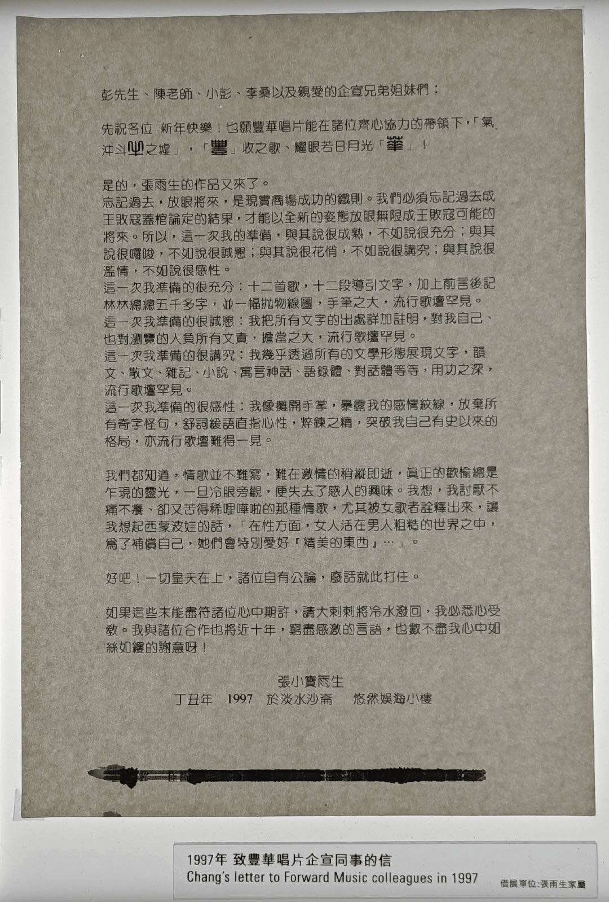

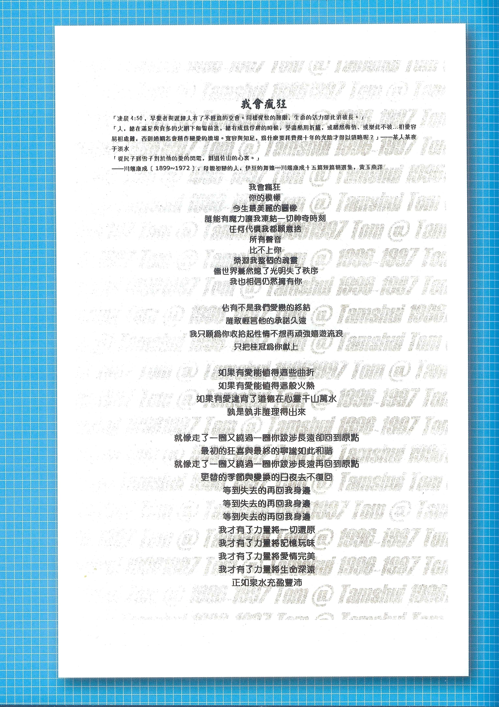

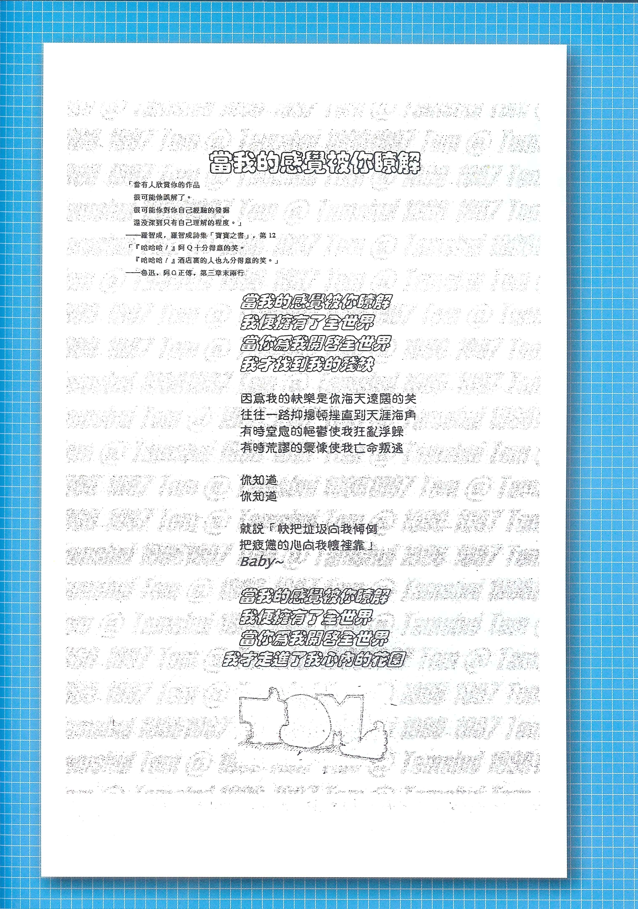

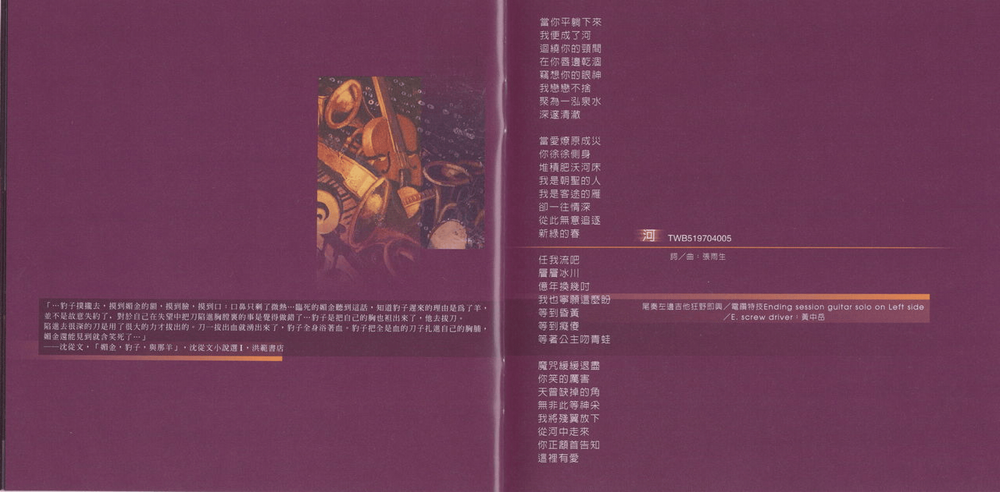

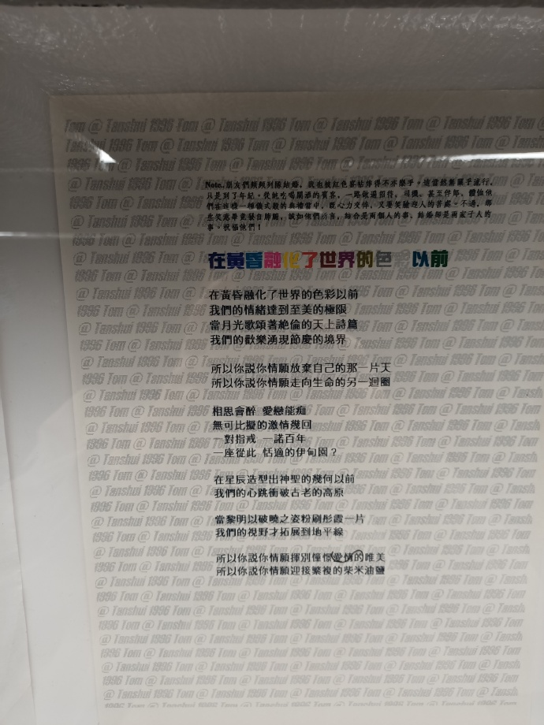

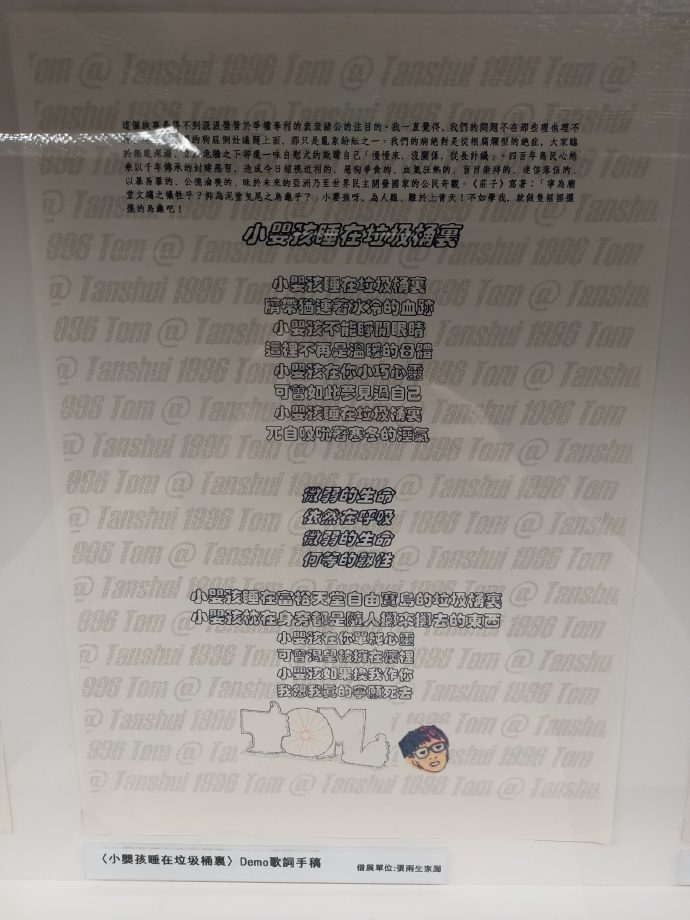

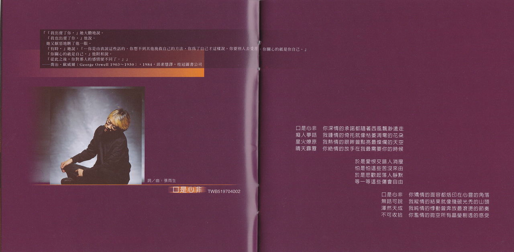

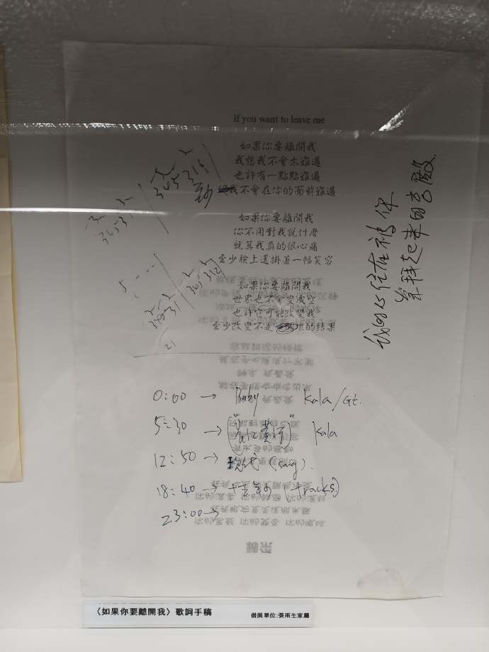

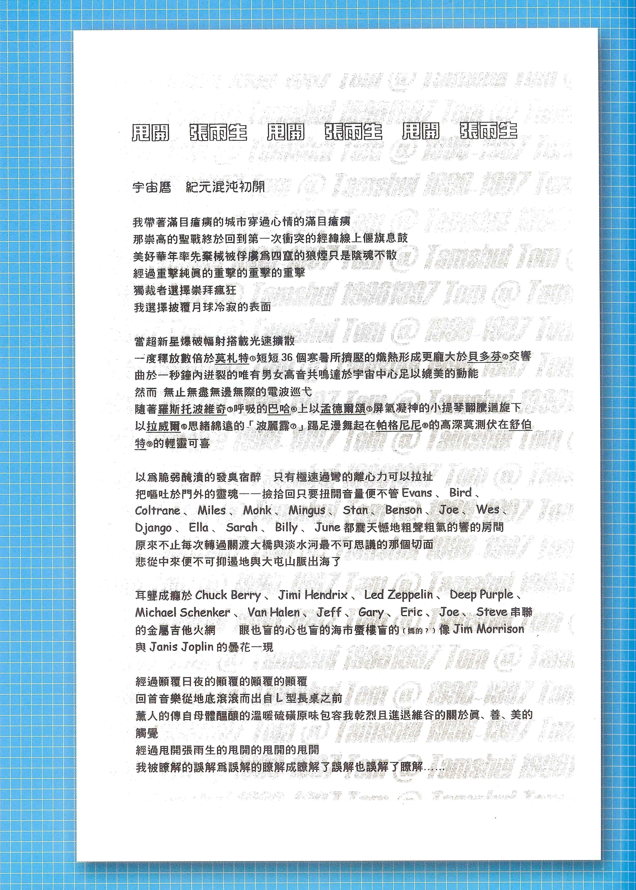

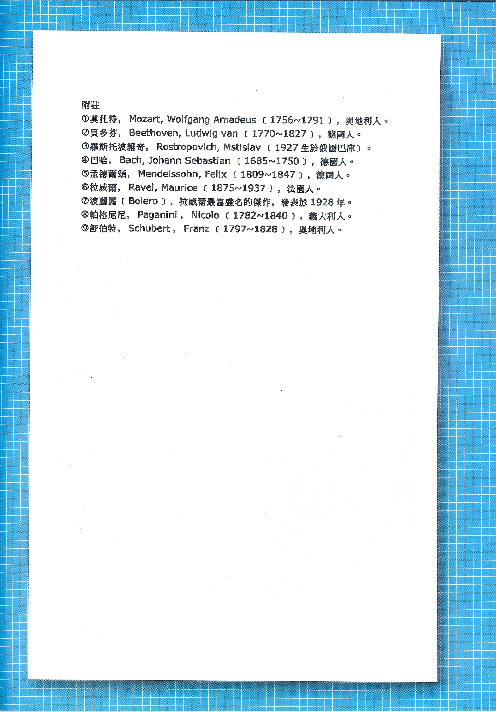

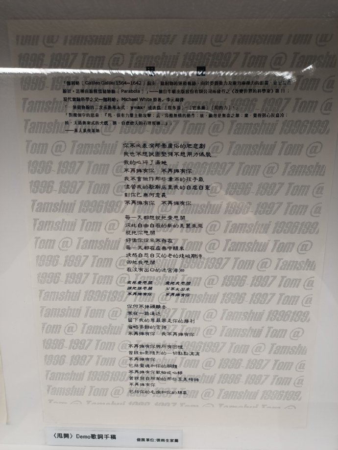

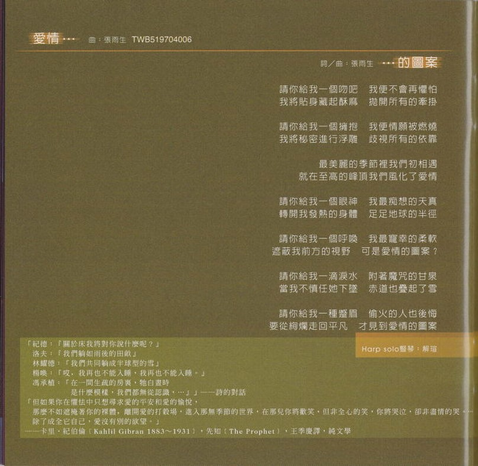
