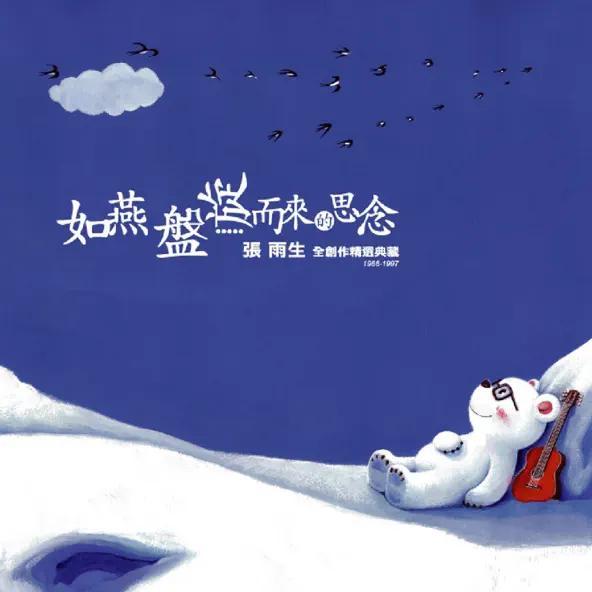
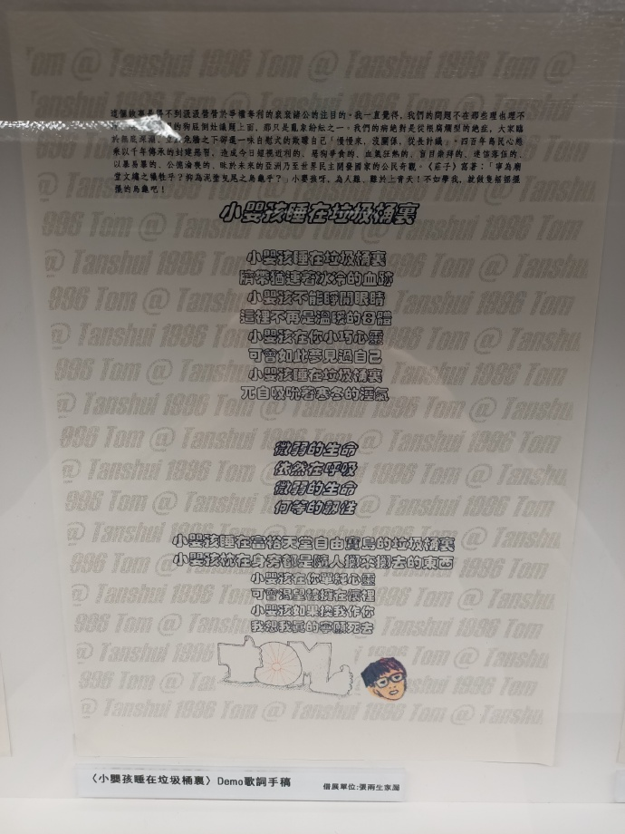
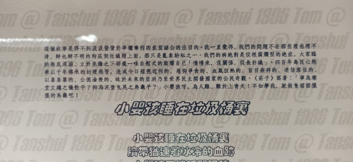
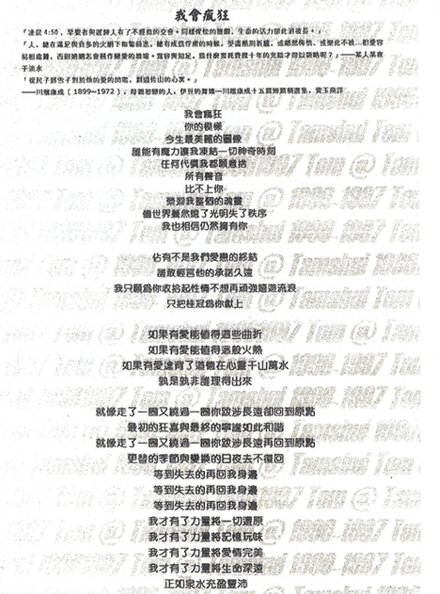
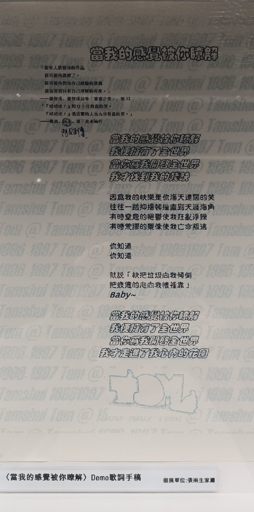

# 如燕盤旋而來的思念

# disc1 友風子雨

## 姊妹（demo）

我一直想著你給我的感覺 讓我不知如何形容  
當你的快樂透過空氣散播 讓我也忘卻了憂愁  
當我的失落傳染你的額頭 你有包容它的寬闊  
我想你生來就是我的英雄 Oh yeah 這就是我的感覺

你是我的姐妹 你是我的 baby 願我們不論何處都能心相連  
你是我的姐妹 你是我的 baby 願我們能夠永遠千里共嬋娟

我們已忘記曾有多少時間 歡樂總是輕盈相隨  
就好像山上大樹畫的圓圈 深刻一年更勝一年  
當我終於能站在世人前面 唱著我們的共同心願  
我想你一定爲我留下眼淚 Oh yeah 這也是我的感覺

## 哎唷！沒什麼（demo）

你又怎麼啦 爲什麼還不想回家  
嗯 我的心情有一點複雜  
我只是想要找個人說說話  
今晚我就捨命陪你吧

都是我的他 總教我心底亂如麻  
難道他又欺負你了嗎  
不知道還該不該繼續愛他  
繼續愛他才是一個大笑話  
你還想忍耐他多久 我不知道  
倒不如一次解決個乾淨俐落  
你有把握跟著我說

哎唷沒什麼 哎唷放輕鬆  
男人這麼多 辣妹何必回頭  
哎唷沒什麼 哎唷放輕鬆  
男人這麼多 如果是辣妹要愛地從容

你又怎麼啦 這是你第七通電話  
我的眼淚不停往下滑  
我開始懷疑我比你還要傻  
就別支支吾吾快點招了吧

原來我的他也不是什麼樣好咖  
他們總是順手摘野花  
不知道還該不該繼續讓他  
讓他才是一個天大的笑話  
不需要讓自己煩惱 我也知道  
倒不如一次解決個乾淨俐落  
學我我學你 大聲地說

哎唷沒什麼 哎唷放輕鬆  
男人這麼多 辣妹何必回頭  
哎唷沒什麼 哎唷放輕鬆  
男人這麼多 如果是辣妹要愛地從容

## 那麼

嘿 別懷疑  
當我告訴你我想孤獨一陣子  
人都有蒼白棄世的宿命  
你又何必追問原因  
我對你的愛不曾衰竭  
只是越來越不知道那是什麼東西  
再見了你的背影  
雖然我忍不住的以爲你會回頭望

別懷疑  
當我告訴你我想孤獨一陣子  
人偶爾逃避幸福的引領  
不過希冀冥想空虛  
我對你的愛依然濃烈  
只是越來越不知道那有什麼意義  
再見了你的背影  
雖然我忍不住的以爲你會回頭望 回頭望

沒有你在的雨季我試著應付更糟的心情  
沒有你來的暗夜我想著與惡劣的夢魘妥協  
我不停的自問 總是不停的自問  
接下來如何  
我不停的自問 停不下來的自問  
那麼接下來如何

沒有你等的清晨我掃著心房堆積如山的灰塵  
沒有你攙的漫步我走著一條離家最遙遠的路  
我不停的自問 總是不停的自問  
接下來如何  
我不停的自問 停不下來的自問  
那麼接下來如何

## Are You Ready

Are you Ready

Tell me baby are you ready 天色已經黑  
Tell me baby are you crazy 用力說聲嘿  
Tell me baby do you want it 搖醒這世界  
告訴我你做好最 cool 的準備

Come on baby I am ready 火花四處飛  
Come on baby let's go crazy 別想的太累  
Come on baby we can make it 越夜越狂野  
我的王國歡迎你來臣服或貢獻

我是一個子夜的靈媒  
連接你的夢通往那座神祕的花園  
你偶爾睜開了你的雙眼  
卻看不見美的無法形容的畫面  
他們傳說要等候天上月圓  
才能讓你我體驗撞擊的滋味

你等著等著 日以繼夜  
但願一陣風吹開黑夜厚重的幕簾  
我想著想著 望穿秋水  
時間爲什麼如此規律的一板一眼  
誰讓愛情封存了一年  
只爲那某時某刻相遇的芳醇甜美

## 當我開始偷偷地想你

這次我離開你應該有風有雨  
一條漫漫長路和一個拉長的身影  
你是不必訝異黃葉跌滿一地  
換過一季心情和落落寡歡的面具  
從今以後我們不再有何干系  
從今以後你就是你  
從今以後我們不再有任何干系  
從今以後我不怪你惡意的失憶

當我開始偷偷地想你  
當我開始偷偷地哭泣  
愛戀一如蟒蛇般纏緊失控的情緒  
如果我們不會再相遇  
你是不是就把我忘記  
或許這是最好的結局  
就讓我偷偷地想你

這次我離開你應該是風是雨  
一顆混亂的心和一窗漆黑的風景  
你是無需歡欣揮揮衣袖而已  
雲彩陽光與我的靈魂還留在原地

這次我離開你 我離不開你~

## 石頭

第一顆石頭 煉成了蒼穹 夢般顏色不只有七種  
第二顆石頭 化育了石猴 夢般人物不只是傳說  
我想在多年以後 我們相逢  
我會問你 記得否  
那一顆屬於我們晶瑩的石頭  
還有懵懂年少編織的純情 灑脫的性情  
飛揚翻騰熱情如火

第三顆石頭 造一座紅樓 多少人流連最後失落  
這麼多石頭 你送給了我 詩人曾說可用來釀酒[^1]  
一直到多年以後 我們相逢  
我會問你 記得否  
我想你會笑著說 石頭只是石頭  
不再有慘綠少年編織的純情 灑脫的性情  
飛揚翻騰熱情如火

用三顆石頭 疊了一個我 有首有手有愛也有愁  
這三顆石頭 按時間先後 我排不出個最愛的結果  
一直到多年以後 我們相逢  
我會問你 記得否  
我想你會笑著說 石頭只是石頭  
不再有慘綠少年編織的純情 灑脫的性情  
飛揚翻騰熱情如火

## 想你

說情話 把情話  
說得甜就讓你快樂  
言語淺不如人意深  
天花亂墜又如何

海多深 海非深  
比起相思不算什麼  
即使隔在兩個地方  
抬頭看 有歐里昂[^2]

總是七上八下 總是層層複雜  
然而忽左忽右 叫我摸不清方向

想你成一道軌跡  
彎彎曲曲沒道理  
一筆一筆看似絹細  
卻相思綿綿無絕期  
想你成一個球體  
滾來滾去不能停  
四方八面全都是你  
多情卻似總無情的眼睛

一分鐘 一秒鐘  
能夠把你想過幾遍  
看見你在市容裡面  
觸目所及的一切

我想你  
我想你

# disc2 櫛風沐雨

## 神采

你的黑髮 你的紅脣 你的雙眸  
在我眼前竟是這般米羅  
你的溫柔 你的嬌羞 你的灑脫  
在我心底都是飄逸水墨

不知怎麼樣開口 有太多的感動  
因爲太難以形容 只能對著自己說

神采 我最愛  
躲在夢裡喃喃念出來  
神采 我最愛  
藏在手心遲遲打不開  
密麻錯落的情懷

你的言語 你的歡聲 你的呼吸  
播放一種巴洛克的旋律

你的步伐 你的轉身 你的沉靜  
框進畫裡印象派的意境

# disc3 礎潤而雨

## 如燕盤旋而來的思念

我是飄落的楓葉  
你是仰望的土堆  
翩翩下墜你胸前  
也放掉一季的疲累  
與我的愛戀一起下跌  
以你的深情敞臂迎接

我是月落的聲音  
你是乍醒的黎明  
祕密會合於天井  
也交換輝映的光暈  
與我的愛戀走唱星系  
以你的深情如影隨形

我是荒涼的廢墟  
你是湮沒的傳奇  
來來往往善男信女  
膜拜他們的執迷  
與我的愛戀一般強烈  
以你的深情匍匐成列

如燕盤旋而來的思念  
如燕盤旋而來的思念  
如燕盤旋而來的思念  
總在凌晨四點  
唯有凌晨四點  
才能訴說最美麗的語言

## 說的再多你也不瞭解

在幸福的瞬間  
我感覺偉大卻又卑微  
在絕望的邊緣  
雖跌蕩仍有信念  
在最愛的面前  
我感覺勇猛卻又膽怯  
在你的凝視下  
勝利也等於投降

說的再多  
你也不懂我的心痛  
這樣你就安全嗎  
就覺得自然嗎  
對我來說難道都一樣

說的再多  
我也不懂你的要求  
就順著你的心意吧  
就順著你的心意吧  
我的多情就當是笑話

在遊戲的規則裡  
我與你都不會贏  
在感情的棋局裡  
我們都是過河的兵

哦 說的在多  
再多我也許不懂你的要求  
就順著你的心意吧  
就順著你的心意吧  
我的多情就當是笑話  
說的再多  
我也不懂你也不懂  
彼此的心跳哦  
這樣你就這樣你就安全嗎  
你就覺得自然嗎  
對我來說難道都一樣

## 小嬰孩睡在垃圾桶裡

> 這個故事是得不到汲汲營營於爭權奪利的袞袞諸公的注目的。我一直覺得，我們的問題不在那些理也理不清、辯也辯不明的狗屁倒竈議題上面，那只是亂象紛紜之一。我們的病絕對是從根腐爛型的絕症，大家臨於無底深淵，立於危牆之下卻還一味自慰式的欺矇自己「慢慢來，沒關係，從長計議」。四百年島民心態乘以千年傅承的封建惡習，造成今日短視近利的、惡狗爭食的、血氣狂熱的、盲目崇拜的、迷信落伍的、以暴易暴的、公德淪喪的、昧於未來的亞洲乃至世界民主開發國家的公民奇觀。《莊子》寫著：「寧爲廟堂文繡之犧牲乎？抑爲泥塗曳尾之烏龜乎？」小嬰孩呀，爲人難、難於上青天！不如學我，就做只搖搖擺擺的烏龜吧！

小嬰孩睡在垃圾桶裡  
臍帶猶連著冰冷的血跡  
小嬰孩不能睜開眼睛  
這裡不再是溫暖的母體  
小嬰孩在你小巧心靈  
可曾如此夢見過自己  
小嬰孩睡在垃圾桶裡  
兀自吸吮這寒冬的溼氣

微弱的聲音  
依然在呼吸  
微弱的聲音  
何等的任性

小嬰孩睡在富裕天堂自由寶島的垃圾桶裡  
小嬰孩站在身旁都是隨人擲來擲去的東西  
小嬰孩在你單純心靈  
可曾渴望能擁在懷裡  
小嬰孩如果換我作你  
我想我真的寧願死去

## 凡

凡已做過的事不消失  
凡真愛過的情盡成癡  
若問人生苦求什麼事  
只需記取橙黃橘綠時

聽那雎鳩關關吟唱多少世紀  
窈窕淑女已經不矜持  
看那雲裳花容太白鬼斧神砌  
貴妃已去徒留華清池  
古冢斑駁全付諸青史

所能看過的幾個春秋  
所能經歷的幾個戰國  
排開名利權欲的誘惑  
不脫生老病死的折磨

以爲手如柔荑巧笑美目婀娜  
就是傾城名媛的輪廓  
以爲富可敵國朱門裡酒肉臭  
就是尊貴諸侯的形容  
且去荒草雜徑尋古丘

多少英雄漢  
多少空留遺憾  
琵琶續續彈  
風流軼聞口耳傳  
霎時斜陽晚  
抬頭月上東山  
不如共進一觴悠悠然歌唱  
人生似幻化

## 他（伊斯瑪利）

他的嘆息由深而淺淡出我不能呼吸  
他的眼睛由遠而近切入我不能迴避  
我的心在竊竊私語 承認吧 難道是愛情

他很平凡表面看來一點也沒有魅力  
他很呆板說到幽默好像不太會反應  
爲什麼我卻擺脫不去那聲音  
讓我不得安寧

哦伊斯瑪利可不可以透露個詳細  
我的情緒無法分明我真的動了心  
我想我願意 我想我願意  
對他說出我愛你  
哦伊斯瑪利我現在相信這就是愛情

啦啦啦啦啦 他是無心的  
啦啦啦啦啦 他是有意的  
啦啦啦啦啦 他是有心的  
啦啦啦啦啦 他是無意的

他跑過來盈盈笑意天真多麼孩子氣  
他轉過身依依不捨離去多讓人憐惜  
我的心在暗暗歡喜  
這一切誰說不幸運

## No Way Out

No way out 儘管你想去做好  
And it is no way out 你到底知不知道  
No way out 儘管你拼命做好  
And it is no way out 就算你知道 這情況 你也救不了

如果你上次離開 就決定不要回來 也許它不會這麼壞  
愛情的酒汁溢滿 從眼角大肆氾濫 逃不過宿命的循環  
你到底在想什麼 你到底在搞什麼 你千萬不要再做夢  
因爲這是個迷宮 你已經陷入其中 空氣卻越來越稀薄

It is no way out 別再讓它糟糕  
And it is no way out 你到底知不知道  
It is no way out 別再如此無聊  
And it is no way out 就算你知道 這情況 你也救不了

## 從你到我

流什麼淚可以灑進自己的心胸  
喫什麼齋可以圓滑自己的幸福  
由不得你不相信轉東轉西  
但這青山綠水都看你如何應對

朝什麼聖可以昇華自己的士氣  
算什麼命可以再見自己的憂懼  
由不得你不相信變來變去  
但這天下萬般不過是那些問題

從我到我有什麼不同  
從你到我有什麼不同  
從我到我有什麼不同

## 他真的不想 (Demo)

我有個朋友不愛過生日  
他總在生日當天打包心情  
把所有的願望都放逐在異地  
他習慣孤僻也是有原因  
他婉拒歡樂其實不得已  
他不願意醉去 更不願意夢醒

難道他真的不想怦然心悸  
難道他真的不想訝然驚喜  
他真的不想把好友擁緊  
一口氣把蠟燭吹熄

難道他真的不想恣意狂喜  
難道他真的不想率性哭泣  
他真的不想把故事延續  
一口氣讓憂傷絕跡  
一口氣將過往監禁

我有個朋友不愛過生日  
他總在生日當天消失無影  
連我們的祝福  
也渺渺在風裡飄零

## 健忘 (Demo)

我有一種健忘的毛病  
它不曾困擾過我  
只是在冥想的時候  
突然發現自己遺失了什麼

我分得出該記不該記的事情  
我分得出日曆上數字的不同  
我分得出想見不想見的面孔  
我分得出生命中掙扎的痕跡  
但卻是不知不覺就被擱置  
擱置在心房最陰暗的那角落

我曾經強迫我一定要記憶 但卻從來也不曾再把它提起  
每次我翻著積疊好友信件 就赫然驚覺我已失去一切  
親朋好友也許忘了對我埋怨 但我怎能疏忽掉這生命細節  
我能重複描述那個愛情故事 卻遺忘愛我至深的雙親生日  
我能夠等待某人幾個小時 卻遺忘父母也在對我相思  
我常渴望巴結那類高尚名流 卻遺忘誠心關切我的是誰  
我常爲了努力工作不休不眠 卻遺忘苦苦守候我的是誰  
那些失去的 我要用什麼來追

我不曾要求過去的重來  
我相信自己不會失敗  
但苦澀的卻是現在  
神經衰竭該是多麼無奈

我要如何學習認真像那小孩  
我要如何拾回被我輕棄的愛  
我要如何增加我對人的關懷  
我要如何把那叮嚀永存腦海

我不想不知不覺的就成長  
成長成一個思想真空的傻瓜  
但總是爲許多遺憾事憔悴  
爲了錯忘了約會感到傷悲

我常常注意來往女人裙襬  
我常去固定的地方喫牛排  
我有時目中無人十分痛快  
我有時窮途潦倒彷如乞丐  
但是我仍然陶醉香水粉黛  
我仍然惦念紅茶和檸檬派  
我仍然幼稚無知不分好歹  
我仍然戲謔自己歡樂悲哀  
哦心靈那種感覺如何按捺  
這症候今天說來是否奇怪  
我只是在記憶的邊緣徘徊  
我只是積欠太多人情的債

## 一條大街 (Demo)

那一個和風旭日蔚藍的晴天  
我匆忙趕著與你說再見  
寬闊平坦的街塞成了死結  
錯過你多麼不情願  
緣起緣滅讓我的眼眶紅了邊  
滾滾情懷卻哭不出淚水  
擁擠熙攘的街給我力量飛  
我想在街景裡融遍

還要多遠還有多遠  
我傻得竟在轉圓圈

這一條大街怎麼會曲折綿延  
我就像走進虛幻的空間  
似曾相識的一切彷彿陌生的世界

這一條大街怎麼會曲折綿延  
我已經焦慮的近乎瘋癲  
任那月圓月缺花開花謝季節輪迴

那一個和風旭日蔚藍的晴天  
夢一般空靈飄逸在眼前  
所有的愛戀柔柔地沉醉  
我變成這一整條街

## 還以爲 (Demo)

凡是走過必定留下或深或淺的痕跡  
銀河之內我們循著一種軌跡行進  
此外愛情難道還有不易解讀的訊息  
想必是我低估彼此寬容的默契  
曾經夢裡的渴望阻撓現實中的狂想  
而當我醒來卻發現我已在你懷裡掙扎

還以爲 你聽到  
我的心如風般的細語  
才想到 那可能是  
飛鳥劃過了我的尾翼  
還以爲 你看得到  
我的心它在暗暗抽泣  
才想到 那不過是  
新月與晚潮間的嬉戲

我今夜思念從小桌前陡然一躍而起  
將你置放在與我遙遙對望的絕壁  
沉默之餘又想起回答我微弱的猶疑  
我看見我的眼睛散在你的眼睛裡

還以爲 還以爲  
聽不到就會失去記憶  
還以爲 還以爲  
看不到就會斷了連繫  
才想到 才知道  
爲什麼我會如此委屈  
才想到 才知道  
爲什麼我又如此歡愉

## 現代啓示錄 (新版) (Demo)

有人厭倦枯燥的作息  
他尋找方法藉以抗拒  
他或許有理由解釋他的心境  
他以爲他在享受他的生命  
他不想中規中矩  
他卻大聲疾呼某些必須  
他認爲大家在耗費光陰  
他說他是摸著良心

但我們沒有見到他的證明  
卻知他過得越來越拮据  
也許他今生已有釋然的造詣

他開始重新對生命估評  
但他的眼神不再樂觀年輕  
他批判文明的價值時十分仔細  
但卻用仇恨代替他的感情  
他指責這個社會瘋狂勢利  
他傲視群衆彷彿首領  
他想象所有卑鄙字句  
形容這世界已無真理  
他好似丟棄當年的憧憬  
他只是無意義的麻醉自己  
然後我們也失去他的消息

偉大是善變的  
你崇拜了什麼  
美女英雄 寂寥身後  
蓋棺卻辯不休  
高貴是交易的  
貪婪的淵藪  
憎恨什麼 控訴什麼  
誰的良心會刺痛

文明是耀眼的星星  
但有誰能夠否認它的無情  
我們活在周遭都是虛僞的環境  
誰又能要求自己回覆本性  
這四面八方廣闊海洋  
但人們朝夕狹隘自欺  
那電腦網路言談無遠弗屆  
地勢疆界又有什麼意義

宇宙是個無限大的母體  
地球只是幾萬億分之一  
人類卻似乎擁有寡佔一切的興趣

悲劇是串連的  
從石頭到元寶  
爲求溫飽 爲求溫飽  
道德情操 道德情操  
任來易去的腥臊

欺瞞是自然的  
面對單純的宇宙  
祖宗社稷 祖宗社稷  
芸芸子民  
誰的良心在呻吟  
誰的良心會刺痛  
誰的良心在呻吟  
誰的良心會刺痛

| 參考                                                                                                                 |
| -------------------------------------------------------------------------------------------------------------------- |
| [【因雨而生】《未來啓示錄（新版）》歌詞問題 - https://tieba.baidu.com/](https://tieba.baidu.com/p/731647849)         |
| [現代啓示錄 (新版) - https://music.163.com/](https://music.163.com/#/song?id=186932)                                 |
| [\[歌詞\] 現代啟示錄 (新版) 的歌詞 - https://www.ptt.cc/](https://www.ptt.cc/bbs/Metal_kids/M.1399472644.A.92C.html) |

## 讚美 (Demo)

我想寫一首詩 一首白話的詩  
簡單到每個字都獲得生命的真摯  
我們酷愛的詩還有我們馳騁的癡  
一條條一砌砌老實的寫進去

我猜我寫完後會沾沾自喜  
我任一層意念你全部都能瞭解  
春天初探的芽或是秋天綠挺的葉  
明朗朗活跳跳在你的眼前

看那春夏秋冬四季輪迴  
世界是如此的美太多要學  
管他悲歡離合陰晴圓缺  
人間是如此的美有太多要學

我想寫一首詞 一首古意的詞  
鏗鏘有韻間象徵了生命的無畏  
心間長存的善還有溫暖慈愛笑靨  
一天天一年年從來不知疲倦

我猜你收到後會洋洋得意  
我每一層轉念從走不出你心眉  
驕傲潔白的月或是絲絲細雨纏綿  
嬌滴滴輕悄悄在你的身邊

看那春夏秋冬四季輪迴  
世界是如此的美太多要學  
管他悲歡離合陰晴圓缺  
人間是如此的美有太多要學  
你不能埋怨

## 我會瘋狂 (Demo)

> 「凌晨 4:50，早覺者與邊緣人有了不經意的交會。同樣惺忪的睡眼，生命的活力卻此消彼長。」  
> 「人，總在滿足和貪多的火網下匍匐前進，總有成爲俘虜的時候，受盡酷刑折騰，或幡然悔悟，或樂此不疲 ⋯ 相愛容易相處難，否則婚姻怎會成爲愛情的墳場？寬容與知足，爲什麼要耗費幾十年的光陰才得以領略呢？」———某人某夜於淡水  
> 「從民子到雪子對於他的愛的閃電，劃過佐山的心裡。」  
> ———川端康成（1899 ～ 1972），母親初戀的人，伊豆的舞娘 ——— 川端康成十五篇短篇精選集，黃玉燕譯

我會瘋狂  
你的模樣  
今生最美麗的圖像  
誰能有魔力讓我凍結一切神奇時刻  
任何代價我都願意舍  
所有聲音  
比不上你  
縈迴我整個的魂靈  
盡世界驀然熄了光明失了秩序  
我也相信仍然擁有你

佔有不是我們愛戀的終結  
誰敢輕言他的承諾久遠  
我只願爲你收拾起性情不想再頑強嬉遊流浪  
只把桂冠爲你獻上

如果有愛能值得這些曲折  
如果有愛能值得這般火熱  
如果有愛違背了道德在心靈千山萬水  
孰是孰非誰理得出來

就像走了一圈又繞過一圈你跋涉長遠卻回到原點  
最初的狂喜與最終的寧謐如此和諧  
就像走了一圈又繞過一圈你跋涉長遠再回到原點  
更替的季節與變換的日夜去不復回

等到失去的再回我身邊  
等到失去的再回我身邊  
等到失去的再回我身邊  
我才有了力量將一切還原  
我才有了力量將記憶玩味  
我才有了力量將愛情完美  
我才有了力量將生命深遠  
正如泉水充盈豐沛

## 我的淚已經流乾 (Demo)

你瑰麗的世界再也不能容許我的存在  
我想最好的方法就是讓我離開  
這紛紛擾擾的時代  
我不能做你生命的主宰  
就像南歸的候鳥我必須離開  
繼續宿命的徘徊

那欲去還留的許多藉口  
總粉飾不掉我們褪色的夢  
聽任歲月慢慢消磨

我的淚已經流乾  
我的心怏怏收帆  
任憑它天旋地轉  
我不再會動彈

我的淚已經流乾  
我的心怏怏收帆  
任憑它海枯石爛  
我不再心回意轉  
決不心回意轉

多年來我頻頻灌溉  
多年來殷殷等待  
快樂的種籽仍在土裡深埋  
你表演稱職的市儈  
我已散盡所有的忍耐  
唯一的籌碼就是離開舞台  
海闊天空的歸來

那進退失據的百般嬌柔  
卻剝落出來我們斑駁的痛  
聽任歲月悠悠抽痛

# disc4 得沾化雨

## 淡水河 (Demo)

淡水河  
我的心事流向淡水河  
我的心思變成淡水河  
想要尋得平靜和喜樂

淡水河  
我的愛戀流向淡水河  
我的情思化入淡水河  
柔柔依偎在觀音山側

行到水窮我才開始害怕  
夕陽西下我才顧盼慌惶  
風裡不再傳來陣陣漁唱  
孑然一身的滋味 好不蒼涼

漫漫長路我竟溼了眼眶  
華燈初上我竟迷了方向  
風裡不再期待青青草香  
只敢無知的靜想 好不憂傷

淡水河  
我的最愛流向淡水河  
我的最苦就像淡水河  
悠悠盪盪這滾滾紅塵

淡水河  
我的愛戀流向淡水河  
我的情思化入淡水河  
洶湧奔流往海天交合

## 相信 (Demo)

你每次說 同樣的理由  
我總不懂 你眼眸的閃動  
快樂是一顆種 當你羞怯的面容泛紅  
傷痕卻忍不過 反覆重演的心靈絞痛

你每次有 千百種藉口  
我懶得問 你形式的承諾  
溫柔是一顆種 當你淚灑溼我的衣袖  
情深竟鎖不住 不時浮沉的心靈悸動

在我相信你之後  
在我相信你之後

好久好久 走在你身後  
一度以爲 我們截然不同  
拉長的影子裡 我的心變得不可捉摸  
悄悄地靠近你 才知自己也太過沖動

話一出口 就不能回收  
針一刺到 血跟著泉流  
成熟的溝通裡 我的心變得格外稚幼  
偷偷地背過你 才知自己是那麼脆弱

在你相信我之後  
在你相信我之後

九天雲霄隨著氣流翻騰  
高速公路乘著嚎風馳奔  
窮鄉僻壤守著日落月升  
誰能相信我  
誰能相信我  
誰能相信我此生  
愛上你這樣的人

## 你想要按怎 (Demo)

無你想要按怎 我只是一咧查某人  
無你想要按怎 我只是一咧查某人  
我嘸像你那麼大叢 也嘸像你那麼ㄟ飯桶

無你想要按怎 甲我罵還是甲我打  
無你想要按怎 甲我罵還是甲我打  
全部攏是你贏 三從四德才會得人疼

我嘸甘這款的拖磨  
遇到這尾嘛是有尊嚴  
這個世間竟然有你也有我  
若是無我  
哪裡來的那個那個狗仔子

無你想要按怎 甘講你也擱袂快活  
無你想要按怎 甘講你也擱袂快活  
愛情甲啥貨講啊攏 是你的傀儡仔

無你想要按怎 嘸通擱再來戲弄  
無你想要按怎 嘸通擱再來戲弄  
查某人的力量總有一天你就會知影

無你想要按怎 我就是一個查某人  
無你想要按怎 我就是一個查某人  
無你想要按怎 總有一天你就會知影

## 海中船 (Demo)

自小無人疼 海中船一隻  
平平是做人 按怎我是私生子  
有爸也有娘 穿暖也呷飽  
就是無人講故事給我聽

看著鳥啊子 開嘴等著喫  
那款的心情 我也想欲知影  
春天若是有快樂的歌聲  
周圍才會有美麗的晚霞

經過這多冬 孤單我不驚  
一個人獨立能過活  
經過這多冬 孤單我不驚  
我有我的姓跟名

請你別擱再問 一隻海中的船  
是要如何艱苦風浪強強滾  
經過這多冬 什麼攏知影  
紅塵這趟註定要打拼

## 憂喜是一件雙面衫

憂喜是一件兩面的衫 你穿著一面藏了一面  
思念的綿延如海如天 也可以輕易被陽光掃下雙眉

偶爾會瘋癲 偶爾受不住情緒的自虐  
就好比一個夢靨能夠停留多久 一個後悔能夠傷幾遍  
直到翻成斷簡殘篇 抽離每個畫面  
直到心靈被鞭笞麻醉

憂喜是一件兩面的衫 你穿著一面藏了一面  
鹹鹹的感覺細細品味 層層的心結緩緩鬆懈

憂喜是一件兩面的衫 你穿著一面藏了一面  
唯有孩子的笑靨卸下防衛 別讓孩子的雙眼蒙上塵煙

## even now

Even now 我依然還在自尋煩惱  
還在動不動就鬱悶焦躁 你不知道  
Even now 我還把生活過得糜爛糟糕  
還把感情裹著厚重外套 無不無聊 你知道

Even now 五月陽光照  
Even now 六月飛雨飄  
七月八月 整個夏天都 想得到

原來出乎我的預料 除此之外愛情沒有別的徵兆  
原來出乎我能預料 除此之外愛情你怎麼捉得到  
Even now

Even now 我還是不經心地穿過街角  
還是不曾留意我的心跳 一想到你 瘋狂了

## 我們如此相愛

我們的額頭終有一天會受不了 歲月的微弱讓眼神不再燃燒  
你的妝眉我的靈慧多教人傾倒 青春一轉身就領著驕傲叛逃  
當我不能再用輕聲細語喚你 你還會看著我的衰弱  
怔怔地對著我說

我們如此相愛 所以不會分開  
我的愛隨時光凝聚成塊 存在時空之外  
我們如此相愛 所以不會分開  
我的愛在心靈擴展成海 將你包容覆蓋

城市的日出灑下一片透明的光 熬夜的我們意外地漫步分享  
你的熊貓似的眸子在熹微中閃亮 這個時刻遠比永恆值得收藏  
當你不能再用厚實臂膀擁我 我還會執起你的殘顏  
娓娓地對著你說

當你我不再用去聽彼此感受 卻學會如何以平行溫度回溯存在的所有

## 愛我正是時候

知道我們的距離 知道我們的差異  
但我捨不得走開 你有致命的吸引力  
我渴望著朝你靠近 渴望著與你同行  
但我捨不得輕言 你的致命的吸引力

Rhythm is my name 靈魂孤獨一行  
Funky on my bed 搖滾我的自信  
Hip hop on the game 敲吻藍色神經  
黎明準備好一個清醒的自己

愛我正是時候 擁抱不由自主的悸動

## 門外還有愛

讓我起來 奮力打開 我要知道門外還有愛

我的眼眸鎖定光明的夢 一眼望去萬里蔚藍晴空  
我的雙手泛發熊熊熱火 你去回想翠綠色的山峯  
快同我怒吼

花無三日紅 人無一時窮  
陽光平均照著地表任一角落  
情深難長久 緣盡不可留  
雨水一樣淋灑傷心人的面孔

我的笑容隨著徐徐和風 溫暖吹襲一股月色迷濛  
我的歌聲衝出節節喉嚨 騷動八方九垓天地星座  
快同我怒吼

大度能寬容 滄海樂悠悠  
誰又不想放下身段快意自由  
失意也會有 得意也會有  
反正都是生不帶來死不帶走

讓我起來 奮力打開 我會知道門外還有愛  
讓我起來 用力（奮力）打開 你會看到門外都是愛

Bass!

讓我起來 跟我打開 我要知道門外還有愛  
讓我起來 奮力打開 我會看到門外都是愛

## 遠來的朋友

我到過不同的地方 審過相通的文化  
人來人往日出日落 悲喜憂傷都一樣  
我藏身熱鬧市集裡 等待淹沒的潮浪  
一霎時強風灌腹 歌聲驚詫呀悽唱

遠來的朋友聽我說故舊 這一路山光水秀我只是失落  
遠來的朋友聽我說故舊 這一路心神馳蕩我不能停休 不能停休

我到過相同的地方 審過相通的文化  
人言人語風捲雲湧 黑白是非都一樣  
我愛默默在飛霞裡想像歷史的軌轍  
總而言之光陰如梭 百年終成一頁紙張

遠行的朋友聽我說故舊 這一路途你奔忙 我只是張望  
遠行的朋友聽我說故舊 這一路悠揚輕唱 我不能停下

## 挽著我的手

挽著我的手 街上走  
朝著文明朝著人群朝著青春並肩齊步  
手牽手 街上走  
就爲那夏日將要奔放的戀曲 珍惜每一刻永恆  
手牽手 街上走

挽著我的手 街上走  
朝著世界朝著生命朝著未來並肩齊步  
手牽手 街上走  
就爲那夏日將要奔放的戀曲 收藏每一寸跡痕  
手牽手 街上走

看和風掠過一道彩虹 充滿燦爛的藍色天空  
我有你 有你的堅定美夢  
只准仰望陽光 啊你擁著我的心  
挽我手 街上走

## 當我的感覺被你瞭解

> 「當有人欣賞你的作品  
> 很可能他誤解了。  
> 很可能你對你自己經驗的發掘  
> 還沒深到只有自己理解的程度。」  
> —— 羅智成 · 羅智成詩集「寶寶之書」· 第 12
>
> 「『哈哈哈！』阿 Q 十分得意的笑。  
> 『哈哈哈！』酒店裡的人也九分得意的笑。」  
> —— 魯迅 · 阿 Q 正傳 · 第三章末兩行

當我的感覺被你瞭解  
我便擁有了全世界  
當你爲我開啓全世界  
我才找到我的殘缺

因爲我的快樂是你海天遼闊的笑  
往往一路抑揚頓挫直到天涯海角  
有時窒息的抑鬱使我狂亂浮躁  
有時荒謬的景象使我亡命叛逃

你知道  
你知道

就說「快把垃圾向我傾倒  
把疲憊的心向我懷裡靠」

當我的感覺被你瞭解  
我便擁有了全世界  
當你爲我開啓全世界  
我才走進了我心內的花園

# disc5

## 多麼的難

我走在雨夜裡  
任雨滴飄向著我  
任那冰冷的雨  
淋溼了我的笑容  
沖淡悲傷記憶  
使我不敢想起  
可能這也是我逃避承受的藉口

當清晨醒來總會浮現出什麼  
寧願再次入夢  
讓我能忘記疼痛  
只願時間停留  
讓我回到從前  
沒有深情相系  
也沒有分離的心痛

多麼的難沒有你的臂彎  
我像倦航的船  
尋找那停泊的岸  
多麼的難 當我覺得孤單  
誰能給我勇氣  
去面對失去你的憂傷

# disc9

## 戒不掉

身邊的朋友都有點驕傲  
簡單的說 這世界早就變了  
我不管自己我不管自己是否變的重要  
想要開心自己找

一般的臉孔對我太無聊  
對我來說 不多不少不需要  
當我的視線開始圍著你繞  
你該知道趕緊逃跑 不然我就要你

戒不掉 莫名其妙  
一生一世愛的無可救藥  
我要你戒不掉 愛我的好  
愛到你神魂顛倒

在這個寂寞世界太喧鬧  
TO SAY I DO 對我來講還太早  
請記住我要給你一個忠告  
想要開心自己找

[^1]: 《[釀酒的石頭](https://mp.weixin.qq.com/s/Jm_N33f0yyHGkC6vU7gnbw)》是洛夫的一首詩
[^2]: 即 Orion，獵戶座
