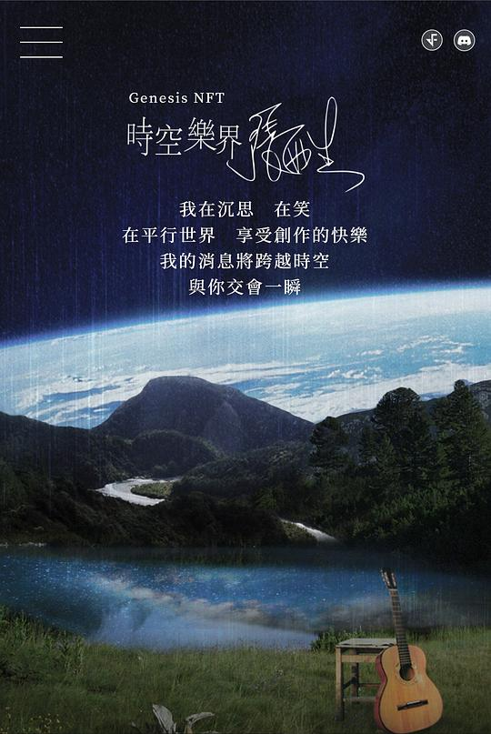

# 樂界

# 年老

當我年老 領悟知天命的訣竅 就不再會對臉上皺紋斤斤計較  
當我年老 享有人生洗練的驕傲 就不會再爲幼稚的青春苦苦哭嚎  
當我年老 征服時光輪軸的奧妙 就不會再因愛慾熊熊燃燒  
當我年老 吟誦每個甘心的歡笑 何妨乾硬的手腳 何妨那無牙一笑

你爲何要流淚 這不是爲了誰 你會品嚐到滋味  
就像一首歌 完美的搭配 我滿足每一個  
忘卻一身疲憊  
圍繞我周圍 寧靜與和諧  
微微已沉醉 所有生命的美

這和平的感覺  
將存在我心扉  
永伴我長眠

小子們都想問我  
關於孤獨與衰老  
我不能安慰你們的焦躁  
當我的心靈常在軀殼之外逍遙  
聽水聽蟬聽蛙叫  
望生望死望塵囂

大自然的骨架 人工的脊椎 撐起文明火焰  
多少個季節 狂歡和慚愧 是生生的歌謠  
寬容一切犯罪  
用心靈感覺 逝去的歲月  
不會再埋怨 心靈似井泉水

這和平的感覺  
將存在我心扉  
永伴我長眠

# 我們的歌

我爲你唱過的那一首歌 你還能不能跟我和  
在楓葉嫣紅的最飽滿時刻 回憶卻如許清澈  
經過了人世的分分合合 這些容顏你是否記得  
儘管走過來又平順波折 增添笑談裏一番聲色

我們曾經擁有這個夢  
曾經擁抱在山峯中  
我們難捨這個夢  
即使在世界失蹤

每一個晚上 最佳的時光 我們一起唱  
每一個晚上 無盡的奔忙 我們一起唱  
跟著我們的歌 乘坐星光馬車 沿著時光軌痕 涉過青春那條愛河  
我們的歌 乘坐星光馬車 沿著時光軌痕 撒開所有宇宙美真

我爲你訴說的那個故事 如今雖然都已成往事  
當微笑在你我的脣邊蕩起 誰也不會點破那種默契  
緣深的時候要傾情去愛 別向朝露祈求旭日的光彩  
當心靈因旋律而感動流淚 歌聲會高亢甜美

我們曾經擁有這個夢  
曾經擁抱在山峯中  
我們難捨這個夢  
即使在世界失蹤

每一個晚上 最佳的時光 我們一起唱  
每一個晚上 無盡的奔忙 我們一起唱  
跟著我們的歌 乘坐星光馬車 沿著時光軌痕 涉過青春那條愛河  
我們的歌 乘坐星光馬車 沿著時光軌痕 撒開所有宇宙美真

# 坐上你的車

我坐上你的車 像坐進悽苦的愁雲  
帶進你的車裏 還有我久未受潮乾燥的心靈  
無論細心探尋稀疏斑駁白髮 邁著有多深沉的思念  
臺北烏雲緩緩堆積  
低氣壓想來還有好一陣持續

我坐上你的車 看你不時恍惚的神情  
隨著轉彎緊張 是我已迷失在現代的生命  
方向盤似是你曾握不住的過往  
緊緊拔著拔著 我好一陣鼻酸的情緒

我坐上你的車 像輸了一甲子的沉寂  
血紅矚目的數字 讓我有泫然欲泣的心悸  
匆匆打開車門 也打開半世紀塵封的狼煙  
臺北惡濁的空氣  
正嗆得我紅腫雙眼

向前望 向前望 別回頭想  
向前望 向前望 別回頭想  
一程一程的車行  
一程一程點算自己  
未盡的天年  
你皺褶的手紋有著比三十五層大樓更堅毅的沉穩  
別回頭 看熱淚盈眶的我

# 一直這樣唱

她突然對我笑 一半明一半又暗 讓我禁不住得想 禁不住得亂 在一旁  
說穿吧那愛情 悲歡聚散誰不看慣 讓我禁不住得亂 禁不住得想 躲開她  
是非 誰會牽掛  
哭笑 怎麼無常  
星宿 縱走橫闖  
感覺 等著枯黃  
我一直這樣唱 一直這樣唱 唱到我心慌 這歌 有幾個人懂它  
我一直這樣唱 一直這樣唱 唱到我失望 這情 有幾個人容納

# 瞭解之後

誰說了解之後的結果是分離  
永恆的一定又是相愛不渝  
社會的現實 成長的壓力  
使得你我不再熟悉  
再一次的見面  
只是平添陌生幾許  
無奈的眼神盡是  
內心犀利的抗議  
爲何你我已不再熟悉

海誓山盟不過是夢幻的糖衣  
認罪之後盡是後悔哭泣  
不必後悔 何必哭泣  
回眸之間仍是那句  
我愛你

愛你 愛你 我愛你  
我愛你 你不要忘記  
我愛你 愛你

# 給我一個痛快

煙霧中浮現一幅畫  
有好多瑰麗的畫  
我喜歡這樣靜靜地  
讓時間從容過去  
傷口中酥麻著快感  
爲原始的獸性震撼  
我期待這樣瘋狂地  
把空虛胡亂填平

總想爲每件事找理由  
每個理由都是空洞  
總想形容我每個心痛  
當我被詛咒的時候

給我一個痛快  
給我即興搖擺  
哪怕是煙火就只要能填充無奈

永無意義的光環中  
因爲我生怕那寂寞  
回憶是治不愈的創痛  
常令我午夜靜默  
仍然有純潔的私慾  
我問你相不相信  
誰敢說他不戴面具  
應酬中逃離人羣

不是想證明我已成熟  
只是想表現得與衆不同  
當你們指責我的時候  
希望你們能聽我說

給我一個痛快  
給我即興搖擺  
哪怕是煙火就只要能填充無奈

# 參考

相關鏈接：

-   [樂界 2022 Demo \| lyrics EternallyAscend@github](https://eternallyascend.github.io/lyrics/Demo2022/)
