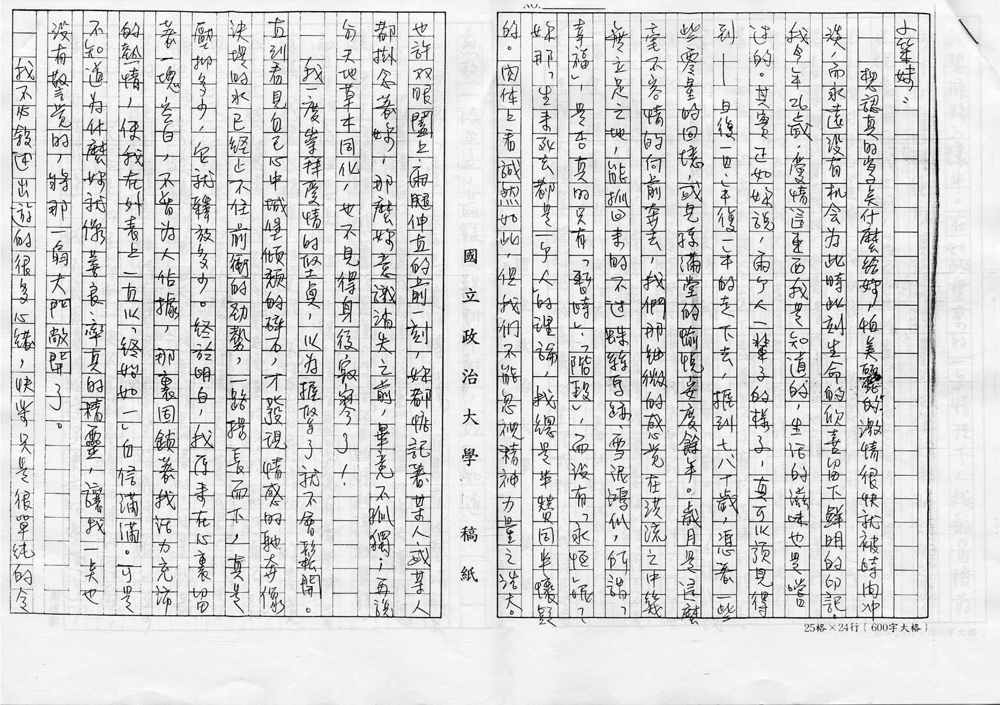
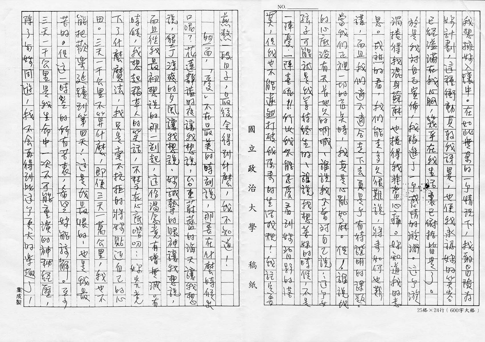
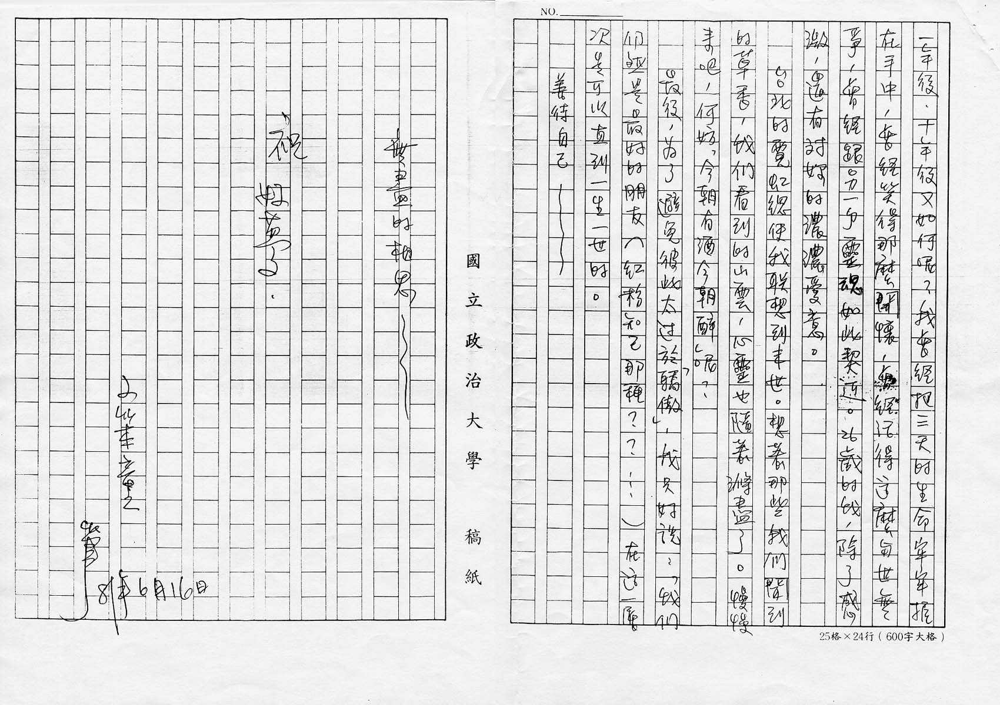

# 「愛」不在最美的時刻說，那要在什麼時候出口呢？

小笨妹：

想認真的寫點什麼給妳，怕美麗的激情很快就被時間沖淡，而永遠沒有機會爲此時此刻生命的欣喜留下鮮明的印記。我今年 26 歲，愛情這東西我是知道的，生活的滋味也是嘗過的。其實正如妳說，兩個人一輩子的樣子，真可以預見得到 —— 日復一日、年復一年的走下去，捱到七、八十歲，憑著一些些零星的回憶，或兒孫滿堂的愉悅安度餘年。歲月是這麼毫不容情的向前奔去，我們那細緻的感覺在洪流之中幾無立足之地，能抓回來的不過蛛絲馬跡、雪泥鴻爪，所謂「幸福」，是否真的只有「暫時」、「階段」，而沒有「永恆」呢？妳那「生來死去都是一個人」的理論，我總是半贊同半懷疑的。肉體上看誠然如此，但我們不能忽視精神力量之浩大。也許雙眼闔上，兩腿伸直的前一刻，妳都惦記著某人，或某人都掛念著妳，那麼妳意識消失之前，畢竟不孤獨；再說與天地草木同化，也不見得身後寂寥了！

我一度崇拜愛情的堅貞，以爲握緊了就不會鬆開。直到看見自己心中城堡傾頹的碎石，才發現情感的馳奔像決堤的水已經止不住前衝的勁勢，一路揚長而下，真是壓抑多少，它就釋放多少。終於明白，我原來在心裏留著一塊空白，不曾爲人佔據，那裏固鎖著我活力充沛的熱情，使我在外表上一直以「終始如一」自信滿滿。可是不知道爲什麼妳就像善良、率真的精靈，讓我一點也沒有警覺的，將那一扇大門敞開了。

我不必敘述出遊的很多心緒，快樂只是很單純的令我想擁妳入懷中。在如此無奈的一個情況下，我敢冒險爲妳計劃，這種衝動真教我訝異，也使我承認妳的笑容已經溢滿在我心胸，幾乎在我生活裏已俯拾皆是了。於是我對自己宣佈，我陷進了一個感情的漩渦。這個漩渦卷得我混身蘇麻，也卷得我非常心痛。妳知道我的意思。成熟的看，我們能走多久很難說，將來如何也難講，而且我們適不適合走下去更是個有待證明的課題。當我們正視一切的盲點時，我真是心亂如麻。但！誰說我的心底沒有天長地久的吶喊、誰說我不曾對自己說：這個女孩子可能就是我等待終生的、誰說我想著妳的時候，不是一陣憂、一陣喜呢！！所以我不能忍受看到妳背影的落寞，但我也不能遽然打破我原來的生活成規！我註定要煎熬一段日子，最後會得到什麼，我不知道！

然而，「愛」不在最美的時刻說，那要在什麼時候出口呢？花蓮靜諡的夜讓我想說，臺東蔚藍的海天讓我想說，墾丁涼爽的夕風讓我想說，妳誠摯的眼神讓我想說，而且從我最初想說的那一刻起，這份渴念竟有增無減。有時候，我想起稻草人的笑話，不禁在心底嘮叨：妳究竟下了什麼魔法，我只是毫不抗拒的將妳貼近自己的心田。三天一千公里不算什麼，即使三天一萬公里，我也不能把歡樂延續到第四天！這是我最恨的，也是我最苦的。但這一時空的所有苦衷，希望妳能諒解。至少三天一千公里是我生命中一次不可能重演的神祕經歷，除了與妳同遊，我不會再得到比這個更大的樂趣了！一年後、十年後又如何呢？我曾經把三天的生命牢牢握在手中，曾經笑得那麼開懷，曾經活得這麼與世無爭，曾經跟另一個靈魂如此契近。26 歲的我，除了感激，還有對妳的濃濃愛意。

臺北的霓虹總使我聯想到來世。想著那些我們聞到的草香，我們看到的山雲，心靈也隨著滌盡了。慢慢來吧，何妨「今朝有酒今朝醉」呢？

最後，爲了避免彼此太過於「驕傲」，我只好說：「我們仍然是最好的朋友（紅粉知己那種？？…）在這一層次是可以直到一生一世的」。

善待自己～～

無盡的相思～～

祝

好夢

小笨童 筆

81 年 6 月 16 日[^1]

[^1]: 民國 81 年，即 1992 年

圖片來源：[張雨生手稿 - tieba.baidu.com](https://tieba.baidu.com/p/2084189476#!/l/p1)
