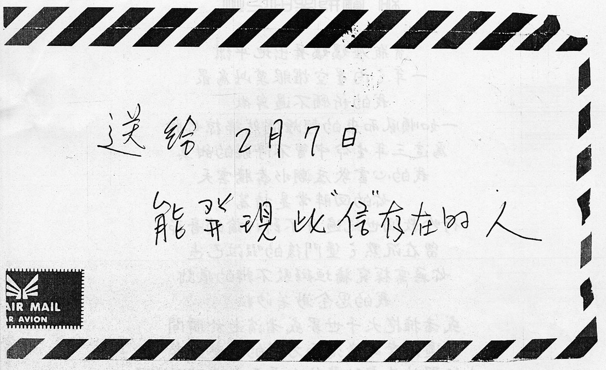
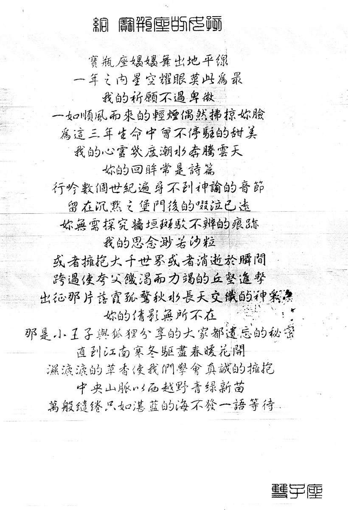

# 生日星座詩

送給 2 月 7 日能發現此“信”存在的人

給 寶瓶座的惠鈴

寶瓶座嫋嫋舞出地平線  
一年之內星空耀眼莫此爲最  
我的祈願不過卑微  
一如順風而來的輕煙偶然拂掠你臉  
爲這三年生命中曾不停駐的甜美  
我的心靈幾度潮水奔騰雲天  
你的回眸常是詩篇  
行吟數個世紀遍尋不到神諭的音節  
留在沉默之堡門後的啜泣已遠  
你無需探究牆垣斑駁不辨的痕跡  
我的思念渺若沙粒  
或者擁抱大千世界或者消逝於瞬間  
跨過使夸父飢渴而力竭的丘壑進擊  
出征那片落霞孤鶩秋水長天交織的神采  
你的倩影無所不在  
那是小王子與狐狸分享的大家都遺忘的祕密  
直到江南寒冬驅盡春暖花開  
溼漉漉的草香使我們學會真誠的擁抱  
中央山脈以西越野青綠新苗  
萬般繾綣只如湛藍的海不發一語等待

雙子座

當前頁面缺陷：

1. 寫信時間未知

# 參考

-   [張雨生手稿 - 百度貼吧](https://tieba.baidu.com/photo/p?tid=2084189476&pic_id=6142fbf2b2119313aebedca565380cd791238d22)
-   [張雨生寫給女朋友的信 - 豆瓣](https://www.douban.com/group/topic/233018900/)
