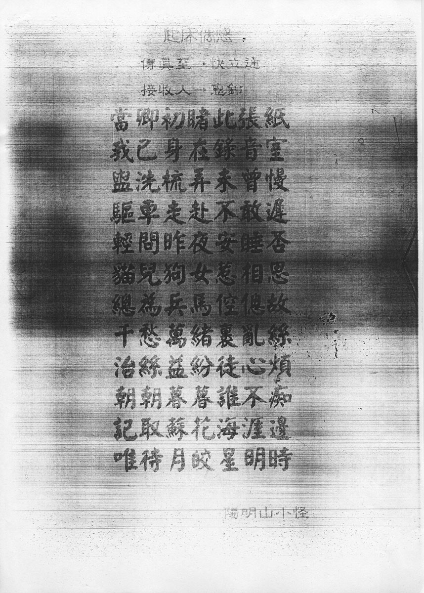

# 起床偶感

傳真至 → 快立通

接收人 → 惠鈴

當卿初睹此張紙 
我已身在錄音室 
盥洗梳弄未曾慢 
驅車走赴不敢遲 
輕問昨夜安睡否 
貓兒狗女惹相思 
總爲兵馬倥傯故 
千愁萬緒裹亂絲 
治絲益紛徒心煩 
朝朝暮暮誰不癡 
記取蘇花海涯邊 
唯待月皎星明時

陽明山小怪

## 頁面缺陷

寫信時間未知

## 參考

-   [張雨生手稿 - tieba.baidu.com](https://tieba.baidu.com/p/2084189476#!/l/p1)
