# 資料整理指導

本項目所有資料採用 markdown 格式編寫，推薦使用 Visual Studio Code（簡稱 vscode）作爲 markdown 編輯器。

或許有朋友會問，「markdown」是什麼，我不會 markdown 還能一起整理資料嗎？

不必擔心，markdown 是一種標記語言，它的語法簡潔明瞭。下面的內容將引導我們在配置並熟悉 vscode 的過程中，掌握基礎的 markdown 語法。

# vscode 配置

好的工具能夠讓資料整理事半功倍，本項目推薦使用 vscode 作爲 markdown 文件編輯器。

從 [Visual Studio Code 官方網站](https://code.visualstudio.com/) 下載並安裝 vscode，安裝過程中所有配置保持默認。

打開 vscode，在側邊欄的插件市場中搜索並安裝如下插件：

-   Chinese (Simplified)
    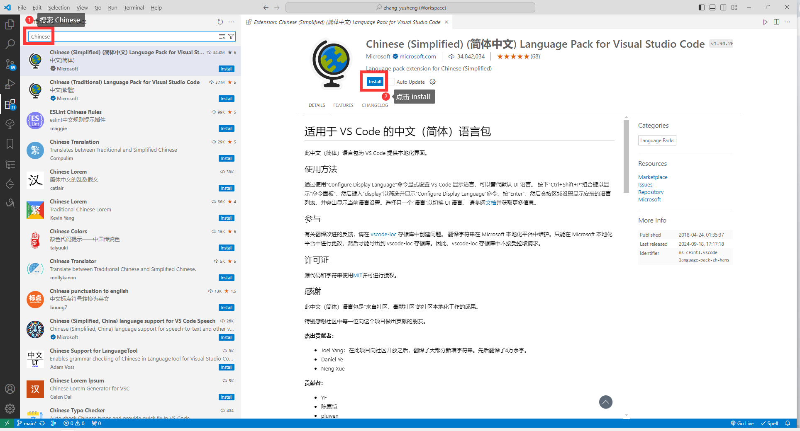
-   prettier
    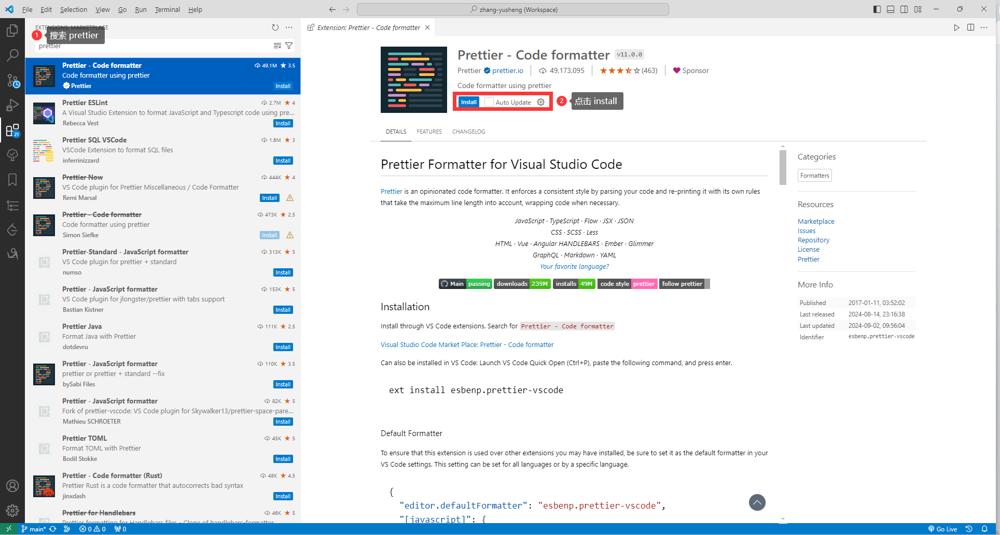
-   markdown all in one
    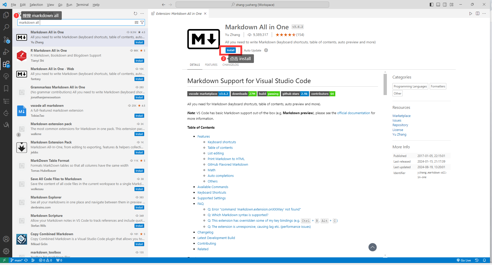
-   autocorrect
    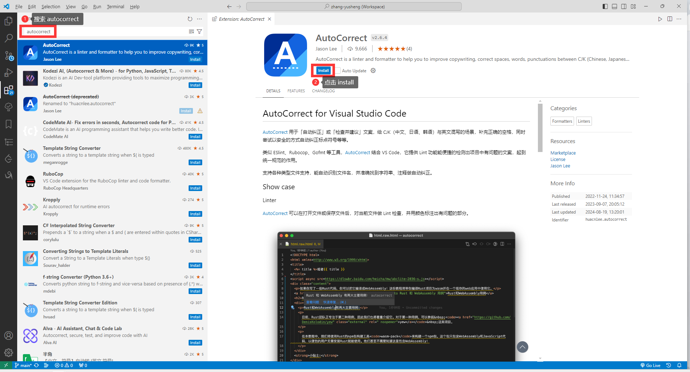
-   markdown preview enhanced
    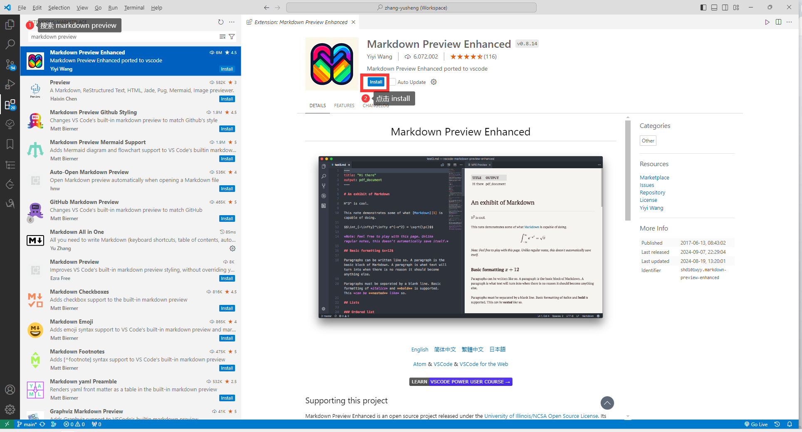
-   code spell checker
    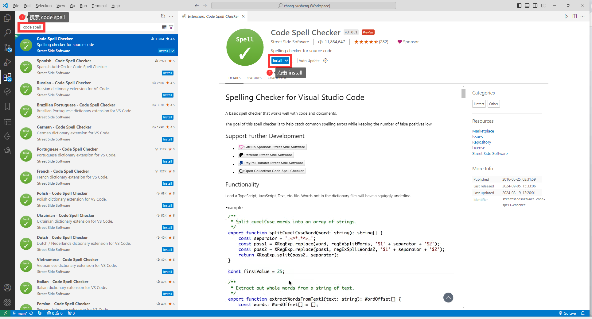
-   Partial Diff  
    該插件可以用於比較文本，安裝過程和上面安裝的插件一致。
-   opencclint  
    該插件可以用於繁體簡體相互轉換，安裝過程和上面安裝的插件一致。

最後，請跟隨《[Visual Studio Code 設置自動保存](https://www.cnblogs.com/ptxiaochen/p/13715668.html)》的指引，配置自動保存功能。

# markdown 教程

現在，打開 [Markdown 官方教程](https://markdown.com.cn/basic-syntax/)，但請不要著急閱讀。

在瀏覽 `.md` 文件時，有看不懂的地方，在教程上進行查閱即可。

# vscode 使用

配置好 vscode 編輯器後，就可以開始編寫資料了。

這裏用已經整理好的《口是心非》專輯作爲例子，從 [《口是心非》資料整理](https://timaab.lanzouj.com/iWlmB2b4cyyd) 下載壓縮包並解壓，然後打開 vscode。

## 編輯文件和打開文件夾

點擊左上角「文件」後，可以選擇「新建文本文件」或「打開文件夾」。

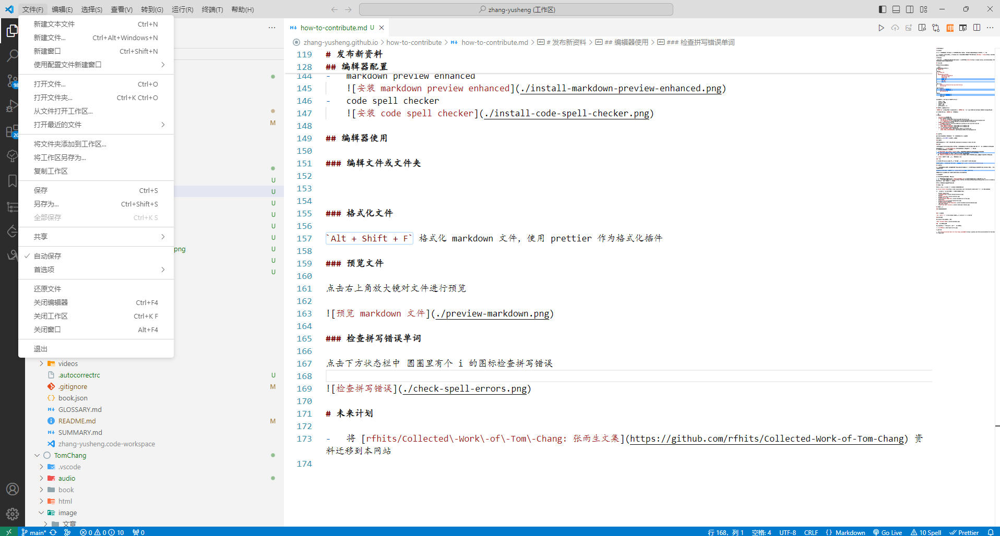

我們打開解壓後的文件夾，名稱爲 `1997-10-16-ksxf`，側邊欄的「資源管理器」中可以看到文件夾下的文件，點擊對應的文件可以瀏覽。

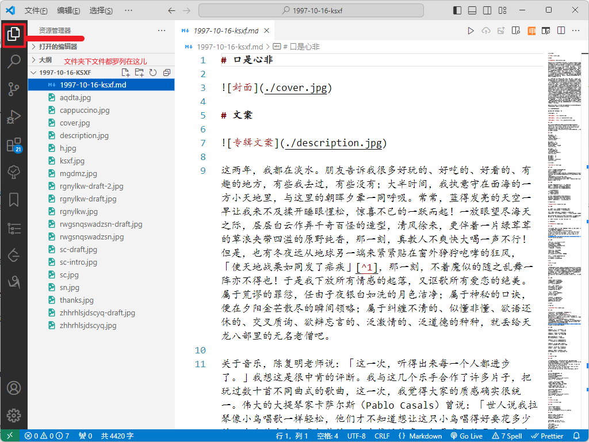

## 格式化文件

打開 `1997-10-16-ksxf.md` 文件，我們按下 `Alt + Shift + F`  
如果提示需要指定格式化插件（formatter），選擇 prettier，千萬不要選擇 Markdown All in One。

`Alt + Shift + F` 將格式化正在編輯的 markdown 文件，比如連續多個空行將被替換爲一個空行，列表的縮進將統一……

## 預覽文件

點擊右上角放大鏡對文件進行預覽

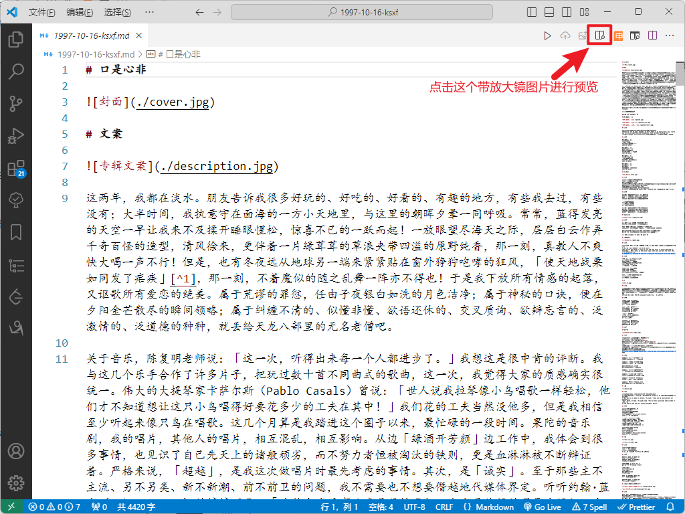

下面是預覽效果：

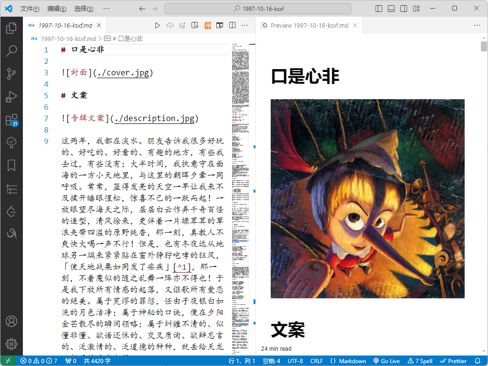

就像谷歌瀏覽器裏的每個標籤頁那樣，在 vscode 中，所有打開的頁籤都是可以拖動的。
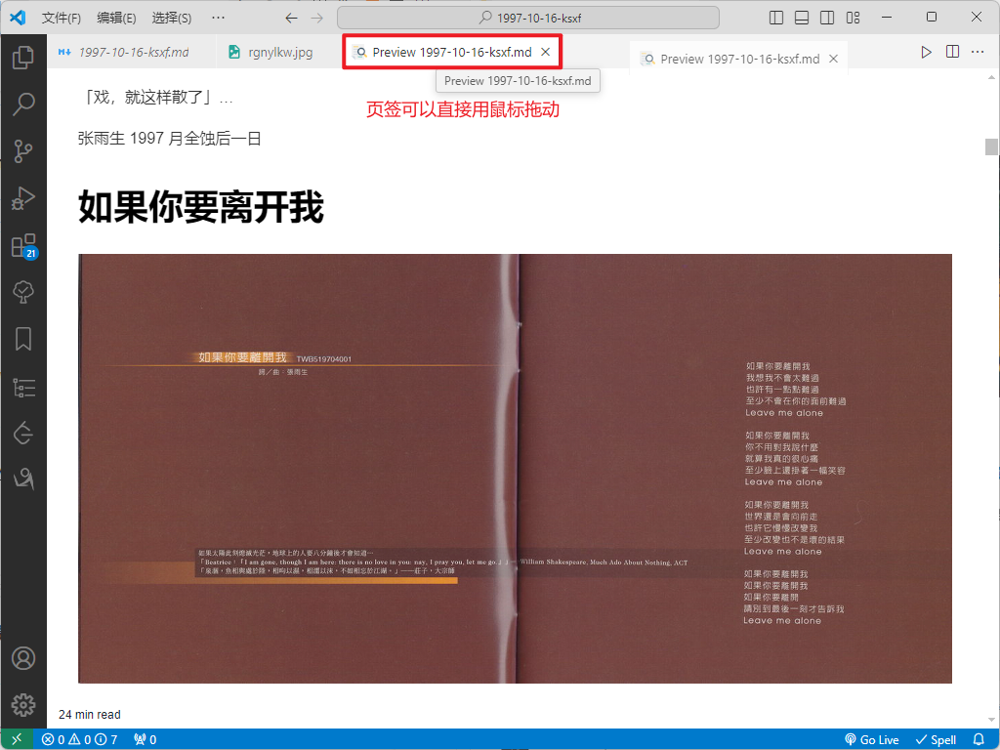

## 查閱 markdown 語法

在 `1997-10-16-ksxf.md` 文件中，你可能會看到各種奇奇怪怪的語法。比如 `# 口是心非`，這是 markdown 語言標記一級標題的語法，在 [Markdown 標題語法](https://markdown.com.cn/basic-syntax/headings.html) 對其進行了介紹。也可以在 vscode 中輸入標題語法的文本，在右側對渲染結果進行預覽。

值得一提的是插入圖片的語法，[Markdown 圖片語法](https://markdown.com.cn/basic-syntax/images.html) 對其進行了介紹。

目前每份資料都有自己單獨的文件夾，所有圖片都存放在資料自己的文件夾下面，  
markdown 中，使用 `.` 表示當前 markdown 文件所在的文件夾，所以 `./cover.jpg` 就表示 `1997-10-16-ksxf.md` 同級文件夾下的 `cover.jpg` 這張圖片。

## 插入 B 站視頻

markdown 中插入 B 站視頻需要使用 HTML 語法。
首先我們需要獲取視頻的分享鏈接，這裏用[《我期待》MV 爲例](https://www.bilibili.com/video/BV1VV41117KV/)：


點擊「嵌入代碼」後，剪貼板中就會有如下代碼

```HTML
<iframe src="//player.bilibili.com/player.html?isOutside=true&aid=415220022&bvid=BV1VV41117KV&cid=252344992&p=1" scrolling="no" border="0" frameborder="no" framespacing="0" allowfullscreen="true"></iframe>
```

我們只需要 `src=""` 裏面的內容，所以上面這段代碼，真正有用的部分是：

```
//player.bilibili.com/player.html?isOutside=true&aid=415220022&bvid=BV1VV41117KV&cid=252344992&p=1
```

這裏提供嵌入 B 站視頻鏈接的一個模板：

```html
<iframe src="https:「替換到這裏」&high_quality=1&danmaku=0&autoplay=0" allowfullscreen="allowfullscreen" width="100%" height="500" scrolling="no" frameborder="0" sandbox="allow-top-navigation allow-same-origin allow-forms allow-scripts"></iframe>
```

把真正有用的部分替換到模板裏面：

```html
<iframe src="https://player.bilibili.com/player.html?isOutside=true&aid=415220022&bvid=BV1VV41117KV&cid=252344992&p=1&high_quality=1&danmaku=0&autoplay=0" allowfullscreen="allowfullscreen" width="100%" height="500" scrolling="no" frameborder="0" sandbox="allow-top-navigation allow-same-origin allow-forms allow-scripts"></iframe>
```

最後把上面的代碼放到 markdown 文件中，就可以渲染出分享出的視頻了。

<iframe src="https://player.bilibili.com/player.html?isOutside=true&aid=415220022&bvid=BV1VV41117KV&cid=252344992&p=1&high_quality=1&danmaku=0&autoplay=0" allowfullscreen="allowfullscreen" width="100%" height="500" scrolling="no" frameborder="0" sandbox="allow-top-navigation allow-same-origin allow-forms allow-scripts"></iframe>

目前 vscode 還不支持 B 站分享視頻的渲染，但是另一個編輯器 [Typora](https://markdown.com.cn/editor/) 和 [在線 markdown 編輯器](https://markdown.com.cn/editor/) 支持。  
總之，推送到 GitHub 後，這些視頻是可以渲染出來的。

## 檢查拼寫錯誤單詞

點擊下方狀態欄中 圓圈裏有個 i 的圖標，可以檢查拼寫錯誤

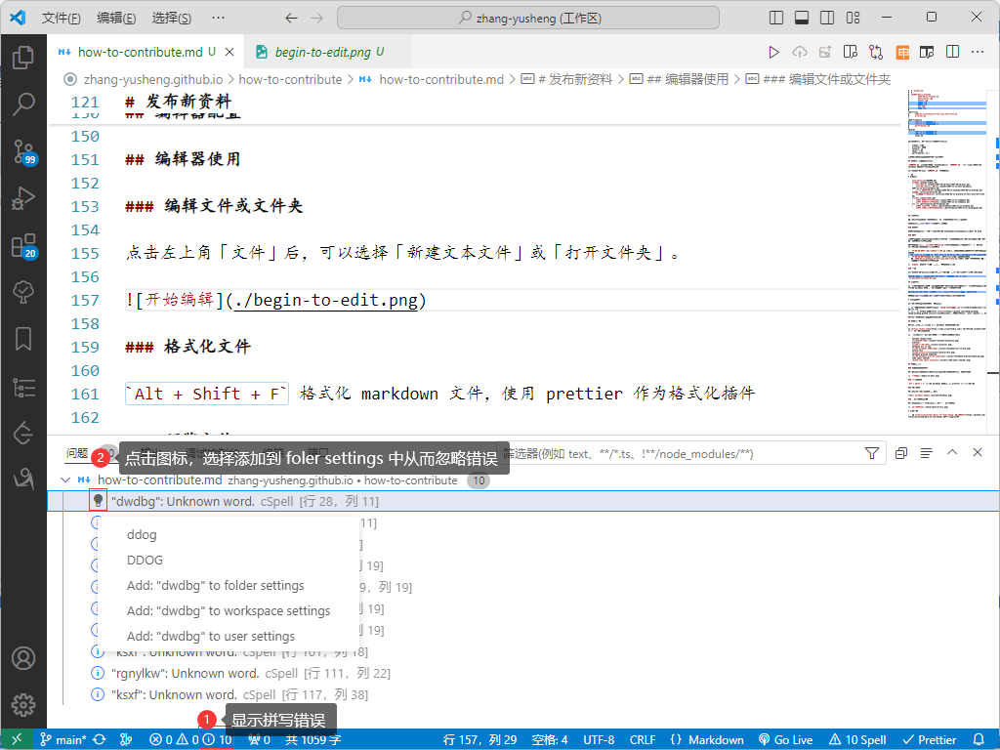

## 編輯 `1997-10-16-ksxf.md`

授人以魚不如授人以漁，`1997-10-16-ksxf.md` 文件中可能還存在其他的 markdown 語法，如加粗、腳註、換行、無序列表、插入鏈接等，遇到看不懂的地方，都可以通過 [Markdown 基本語法](https://markdown.com.cn/basic-syntax/) 和 [Markdown 擴展語法](https://markdown.com.cn/extended-syntax/) 進行查閱，還可以問 ChatGPT。

在閱讀 markdown 語法教程時，可以在 vscode 中編輯 `1997-10-16-ksxf.md`，比如修改標題、插入一些其他的圖片、添加自己的腳註等待，所有的改動都可以通過點擊右上角的放大鏡圖標預覽。

## 批量編輯

一隻手按住 `Alt + Ctrl + Shift`，另一隻手敲擊向上鍵，可以向上的方向上製造多個光標。

這個功能在批量添加換行時非常好用：  
首先將光標移動到最後一行的行首，一隻手按住 `Alt + Ctrl + Shift`，另一隻手一直敲向上鍵，直到光標到第一行，按下 `End` 鍵後，光標就來到了所有行的行末，此時輸入兩個空格就相當於在所有行的行末插入了換行。

要重新只有一個光標，用鼠標點一下 markdown 文件的任意位置就行。

## 繁簡轉換

這個功能是在安裝了 opencclint 插件以後纔會有的。

選中一段文字後，右鍵，在彈出的擴展菜單中，點擊 `Opencclint: Translate Selection`，就可以將簡體轉換爲繁體；點擊`Opencclint: Translate Selection Revert` 可以將繁體轉換爲簡體。

# 項目結構介紹

爲了能夠更加輕鬆地理解整個項目的結構，請下載一份網站內容的 [壓縮包](https://timaab.lanzouj.com/i3Zce2almbmj) 並解壓，結合解壓後的文件結構理解項目。

## 目錄結構

項目的部分目錄結構如下：

```shell
zhang-yusheng.github.io
│  SUMMARY.md
│
├─albums
│  │
│  └─1994-08-xx-kloktbw
│         1994-08-xx-kloktbw.md
│         description.jpg
│         thanks.jpg
│         dwdbg.jpg
│         gdswb.jpg
│         hdj.jpg
│         hzhj.jpg
│
├─articles
│      1994-0x-xx-preface-of-tell-you-the-truth.md
|
├─performances
│      1992-xx-xx-alpkfwh.md
│      1992-xx-xx-ayxwzgwywh.md
│
└─shows
       1997-xx-xx-lxhdyyjs.md
       199x-xx-xx-lxhdyyjs.md
```

不同文件夾用於存放不同類型的資料，包括：

-   albums: 專輯
-   articles: 文章
-   letters: 信
-   shows: 綜藝
-   performances: 演出

未來可能還會有新的文件夾存放對應資料

詳細參考：[目錄結構](STRUCTURE.md)

## 文件夾和網址的對應關係

`SUMMARY.md` 定義了網站左側目錄的結構，在 `SUMMARY.md` 中通過相對路徑引用的 markdown 文件會被髮布到網站上。

目前（2024-09-22） `SUMMARY.md` 內容如下：

```md
# Summary

-   [Introduction](README.md)
-   [專輯](./albums/albums.md)
    -   [口是心非](./albums/1997-10-16-ksxf/1997-10-16-ksxf.md)
    -   [口是心非（拋物線版）](./albums/1997-xx-xx-ksxf-parabola/1997-xx-xx-ksxf-parabola.md)
    -   [卡拉 OK·臺北·我](./albums/1994-08-xx-kloktbw/1994-08-xx-kloktbw.md)
-   [文章](./articles/articles.md)
    -   [《跟你說真的》序](./articles/1994-0x-xx-preface-of-tell-you-the-truth.md)
-   [綜藝](./shows/shows.md)
    -   [199x 龍兄虎弟音樂教室](./shows/199x-xx-xx-lxhdyyjs.md)
    -   [1997 龍兄虎弟音樂教室](./shows/1997-xx-xx-lxhdyyjs.md)
-   [演出](./performances/performances.md)
    -   [1992 奧林匹克風晚會](./performances/1992-xx-xx-alpkfwh.md)
    -   [1992 奧運希望之光文藝晚會](./performances/1992-xx-xx-ayxwzgwywh.md)

```

## 命名約定

因爲電子書打包工具不支持中文文件名，所以所有的文件和文件夾名稱都**必須是英文**。

文件名只能使用**小寫字母**、數字和減號。

### 文件夾

文件夾的名稱應當爲複數形式或縮寫，如 albums、articles、music-videos 或 mv。

### 資料

「資料」指的是具有明確的發佈或創作時間的一個文件。如《口是心非》專輯、雨生 1997 年參加的一次龍兄虎弟音樂教室。

資料文件名格式爲 `創作時間-資料名.md`，時間不知道的用小寫英文字母 `x` 表示。  
目前項目採用的文件名格式有兩種：

1. `年-月-日-資料中文拼音首字母拼接.md`，適用於不知道如何翻譯資料以及資料的名稱太長的情況。  
   如 `1997-10-16-ksxf.md` 表示 1997 年 10 月 16 日發行的專輯《口是心非》的內容。
2. `年-月-日-資料名英文.md`，適用於資料非常好翻譯爲英文的情況。  
   如 `1994-0x-xx-preface-of-tell-you-the-truth.md`，表示 1994 年某月某日雨生爲《跟你說真的》這本書寫的序。

在 `albums` 文件夾中，統一使用第一種文件名格式。

### 圖片

目前（2024-09-22）只在專輯部分使用圖片，統一使用漢語拼音首字母拼接命名。

如《如果你要離開我》的專輯圖片，命名爲 `rgnylkw.jpg`，而不是 `if-you-want-to-leave-me.jpg`

## 結構約定

當一份資料需要引用各種多媒體素材（如圖片、音頻）時，需要建立一個**與資料名稱相同的文件夾**，將 markdown 文件和所引用的素材放到同一個文件夾內。

如專輯《口是心非》的所有素材都放在 `albums/1997-10-16-ksxf` 文件夾內。

這樣的好處是，未來如果要遷移資料，可以直接移動整個文件夾。

# 發佈新資料

目前投遞資料到網站有如下兩種方法：

1. 通過郵件將整理好的資料發送給 `zhang-yusheng@qq.com`，註明要發佈到的類別，是專輯，還是演出……
2. 註冊一個 GitHub 賬號，fork 本[倉庫](https://github.com/zhang-yusheng/zhang-yusheng.github.io)後，在自己的倉庫下進行編輯，然後通過 pull request 進行更新。

站長有空時就會手動將新資料合入網站

# Commit Comment 約定

該部分只需 GitHub Users 閱讀並遵守。

| 類型     | 說明                                       |
| :------- | :----------------------------------------- |
| feat     | 爲項目**增加**內容，如添加出處、添加腳註等 |
| fix      | 修訂項目中**錯誤**的部分，如筆誤、時間等   |
| refactor | 重命名項目、移動項目                       |
| style    | 文件**格式**修改                           |
| chore    | 網站部署相關的修改                         |
