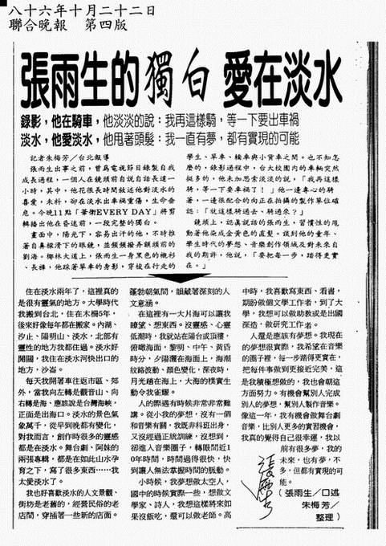

# 張雨生的獨白 愛在淡水

錄影，他在騎車，他淡淡的說：我再這樣騎，等一下要出車禍  
淡水，他愛淡水，他甩著頭髮：我一直有夢，都有實現的可能

> 記者朱梅芳 / 台北報導
>
> 張雨生出事之前，曾爲電視節目錄制自我成長過程，一個人在鏡頭前自說自話長達一小時，其中他花很長時間敘述他對淡水的喜愛，未料，卻在淡水出車禍重傷，生命垂危。今晚 11 點，「華衛 EVERY DAY」將剪輯播出他在昏迷前，一段完整的獨白。
>
> 畫面中，陽光下，容易出汗的他，不時推著自鼻樑滑下的眼鏡，並頻頻撥弄額頭前的劉海。椰林大道上，張雨生一身黑色的襯衫、長褲，他踩著單車的身影，穿梭在行走的學生、單車、轎車與小貨車之間。也不知怎麼的，錄影過程中，台大校園內的車輛突然挺多的，他未加思索淡淡的說，「我再這樣騎，等一下要車禍了！」他一邊專心的騎著，一邊很配合的向正在拍攝的製作單位確認：「就這樣騎過去、騎過來？」
>
> 鏡頭上，認真說話的張雨生，習慣性的甩動著他染成金黃色的直髮。談到他的童年、學生時代的夢想、音樂創作領域及對未來自我的期許，他說，「要把每一步，踏得更實在。」

住在淡水兩年了，這裡真的是很有靈氣的地方。大學時代我搬到台北，住在木柵 5 年，後來好像每年都在搬家。內湖、汐止、陽明山、淡水，北部有靈性的地方我都住過。淡水好開闊，我住在淡水河快出口的地方，沙崙。

每天我開著車往返市區、郊外，當我向左轉是觀音山、向右轉是海、應該說是台灣海峽，正面是出海口。淡水的景色氣象萬千，從早到晚都有變化，對我而言，創作時很多的靈感都是在淡水。舞台劇、阿妹的兩張專輯，都是在如此山水孕育之下，寫了很多東西……我太愛淡水了。

我也好喜歡淡水的人文景觀、街坊是老舊的，經營民俗的老店間，穿插著一些新的店面。蓬勃朝氣間，蘊藏著深刻的人文意涵。

在這裡有一大片海可讓我瞭望、想東西。沒靈感、心靈低潮時，我就站在陽台或頂樓，俯瞰海面，黎明、中午、黃昏時分，夕陽灑在海面上，海潮紋路波動、顏色變化，深夜時，月光趟在海上，大海的樸實生動令我雀躍。

人的際遇有時候非常非常難講。從小我的夢想，沒有一個和音樂有關，我既非科班出身，又沒經過正統訓練，沒想到，卻進入音樂圈子，轉眼間近 10 年時間，時間過得很快，快到讓人無法掌握時間的脈動。

小時候，我夢想做太空人，國中的時候實際一些，想做文學家、詩人，我想這樣將來如果沒飯喫，還可以做老師。高中時，我喜歡寫東西、看書，期盼做個文學工作者，到了大學，我想可以當個助教或是出國深造，做研究工作者。

人還是應該有夢想。我現在的夢想很實際，我希望在音樂的圈子裡，每一步踏得更實在，把每件事做到更接近完美，這是我積極想做的，我也會朝這方面努力。有機會幫別人完成別人的夢想，幫別人制作音樂。像這一年，我有機會做舞台劇音樂，比別人更多的實習機會，我真的覺得自己很幸運，我以前有很多夢，我的未來，也有夢，不多，但都有實現的可能。

<iframe src="https://player.bilibili.com/player.html?isOutside=true&aid=47808797&bvid=BV1Kb411s7JY&cid=83744041&p=1&high_quality=1&danmaku=0&autoplay=0" allowfullscreen="allowfullscreen" width="100%" height="500" scrolling="no" frameborder="0" sandbox="allow-top-navigation allow-same-origin allow-forms allow-scripts"></iframe>

<iframe src="https://player.bilibili.com/player.html?isOutside=true&aid=37871735&bvid=BV1pt411q7ES&cid=66578303&p=1&high_quality=1&danmaku=0&autoplay=0" allowfullscreen="allowfullscreen" width="100%" height="500" scrolling="no" frameborder="0" sandbox="allow-top-navigation allow-same-origin allow-forms allow-scripts"></iframe>

# 參考

相關鏈接：

-   [張雨生剪報海報等收藏 - tieba.baidu.com](https://tieba.baidu.com/photo/p?kw=%E5%BC%A0%E9%9B%A8%E7%94%9F&tid=2084189445&pic_id=ab24bc315c6034a810ea909bcb134954092376a4)
-   [愛在淡水 - tomchang.cn](https://www.tomchang.cn/archive/article/57.html)

整理：momo，健健

當前頁面缺陷：

1. 待校對
2. 採訪時間未知
